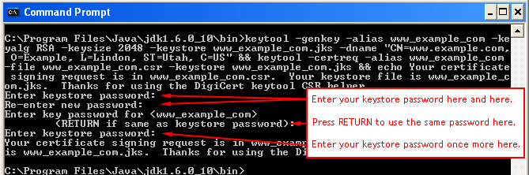

# Digital Certificate


- [Digital Certificate and Public Key Identity](#digital_certificate)
- [Generate, Sign and Publish Public key certificate using Java keytool](#generate_sign_publish_keytool)
- [Generate, Sign and Publish Public key certificateusing ssh-keygen and openssl](#generate_sign_publish_sshkeygen_openssl)
- [Generate certificate signing request (CSR) for tomcat server](#scr_tomcat)
- [Generate self-signed certificate for tomcat server](#tomcat_self_signed_certificate)
- [Spring RestTemplate to disable SSL Certificate Validation](#resettemplete_disable_ssl)
- [Install SSL certificate for tomcat server](#tomcat_ca_signed_certificate)
- [Using Apache httpclient for https](#apache_httpclient)
- [Java Certificate Truststore](#java_trusted_truststore)
- [What are the differences between .pem, .cer and .der?](#pem_cer_der)


## <a name='apache_httpclient'> Using Apache httpclient for https </a>  


## <a name='digital_certificate'> Digital Certificate and Public Key Identity </a> 

- A **certificate is a document that associates an identity to a given public key**.  
Certificates are signed by a third-party entity called a **Certificate Authority (CA)**.

- We know that if the hash we decrypt with the published public key matches the actual hash, then the message is signed. However, how do we know that the public key really came from the right entity? This is solved by the use of digital certificates.

- **A Digital Certificate contains a public key and is itself signed by another entity**. 
The signature of that entity can itself be verified by another entity and so on. 
We end up having what we call a certificate chain. Each top entity certifies the public key of the next entity. 
The most top-level entity is self-signed, which means that his public key is signed by his own private key.

- The X.509 is the most used certificate format, and it is shipped either as binary format (DER) or text format (PEM). 
JCA already provides an implementation for this via the X509Certificate class.


## <a name='generate_sign_publish_keytool'> Generate, Sign and Publish Public key certificate using Java keytool </a> 


#### Generating key pair (public/private key)

To create a key pair of a private and public key, we'll use the Java **keytool**.   
Let's generate a key pair using the **genkeypair** command:

```bash
keytool -genkeypair -alias senderKeyPair -keyalg RSA -keysize 2048 -dname "CN=Baeldung" -validity 365 -storetype PKCS12 \
  -keystore sender_keystore.p12 -storepass changeit
```

#### Publishing the Public Key

Before we can publish the public key, we must first decide whether we're going to use   
1. **a self-signed certificate** or 
2. **a CA-signed certificate**.

**When using a self-signed certificate, we need only to export it from the Keystore file**.   
We can do this with the **exportcert** command:

```bash
keytool -exportcert -alias senderKeyPair -storetype PKCS12 -keystore sender_keystore.p12 -file \
  sender_certificate.cer -rfc -storepass changeit
```

---

Otherwise, **if we're going to work with a CA-signed certificate**,   
then we need to create a ***certificate signing request (CSR)***. 
   
We do this with the **certreq** command:

```bash
keytool -certreq -alias senderKeyPair -storetype PKCS12 -keystore sender_keystore.p12 -file -rfc \
  -storepass changeit > sender_certificate.csr
```


The CSR file, **sender_certificate.csr**, is then sent to a Certificate Authority for the purpose of signing. 
When this is done, we'll receive a signed public key wrapped in an X.509 certificate, either in binary (DER) or text (PEM) format.    
Here, we've used the rfc option for a PEM format.

The public key we received from the CA, sender_certificate.cer, has now been signed by a CA and 
can be make available for clients.


#### Loading a Public Key for Verification

Having access to the public key, a receiver can load it into their Keystore using the **importcert** command:

```bash
keytool -importcert -alias receiverKeyPair -storetype PKCS12 -keystore receiver_keystore.p12 -file \
  sender_certificate.cer -rfc -storepass changeit
```

Now that we have a PrivateKey instance on the sender side, and an instance of the PublicKey on the receiver side, we can start the process of signing and verification.  


## <a name='generate_sign_publish_sshkeygen_openssl'> Generate, Sign and Publish Public key certificateusing ssh-keygen and openssl </a> 


#### Generating key pair (public/private key) and Publishing the Public Key 

Before we can publish the public key, we must first decide whether we're going to use   
1. **a self-signed certificate** or 
2. **a CA-signed certificate**.

**When using a self-signed certificate**  
We can do this with the **openssl req** command :

```bash
openssl req -x509 -sha256 -nodes -days 365 -newkey rsa:4096 -keyout private.key -out certificate.crt
```

- **req** - Command passed to OpenSSL intended for creating and processing certificate requests usually in the PKCS#10 format.
- **x509** - This multipurpose command allows OpenSSL to sign the certificate somewhat like a certificate authority. X.509 refers to a digitally signed document according to RFC 5280.
- **sha256** - This is the hash to use when encrypting the certificate.
- **nodes** - This command is for no DES, which means that the private key will not be password protected.
- **days** - The number of days that the certificate will be valid.
- **newkey** - The format of the key, in this case an RSA key with 4096 bit encryption.
- **keyout** - specifies where to save the private key file.
- **out** - The location to output the certificate file itself.


Verify that the certificate is correct:
```bash
openssl x509 -in certificate.crt -text -noout
```

- **x509** - This is a multipurpose command, and when combined with the other parameters here, it is for retrieving information about the passed in the certificate.
- **in** - The certificate that we are verifying.
- **text** - Strips the text headers from the output.
- **noout** - Needed not to output the encoded version of the certificate

Otherwise, **if we're going to work with a CA-signed certificate**,   
then we need to create a ***certificate signing request (CSR)***.    
We do this with the **openssl req** command:


```bash
openssl req -new -key private.pem -out certificate.csr
```


**Note:** openssl command uses private key (not a public key) to generate the CSR

**Question**  
Why private key is used amidst creation of CSR?

**Answer**
The structure of a PKCS#10 certification request [(RFC 2986)](https://www.rfc-editor.org/rfc/rfc2986) is, loosely described:
```
Request:
    Info:
        Version
        Name
        PublicKey
        Attributes
    SignatureAlgorithmIdentifier
    Signature
```    
- The attributes are attributes for the request, where one if them could be attributes you are requesting for the resulting certificate.
- The CA can respect as much, or as little, from the CSR as it chooses. StartSSL, for example, only read out the public key information, and discarded the remainder of the CSR -- everything else they needed was based on your request from their web UI and your account status.
- In general, the CA isn't going to ignore the public key value, because if they asserted a new keypair for you they'd need to figure out how you were supposed to get the private key. So, the public key part needs to be present and correct. OpenSSL's command can get the public key value by reading the private key, then it can embed it in the CSR.
- The second reason you need the private key is to sign the request. I'll assert that the main reason the request is signed is to force/strongly-suggest you save the private key at this stage, so you don't come back in a few minutes with a "please revoke this new certificate, I already lost the private key" request. The RFC (also) has this to say:    


The CSR file, **certificate.csr**, is then sent to a Certificate Authority for the purpose of signing. 
When this is done, we'll receive a signed public key wrapped in an X.509 certificate, either in binary (DER) or text (PEM) format.    
Here, we've used the rfc option for a PEM format.

The public key we received from the CA, sender_certificate.cer, has now been signed by a CA and 
can be make available for clients.


## <a name='scr_tomcat'> Generate certificate signing request (CSR) for tomcat server </a> 



```bash
keytool -genkey -alias www_mina_com -keyalg RSA -keysize 2018 -keystore www_mina_com.jks -dname "CN=www.mina.com, O=Example, L=Lindon, ST=Utah, C=US"
```

```bash
keytool -certreq -alias www_mina_com -file www_mina_com.csr -keystore www_mina_com.jks
```

Now the csr file to be send to CA is **www_mina_com.csr**


## <a name='tomcat_self_signed_certificate'> Generate self-signed certificate for tomcat server </a>

1. Run the following command to generate the SSL certificate.

    ```bash
    keytool -genkey -keyalg RSA -alias tomcat -keystore ${user.home}/selfsigned.jks -validity 365 -keysize 2048
    ```
    
    - Where, 365 indicate the number of days for which the certificate will be valid.  
    - Above command exports the certificate, whose alias is **tomcat**.  
    - **selfsigned.jks** is the key store file.  

2. Enter a password for the keystore. Note this password as you require this for configuring the server.
    > By default, the key store password is set to **changeit**; you can use the Key Tool utility’s -storepasswd option to change it to something more secure.

3. When prompted for a first name and the last name, enter the domain name of the server. For example, myserver or myserver.mycompany.com

4. Enter the other details, such as Organizational Unit, Organization, City, State, and Country.
    - usually Organizational Unit is set it **IT**
    
5. Confirm that the information entered is correct.

6. When prompted with "Enter key" password for tomcat, press Enter to use the same password as the key store password.

7. Run this command to verify the contents of the key store.

    ```bash
    keytool -list -v -keystore selfsigned.jks
    ```    
    - The Key Tool utility’s -list option lists the contents of a specified key store file.
    - The -v option tells the Key Tool utility to display certificate fingerprints in human-readable form.
    
8. When prompted, enter the keystore password noted down in Step 2. The basic information about the generated certificate is displayed.    

9. Verify the certificate’s fingerprints. (Verify that the "Owner" and "Issuer" are the same. Also, you should see the information you provided in Step 3 and 4) 
   - **Do not accept the certificate and install it in your application’s trust store unless the fingerprints match.**

10. Use the Key Tool utility’s **-export** option to export the certificate from the key store to a separate certificate file, from which you can then import it into your application’s trust store.
    - *For example, the following command exports the certificate shown above, whose alias is tomcat, from the key store (selfsigned.jks) to a certificate file named selfsigned.cer:*
    ```bash
    keytool -export -keystore selfsigned.jks -storepass <password> -alias tomcat -file selfsigned.cer
    ```
    - password is the keystore password, enter the keystore password noted down in Step 2.
    - The Key Tool utility responds with the following output Certificate stored in file **selfsigned.cer**

11. Verify the contents of the certificate file.
    - You can double-check the contents of the certificate file to make sure it contains the correct certificate.      
    - The Key Tool utility’s -printcert option lists the contents of a specified certificate file. For example, the following command lists the certificate file selfsigned.cer that was created in the preceding step:
        ```bash
        keytool -printcert -v -file selfsigned.cer
        ```      
    - Once again, the -v option tells the Key Tool utility to display the certificate’s fingerprints in human-readable form.
    - Examine the output from the keytool -printcert command to make sure that the certificate is correct.
    
12. If you are having expired certificate present in your application's trust store then you have to delete it using following steps, otherwise directly jump to next step number 13 for importing certificate.           

    ##### To remove SSL Certificate from JAVA truststore and delete it.
  
   - Run the following command to delete the certificate from the JAVA trust store.
   ```bash
    keytool -delete -noprompt -trustcacerts -alias tomcat -file selfsigned.cer -keystore "$JAVA_HOME/jre/lib/security/cacerts"
  ``` 

   - When prompted, enter the password (by default the password is changeit) 
   - Run the following command to confirm whether certificate is deleted from JAVA trust store.  
   ```bash
    keytool -list -keystore "$JAVA_HOME/jre/lib/security/cacerts" | grep tomcat
   ``` 

   - When prompted, enter the password (by default the password is changeit)
   - Run the following command to remove the certificate file from the system.
   ```bash
    rm -f selfsigned.cer
  ```

   ##### To remove SSL Certificate from key store and delete it.  
    
   - Run the following command to delete the certificate from key store
   ```bash
    keytool -delete -noprompt -trustcacerts -alias tomcat -keystore selfsigned.jks
   ``` 
    
   - The Key Tool utility prompts you for the key store file’s password:
   *Enter the keystore password:*
   
   - Run the following command to confirm whether certificate is deleted from key store.
   ```bash
    keytool -list -keystore keytool -list -keystore selfsigned.jks | grep tomcat
   ``` 
    
   - The Key Tool utility prompts you for the key store file’s password:   
   *Enter the keystore password:*

   - Run the following command to remove the key store file from the system.
   ```bash
    rm -f selfsigned.jks
   ``` 

13. Import the certificate into your application’s trust store. The Key Tool utility’s -import option installs a certificate from a certificate file in a specified trust store.
    - For example, if your client application’s trust store is kept in the file *$JAVA_HOME/jre/lib/security/cacerts*, the following command will install the certificate from the file selfsigned.cer created above:
   ```bash
    keytool -import -noprompt -trustcacerts -alias tomcat -file selfsigned.cer -keystore "$JAVA_HOME/jre/lib/security/cacerts" -storepass changeit
   ``` 
   - The Key Tool utility responds with the below output:
   > Certificate was added to keystore

   #####  The certificate is now complete and can be used by Apache Tomcat Server.
   
14. In tomcat server.xml, look for the Connector tag in the file, add key store file path and its password. Please refer the following configuration.    
   ```bash
    <Connector port="8080" protocol="HTTP/1.1"
               redirectPort="443"
               disableUploadTimeout="false"/>
    <Connector port="443" protocol="HTTP/1.1" SSLEnabled="true"
              maxThreads="150" scheme="https" secure="true"
              keystoreFile="selfsigned.jks" keystorePass="<password>"
              clientAuth="false" acceptCount="100"/>
   ``` 


## <a name='resettemplete_disable_ssl'> Spring RestTemplate to disable SSL Certificate Validation </a>

```java
@Bean
public RestTemplate restTemplate() 
                throws KeyStoreException, NoSuchAlgorithmException, KeyManagementException {
    TrustStrategy acceptingTrustStrategy = (X509Certificate[] chain, String authType) -> true;

    SSLContext sslContext = org.apache.http.ssl.SSLContexts.custom()
                    .loadTrustMaterial(null, acceptingTrustStrategy)
                    .build();

    SSLConnectionSocketFactory csf = new SSLConnectionSocketFactory(sslContext);

    CloseableHttpClient httpClient = HttpClients.custom()
                    .setSSLSocketFactory(csf)
                    .build();

    HttpComponentsClientHttpRequestFactory requestFactory =
                    new HttpComponentsClientHttpRequestFactory();

    requestFactory.setHttpClient(httpClient);
    RestTemplate restTemplate = new RestTemplate(requestFactory);
    return restTemplate;
 }
```

**OR**

- Add **“src/main/resources/keystore”** directory to the spring project


```java
RestTemplate restTemplate() throws Exception {
    
    
    KeyStore trustStore = KeyStore.getInstance("PKCS12");
    //KeyStore trustStore = KeyStore.getInstance("JKS")


    String trustStorePassword = "changeit";

    SSLContext sslContext = new SSLContextBuilder()
      .loadTrustMaterial(trustStore.getURL(), trustStorePassword.toCharArray())
      .build();


    SSLConnectionSocketFactory socketFactory = new SSLConnectionSocketFactory(sslContext);
    HttpClient httpClient = HttpClients.custom()
      .setSSLSocketFactory(socketFactory)
      .build();
    HttpComponentsClientHttpRequestFactory factory = 
      new HttpComponentsClientHttpRequestFactory(httpClient);
    return new RestTemplate(factory);
}
```
## <a name='tomcat_ca_signed_certificate'> Install SSL certificate for tomcat server </a>

**Before You Start**

Please make sure you have downloaded your certificate files. Still haven't downloaded your certificate? To get instructions on how to download your certificate (.zip), you can click here.

After downloading your certificate, you should have a ZIP containing the following certificate files:

- certificate.crt
- ca_bundle.crt
- private.key

- Edit the "server.xml" file.
    - Make sure that it contains a line like this
    ```xml
    <Listener className="org.apache.catalina.core.AprLifecycleListener" SSLEngine="on" />
    ```
  
    - Next adapt the existing SSL listener in the same server.xml file or add a new one - don't forget to change the path accordingly:
    ```xml
    <Connector port="8443" protocol="org.apache.coyote.http11.Http11AprProtocol" maxThreads="150" SSLEnabled="true" >
    	<UpgradeProtocol className="org.apache.coyote.http2.Http2Protocol" />
      <SSLHostConfig>
      		<Certificate certificateKeyFile="/cert/private.key" certificateFile="/cert/certificate.crt" certificateChainFile="/cert/ca_bundle.crt" type="RSA" />
        </SSLHostConfig>
     </Connector>
    ```
    - If you want Tomcat to listen on another port than 8443 please change port="8443" to a value that suits you
    - If you don't want to offer Http/2 you can omit the line **<UpgradeProtocol .../>**
    
    
## <a name='apache_httpclient'> Using Apache httpclient for https </a>    
    
```java
Protocol authhttps = new Protocol("https",  
      new AuthSSLProtocolSocketFactory(
          new URL("file:my.keystore"), "mypassword",
          new URL("file:my.truststore"), "mypassword"), 443); 

 HttpClient client = new HttpClient();
 client.getHostConfiguration().setHost("localhost", 443, authhttps);
```    


## <a name='java_trusted_truststore'> Java Certificate Truststore </a>


- **'cacerts'** is a **truststore**. A trust store is used to authenticate peers. 
- A **keystore** is used to authenticate yourself.
- **cacerts** is where Java stores public certificates of root CAs. Java uses cacerts to authenticate the servers.
- **Keystore** is where Java stores the private keys of the clients so that it can share it to the server when the server requests client authentication.
- the defulat password of the 'cacerts' is **changeit**
- The 'cacerts' location on Linux
    ```bash
    readlink -f /usr/bin/java | sed "s:bin/java::"
    ```
    - the cacerts are under lib/security/cacerts:
    ```bash
    $(readlink -f /usr/bin/java | sed "s:bin/java::")lib/security/cacerts
    ```
  > **readlink** - display value of a symbolic link
  
      
## <a name='pem_cer_der'> What are the differences between .pem, .cer and .der? </a>

.pem, .cer and .der are all file extensions for files that may contain a X.509 v3 certificate.

##### The .der extension
DER is the method of encoding the data that makes up the certificate. DER itself could represent any kind of data, but usually it describes an encoded certificate or a CMS container.

The structure of a certificate is described using the ASN.1 data representation language. BER and DER are binary encoding methods for data described by ASN.1.

##### The .pem extension
PEM is a method of encoding binary data as a string (ASCII armor). It contains a header and a footer line (specifying the type of data that is encoded and showing begin/end if the data is chained together) and the data in the middle is the base 64 data. In the case that it encodes a certificate it would simply contain the base 64 encoding of the DER certificate. PEM stands for Privacy Enhanced Mail; mail cannot contain un-encoded binary values such as DER directly.

PEM may also encode / protect other kinds of data that is related to certificates such as public / private keys, certificate requests, etc. If the contents are a common X509v3 certificate then the PEM is encoded as:

```
-----BEGIN CERTIFICATE-----
... base 64 encoding of the DER encoded certificate
    with line endings and padding with equals signs ...
-----END CERTIFICATE-----
```

Note that a PEM file may also contain a complete certificate chain, where the chain starts with the leaf / end certificate of the service, followed by the certificate that signed it, usually up to but not including the trusted root certificate. So if you're missing certificates you may want to take a look behind the first one.

##### The .cer or .crt extension
.cer just stands for certificate. It is normally DER encoded data, but Windows may also accept PEM encoded data. You need to take a look at the content (e.g. using the file utility on posix systems) to see what is within the file to be 100% sure.


