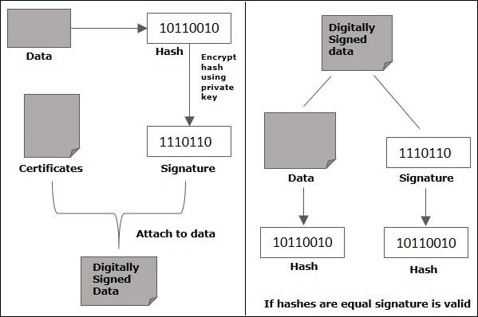

# Digital Signature


- [Digital Signature](#digital_signature)
- [Digital Signature - Java example](#java_example)
    - [Creating the digital signature](#java_create_signature)
    - [Verifing the digital signature](#java_verify_signature)
    


## <a name='digital_signature'> Digital Signature </a>    

Digital Signature is a technique for ensuring:

- Integrity: the message hasn't been altered in transit
- Authenticity: the author of the message is really who they claim to be
- Non-repudiation: the author of the message can't later deny that they were the source

#### Sending a Message with a Digital Signature

- Technically speaking, **a digital signature is the encrypted hash (digest, checksum) of a message**. That means we generate a hash from a message and encrypt it with a private key according to a chosen algorithm.

- The message, the encrypted hash, the corresponding public key, and the algorithm are all then sent. This is classified as a message with its digital signature.



#### Receiving and Checking a Digital Signature

- To check the digital signature, the message receiver generates a new hash from the received message, decrypts the received encrypted hash using the public key, and compares them. If they match, the Digital Signature is said to be verified.

- **We should note that we only encrypt the message hash, and not the message itself**. In other words, Digital Signature doesn't try to keep the message secret. Our digital signature only proves that the message was not altered in transit.

- **When the signature is verified, we're sure that only the owner of the private key could be the author of the message**


  
## <a name='java_example'> Digital Signature - Java example </a>  


## <a name='java_create_signature'> Creating the digital signature </a>  


- **Step 1**: Create a KeyPairGenerator object

    ```java
    //Creating KeyPair generator object
    KeyPairGenerator keyPairGen = KeyPairGenerator.getInstance("DSA");
    ```

- **Step 2**: Initialize the KeyPairGenerator object

    ```java
    //Initializing the KeyPairGenerator
    keyPairGen.initialize(2048);
    ```

- **Step 3**: Generate the KeyPairGenerator

    ```java
    //Generate the pair of keys
    KeyPair pair = keyPairGen.generateKeyPair();
    ```

- **Step 4**: Get the private key from the pair

    ```java
    //Getting the private key from the key pair
    PrivateKey privKey = pair.getPrivate();  
    ```

- **Step 5**: Create a signature object

    ```java
    //Creating a Signature object
    Signature sign = Signature.getInstance("SHA256withDSA"); 
    ```


- **Step 6**: Initialize the Signature object

    ```java
    //Initialize the signature
    sign.initSign(privKey);
    ```

- **Step 7**: Add data to the Signature object

    ```java
    byte[] bytes = "Hello how are you".getBytes();      
    
    //Adding data to the signature
    sign.update(bytes);
    ```

- **Step 8**: Calculate the Signature

    ```java
    //Calculating the signature
    byte[] signature = sign.sign();
    ```

#### Complete CreatingDigitalSignature example

```java

import java.security.KeyPair;
import java.security.KeyPairGenerator;
import java.security.PrivateKey;
import java.security.Signature;
import java.util.Scanner;

public class CreatingDigitalSignature {
   public static void main(String args[]) throws Exception {
      //Accepting text from user
      Scanner sc = new Scanner(System.in);
      System.out.println("Enter some text");
      String msg = sc.nextLine();
      
      //Creating KeyPair generator object
      KeyPairGenerator keyPairGen = KeyPairGenerator.getInstance("DSA");
      
      //Initializing the key pair generator
      keyPairGen.initialize(2048);
      
      //Generate the pair of keys
      KeyPair pair = keyPairGen.generateKeyPair();
      
      //Getting the private key from the key pair
      PrivateKey privKey = pair.getPrivate();
      
      //Creating a Signature object
      Signature sign = Signature.getInstance("SHA256withDSA");
      
      //Initialize the signature
      sign.initSign(privKey);
      byte[] bytes = "msg".getBytes();
      
      //Adding data to the signature
      sign.update(bytes);
      
      //Calculating the signature
      byte[] signature = sign.sign();
      
      //Printing the signature
      System.out.println("Digital signature for given text: "+new String(signature, "UTF8"));
   }
}


```


## <a name='java_verify_signature'> Verifing the digital signature </a>  


- **Step 1**: Create a KeyPairGenerator object

    ```java
    //Creating KeyPair generator object
    KeyPairGenerator keyPairGen = KeyPairGenerator.getInstance("DSA");
    ```
  
- **Step 2**: Initialize the KeyPairGenerator object

    ```java
    //Initializing the KeyPairGenerator
    keyPairGen.initialize(2048);
    ```
  
  
- **Step 3**: Generate the KeyPairGenerator

    ```java
    //Generate the pair of keys
    KeyPair pair = keyPairGen.generateKeyPair();
    ```
  
  
- **Step 4**: Get the private key from the pair

    ```java
    //Getting the private key from the key pair
    PrivateKey privKey = pair.getPrivate();
    ```
  
  
- **Step 5**: Create a signature object

    ```java
    //Creating a Signature object
    Signature sign = Signature.getInstance("SHA256withDSA");
    ```
  
  
- **Step 6**: Initialize the Signature object

    ```java
    //Initialize the signature
    sign.initSign(privKey);
    ```
  
  
- **Step 7**: Add data to the Signature object
  
    ```java
    byte[] bytes = "Hello how are you".getBytes();      
    
    //Adding data to the signature
    sign.update(bytes);
    ```
  
  
- **Step 8**: Calculate the Signature

    ```java
    //Calculating the signature
    byte[] signature = sign.sign();
    ```
  
  
- **Step 9**: Initialize the signature object for verification

    ```java
    //Initializing the signature
    sign.initVerify(pair.getPublic());
    ```
  
  
- **Step 10**: Update the data to be verified

    ```java
    //Update the data to be verified
    sign.update(bytes);
    ```
  
  
- **Step 11**: Verify the Signature

    ```java
    //Verify the signature
    boolean bool = sign.verify(signature);
    ```


#### Complete SignatureVerification  example

```java

import java.security.KeyPair;
import java.security.KeyPairGenerator;
import java.security.PrivateKey;
import java.security.Signature;

import java.util.Scanner;

public class SignatureVerification {
   public static void main(String args[]) throws Exception{
      //Creating KeyPair generator object
      KeyPairGenerator keyPairGen = KeyPairGenerator.getInstance("DSA");
	      
      //Initializing the key pair generator
      keyPairGen.initialize(2048);
	      
      //Generate the pair of keys
      KeyPair pair = keyPairGen.generateKeyPair();
      
      //Getting the privatekey from the key pair
      PrivateKey privKey = pair.getPrivate();

      //Creating a Signature object
      Signature sign = Signature.getInstance("SHA256withDSA");

      //Initializing the signature
      sign.initSign(privKey);
      byte[] bytes = "Hello how are you".getBytes();
      
      //Adding data to the signature
      sign.update(bytes);
      
      //Calculating the signature
      byte[] signature = sign.sign();      
      
      //Initializing the signature
      sign.initVerify(pair.getPublic());
      sign.update(bytes);
      
      //Verifying the signature
      boolean bool = sign.verify(signature);
      
      if(bool) {
         System.out.println("Signature verified");   
      } else {
         System.out.println("Signature failed");
      }
   }
}


```

