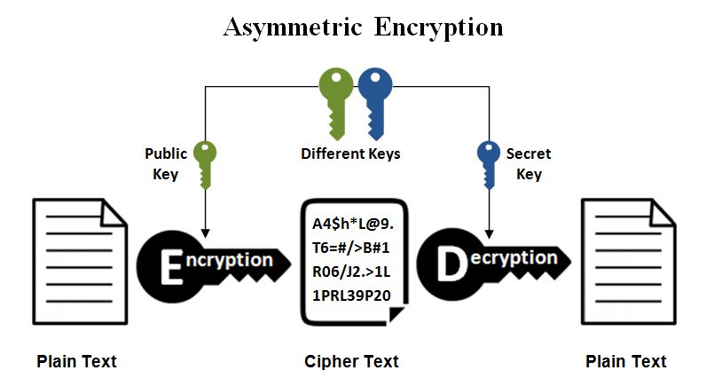

# Symmetric vs Asymmetric Encryption


- [Symmetric Encryption](#symmetric_enc)
    - [Symmetric Java examples](symmetric_java)
- [Asymmetric Encryption](#asymmetric_enc)
    - [Asymmetric Java examples](asymmetric_java)
    - [ssh-keygen tool to generate public/private keys](asymmetric_ssh_keygen)
    - [Java keytool to generate public/private keys](asymmetric_java_keytool)
    
    
## <a name='symmetric_enc'> Symmetric Encryption </a>

Symmetric encryption is a type of encryption where only one key (a secret key) is used to both encrypt and decrypt electronic information.


#### Examples of symmetric encryption:
- Data Encryption Standard (DES)
- Triple Data Encryption Standard (Triple DES)
- Advanced Encryption Standard (AES)
- International Data Encryption Algorithm (IDEA)
- TLS/SSL protocol


### <a name='symmetric_java'> Symmetric Java examples </a>

#### Java "DES" - Data Encryption Standard Symmetric Encryption

```java
public class DES_SymmetricKey {

    public static void main(String[] argv) {

        try {

            KeyGenerator keygenerator = KeyGenerator.getInstance("DES");
            SecretKey myDesKey = keygenerator.generateKey();

            // Create the cipher
            /*
                DES = Data Encryption Standard.
                ECB = Electronic Codebook mode.
                PKCS5Padding = PKCS #5-style padding.
             */
            Cipher cipher = Cipher.getInstance("DES/ECB/PKCS5Padding");

            // Initialize the cipher for encryption
            cipher.init(Cipher.ENCRYPT_MODE, myDesKey);

            //sensitive information
            byte[] text = "No body can see me".getBytes();

            System.out.println("Text [Byte Format] : " + text);
            System.out.println("Text : " + new String(text));

            // Encrypt the text
            byte[] textEncrypted = cipher.doFinal(text);

            System.out.println("Text Encrypted : " + textEncrypted);

            // Initialize the same cipher for decryption
            cipher.init(Cipher.DECRYPT_MODE, myDesKey);

            // Decrypt the text
            byte[] textDecrypted = cipher.doFinal(textEncrypted);

            System.out.println("Text Decrypted : " + new String(textDecrypted));

        } catch (NoSuchAlgorithmException | NoSuchPaddingException | IllegalBlockSizeException | BadPaddingException | InvalidKeyException e) {
            e.printStackTrace();
        }

    }
}

```

```
Text [Byte Format] : [B@2b2948e2
Text : No body can see me
Text Encrypted : [B@4b4523f8
Text Decrypted : No body can see me
```

#### Java "Triple DES" - Triple Data Encryption Standard Symmetric Encryption

```java

public class TripleDES_SymmetricKey {


    public static void main(String[] argv) {

        try {

            KeyGenerator keygenerator = KeyGenerator.getInstance("TripleDES");
            SecretKey myDesKey = keygenerator.generateKey();


            // Create the cipher
            /*
                DES = Data Encryption Standard.
                ECB =
                PKCS5Padding = PKCS #5-style padding.
             */
            Cipher cipher = Cipher.getInstance("TripleDES/ECB/PKCS5Padding");

            // Initialize the cipher for encryption
            cipher.init(Cipher.ENCRYPT_MODE, myDesKey);

            //sensitive information
            byte[] text = "No body can see me".getBytes();

            System.out.println("Text [Byte Format] : " + text);
            System.out.println("Text : " + new String(text));

            // Encrypt the text
            byte[] textEncrypted = cipher.doFinal(text);

            System.out.println("Text Encrypted : " + textEncrypted);

            // Initialize the same cipher for decryption
            cipher.init(Cipher.DECRYPT_MODE, myDesKey);

            // Decrypt the text
            byte[] textDecrypted = cipher.doFinal(textEncrypted);

            System.out.println("Text Decrypted : " + new String(textDecrypted));

        } catch (NoSuchAlgorithmException | NoSuchPaddingException | InvalidKeyException | IllegalBlockSizeException | BadPaddingException e) {
            e.printStackTrace();
        }

    }


}

```

```
Text [Byte Format] : [B@13a5fe33
Text : No body can see me
Text Encrypted : [B@6b09bb57
Text Decrypted : No body can see me
```


#### More Java Symmetric Encryption examples
Check out the [Cryptography git repo](https://github.com/MinaSeddik/Cryptographgy)


## <a name='asymmetric_enc'> Asymmetric Encryption </a>

Asymmetric Encryption, also known as Public-Key Cryptography, is an example of one type. Unlike “normal” (symmetric) encryption, Asymmetric Encryption encrypts and decrypts the data using two separate yet mathematically connected cryptographic keys. 
These keys are known as a **Public Key** and a **Private Key**



#### Examples of Asymmetric encryption:
- Rivest Shamir Adleman (RSA)
- the Digital Signature Standard (DSS), which incorporates the Digital Signature Algorithm (DSA)
- Elliptical Curve Cryptography (ECC)
- the Diffie-Hellman exchange method
- TLS/SSL protocol


### <a name='asymmetric_java'> Symmetric Java examples </a>

#### Java "RSA" - Rivest Shamir Adleman Asymmetric Encryption

```java
public class RSA_ASymmetricKey {

    public static void main(String[] argv) {

        try {

            KeyPairGenerator generator = KeyPairGenerator.getInstance("RSA");
            generator.initialize(2048);
            KeyPair pair = generator.generateKeyPair();


            // We'll use the public key to encrypt the data and the private one for decrypting it
            PrivateKey privateKey = pair.getPrivate();
            PublicKey publicKey = pair.getPublic();


            // To save a key in a file, we can use the getEncoded method, which returns the key content in its primary encoding format:
            try (FileOutputStream fos = new FileOutputStream("public.key")) {
                fos.write(publicKey.getEncoded());
            } catch (IOException e) {
                e.printStackTrace();
            }

            // To read the key from a file, we'll first need to load the content as a byte array:
            File publicKeyFile = new File("public.key");
            byte[] publicKeyBytes = Files.readAllBytes(publicKeyFile.toPath());


            // and then use the KeyFactory to recreate the actual instance:
            KeyFactory keyFactory = KeyFactory.getInstance("RSA");
            EncodedKeySpec publicKeySpec = new X509EncodedKeySpec(publicKeyBytes);
            keyFactory.generatePublic(publicKeySpec);


            Cipher cipher = Cipher.getInstance("RSA");

            // Initialize the cipher for encryption with a public key
            cipher.init(Cipher.ENCRYPT_MODE, publicKey);


            //sensitive information
            byte[] text = "No body can see me".getBytes();

            System.out.println("Text [Byte Format] : " + text);
            System.out.println("Text : " + new String(text));

            // Encrypt the text
            byte[] textEncrypted = cipher.doFinal(text);

            System.out.println("Text Encrypted : " + textEncrypted);

            // Initialize the same cipher for decryption with a private key
            cipher.init(Cipher.DECRYPT_MODE, privateKey);

            // Decrypt the text
            byte[] textDecrypted = cipher.doFinal(textEncrypted);

            System.out.println("Text Decrypted : " + new String(textDecrypted));

        } catch (NoSuchAlgorithmException | NoSuchPaddingException | InvalidKeyException | IllegalBlockSizeException | BadPaddingException | InvalidKeySpecException | IOException e) {
            e.printStackTrace();
        }

    }
}

```

```
Text [Byte Format] : [B@4f970963
Text : No body can see me
Text Encrypted : [B@61f8bee4
Text Decrypted : No body can see me
```

#### Java "ECC" - Elliptical Curve Cryptography Asymmetric Encryption

```java
public class ECC_ASymmetricKey {

    public static void main(String[] argv) {

        try {

            // BouncyCastle is a Java library that complements the default Java Cryptographic Extension (JCE).
            Security.addProvider(new BouncyCastleProvider());

            KeyPairGenerator keyPairGenerator = KeyPairGenerator.getInstance("EC", BouncyCastleProvider.PROVIDER_NAME);
            keyPairGenerator.initialize(new ECGenParameterSpec("secp256r1"));

            KeyPair pair = keyPairGenerator.generateKeyPair();


            // We'll use the public key to encrypt the data and the private one for decrypting it
            PrivateKey privateKey = pair.getPrivate();
            PublicKey publicKey = pair.getPublic();

            // Initialize the cipher for encryption
            Cipher cipher = Cipher.getInstance("ECIESwithAES-CBC");

            // Initialize the cipher for encryption with a public key
            cipher.init(Cipher.ENCRYPT_MODE, publicKey);


            //sensitive information
            byte[] text = "No body can see me".getBytes();

            System.out.println("Text [Byte Format] : " + text);
            System.out.println("Text : " + new String(text));

            // Encrypt the text
            byte[] textEncrypted = cipher.doFinal(text);

            System.out.println("Text Encrypted : " + textEncrypted);

            // Initialize the same cipher for decryption with a private key
            cipher.init(Cipher.DECRYPT_MODE, privateKey, cipher.getParameters());

            // Decrypt the text
            byte[] textDecrypted = cipher.doFinal(textEncrypted);

            System.out.println("Text Decrypted : " + new String(textDecrypted));

        } catch (NoSuchAlgorithmException | NoSuchPaddingException| InvalidKeyException| IllegalBlockSizeException | BadPaddingException | InvalidAlgorithmParameterException | NoSuchProviderException e) {
            e.printStackTrace();
        }

    }
}

```


```
Text [Byte Format] : [B@68b58644
Text : No body can see me
Text Encrypted : [B@68fe48d7
Text Decrypted : No body can see me
```


#### More Java Asymmetric Encryption examples
Check out the [Cryptography git repo](https://github.com/MinaSeddik/Cryptographgy)


### <a name='asymmetric_ssh_keygen'> ssh-keygen tool to generate public/private keys </a>

#### Choosing an Algorithm and Key Size
1. **rsa**: an old algorithm based on the difficulty of factoring large numbers. A key size of at least 2048 bits is recommended for RSA; 4096 bits is better. 
2. **dsa**: an old US government Digital Signature Algorithm. It is based on the difficulty of computing discrete logarithms. A key size of 1024 would normally be used with it. DSA in its original form is no longer recommended.
3. **ecdsa**: a new Digital Signature Algorithm standarized by the US government, using elliptic curves. This is probably a good algorithm for current applications. Only three key sizes are supported: 256, 384, and 521 (sic!) bits. We would recommend always using it with 521 bits
4. **ed25519**: this is a new algorithm added in OpenSSH. Support for it in clients is not yet universal. Thus its use in general purpose applications may not yet be advisable.

- The algorithm is selected using the ***-t*** option 
- Key size using the ***-b*** option.
- Add comment using **-C** option
- Specify the file name with **-f** option
- Assign passphrase with using **-P** option

examples: 
```bash
ssh-keygen -t rsa -b 4096 -C "your_email@example.com"
```

```bash
ssh-keygen -t dsa -C "your_email@example.com"
```

```bash
ssh-keygen -t ecdsa -b 521 -C "your_email@example.com"
```

```bash
ssh-keygen -t ed25519 -C "your_email@example.com"
```


```bash
ssh-keygen -f ~/tatu-key-ecdsa -t ecdsa -b 521
```

```bash
ssh-keygen -f ~/tatu-key-ecdsa -t ras -b 4096 -P "MyPassw0rd"
```

#### Change passphrase of the private key

```bash
ssh-keygen -p
```

```
Enter file in which the key is (/root/.ssh/id_rsa):
Enter old passphrase:
Key has comment 'root@rhel-8.example.com'
Enter new passphrase (empty for no passphrase):
Enter same passphrase again:
Your identification has been saved with the new passphrase.
```


### <a name='asymmetric_java_keytool'> Java keytool to generate public/private keys </a>

- **keytool** must be found in **JRE_HOME/bin**
- It is used to generate key pairs and certificates
- **Note**: this keytool flag was named **-genkey** in earlier releases. While the old name is still supported, **-genkeypair** is preferred going forward.

- **genkeypair**  
    - **{-alias alias}**: Alias name of the entry to process, the -alias ***alias_name*** subpart indicates the alias to be used in the future to refer to the keystore entry containing the keys that will be generated.
    - **{-keyalg alg}**: Key algorithm name
    - **{-keysize size}**: Key bit size
    - **{-dname name}**: Distinguished name
    - **{-keypass arg}**: Key password, The keypass value that you are prompted for specifies a password for the private key about to be generated. You will always need this password in order to access the keystore entry containing that key. The entry doesn't have to have its own password. When you are prompted for the key password, you are given the option of letting it be the same as the keystore password.
    - **{-keystore keystore}**: Keystore name, indicates the name (and optionally path) of the keystore you are creating or already using.
    - **{-storepass arg}**: Keystore password
    - **{-storetype type}**: Keystore type
    

   - keysize
       - 2048 (when using -genkeypair and -keyalg is "RSA")
       - 1024 (when using -genkeypair and -keyalg is "DSA")
       - 256 (when using -genkeypair and -keyalg is "EC")
       - 56 (when using -genseckey and -keyalg is "DES")
       - 168 (when using -genseckey and -keyalg is "DESede")
    
   - validity 90
    
   - hgsdjklfg
       - The default format used for these files is JKS until Java 8.
       - Since Java 9, though, the default keystore format is PKCS12. 
       - The biggest difference between JKS and PKCS12 is that JKS is a format specific to Java, while PKCS12 is a standardized and language-neutral way of storing encrypted private keys and certificates.
       - If you are using Java 8 or newer you should definitely choose PKCS12, the default since Java 9

**example**:
```bash
keytool -genkey -alias signFiles -keystore examplestore
```

- The command for generating keys is -genkey.
- The -alias signFiles subpart indicates the alias to be used in the future to refer to the keystore entry containing the keys that will be generated.
- The -keystore examplestore subpart indicates the name (and optionally path) of the keystore you are creating or already using.
- The storepass value that you are promted for specifies the keystore password.
- The keypass value that you are prompted for specifies a password for the private key about to be generated. You will always need this password in order to access the keystore entry containing that key. The entry doesn't have to have its own password. When you are prompted for the key password, you are given the option of letting it be the same as the keystore password.
- **Note**: For security reasons you should not set your key or keystore passwords on the command line, because they can be intercepted more easily that way.

**Distinguished-Name Information**  
If you use the preceding keystore command, you will be prompted for your distinguished-name information. Following are the prompts; the bold indicates what you should type.

```
What is your first and last name?
  [Unknown]:  Susan Jones 
What is the name of your organizational unit?
  [Unknown]:  Purchasing 
What is the name of your organization?
  [Unknown]:  ExampleCompany 
What is the name of your City or Locality?
  [Unknown]:  Cupertino 
What is the name of your State or Province?
  [Unknown]:  CA 
What is the two-letter country code for this unit?
  [Unknown]:  US 
Is <CN=Susan Jones, OU=Purchasing, O=ExampleCompany,
    L=Cupertino, ST=CA, C=US> correct?
  [no]:  y 
```

**Command Results**  
- The keytool command creates the keystore named examplestore (if it doesn't already exist) in the same directory in which the command is executed. The command generates a public/private key pair for the entity whose distinguished name has a common name of Susan Jones and the organizational unit of Purchasing.

- The command creates a self-signed certificate that includes the public key and the distinguished-name information. (The distinguished name you supply will be used as the "subject" field in the certificate.) This certificate will be valid for 90 days, the default validity period if you don't specify a -validity option. The certificate is associated with the private key in a keystore entry referred to by the alias signFiles.

- Self-signed certificates are useful for developing and testing an application. However, users are warned that the application is signed with an untrusted certificate and asked if they want to run the application. To provide users with more confidence to run your application, use a certificate issued by a recognized certificate authority.

---  

#### More examples
```bash
keytool -genkey -alias mydomain -keyalg RSA -keysize 2048 -keystore keystore.jks 
```

```bash
keytool -genkey -alias duke -keypass dukekeypasswd
```

```bash
keytool -genkey -alias mydomain -keyalg RSA -keysize 2048 -keystore keystore.jks 
```

```bash
keytool -genkey -alias signFiles -keystore examplestore
```

to check 

```bash
keytool -list
```

```bash
keytool -list -alias signFiles
```


    