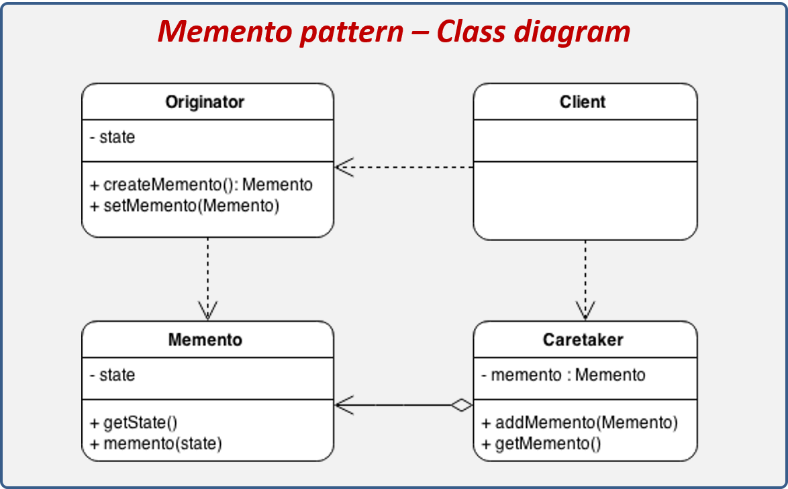

# Design Patterns

Since A picture is worth a thousand words, 
Here is **ALL** Design Patterns based on **Head First Design Patterns** 

- [Strategy Design Pattern](#strategy_design_pattern)
- [Observer Design Pattern](#observer_design_pattern)
- [Decorator Design Pattern](#decorator_design_pattern)
- [Factory Method and Abstract Factory Design Patterns](#factory_design_pattern)
- [Singleton Design Pattern](#singleton_design_pattern)
- [Command Design Pattern](#command_design_pattern)
- [Adapter and Facade Design Patterns](#adapter_facade_design_pattern)
- [Template Method Pattern](#templete_design_pattern)
- [Iterator and Composite Pattern](#iterator_composite_design_pattern)
- [State Design Pattern](#state_design_pattern)
- [Proxy Design Pattern](#proxy_design_pattern)
- [MVC Design Pattern](#mvc_design_pattern)
--- 
- [Bridge Pattern](#bridge_pattern)
- [Builder Pattern](#builder_pattern)
- [Chain of Responsibility Pattern](#chain_of_responsibility_pattern)
- [Flyweight Pattern](#flyweight_pattern)
- [Interpreter Pattern](#interpreter_pattern)
- [Mediator Pattern](#mediator_pattern)
- [Memento Pattern](#memento_pattern)
- [Prototype Pattern](#prototype_pattern)
- [Visitor Pattern](#visitor_pattern)
---
- [SOLID Principles](#solid_principles)

## <a name='strategy_design_pattern'> Strategy Design Pattern </a>

## <a name='observer_design_pattern'> Observer Design Pattern </a>

## <a name='decorator_design_pattern'> Decorator Design Pattern </a>

## <a name='factory_design_pattern'> Factory Method and Abstract Factory Design Patterns </a>

#### Factory Design Pattern

#### Abstract Factory Design Pattern

## <a name='singleton_design_pattern'> Singleton Design Pattern </a>

## <a name='command_design_pattern'> Command Design Pattern </a>

## <a name='adapter_facade_design_pattern'> Adapter and Facade Design Patterns </a>

#### Adapter Design Pattern

#### Facade Design Pattern

## <a name='templete_design_pattern'> Template Method Pattern </a>

## <a name='iterator_composite_design_pattern'> Iterator and Composite Pattern </a>

#### Iterator Design Pattern

#### Composite Design Pattern

## <a name='state_design_pattern'> State Design Pattern </a>

## <a name='proxy_design_pattern'> Proxy Design Pattern </a>

## <a name='mvc_design_pattern'> MVC Design Pattern </a>

---

## <a name='bridge_pattern'> Bridge Pattern </a>

## <a name='builder_pattern'> Builder Pattern </a>

## <a name='chain_of_responsibility_pattern'> Chain of Responsibility Pattern </a>

## <a name='flyweight_pattern'> Flyweight Pattern </a>

## <a name='interpreter_pattern'> Interpreter Pattern </a>

## <a name='mediator_pattern'> Mediator Pattern </a>

## <a name='memento_pattern'> Memento Pattern </a>

## <a name='prototype_pattern'> Prototype Pattern </a>

## <a name='visitor_pattern'> Visitor Pattern </a>

## <a name='solid_principles'> SOLID Principles </a>

- The **S**ingle Responsibility Principle 
    - there must be ONLY ONE REASON to make changes there. 
    - The function must be testable.
- The **O**pen-Closed Principle
    - the class must be closed to modification and open to extension.
    - New class functionality should be added to an existing class through inheritance, and not by modifying the existing one.
- The **L**iskov Substitution Principle
    - If you have a function or class X using class A, then the replacement of class A by any of its subclasses should not break the function of X.
- The **I**nterface Segregation Principle
    - No code should be forced to depend on methods it does not use.
- The **D**ependency Inversion Principle
    - classes should depend on abstractions, not on specific implementations of those abstractions.
    
    
    

