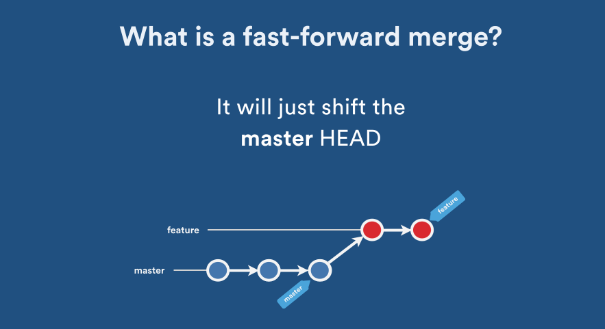
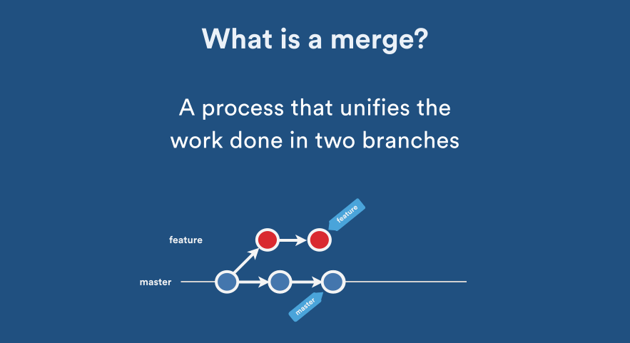

# Git Source Control


- [git add / git rm - *Add/Remove file to/from stage area*](#git_add_rm)
- [git status](#git_status)
- [git log](#git_log)
- [git reset](#git_reset)
- [git merge](#git_merge)
- [git rebase](#git_rebase)
- [git rebase -i   (*interactive mode*) ](#git_rebase_iteractive)


## <a name='git_add_rm'> git add / git rm - *Add/Remove file to/from stage area* </a>

To add a file to stage, Use: git add <fileName>
```git
git add fileName
```

To add all files to stage
```git
git add *
```
OR
```git
git add -A
```
OR
```git
git add -all
```

To remove a file from stage, Use: git rm <fileName>
```git
git rm fileName
```

To remove all staged files
```git
git reset HEAD
```


## <a name='git_status'> git status </a>

```git
git status
```


## <a name='git_log'> git log </a>

```git
git log
```

```git
git log --oneline
```


## <a name='git_reset'> git reset </a>

git reset changes, at minimum, where the current branch (HEAD) is pointing. The difference between --mixed and --soft is whether or not your index is also modified. So, if we're on branch master with this series of commits:
```
- A - B - C (master)
```
 HEAD points to C and the index matches C.
 
 When we run git reset --soft B, master (and thus HEAD) now points to B, but the index still has the changes from C; git status will show them as staged. So if we run git commit at this point, we'll get a new commit with the same changes as C.
 
 ```git
git reset --soft HEAD
 ```

exactly the same as

 ```git
git reset --soft 
 ```


 ___
 Okay, so starting from here again:
 ```
 - A - B - C (master)
 ```

Now let's do git reset --mixed B. (Note: --mixed is the default option). Once again, master and HEAD point to B, but this time the index is also modified to match B. If we run git commit at this point, nothing will happen since the index matches HEAD. We still have the changes in the working directory, but since they're not in the index, git status shows them as unstaged. To commit them, you would git add and then commit as usual.


 ```git
git reset HEAD
 ```

exactly the same as

 ```git
git reset 
 ```
___

And finally, --hard is the same as --mixed (it changes your HEAD and index), except that --hard also modifies your working directory. If we're at C and run git reset --hard B, then the changes added in C, as well as any uncommitted changes you have, will be removed, and the files in your working copy will match commit B. Since you can permanently lose changes this way, you should always run git status before doing a hard reset to make sure your working directory is clean or that you're okay with losing your uncommitted changes.

 ```git
git reset --hard HEAD
 ```

exactly the same as

 ```git
git reset --hard 
 ```

___
And finally, a visualization:


## <a name='git_merge'> git merge </a>

merge source into master
```
git checkout <target>     <--- 
git merge <source>
```
Note: the source pointer won't change but the target pointer will

ex: **merge feature-1 branch into master branch** 

first, checkout master branch
```
git checkout master
```

then, merge feature-1 branch to master
```
git merge feature-1
```

Note: the master branch pointer will move but feature-1 branch will remain as it is

---
**There are 2 types of merge**

- Fast-forward merge

    In this most commonly used merge strategy, history is just one straight line. When you create a branch, make some commits in that branch, the time you’re ready to merge, there is no new merge on the master. That way master’s pointer is just moved straight forward and history is one straight line.

    
    
- **Recursive merge**

    Recursive is the default merge strategy when  merging one branch.

    In Recursive merge, after you branch and make some commits, there are some new original commits on the ‘master‘. So, when it’s time to merge, git recurses over the branch and creates a new merge commit. The merge commit continues to have two parents.
    
    


## <a name='git_rebase'> git rebase </a>

## <a name='git_reset'> git rebase -i   (*interactive mode*) </a>


