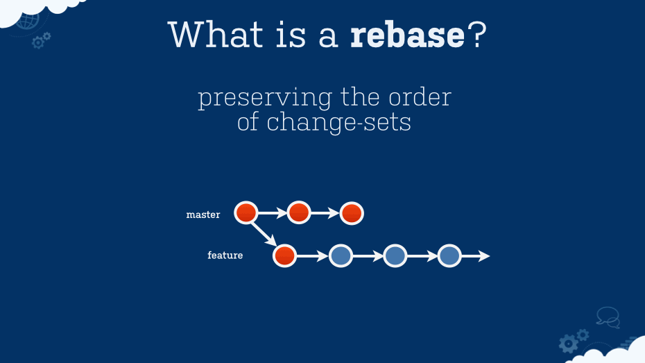
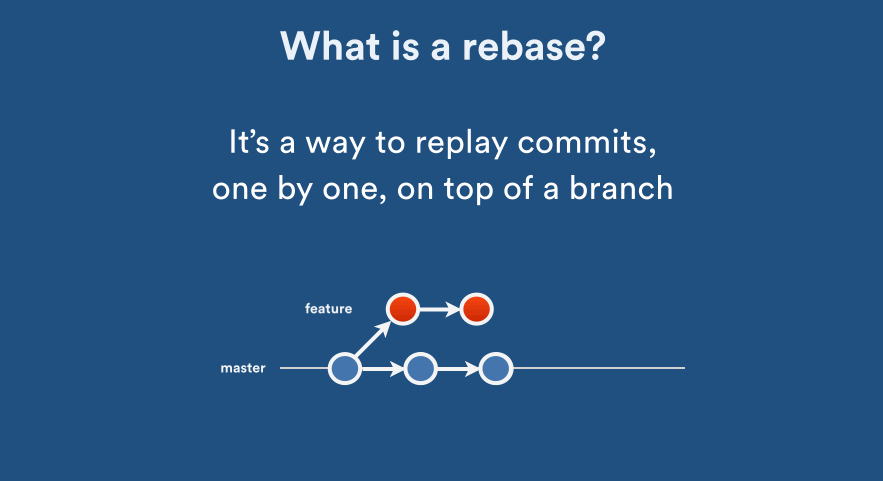
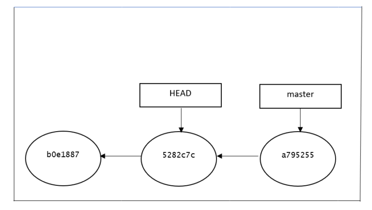

# Git Source Control


- [git version](#git_version)
- [git add](#git_add)
- [git rm](#git_rm)
- [git commit](#git_commit)
- [git status](#git_status)
- [git log](#git_log)
- [git chekout](#git_checkout)
- [git switch](#git_switch)
- [git restore](#git_restore)
- [git reset](#git_reset)
- [git merge](#git_merge)
- [git rebase](#git_rebase)
- [git rebase -i  (*interactive mode*) ](#git_rebase_iteractive)
- [git remote](#git_remote)
- [git branch](#git_branch)
- [git fetch](#git_fetch)
- [git pull](#git_pull)
- [git push](#git_push)
- [git stash](#git_stash)
- [git init](#git_init)
- [git clone](#git_clone)
- [git config](#git_config)
- [git tag](#git_tag)
- [git reflog](#git_reflog)
- [git cherrypick](#git_cherrypick)
- [git revert](#git_revert)   


## <a name='git_version'> git version </a>

To view the installed git version on your local
```git
git --version
```


## <a name='git_add'> git add </a>

To add a file to stage, Use: git add <fileName>
```git
git add fileName
```

To add all files to stage
```git
git add *
```
OR
```git
git add -A
```
OR
```git
git add -all
```

## <a name='git_rm'> git rm </a>


To remove a file from stage, Use: git rm <fileName>
```git
git rm fileName
```

To remove all staged files
```git
git reset HEAD
```

## <a name='git_commit'> git commit </a>

```git
git commit -m "message"
```

To add more file to the last commit, issue the following command after staging the files
OR
To change the message of the last commit
```git
git commit --amend
```


## <a name='git_status'> git status </a>

```git
git status
```


## <a name='git_log'> git log </a>

```git
git log
```

```git
git log --oneline
```

## <a name='git_checkout'> git checkout </a> 

It is used to
- Move HEAD from one branch to another
- Create a new branch
- Move HEAD to a particular commit hash
- checkout single file 


to checkout develop branch
```git
git checkout develop
```
the HEAD is pointing to develop branch


to go back to previuos commit where the HEAD was pointing to
```git
git checkout -
``

create new branch
```git
git checkout -b <branch_name>
```

move HEAD to a particular commit hash
```git
git checkout -b <commit_hash>
```


checkout certain file from a certain branch
```git
git checkout <branch_name> -- <file_name>
```

OR from certain commit hash
```git
git checkout <commit_hash> -- <file_name>
```

and to move back to the file_name of the HEAD
```git
git checkout HEAD -- <file_name>
```


## <a name='git_switch'> git switch </a> 

It is used to
- Move HEAD from one branch to another
- Create a new branch
- **CANNOT** move HEAD to a particular commit hash - *git checkout should be used instead*  

to switch to develop branch
```git
git switch develop
```
The HEAD will be pointing to develop branch


create new branch
```git
git switch -c <branch_name>
```
The HEAD will be pointing to the new branch

## <a name='git_restore'> git restore </a> 

It is used to
- Restore a file from working area
- Remove a file from staging area  
  
  

to restore a file from working area (undo the modifications)  
and it will be in sync with the HEAD
```git
git restore <file_name>
```


to remove a file from staging area (to unstage a file)
```git
git restore --staged <file_name>
```
This file will be moved to the working area


to restore certain file from a certain commit
```git
git restore --source <branch_name> -- <file_name>
```


## <a name='git_reset'> git reset </a>

git reset changes, at minimum, where the current branch (HEAD) is pointing. The difference between --mixed and --soft is whether or not your index is also modified. So, if we're on branch master with this series of commits:

```
- A - B - C (master)
```
 HEAD points to C and the index matches C.
 
 When we run git reset --soft B, master (and thus HEAD) now points to B, but the index still has the changes from C; git status will show them as staged. So if we run git commit at this point, we'll get a new commit with the same changes as C.
 
 ```git
git reset --soft HEAD
 ```

exactly the same as

 ```git
git reset --soft 
 ```


 ___
 Okay, so starting from here again:
 ```
 - A - B - C (master)
 ```

Now let's do git reset --mixed B. (Note: --mixed is the default option). Once again, master and HEAD point to B, but this time the index is also modified to match B. If we run git commit at this point, nothing will happen since the index matches HEAD. We still have the changes in the working directory, but since they're not in the index, git status shows them as unstaged. To commit them, you would git add and then commit as usual.


 ```git
git reset HEAD
 ```

exactly the same as

 ```git
git reset 
 ```
___

And finally, --hard is the same as --mixed (it changes your HEAD and index), except that --hard also modifies your working directory. If we're at C and run git reset --hard B, then the changes added in C, as well as any uncommitted changes you have, will be removed, and the files in your working copy will match commit B. Since you can permanently lose changes this way, you should always run git status before doing a hard reset to make sure your working directory is clean or that you're okay with losing your uncommitted changes.

 ```git
git reset --hard HEAD
 ```

exactly the same as

 ```git
git reset --hard 
 ```

___
And finally, a visualization:


## <a name='git_merge'> git merge </a>

merge source into target
```
git checkout <target>     
git merge <source>
```
Note: the source pointer won't change but the target pointer will

ex: **merge feature (source) branch into master branch (target)** 

first, checkout master branch
```
git checkout master
```

then, merge feature branch to master
```
git merge feature
```

Note: the master branch pointer will move but feature branch will remain as it is

---
**There are 2 types of merge**

- Fast-forward merge

    In this most commonly used merge strategy, history is just one straight line. When you create a branch, make some commits in that branch, the time you’re ready to merge, there is no new merge on the master. That way master’s pointer is just moved straight forward and history is one straight line.

    
    
- **Recursive merge**

    Recursive is the default merge strategy when  merging one branch.

    In Recursive merge, after you branch and make some commits, there are some new original commits on the ‘master‘. So, when it’s time to merge, git recurses over the branch and creates a new merge commit. The merge commit continues to have two parents.
    
    


## <a name='git_rebase'> git rebase </a>

Rebase is recreating your work from one branch onto another.
    
rebase a branch (target) on top of another branch (base)

Note: the base pointer won't change but the target pointer will

ex: **rebase feature (target) branch on master branch (base)** 

first, checkout master feature
```git
git checkout feature
```

then, merge feature branch to master
```git
git rebase master
```

Note: the master branch pointer will NOT change but feature branch will


   
    
   
   
      
Then we can perform merge feature into master (fast forward merge)

this way, we can keep a clean history

```git
git checkout master
git merge feature
```
       
    
## <a name='git_reset'> git rebase -i   (*interactive mode*) </a>

```git
git rebase -i HEAD~3
```

i: interactive

HEAD~3: rebase (change) last 3 commits


you can squash, change commit message, delete a commit and much more


## <a name='git_remote'> git remote </a>

To list remote
```git
git remote -v
```

To list remote
```git
git remote add origin <URL>
```

To list remote
```git
git rename <source> <dest>
```
    
 and much more like delete remote ....


## <a name='git_branch'> git branch</a>

Create new branch without check it out
```git
git branch <branch_name>
```

Create new branch and check it out
```git
git checkout -b <branch_name>
```

Delete branch
```git
git branch -d <branch_name>
```

and to delete the remote branch
```git
git push origin <branch_name> --delete
```

list local branches
```git
git branch -l
```

list remote branches
```git
git branch -r
```

list all branches
```git
git branch -a
```


## <a name='git_fetch'> git fetch </a>

Used to fetch and update the remote refrences only without changing anything

It'll be usefull to track the remote branch and compare it with the local
```git
git fetch  <branch_name>
```

to fetch current checkout branch
```git
git fetch 
```

to fetch all remote branches
```git
git fetch --all
```


## <a name='git_pull'> git pull </a>

pull = fetch + merge 
```git
git pull origin <branch_name>
```

ex: to update master branch from remote
```git
git pull origin master
```

OR

```git
git checkout master
git pull  
```


to do rebase instead of merge

pull = fetch + rebase
```git
git pull origin master --rebase
```

OR

```git
git checkout master
git pull origin --rebase
```

## <a name='git_push'> git push </a>

To push the changes to the remote
```git
git push origin <branch_name>
```

ex: to push master branch to the remote
```git
git push origin master
```

 Note: for the first time, you may need to do --set-upstream
 ```git
 git push --set-upstream origin <branch>
```

ex: to push master branch to the remote for the first time
```git
git push --set-upstream origin master
```


## <a name='git_stash'> git stash </a>


to stash chnages 
 ```git
 git stash
```


to stash a newly created/untracked file
 ```git
 git stash -u
``` 


to stash with save message
 ```git
 git stash save <message>
```

ex:
 ```git
 git stash save "add style to our site"
```

to list stash
 ```git
 git stash list
```

to apply last stash
 ```git
 git stash apply
```

Note: apply command doesn't remove the stashed files from the stash area

to remove the stash entry
 ```git
 git stash drop
```


finally: pop = apply + remove
 ```git
 git stash pop
```
the last sash will be applied and removed from the stage area


## <a name='git_init'> git init </a>

to init a git tracking repo on your local
 ```git
 git init
```


to init a git tracking on the remote repo
 ```git
 git init --bare
```


## <a name='git_clone'> git clone </a>

to clone and bring a project from remote repo to local
 ```git
mkdir <project_dir>
cd <project_dir>
git clone https://github.com/gittower/<project_name>.git
```

ex:
 ```git
mkdir <project_dir>
cd <project_dir>
git clone https://github.com/gittower/<project_name>.git
```


 ```git
mkdir /home/mina/my_workspace
cd /home/mina/my_workspace
git clone git@github.com:MinaSeddik/dev-shortcut.git
```

a new project directory named "shortcut" will be created


## <a name='git_config'> git config </a>

to list local git configuration
 ```git
 git config --list
```

to set user name for local repo
 ```git
 git config --global user.name "Mina"
```

to set email for local repo
 ```git
 git config --global user.email "mina@example.com"
```

to set git ui color for git bash
 ```git
 git config --global color.ui auto
```


## <a name='git_tag'> git tag </a>


to create tag of the current comment
 ```git
 git tag v1.0.0
```

Note: for best practice of tag versioning, Follow **Semantic Versioning**:  
https://semver.org/


to list tags
 ```git
 git tag -l
```


to push tags to remote
 ```git
 git push --tags
```

to checkout a tag
 ```git
 git checkout v1.0.0
```


to delete a tag
 ```git
 git tag -d v1.0.0
```

to delete remote tag
 ```git
 git tag -d v1.0.0
git push --delete origin v1.0.0
```


## <a name='git_reflog'> git reflog </a>

Git keeps track of updates to the tip of branches using a mechanism called reference logs, or "reflogs."

It is a record of all commits that are or were referenced in your repo at any time.

You can use it to view the history of the **HEAD** pointer

 ```git
 git reflog
```

This is essentially a short cut that's equivalent to:
 ```git
 git reflog show HEAD
```
It used to
- Recovering lost commits
- undo git merge
- undo git rebase
- go back on history

ex:
 ```git
git reset HEAD@{2}
```

OR

 ```git
git reset 833b2c1
```
where "833b2c1" is the hash of the target commit


to revert to a certain commit permenantly
 ```git
git reset --hard <SHA>
```

Note: You may got a warning message
```gitignore
You are in 'detached HEAD' state. You can look around, make experimental
changes and commit them, and you can discard any commits you make in this
state without impacting any branches by switching back to a branch.
```

HEAD is **NOT** pointing to a branch


Below is the graphical representation of the current git HEAD. 
Since we've checkout to a previous commit, now the HEAD is pointing to 5282c7c commit, 
and the master branch is still referring to the same:


   


## <a name='git_cherrypick'> git cherrypick </a>

Cherry picking in Git means to choose a commit from one branch and apply it onto another.

This is in contrast with other ways such as merge and rebase which normally apply many commits onto another branch.

Make sure you are on the branch you want to apply the commit to
 ```git
git checkout master
```

then, execute the following
 ```git
git cherry-pick <commit-hash>
```

**Note:** If you cherry-pick from a public branch, you should consider using
 ```git
git cherry-pick -x <commit-hash>
```

This will generate a standardized commit message. This way, you (and your co-workers) can still keep track of the origin of the commit and may avoid merge conflicts in the future.


## <a name='git_revert'> git revert </a>

It creates a new commit that is the opposite of an existing commit
 ```git
git revert <commit-hash>
```

It  creates a new commit with the changes that are rolled back.


the output will be something like this
 ```git
$ git log --oneline
1db4eeb Revert "bad update"
a1b9870 bad update
```


