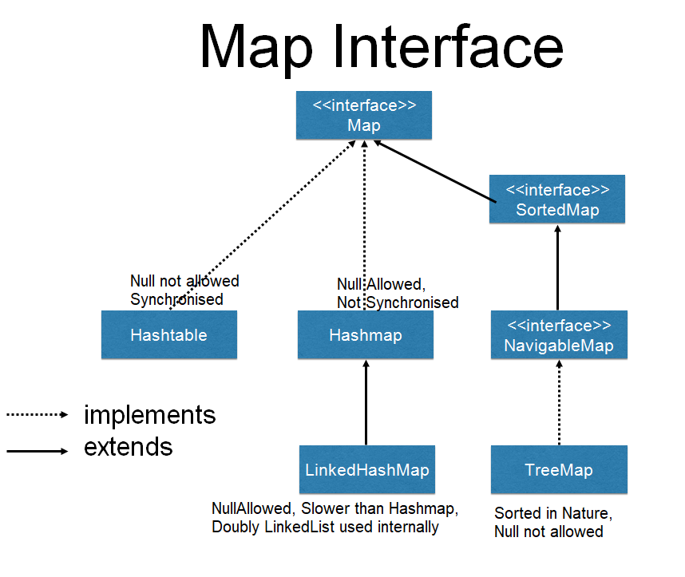

# Java

*The Java code snippets listed here are based on Java 8*

- [Java Collection](#java_collection)
- [Map Hierarchy](#map_hierarchy)
- [Collections Utility](#collections_utility)
- [Exception Hierarchy](#exception_hierarchy)
- [Avoid float and double if exact answers are required](#floating_numbers)
- [Enums](#enums)
- [Functional Interfaces](#functional_interfaces)
- [Java Generics](#java_generics)
- Concurrency
- JVM Options - *Heap size, min, max and other options*
- JVM Memory management
- JVM Garbage Collector
- Performance tuning


## <a name='java_collection'> Java Collection </a>


#### List
- **LinkedList** is implemented as a double linked list. It's performance on add and remove is better than Arraylist, but worse on get and set methods.You will have to traverse the list up to a certain point in those cases. So, definitely not LinkedList.
    - LinkedList, however, also implements Queue interface which adds more methods than ArrayList and Vector, such as offer(), peek(), poll(), etc.
- **ArrayList** is implemented as a resizable array. As more elements are added to ArrayList, its size is increased dynamically. It's elements can be accessed directly by using the get and set methods, since ArrayList is essentially an array.
- **Vector** is similar with ArrayList, but it is synchronised.
- **Stack** implements FILO strategy  
- **CopyOnWriteArrayList*** ***(belongs to concurrency util)*** 
    - uses an interesting technique to make it thread-safe without a need for synchronization. When we are using any of the modify methods – such as add() or remove() – the whole content of the CopyOnWriteArrayList is copied into the new internal copy.
    - Removing While Iterating Is Not Allowed
     
#### Queue
- **ArrayDeque** and **LinkedList** are implementing Deque interface but implementation is different.
- **ArrayDeque** class is the resizable array implementation of the Deque interface and **LinkedList** class is the list implementation
- NULL elements can be added to **LinkedList** but not in **ArrayDeque**
- **ArrayDeque** is more efficient than the **LinkedList** for add and remove operation at both ends and LinkedList implementation is efficient for removing the current element during the iteration
- The **LinkedList** implementation consumes more memory than the ArrayDeque
- A **PriorityQueue** is used when the objects are supposed to be processed based on the priority. It is known that a Queue follows the First-In-First-Out algorithm, but sometimes the elements of the queue are needed to be processed according to the priority, that’s when the PriorityQueue comes into play. The PriorityQueue is based on the priority heap. The elements of the priority queue are ordered according to the natural ordering, or by a Comparator provided at queue construction time, depending on which constructor is used. 
#### Set
- **HashSet** doesn’t maintain any order of elements.
- **LinkedHashSet** maintains insertion order of elements. i.e elements are placed as they are inserted.   
- **TreeSet** orders the elements according to supplied Comparator. 
- **EnumSet** specialized Set collection to work with enum classes. It implements the Set interface and extends from AbstractSet:
    - It can contain only enum values and all the values have to belong to the same enum
    - It doesn't allow to add null values, throwing a NullPointerException in an attempt to do so
    - It's not thread-safe, so we need to synchronize it externally if required
    - The elements are stored following the order in which they are declared in the enum
    - It uses a fail-safe iterator that works on a copy, so it won't throw a ConcurrentModificationException if the collection is modified when iterating over it
    - EnumSet is a public abstract class that contains multiple static factory methods that allow us to create instances. The JDK provides 2 different implementations – are package-private and backed by a bit vector:
       - RegularEnumSet and
       - JumboEnumSet
            - RegularEnumSet uses a single long to represent the bit vector. Each bit of the long element represents a value of the enum. The i-th value of the enum will be stored in the i-th bit, so it's quite easy to know whether a value is present or not. Since long is a 64-bit data type, this implementation can store up to 64 elements.
            - On the other hand, JumboEnumSet uses an array of long elements as a bit vector. This lets this implementation store more than 64 elements. It works pretty much like the RegularEnumSet but making some extra calculations to find the array index where the value is stored.
     - **Examples:**
        - EnumSet.allOf(Color.class);
        - EnumSet.noneOf(Color.class);
        - EnumSet.of(Color.YELLOW, Color.BLUE, Color.RED);
        - EnumSet.range(Color.YELLOW, Color.BLUE);         


## <a name='map_hierarchy'> Map Hierarchy </a>



- **HashMap** is implemented as a hash table, and there is no ordering on keys or values. 
- **TreeMap** is implemented based on red-black tree structure, and it is ordered by the key. 
- **LinkedHashMap** preserves the insertion order or access order (which is used to implement LRU Cache)
     
example:  LinkedHashMap to implement LRU cache

```java
public class LRUCache<K, V> extends LinkedHashMap<K, V> {
    private int size;

    public static void main(String[] args) {
        LRUCache<Integer, Integer> cache = LRUCache.newInstance(2);
        cache.put(1, 1);    // { 1=1 }
        cache.put(2, 2);    // { 1=1, 2=2 }
        cache.put(1, 1);    // { 2=2, 1=1 }
        cache.put(3, 3);    // { 1=1, 3=3 }

        System.out.println(cache);
    }

    private LRUCache(int size) {
        super(size, 0.75f, true);   // <--- "true for access-order, false for insertion-order"
        this.size = size;
    }

    @Override
    protected boolean removeEldestEntry(Map.Entry<K, V> eldest) {
        return size() > size;
    }

    public static <K, V> LRUCache<K, V> newInstance(int size) {
        return new LRUCache<K, V>(size);
    }

}
```
The output is
> {1=1, 3=3}

- **Hashtable** is synchronized in contrast to HashMap. 
- **EnumMap** is a Map implementation that exclusively takes Enum as its keys.
example:
```java

public enum DayOfWeek {
    MONDAY, TUESDAY, WEDNESDAY, THURSDAY, FRIDAY, SATURDAY, SUNDAY
}


EnumMap<DayOfWeek, String> activityMap = new EnumMap<>(DayOfWeek.class);
activityMap.put(DayOfWeek.MONDAY, "Soccer");

```
- **EnumMap** is a hashtable-based implementation of the Map interface, with keys that are of a WeakReference type.
    - References of a WeakReference type are used as keys in WeakHashMap.
    - An entry in a WeakHashMap will automatically be removed when its key is no longer in ordinary use, meaning that there is no single Reference that point to that key.
example:
```java
WeakHashMap<UniqueImageName, BigImage> map = new WeakHashMap<>();
BigImage bigImage = new BigImage("image_id");
UniqueImageName imageName = new UniqueImageName("name_of_big_image");

map.put(imageName, bigImage);
assertTrue(map.containsKey(imageName));

imageName = null;
System.gc();

await().atMost(10, TimeUnit.SECONDS).until(map::isEmpty);
```    
We're creating a WeakHashMap instance that will store our BigImage objects. We are putting a BigImage object as a value and an imageName object reference as a key. The imageName will be stored in a map as a WeakReference type.   

Next, we set the imageName reference to be null, therefore there are no more references pointing to the bigImage object. The default behavior of a WeakHashMap is to reclaim an entry that has no reference to it on next GC, so this entry will be deleted from memory by the next GC process.   

We are calling a System.gc() to force the JVM to trigger a GC process. After the GC cycle, our WeakHashMap will be empty   

- **IdentityHashMap** violates the use of the equals(), Instead, it uses reference equality (==) on key search operations.
- **ConcurrentMap*** ***(belongs to concurrency util)***   
Maps are naturally one of the most widely style of Java collection.

And, importantly, HashMap is not a thread-safe implementation, while Hashtable does provide thread-safety by synchronizing operations.

Even though Hashtable is thread safe, it is not very efficient. Another fully synchronized Map, Collections.synchronizedMap, does not exhibit great efficiency either. If we want thread-safety with high throughput under high concurrency, these implementations aren't the way to go.


The following APIs are also overridden to support atomicity:
- putIfAbsent
- remove
- replace(key, oldValue, newValue)
- replace(key, value)
- getOrDefault
- forEach
- replaceAll
- computeIfAbsent
- computeIfPresent
- compute
- merge

For better performance, it consists of an array of nodes as table buckets (used to be table segments prior to Java 8) under the hood, and mainly uses CAS operations during updating.

The table buckets are initialized lazily, upon the first insertion. Each bucket can be independently locked by locking the very first node in the bucket. Read operations do not block, and update contentions are minimized.


## <a name='collections_utility'> Collections Utility </a>

| Sr.No.      |    Method & Description           |
| :---         |    :----                    |
| 1	| **static <T> boolean addAll(Collection<? super T> c, T... elements)**  <br> This method adds all of the specified elements to the specified collection. | 
| 2	| **static <T> Queue<T> asLifoQueue(Deque<T> deque)** <br> This method returns a view of a Deque as a Last-in-first-out (Lifo) Queue. | 
| 3	| **static <T> int binarySearch(List<? extends Comparable<? super T>> list, T key)** <br> This method searches the specified list for the specified object using the binary search algorithm. | 
| 4	| **static <T> int binarySearch(List<? extends T> list, T key, Comparator<? super T< c)** <br> This method searches the specified list for the specified object using the binary search algorithm. | 
| 5	| **static <E> Collection<E> checkedCollection(Collection<E> c, Class<E> type)** <br> This method returns a dynamically typesafe view of the specified collection. | 
| 6	| **static <E> List<E> checkedList(List<E> list, Class<E> type)** <br> This method returns a dynamically typesafe view of the specified list. | 
| 7	| **static <K,V> Map<K,V> checkedMap(Map<K,V> m, Class<K> keyType, Class<V> valueType)** <br> This method returns a dynamically typesafe view of the specified map. | 
| 8	| **static <E> Set<E> checkedSet(Set<E> s, Class<E> type)** <br> This method returns a dynamically typesafe view of the specified set. | 
| 9	|  **static <K,V> SortedMap<K,V> checkedSortedMap(SortedMap<K,V> m, Class<K> keyType, Class<V> valueType)** <br> This method returns a dynamically typesafe view of the specified sorted map. | 
| 10 | 	**static <E> SortedSet<E>checkedSortedSet(SortedSet<E> s, Class<E> type)** <br> This method returns a dynamically typesafe view of the specified sorted set. | 
| 11 |	**static <T> void copy(List<? super T> dest, List<? extends T> src)** <br> This method copies all of the elements from one list into another. | 
| 12 |	**static boolean disjoint(Collection<?> c1, Collection<?> c2)** <br> This method returns true if the two specified collections have no elements in common. |
| 13 |	**static <T> List<T> emptyList()** <br> This method returns the empty list (immutable). |
| 14 |	**static <K,V> Map<K,V> emptyMap()** <br> This method returns the empty map (immutable). |
| 15 |	**static <T> Set<T> emptySet()** <br> This method returns the empty set (immutable). |
| 16 |	**static <T> Enumeration<T> enumeration(Collection<T> c)** <br> This method returns an enumeration over the specified collection. |
| 17 |	**static <T> void fill(List<? super T> list, T obj)** <br> This method replaces all of the elements of the specified list with the specified element. |
| 18 |	**static int frequency(Collection<?> c, Object o)** <br> This method returns the number of elements in the specified collection equal to the specified object. |
| 19 |	**static int indexOfSubList(List<?> source, List<?> target)** <br> This method returns the starting position of the first occurrence of the specified target list within the specified source list, or -1 if there is no such occurrence. |
| 20 |	**static int lastIndexOfSubList(List<?> source, List<?> target)** <br> This method returns the starting position of the last occurrence of the specified target list within the specified source list, or -1 if there is no such occurrence. |
| 21 |	**static <T> ArrayList<T> list(Enumeration<T> e)** <br> This method returns an array list containing the elements returned by the specified enumeration in the order they are returned by the enumeration. |
| 22 |	**static <T extends Object & Comparable<? super T> >T max(Collection<? extends T> coll)** <br> This method returns the maximum element of the given collection, according to the natural ordering of its elements. |
| 23 |	**static <T> T max(Collection<? extends T> coll, Comparator<? super T> comp)** <br> This method returns the maximum element of the given collection, according to the order induced by the specified comparator. |
| 24 |	**static <T extends Object & Comparable<? super T>>T min(Collection<? extends T> coll)** <br> This method Returns the minimum element of the given collection, according to the natural ordering of its elements. |
| 25 |	**static <T> T min(Collection<? extends T> coll, Comparator<? super T> comp)** <br> This method returns the minimum element of the given collection, according to the order induced by the specified comparator. |
| 26 |	**static <T> List<T> nCopies(int n, T o)** <br> This method returns an immutable list consisting of n copies of the specified object. |
| 27 |	**static <E> Set<E> newSetFromMap(Map<E,Boolean> map)** <br> This method returns a set backed by the specified map. |
| 28 |	**static <T> boolean replaceAll(List<T> list, T oldVal, T newVal)** <br> This method replaces all occurrences of one specified value in a list with another. |
| 29 |	**static void reverse(List<?> list)** <br> This method reverses the order of the elements in the specified list. |
| 30 |	**static <T> Comparator<T> reverseOrder()** <br> This method returns a comparator that imposes the reverse of the natural ordering on a collection of objects that implement the Comparable interface. |
| 31 |	**static <T> Comparator<T> reverseOrder(Comparator<T> cmp)** <br> This method returns a comparator that imposes the reverse ordering of the specified comparator. |
| 32 |	**static void rotate(List<?> list, int distance)** <br> This method rotates the elements in the specified list by the specified distance. |
| 33 |	**static void shuffle(List<?> list)** <br> This method randomly permutes the specified list using a default source of randomness. |
| 34 |	**static void shuffle(List<?> list, Random rnd)** <br> This method randomly permute the specified list using the specified source of randomness. |
| 35 |	**static <T> Set<T> singleton(T o)** <br> This method returns an immutable set containing only the specified object. |
| 36 |	**static <T> List<T> singletonList(T o)** <br> This method returns an immutable list containing only the specified object. |
| 37 |	**static <K,V> Map<K,V> singletonMap(K key, V value)** <br> This method returns an immutable map, mapping only the specified key to the specified value. |
| 38 |	**static <T extends Comparable<? super T>> void sort(List<T> list)** <br> This method sorts the specified list into ascending order, according to the natural ordering of its elements. |
| 39 |	**static <T> void sort(List<T> list, Comparator<? super T> c)** <br> This method sorts the specified list according to the order induced by the specified comparator. |
| 40 |	**static void swap(List<?> list, int i, int j)** <br> This method swaps the elements at the specified positions in the specified list. |
| 41 |	**static <T> Collection<T> synchronizedCollection(Collection<T> c)** <br> This method returns a synchronized (thread-safe) collection backed by the specified collection. |
| 42 |	**static <T> List<T> synchronizedList(List<T> list)** <br> This method returns a synchronized (thread-safe) list backed by the specified list. |
| 43 |	**static <K,V> Map<K,V> synchronizedMap(Map<K,V> m)** <br> This method returns a synchronized (thread-safe) map backed by the specified map. |
| 44 |	**static <T> Set<T> synchronizedSet(Set<T> s)** <br> This method returns a synchronized (thread-safe) set backed by the specified set. |
| 45 |	**static <K,V> SortedMap<K,V> synchronizedSortedMap(SortedMap<K,V> m)** <br> This method returns a synchronized (thread-safe) sorted map backed by the specified sorted map. |
| 46 |	**static <T> SortedSet<T> synchronizedSortedSet(SortedSet<T> s)** <br> This method returns a synchronized (thread-safe) sorted set backed by the specified sorted set. |
| 47 |	**static <T> Collection<T> unmodifiableCollection(Collection<? extends T> c)** <br> This method returns an unmodifiable view of the specified collection. |
| 48 |	**static <T> List<T> unmodifiableList(List<? extends T> list)** <br> This method returns an unmodifiable view of the specified list. |
| 49 |	**static <K,V> Map<K,V> unmodifiableMap(Map<? extends K,? extends V> m)** <br> This method returns an unmodifiable view of the specified map. |
| 50 |	**static <T> Set<T> unmodifiableSet(Set<? extends T> s)** <br> This method returns an unmodifiable view of the specified set. |
| 51 |	**static <K,V> SortedMap<K,V> unmodifiableSortedMap(SortedMap<K,? extends V> m)** <br> This method returns an unmodifiable view of the specified sorted map. |
| 52 |	**static <T> SortedSet<T> unmodifiableSortedSet(SortedSet<T> s)** <br> This method returns an unmodifiable view of the specified sorted set. |


## <a name='exception_hierarchy'> Exception Hierarchy </a>


## <a name='floating_numbers'> Avoid float and double if exact answers are required </a>

The float and double types are designed primarily for scientific and engineering calculations. They perform binary floating-point arithmetic, which was carefully designed to furnish accurate approximations quickly over a broad range of magnitudes. They do not, however, provide exact results and should not be used where exact results are required. The float and double types are particularly ill-suited for monetary calculations because it is impossible to represent 0.1 (or any other negative power of ten) as a float or double exactly.

For example, suppose you have $1.03 in your pocket, and you spend 42¢. How much money do you have left? Here’s a naive program fragment that attempts to answer this question:

System.out.println(1.03 - .42); Unfortunately, it prints out 0.6100000000000001. This is not an isolated case. Suppose you have a dollar in your pocket, and you buy nine washers priced at ten cents each. How much change do you get?

System.out.println(1.00 - 9 * .10); According to this program fragment, you get $0.09999999999999998.

You might think that the problem could be solved merely by rounding results prior to printing, but unfortunately this does not always work. For example, suppose you have a dollar in your pocket, and you see a shelf with a row of delicious candies priced at 10¢, 20¢, 30¢, and so forth, up to a dollar. You buy one of each candy, starting with the one that costs 10¢, until you can’t afford to buy the next candy on the shelf. How many candies do you buy, and how much change do you get? Here’s a naive program designed to solve this problem:

```java
    // Broken - uses floating point for monetary calculation! 
    public static void main(String[] args) {
        double funds = 1.00;
        int itemsBought = 0;
        for (double price = .10; funds >= price; price += .10) {
            funds -= price;
            itemsBought++;
        }
        System.out.println(itemsBought + " items bought.");
        System.out.println("Change: $" + funds);
    }
```

If you run the program, you’ll find that you can afford three pieces of candy, and you have $0.3999999999999999 left. This is the wrong answer! The right way to solve this problem is to use BigDecimal, int, or long for monetary calculations.

Here’s a straightforward transformation of the previous program to use the BigDecimal type in place of double:


```java
    public static void main(String[] args) {
        final BigDecimal TEN_CENTS = new BigDecimal(".10");
        int itemsBought = 0;
        
        BigDecimal funds = new BigDecimal("1.00");
        for (BigDecimal price = TEN_CENTS; funds.compareTo(price) >= 0; price = price.add(TEN_CENTS)) {
            funds = funds.subtract(price);
            itemsBought++;
        }
        
        System.out.println(itemsBought + " items bought.");
        System.out.println("Money left over: $" + funds);
        
    }
```

If you run the revised program, you’ll find that you can afford four pieces of candy, with $0.00 left over. This is the correct answer.

There are, however, two disadvantages to using BigDecimal: it’s less convenient than using a primitive arithmetic type, and it’s slower. The latter disadvantage is irrelevant if you’re solving a single short problem, but the former may annoy you.

An alternative to using BigDecimal is to use int or long, depending on the amounts involved, and to keep track of the decimal point yourself. In this example, the obvious approach is to do all computation in cents instead of dollars. Here’s a straightforward transformation of the program just shown that takes this approach:

```java
    public static void main(String[] args) {
        int itemsBought = 0;
        int funds = 100;
        for (int price = 10; funds >= price; price += 10) {
            funds -= price;
            itemsBought++;
        }
        System.out.println(itemsBought + " items bought.");
        System.out.println("Money left over: " + funds + " cents");
    }
```

**In summary**,   
Don’t use float or double for any calculations that require an exact answer. Use BigDecimal if you want the system to keep track of the decimal point and you don’t mind the inconvenience and cost of not using a primitive type. Using BigDecimal has the added advantage that it gives you full control over rounding, letting you select from eight rounding modes whenever an operation that entails rounding is performed. This comes in handy if you’re performing business calculations with legally mandated rounding behavior. If performance is of the essence, you don’t mind keeping track of the decimal point yourself, and the quantities aren’t too big, use int or long. If the quantities don’t exceed nine decimal digits, you can use int; if they don’t exceed eighteen digits, you can use long. If the quantities might exceed eighteen digits, you must use BigDecimal.

#### Using Incorrect BigDecimal constructor
Another mistake Java Programmers make is using wrong constructor of BigDecmial. 
BigDecimal has overloaded constructor and if you use the one which accept double as argument 
you will get same result as you do while operating with double. 
So **always use BigDecimal with String constructor**. here is an example of using BigDecmial constructed with double values:

```java
//Creating BigDecimal from double values
BigDecimal amount3 = new BigDecimal(2.15);
BigDecimal amount4 = new BigDecimal(1.10) ;
System.out.println("difference between 2.15 and 1.0 using BigDecmial is: " + (amount3.subtract(amount4)));

Output:
difference between 2.15 and 1.0 using double is: 1.0499999999999998
difference between 2.15 and 1.0 using BigDecmial is: 1.0499999999999998223643160599749535322189331054687

```


```java
//floating point calculation
double amount1 = 2.15;
double amount2 = 1.10;
System.out.println("difference between 2.15 and 1.0 using double is: " + (amount1 - amount2));

//Use BigDecimal for financial calculation
BigDecimal amount3 = new BigDecimal("2.15");
BigDecimal amount4 = new BigDecimal("1.10") ;
System.out.println("difference between 2.15 and 1.0 using BigDecimal is: " + (amount3.subtract(amount4)));      
}  


Output:
difference between 2.15 and 1.0 using double is: 1.0499999999999998
difference between 2.15 and 1.0 using BigDecmial is: 1.05
  
```
#### java NaN and infinity

Well if you think about it NaN is kind of like a number in this case, even though NaN means **Not-a-Number**.    
It exists to enable calculations with indeterminate results to be represented as a “number” in the set of valid double values. Without NaN you could get completely wrong results or you’ll get an exception, which isn’t ideal either. NaN is defined, same as Infinity, to be part of the set of valid doubles.

```java
double possitive_infinity = 5.0/0;
System.out.println("Positive-Infinity: " + possitive_infinity);
System.out.println((possitive_infinity == Double.POSITIVE_INFINITY));


>> Positive-Infinity: Infinity  
>> true
```

```java
double negative_infinity = -5.0/0;
System.out.println("Negative-Infinity: " + negative_infinity);
System.out.println((infinity == Double.NEGATIVE_INFINITY));


>> Negative-Infinity: -Infinity  
>> true
```


```java
double value = Math.sqrt(-1);
System.out.println("Value: " + value);


System.out.println(0.0 / 0.0);	    //zero divided by zero
System.out.println(Math.sqrt(-1));  //take sqrt of negative number
System.out.println(10.0 % 0);       //taking mod by zero


>> Value: Nan  
>> Nan
>> Nan
>> Nan
```


You can check for NaN by doing
```java
if (Double.isNaN(yourResult)) { ... }
```

And infinities by doing:
```java
if (Double.isInfinite(yourResult)) { ... }
```

You should never use == to check for NaN because NaN is considered not equal to NaN!


## <a name='enums'> Enums </a>

```java
enum Season { WINTER, SPRING, SUMMER, FALL }
```

By default, the compiler put **Enum** class is base class of any enum 
public abstract class Enum<E extends Enum<E>> implements Comparable<E>

Base class for enumerated types 
```java
    public abstract class Enum<E extends Enum<E>> implements Comparable<E> {
        private final String name;
        private final int ordinal;

        protected Enum(String name, int ordinal) {
            this.name = name;
            this.ordinal = ordinal;
        }

        public final String name() {
            return name;
        }

        public final int ordinal() {
            return ordinal;
        }

        public String toString() {
            return name;
        }

        public final int compareTo(E o) {
            return ordinal - o.ordinal;
        }
    }
```

Class corresponding to an enumerated type **Season**
```java
    // corresponds to enum Season { WINTER, SPRING, SUMMER, FALL } 
    final class Season extends Enum<Season> {
        private Season(String name, int ordinal) {
            super(name, ordinal);
        }

        public static final Season WINTER = new Season("WINTER", 0);
        public static final Season SPRING = new Season("SPRING", 1);
        public static final Season SUMMER = new Season("SUMMER", 2);
        public static final Season FALL = new Season("FALL", 3);
        private static final Season[] VALUES = {WINTER, SPRING, SUMMER, FALL};

        public static Season[] values() {
            return VALUES.clone();
        }

        public static Season valueOf(String name) {
            for (Season e : VALUES) if (e.name().equals(name)) return e;
            throw new IllegalArgumentException();
        }
    }
```
 
 

## <a name='functional_interfaces'> Functional Interfaces </a>

```
Supplier       ()    -> x
Consumer       x     -> ()
BiConsumer     x, y  -> ()
Callable       ()    -> x throws ex
Runnable       ()    -> ()
Function       x     -> y
BiFunction     x,y   -> z
Predicate      x     -> boolean
UnaryOperator  x1    -> x2
BinaryOperator x1,x2 -> x3
```

## <a name='java_generics'> Java Generics </a>

### Type Parameters

#### 1.Unbounded Type Parameters
A Generic class can have parameterized types where a type parameter can be substituted with a parameterized type

```java
class Box<T, S> {
   private T t;
   private S s;

   public void add(T t, S s) {
      this.t = t;
      this.s = s;
   }

   public T getFirst() {
      return t;
   } 

   public S getSecond() {
      return s;
   } 
}
```

```java
public static <T> T maximum(T x, T y, T z) {

    //.....

      return z;   // returns the largest object   
   }
```

#### 2.Bounded Type Parameters

```java
class Box<T extends Comparable<T>, S> {
   private T t;
   private S s;

   public void add(T t, S s) {
      this.t = t;
      this.s = s;
   }

   public T getFirst() {
      return t;
   } 

   public S getSecond() {
      return s;
   } 
}
```

OR

```java
class Box<T extends Number, S> {
    private T t;
    private S s;

    public void add(T t, S s) {
        this.t = t;
        this.s = s;
    }

    public T getFirst() {
        return t;
    }

    public S getSecond() {
        return s;
    }
}
```

```java
public static <T extends Comparable<T>> T maximum(T x, T y, T z) {
      T max = x;   // assume x is initially the largest
      
      if(y.compareTo(max) > 0) {
         max = y;   // y is the largest so far
      }
      
      if(z.compareTo(max) > 0) {
         max = z;   // z is the largest now                 
      }
      return max;   // returns the largest object   
   }
```

#### 3.Multiple Bounds

> public static <T extends Number & Comparable<T>> T maximum(T x, T y, T z)


```java
public static <T extends Number & Comparable<T>> T maximum(T x, T y, T z) {
      T max = x;      
      if(y.compareTo(max) > 0) {
         max = y;   
      }

      if(z.compareTo(max) > 0) {
         max = z;                    
      }
      return max;      
   }
```

### Wildcards
The question mark (?), represents the wildcard, stands for unknown type in generics.


#### 1.Upper Bounded Wildcards
To declare a upper bounded Wildcard parameter, list the ?, followed by the extends keyword, followed by its upper bound.

```java
public static double sum(List<? extends Number> numberlist) {
      double sum = 0.0;
      for (Number n : numberlist) sum += n.doubleValue();
      return sum;
   }
```

#### 2.Lower Bounded Wildcards
To declare a lower bounded Wildcard parameter, list the ?, followed by the super keyword, followed by its lower bound.

```java
public static void addCat(List<? super Cat> catList) {
      catList.add(new RedCat());
      System.out.println("Cat Added");
   }
```


#### 3.Unbounded Wildcards
To declare a Unbounded Wildcard parameter, list the ? only.

```java
public static void printAll(List<?> list) {
      for (Object item : list)
         System.out.println(item + " ");
   }
```

#### Guidelines for Wildcard Use

Wildcards can be used in three ways: 
- Upper bound Wildcard − ? extends Type.
- Lower bound Wildcard − ? super Type.
- Unbounded Wildcard − ?


In order to decide which type of wildcard best suits the condition, let's first classify the type of parameters passed to a method as in and out parameter.

- **in variable** − An in variable provides data to the code. For example, copy(src, dest). Here src acts as in variable being data to be copied.
- **out variable** − An out variable holds data updated by the code. For example, copy(src, dest). Here dest acts as in variable having copied data.


Guidelines for Wildcards

- **Upper bound wildcard** − If a variable is of in category, use extends keyword with wildcard.
- **Lower bound wildcard** − If a variable is of out category, use super keyword with wildcard.
- **Unbounded wildcard** − If a variable can be accessed using Object class method then use an unbound wildcard.
- **No wildcard** − If code is accessing variable in both in and out category then do not use wildcards.


### Type Erasure

Generics are used for tighter type checks at compile time and to provide a generic programming. To implement generic behaviour, java compiler apply type erasure. Type erasure is a process in which compiler replaces a generic parameter with actual class or bridge method. In type erasure, compiler ensures that no extra classes are created and there is no runtime overhead.   
- Replace type parameters in generic type with their bound if bounded type parameters are used.
- Replace type parameters in generic type with Object if unbounded type parameters are used.
- Insert type casts to preserve type safety.
- Generate bridge methods to keep polymorphism in extended generic types.


#### 1. Bound Types Erasure
Java Compiler replaces type parameters in generic type with their bound if bounded type parameters are used.

```java
public class GenericsTester {
   public static void main(String[] args) {
      Box<Integer> integerBox = new Box<Integer>();
      Box<Double> doubleBox = new Box<Double>();

      integerBox.add(new Integer(10));
      doubleBox.add(new Double(10.0));

      System.out.printf("Integer Value :%d\n", integerBox.get());
      System.out.printf("Double Value :%s\n", doubleBox.get());
   }
}

class Box<T extends Number> {
   private T t;

   public void add(T t) {
      this.t = t;
   }

   public T get() {
      return t;
   }   
}
```

In this case, java compiler will replace T with Number class and after type erasure,compiler will generate bytecode for the following code.

```java
public class GenericsTester {
   public static void main(String[] args) {
      Box integerBox = new Box();
      Box doubleBox = new Box();

      integerBox.add(new Integer(10));
      doubleBox.add(new Double(10.0));

      System.out.printf("Integer Value :%d\n", integerBox.get());
      System.out.printf("Double Value :%s\n", doubleBox.get());
   }
}

class Box {
   private Number t;

   public void add(Number t) {
      this.t = t;
   }

   public Number get() {
      return t;
   }   
}
```

#### 2. Unbounded Types Erasure
Java Compiler replaces type parameters in generic type with Object if unbounded type parameters are used.

```java
public class GenericsTester {
   public static void main(String[] args) {
      Box<Integer> integerBox = new Box<Integer>();
      Box<String> stringBox = new Box<String>();

      integerBox.add(new Integer(10));
      stringBox.add(new String("Hello World"));

      System.out.printf("Integer Value :%d\n", integerBox.get());
      System.out.printf("String Value :%s\n", stringBox.get());
   }
}

class Box<T> {
   private T t;

   public void add(T t) {
      this.t = t;
   }

   public T get() {
      return t;
   }   
}
```

In this case, java compiler will replace T with Object class and after type erasure,compiler will generate bytecode for the following code.

```java
public class GenericsTester {
   public static void main(String[] args) {
      Box integerBox = new Box();
      Box stringBox = new Box();

      integerBox.add(new Integer(10));
      stringBox.add(new String("Hello World"));

      System.out.printf("Integer Value :%d\n", integerBox.get());
      System.out.printf("String Value :%s\n", stringBox.get());
   }
}

class Box {
   private Object t;

   public void add(Object t) {
      this.t = t;
   }

   public Object get() {
      return t;
   }   

```

#### 3. Unbounded Types Erasure
Java Compiler replaces type parameters in generic type with Object if unbounded type parameters are used, and with type if bound parameters are used as method parameters.


```java
public class GenericsTester {
   public static void main(String[] args) {
      Box<Integer> integerBox = new Box<Integer>();
      Box<String> stringBox = new Box<String>();

      integerBox.add(new Integer(10));
      stringBox.add(new String("Hello World"));
      
      printBox(integerBox);
      printBox1(stringBox);
   }
   
   private static <T extends Box> void printBox(T box) {
      System.out.println("Integer Value :" + box.get());
   }
   
   private static <T> void printBox1(T box) {
      System.out.println("String Value :" + ((Box)box).get());
   }
}

class Box<T> {
   private T t;

   public void add(T t) {
      this.t = t;
   }

   public T get() {
      return t;
   }   
}
```

In this case, java compiler will replace T with Object class and after type erasure,compiler will generate bytecode for the following code.

```java
public class GenericsTester {
   public static void main(String[] args) {
      Box integerBox = new Box();
      Box stringBox = new Box();

      integerBox.add(new Integer(10));
      stringBox.add(new String("Hello World"));
      
      printBox(integerBox);
      printBox1(stringBox);
   }
	
   //Bounded Types Erasure
   private static void printBox(Box box) {
      System.out.println("Integer Value :" + box.get());
   }
	
   //Unbounded Types Erasure
   private static void printBox1(Object box) {
      System.out.println("String Value :" + ((Box)box).get());
   }
}

class Box {
   private Object t;

   public void add(Object t) {
      this.t = t;
   }

   public Object get() {
      return t;
   }   
}
```