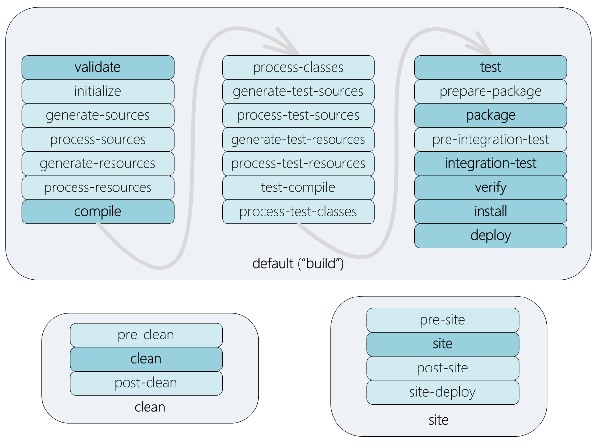

# Maven Build Automation


- [Install Maven](#install_maven)
- [Maven Build lifecycle](#life_cycle)
- [Maven goals and plugins](#goals_plugins)
- [Maven Profiles](#profiles)
- [Maven Repository](#repository)


## <a name='install_maven'> Install Maven </a>

#### Installing Maven on Ubuntu using apt is a simple, straightforward process.

Update the package index and install Maven by entering the following commands:
```bash
sudo apt update
sudo apt install maven
```

To verify the installation, run
```
mvn -version
```

#### Maven 3.3+ requires JDK 1.7 or above to be installed.

**Take care:** Which Java JDK you want to install?!
> Oracle jdk or openjdk ?!

Here is a reference to install Oracle jdk   
https://www.javahelps.com/2015/03/install-oracle-jdk-in-ubuntu.html  


to install OpenJDK 11 , by typing:
```bash
sudo apt update
sudo apt install default-jdk
```

to install openjdk Java 8
```bash
sudo apt update
sudo apt install openjdk-8-jdk
```


To verify java installation, run
```
java -version
```

#### Setup environment variables

create a new file named maven.sh in the /etc/profile.d/ directory.
```bash
sudo vi /etc/profile.d/maven.sh
```

Paste the following code:
```bash
export JAVA_HOME=/usr/lib/jvm/default-java
export M2_HOME=/opt/maven
export MAVEN_HOME=/opt/maven
export PATH=${M2_HOME}/bin:${PATH}
```

Save and close the file. This script will be sourced at shell startup.

Make the script executable with chmod :
```bash
sudo chmod +x /etc/profile.d/maven.sh
```

Finally, load the environment variables using the source command:
```bash
source /etc/profile.d/maven.sh
```

to verify that Maven is installed, use
```
mvn -version
```


## <a name='life_cycle'> Maven Build lifecycle </a>

Life cycle is a sequence of named phases.  
Phases executes sequentially.   
Executing a phase means executes all previous phases.  

   
The phases in bold - are the main phases commonly used.

___   
   
Maven has the following three standard lifecycles :

1. clean
2. default(or build)
3. site

### 1. Clean Lifecycle

The clean lifecycle consisting of the following 3 phases

| Sr.No.      | Lifecycle Phase & Description       |
| :---        |    :----:                           |
| 1           | pre-clean                           |
| 2           | clean                               |
| 3           | post-clean                          |

### 2. default(or build) Lifecycle

This is the primary life cycle of Maven and is used to build the application. It has the following 21 phases

| Sr.No.       | Lifecycle Phase & Description       |
| :---         |    :----                           |
| 1            | **validate** <br/><br/>  Validates whether project is correct and all necessary information is available to complete the build process.                        |
| 2            | **initialize** <br/><br/>  Initializes build state, for example set properties.                        |
| 3            | **generate-sources** <br/><br/>  Generate any source code to be included in compilation phase.                        |
| 4            | **process-sources** <br/><br/>   Process the source code, for example, filter any value.                       |
| 5            | **generate-resources** <br/><br/>  Generate resources to be included in the package.                        |
| 6            | **process-resources** <br/><br/>  Copy and process the resources into the destination directory, ready for packaging phase.                        |
| 7            | **compile** <br/><br/>  Compile the source code of the project.                        |
| 8            | **process-classes** <br/><br/>  Post-process the generated files from compilation, for example to do bytecode enhancement/optimization on Java classes.                        |
| 9            | **generate-test-sources** <br/><br/>  Generate any test source code to be included in compilation phase.                        |
| 10           | **process-test-sources** <br/><br/>  Process the test source code, for example, filter any values.                        |
| 11           | **test-compile** <br/><br/>   Compile the test source code into the test destination directory.                       |
| 12           | **process-test-classes** <br/><br/>  Process the generated files from test code file compilation.                        |
| 13           | **test** <br/><br/>  Run tests using a suitable unit testing framework (Junit is one).                        |
| 14           | **prepare-package** <br/><br/>  Perform any operations necessary to prepare a package before the actual packaging.                        |
| 15           | **package** <br/><br/>  Take the compiled code and package it in its distributable format, such as a JAR, WAR, or EAR file.                       |
| 16           | **pre-integration-test** <br/><br/>  Perform actions required before integration tests are executed. For example, setting up the required environment.                        |
| 17           | **integration-test** <br/><br/>  Process and deploy the package if necessary into an environment where integration tests can be run.                        |
| 18           | **post-integration-test** <br/><br/>  Perform actions required after integration tests have been executed. For example, cleaning up the environment.                        |
| 19           | **verify** <br/><br/>  Run any check-ups to verify the package is valid and meets quality criteria.                        |
| 20           | **install** <br/><br/>  Install the package into the local repository, which can be used as a dependency in other projects locally.                        |
| 21           | **deploy** <br/><br/>   Copies the final package to the remote repository for sharing with other developers and projects.                       |


### 3. Site  Lifecycle

The clean lifecycle consisting of the following 3 phases

| Sr.No.      | Lifecycle Phase & Description      |
| :---        |    :----:                          |
| 1           | pre-site                           |
| 2           | site                               |
| 3           | post-site                          |
| 4           | site-deploy                        |


## <a name='goals_plugins'> Maven goals and plugins </a>


### Maven plugin
Plugin is a collection of goals also called MOJO (Maven Old Java Object).

### Maven goal
A **goal** represents a specific task which contributes to the building and managing of a project. 
It may be bound to zero or more build phases. 
A goal not bound to any build phase could be executed outside of the build lifecycle by direct invocation.

Maven is based around the central concept of a **Build Life Cycles.** 
Inside each Build Life Cycles there are **Build Phases**, 
and inside each Build Phases there are **Build Goals**.

Maven can either execute a goal or a phase

##### Executing phase
   
ex:
```
mvn install
```
starting from the first phase, all the phases are executed sequentially till the ‘install’ phase  


##### Executing goal
   
Most of Maven's functionality is in plugins. A plugin provides a set of goals that can be executed using the following syntax:

```
 mvn [plugin-name]:[goal-name]
```

For example, a Java project can be compiled with the compiler-plugin's compile-goal by running 
```
mvn compiler:compile
```


**Goals provided by plugins can be associated with different phases of the lifecycle.**    
For example, by default, the goal 
> compiler:compile  

is associated with the compile phase,   
*compiler* is **the plugin name** while *compile* is a **goal** inside this plugin   
__Full plugin name: maven-compiler-plugin__


while 
> surefire:test 

is associated with the test phase.   
*surefire* is **the plugin name** while *test* is a **goal** inside this plugin   
__Full plugin name: maven-surefire-plugin__

Consider the following command:
```
mvn test
```

When the preceding command is executed, Maven runs all goals associated with each of the phases up to and including the test phase. In such a case, Maven runs the resources:resources goal associated with the process-resources phase, then compiler:compile, and so on until it finally runs the surefire:test goal.

However, even though a build phase is responsible for a specific step in the build lifecycle, the manner in which it carries out those responsibilities may vary. And this is done by declaring the plugin goals bound to those build phases.

Maven Architecture:
   


## <a name='profiles'> Maven Profiles </a>

A Build profile is a set of configuration values, which can be used to set or override default values of Maven build.

you can customize build for different environments such as Production v/s Development environments.

Now, under src/main/resources, there are three environment specific files:  

| Sr.No.       | File Name & Description      |
| :---         |    :----                           |
| 1            | **env.properties** <br/><br/>  default configuration used if no profile is mentioned.                        |
| 2            | **env.test.properties** <br/><br/>  test configuration when test profile is used.                        |
| 3            | **env.prod.properties** <br/><br/>  production configuration when prod profile is used.                        |

ex: in pom.xml 

```xml
   <profiles>
      <profile>
         <id>test</id>
         <build>
            <plugins>
               <plugin>
                  <groupId>org.apache.maven.plugins</groupId>
                  <artifactId>maven-antrun-plugin</artifactId>
                  <version>1.1</version>
                  <executions>
                     <execution>
                        <phase>test</phase>
                        <goals>
                           <goal>run</goal>
                        </goals>
                        <configuration>
                           <tasks>
                              <echo>Using env.test.properties</echo>
                              <copy file="src/main/resources/env.test.properties"
                                 tofile="${project.build.outputDirectory}/env.properties"/>
                           </tasks>
                        </configuration>
                     </execution>
                  </executions>
               </plugin>
            </plugins>
         </build>
      </profile>
   </profiles>
```
we created profile **test**


Now, we can run test profile using
```
mvn test -Ptest
```


## <a name='repository'> Maven Repository </a>


Maven repository are of three types. The following illustration will give an idea regarding these three types.

- Local
- Central
- Remote

    
    
#### 1. Local Repository

Maven local repository by default get created by Maven in %USER_HOME% directory. To override the default location, mention another path in Maven settings.xml file available at %M2_HOME%\conf directory.

```xml
<settings xmlns = "http://maven.apache.org/SETTINGS/1.0.0"
   xmlns:xsi = "http://www.w3.org/2001/XMLSchema-instance"
   xsi:schemaLocation = "http://maven.apache.org/SETTINGS/1.0.0 
   http://maven.apache.org/xsd/settings-1.0.0.xsd">
   <localRepository>C:/MyLocalRepository</localRepository>
</settings>
```

When you run Maven command, Maven will download dependencies to your custom path.


#### 2. Central Repository

When Maven does not find any dependency in local repository, it starts searching in central repository using following URL − https://repo1.maven.org/maven2/

To browse the content of central maven repository, maven community has provided a URL − 
https://search.maven.org/#browse


#### 3. Remote Repository

Sometimes, Maven does not find a mentioned dependency in central repository as well. It then stops the build process and output error message to console. To prevent such situation, Maven provides concept of Remote Repository, which is developer's own custom repository containing required libraries or other project jars.

```xml
<project xmlns = "http://maven.apache.org/POM/4.0.0"
   xmlns:xsi = "http://www.w3.org/2001/XMLSchema-instance"
   xsi:schemaLocation = "http://maven.apache.org/POM/4.0.0
   http://maven.apache.org/xsd/maven-4.0.0.xsd">
   <modelVersion>4.0.0</modelVersion>
   <groupId>com.companyname.projectgroup</groupId>
   <artifactId>project</artifactId>
   <version>1.0</version>
   <dependencies>
      <dependency>
         <groupId>com.companyname.common-lib</groupId>
         <artifactId>common-lib</artifactId>
         <version>1.0.0</version>
      </dependency>
   <dependencies>
   <repositories>
      <repository>
         <id>companyname.lib1</id>
         <url>http://download.companyname.org/maven2/lib1</url>
      </repository>
      <repository>
         <id>companyname.lib2</id>
         <url>http://download.companyname.org/maven2/lib2</url>
      </repository>
   </repositories>
</project>
```


