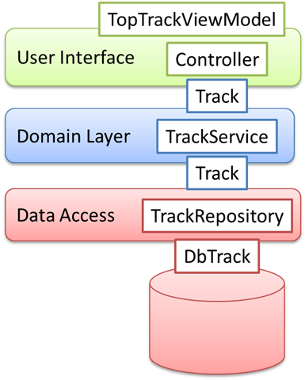

# REST Web Service


- [What is REST Web Service ?](#rest_definition)
- [REST API vs GraphQL API](#rest_vs_graghql)
- [REST Best practice](#rest_best_practice)
- [HTTP Response Codes](#http_response_codes)
- [POST body encoding](#post_body_encoding)
- [JSON Naming Convention](#json_naming_convension)
- [REST API Versioning](#rest_api_versioning)
- [Data Filtering, Sorting, Paging, Field Selection](#rest_filtering)
- [HATEOAS](#hateoas)
- [Entity (Domain model) To DTO Conversion](#domain_to_dto)
- [Error Handling](#error_handling)
- [Logging](#logging)
- [Sending a notification email to the development team upon Errors on the System](#notification_email)
- [API Metrics and Monitoring](#api_metrics)
- [Web Sockets](#web_socket)
- [More Advanced topics](#advanced_topics)


## <a name='rest_definition'> What is REST Web Service ? </a>

- REST: **Re**presentational **S**tate **T**ransfer
- RESTful Web Services are basically REST Architecture based Web Services. 
- In REST Architecture everything is a **resource**. 
- RESTful web services are light weight, highly scalable and maintainable and are very commonly used to create APIs for web-based applications.
- The REST architectural style is designed to use a stateless communication protocol, typically HTTP. 


## <a name='rest_vs_graghql'> REST API vs GraphQL API </a>

- GraphQL is an open source server-side technology which was developed by Facebook to optimize RESTful API calls. It is an execution engine and a data query language.
- RESTful APIs follow clear and well-structured resource-oriented approach. However, **when the data gets more complex, the routes get longer. Sometimes it is not possible to fetch data with a single request**.
- Ask for what you want − and get it, Send a GraphQL query to your API and get exactly what you need, Unlike Restful services, these applications can restrict data that should be fetched from the server.
- GraphQL queries help to smoothly retrieve associated business objects, while typical REST APIs require loading from multiple URLs. GraphQL APIs fetch all the data your application need in a single request. 


example:
Let us consider a business object Student with the attributes id, firstName, lastName and collegeName. Suppose a mobile application needs to fetch only the firstName and id. If we design a REST endpoint like /api/v1/students, it will end up fetching data for all the fields for a student object. This means, data is over fetched by the RESTful service. This problem can be solved by using GraphQL.

Consider the GraphQL query given below
```
{
   students {
      id
      firstName
   }
}
```

This will return values only for the id and firstname fields. The query will not fetch values for other attributes of the student object. The response of the query illustrated above is as shown below
```
{
   "data": {
      "students": [
         {
            "id": "S1001",
            "firstName": "Mohtashim"
         },
         {
            "id": "S1002",
            "firstName": "Kannan"
         }
      ]
   }
}
```

## <a name='rest_best_practice'> REST Best practice </a>

#### Resources (URIs) - Nouns and Verbs


Below are the most commonly used HTTP methods to define the **verb**:   
**GET** - indicates get/retrieve the resource data     
**POST** - indicates create new resource data   
**PUT** - indicates update the existing resource data   
**DELETE** - indicates remove the resource data   


While defining resources, **use plural nouns**. Example: To identify user resource, use the name “users” for that resource.    

examples:    
```
/companies  
/companies/{companyId}   
/companies/{companyId}/departments   
/companies/{companyId}/departments/{departmentId}/ 
/companies/{companyId}/departments/{departmentId}/employees 
/companies/{companyId}/departments/{departmentId}/employees/{empId}
```

the REST API best practice that can be followed is limiting the use of nesting to 2 levels.

so you can create  
```
/employees/{empId}
/employees/?company={companyId}&department={deptId}
```

### URI case 

The URI is case-insensitive, but as part of best practice, it is recommended to use lower case only.
avoid spaces in the URL

there are 3 main types of case conventions: 
1. CamelCase
2. snake_case 
3. spinal-case.
- It is recommended to use the **spinal-case** (which is highlighted by RFC3986), **this case is used by Google, PayPal, and other big companies.**


#### Retrieve a Resource

- HTTP method: **GET**
- URI uses plural nouns; example:   
    ```
    GET /books               <---- fetch a collection of books (Array)   
    GET /books/{book_id}     <---- fetch a specific book  
    ```
- HTTP response **200 (OK)**


#### Create a Resource

- HTTP method: **POST**
- POST method call will create a child resource under a collection of resources.
- URI uses plural nouns; example:   
    ```
    POST /books               <---- use plurarl noun     
    ```
- HTTP response 
    - HTTP code **201 (Created)**
    - HTTP Location Header **Location: /books/12345**   
    - in addition to including the newly created resource representation as the body of the response.
    
    
#### Take action  
    
- HTTP method: **POST**

   - **Method (1)**: URI uses actions/{action-name}   
        ```
        POST /order/{order_id}/actions/resend-email  { “email”: “mina@gmail.com” }   
        ```
      and in the body
      ```gitignore
      mina@yahoo.com  <----  the email address to receive the order 
      ```
  
   - **Method (2)**: URI uses commands   
        ```
        POST posts/d92hf73/commands { “name”: “publish” }           
        ```
        
- HTTP response 
    - HTTP code **200 (OK)** OR **204 (No Content)** in case of no need to send response in payload


#### Update a Resource

- HTTP method: **PATCH**
- PATCH is used for partial update of a resource
- URI uses plural nouns; example:   
    ```
    PATCH /users/1
    {
        "email": "skwee357@gmail.com"       // update email add of the user
    }   
    ```

- HTTP response 
    - HTTP code **200 (OK)** if the entity is being send in the payload 
    OR **204 (No Content)** in case of no need to send response in payload


#### Replacing a Resource at a URL known by the client.
    
- HTTP method: **PUT**
- POST method call will create a child resource under a collection of resources.
- URI uses plural nouns; example:   
    ```
    PUT /books/236               <---- we use put as the resource <236 is known for us>     
    ```
- If book with id =236 is not exist so create it otherwise update it  
  
- HTTP response 
    - HTTP code **200 (OK)** if the resource modified
    - HTTP code **201 (Created)** if the resource is created   
    - in addition to including the newly created resource representation as the body of the response.
   

Note: we use **PUT** instead of POST or PATCH WHEN:   
- You are referring to an entity, not to a collection. -  *if a collection is referred, then POST should be used instead*
- The entity you are supplying is complete (the entire entity). -  *if a partial entity is referred, then PATCH should be used instead*


```
POST /users

{
    "username": "skwee357",
    "email": "skwee357@domain.com"
}
```
> new resource will be created


```
PUT /users/1

{
    "username": "skwee357",
    "email": "skwee357@gmail.com"       // new email address
}
```
> the entire resource will be modified and replaced


```
PUT /users/1

{
    "username": "skwee357",
    "email": "skwee357@gmail.com"       // new email address
}
```
> Only email address will be updated


## <a name='http_response_codes'> HTTP Response Codes </a>


- 1xx - represents informational responses
- 2xx - represents successful responses
- 3xx - represents redirects
- 4xx - represents client errors
- 5xx - represents server errors


| Status       |    Status code	Meaning            |
| :---         |    :----                          |
| **1xx**     |  **Informational**                     |
| **100**     |  Continue                          |
| **101**     |  Switching protocols               |
| **102**     |  Processing                        |
| **103**     |  Early Hints                       |
| ---    |  ---                                    |
| **2xx**     |  **Succesful**                         |
| **200**     |  OK                                 |
| **201**     |  Created                            |
| **202**     |  Accepted                           |
| **203**     |  Non-Authoritative Information      |
| **204**     |  No Content                         |
| **205**     |  Reset Content                      |
| **206**     |  Partial Content                    |
| **207**     |  Multi-Status                       |
| **208**     |  Already Reported                   |
| **226**     |  IM Used                            | 	 
| ---    |  ---                                     | 	 
| **3xx**     |  **Redirection**                         |
| **300**     |  Multiple Choices                    |
| **301**     |  Moved Permanently                   |
| **302**     |  Found (Previously "Moved Temporarily")  |
| **303**     |  See Other                           |
| **304**     |  Not Modified                        |
| **305**     |  Use Proxy                           |
| **306**     |  Switch Proxy                        |
| **307**     |  Temporary Redirect                  |
| **308**     |  Permanent Redirect                  | 
| ---    |  ---                                      | 	 		 
| **4xx**     |  **Client Error**                    |
| **400**     |  Bad Request                         |
| **401**     |  Unauthorized                        |
| **402**     |  Payment Required                    |
| **403**     |  Forbidden                           |
| **404**     |  Not Found                           |
| **405**     |  Method Not Allowed                  |
| **406**     |  Not Acceptable                      |
| **407**     |  Proxy Authentication Required       |
| **408**     |  Request Timeout                     | 
| **409**     |  Conflict                            |
| **410**     |  Gone                                |
| **411**     |  Length Required                     |
| **412**     |  Precondition Failed                 |
| **413**     |  Payload Too Large                   |
| **414**     |  URI Too Long                        |
| **415**     |  Unsupported Media Type              |
| **416**     |  Range Not Satisfiable               |
| **417**     |  Expectation Failed                  | 
| **418**     |  I'm a Teapot                        |
| **421**     |  Misdirected Request                 | 
| **422**     |  Unprocessable Entity                |
| **423**     |  Locked                              |
| **424**     |  Failed Dependency                   |
| **425**     |  Too Early                           |
| **426**     |  Upgrade Required                    |
| **428**     |  Precondition Required               |
| **429**     |  Too Many Requests                   |
| **431**     |  Request Header Fields Too Large     |
| **451**     |  Unavailable For Legal Reasons       | 
| ---    |  ---                                      | 	 	 
| **5xx**     |  **Server Error**                    |
| **500**     |  Internal Server Error               |
| **501**     |  Not Implemented                     |
| **502**     |  Bad Gateway                         |
| **503**     |  Service Unavailable                 |
| **504**     |  Gateway Timeout                     |
| **505**     |  HTTP Version Not Supported          |
| **506**     |  Variant Also Negotiates             |
| **507**     |  Insufficient Storage                |	
| **508**     |  Loop Detected                       |
| **510**     |  Not Extended                        |
| **511**     |  Network Authentication Required     |	


#### HTTP codes for Client Error

[Good reference here](https://evertpot.com/http/)

		 
| **4xx**     |  **Client Error**                    |      **Description**                         | 
| :---         |    :----                            |   :----                                           |
| **400**     |  Bad Request                         |   - A 400 means that the request was malformed. In other words, the data stream sent by the client to the server didn't follow the rules.   <br> - For input validation failure  <br> - is used as a generic error code. It’s a useful default error code if there’s no specific error code that’s                                      |
| **401**     |  Unauthorized                        |   - the server requires the request to be authenticated                                           |
| **402**     |  Payment Required                    |                                              |
| **403**     |  Forbidden                           |    - should be used when a client is trying to do a request it’s not allowed to do for a variety of reasons. Maybe the user doesn’t have the right permissions, or maybe it’s logged in with the wrong credentials. <br> - Use **401** Unauthorized if the user can’t do an operations because they haven’t logged in yet. <br> - Use **405** Method Not Allowed if the user has access to the resource, but the specific operation they’re trying to do is not allowed. For example, calling PUT on a read-only resource.                                          |
| **404**     |  Not Found                           |    - is emitted when a resource doesn’t exist, never existed or if the server doesn’t want a client to know that a resource exist.                                          |
| **405**     |  Method Not Allowed                  |    - means that the HTTP method is simply not supported. For example, a client might do a POST request on a resource where POST is not implemented or it’s meaningless.                                          |
| **406**     |  Not Acceptable                      |    - is emitted by a server when the client asked for a specific representation of a resource that the server doesn’t support.                                          | 
| **407**     |  Proxy Authentication Required       |    |
| **408**     |  Request Timeout                     |    - When a server sends back the 408, it no longer wants to wait for the request and kills the connection.                                        |                     
| **409**     |  Conflict                            |  - HTTP request was valid, but the current state of the server prevents it from being executed. <br> **examples**: <br> - A user wants to add a file to a folder, but the folder doesn’t exist yet.  <br> - Amazon S3 uses it when you try to delete a bucket that’s not empty. <br> - You’re creating a new blog post, but it refers to a category that was deleted.                                             |
| **410**     |  Gone                                |   - is a status code that can be used in cases where a resource is gone and never coming back. It’s a more specific version of 404                                           |
| **411**     |  Length Required                     |                                              |
| **412**     |  Precondition Failed                 |                                              |
| **413**     |  Payload Too Large                   |   - Maybe the request was a file upload, and it exceeded the maximum file-size, or maybe it’s an API and it preemptively blocks requests that are unrealisticly large. <br> - If the reason for the error is that the server ran out of disk- space, **507 Insufficient Storage** should be used instead.                                              |
| **414**     |  URI Too Long                        |   - The URI or path of a HTTP request doesn’t have any hard limits in terms of how long it’s allowed to be. <br> - Based on limits of browsers, it’s a good idea to try and not exceed 2000 bytes for the uri.                                           |
| **415**     |  Unsupported Media Type              |                                              |
| **416**     |  Range Not Satisfiable               |   - It’s possible for a client to request partial responses from a server. For example, a client might only want the first 5 minutes of a video, or the last 100 lines of a log file. <br>  - HTTP clients and servers can do this with range requests.                                   |
| **417**     |  Expectation Failed                  |                                               |
| **418**     |  I'm a Teapot                        |                                              |
| **421**     |  Misdirected Request                 |                                               |
| **422**     |  Unprocessable Entity                |                                              |
| **423**     |  Locked                              |                                              |
| **424**     |  Failed Dependency                   |                                              |
| **425**     |  Too Early                           |                                              |
| **426**     |  Upgrade Required                    |                                              |
| **428**     |  Precondition Required               |                                              |
| **429**     |  Too Many Requests                   |  - If an service wants to limit the amount of requests clients make, they can use the 429 Too Many Requests status code to inform the client that they’ve exceeded it.  <br> - For example, perhaps an API wants to limit users to 100 HTTP requests per hour.  <br> - It’s possible to tell a client when they can make requests again with the Retry-After header, but this is optional.  <br>                                           |
| **431**     |  Request Header Fields Too Large     |                                              |
| **451**     |  Unavailable For Legal Reasons       |                                               |


#### HTTP codes for Server Error

[Good reference here](https://evertpot.com/http/)


| **5xx**     |  **Server Error**                    |      **Description**                         | 
| :---         |    :----                            |   :----                                           |
| **500**     |  Internal Server Error                |   - This is a generic error, and a good error to choose if there is not a more specific error suitable for your problem.  <br> - Many server-side error handlers automatically convert any uncaught exception into this error code.                                           |
| **501**     |  Not Implemented                     |    - when it doesn’t support a certain feature.                                       |
| **502**     |  Bad Gateway                     |    - This status should not be used if the origin server just returned a valid HTTP error itself, because these should generally just be forwarded by the proxy (mostly) unaltered.                                          |
| **503**     |  Service Unavailable            |    - status that a server can send when it is overloaded, or otherwise incapable of handling a request. Maybe the server is just booting up, or perhaps the application is partially down.                          |
| **504**     |  Gateway Timeout                  |   - status a proxy might emit, when it’s acting as a proxy and not getting a response from an upstream server.                           |
| **505**     |  HTTP Version Not Supported          |                                         |
| **506**     |  Variant Also Negotiates         |                                    | 
| **507**     |  Insufficient Storage        |   - maybe because it’s too large to fit on a disk. |
| **508**     |  Loop Detected    |                                          |
| **510**     |  Not Extended         |                                          |
| **511**     |  Network Authentication Required       |                                              |


## <a name='post_body_encoding'> POST body encoding </a>


- **Content-Type: application/x-www-form-urlencoded**: the keys and values are encoded in key-value tuples separated by **'&'**, with a **'='** between the key and the value. 
   - Non-alphanumeric characters in both keys and values are percent encoded: this is the reason why this type is not suitable to use with binary data (use multipart/form-data instead)
   - Body will need to be **URL encoded**
- **Content-Type: multipart/form-data**: each value is sent as a block of data ("body part"), with a user agent-defined delimiter ("boundary") separating each part. 
   - The keys are given in the **Content-Disposition** header of each part.
- **Content-Type: application/json**: The default encoding is UTF-8, It is the encoding this is commonly used when using REST web services
- **Other types**:
    - **Content-Type: application/text**
    - **Content-Type: application/x-javascript**
    - **Content-Type: text/javascript**
    - **Content-Type: text/x-javascript**
    - **Content-Type: text/x-json**
    
    
    
## <a name='json_naming_convension'> JSON Naming Convention </a>

    
In this document [Google JSON Style Guide](https://google.github.io/styleguide/jsoncstyleguide.xml?showone=Property_Name_Format#Property_Name_Format) (recommendations for building JSON APIs at Google),   
It recommends that:  
1. Property names must be **camelCased**, ASCII strings.
2. The first character must be a letter, an underscore (_), or a dollar sign ($).    

Note: Java prefers **camelCased**


## <a name='rest_api_versioning'> REST API Versioning </a>


### URI Versioning

For example, say an API publishes the following resources – users and privileges:
```
http://host/v1/users
http://host/v1/privileges
```

Now, let's consider that a breaking change in the users API requires introducing a second version:

```
http://host/v2/users
http://host/v2/privileges
```
    
### Media Type Versioning


The REST API would make use of custom **vendor MIME media types** instead of generic media types such as application/json. 
We're going to version these media types instead of the URIs.   
   
```
===>
 GET /users/3 HTTP/1.1
 Accept: application/vnd.myname.v1+json
 <===
 HTTP/1.1 200 OK
 Content-Type: application/vnd.myname.v1+json
 {
     "user": {
         "name": "John Smith"
     }
 }
```
   
   
   
example :  
```
"application/vnd.company.myapp.v1+json"
```
   
Now, let's consider that a breaking change in the users API requires introducing a second version:   
```
"application/vnd.company.myapp.v2+json"
```

Here the naming convension is **vnd.[my api name].v[version_number]+json**   
ex: **application/vnd.company.myapp.api-v3+json**


```
(GOOD WAY TO DO IT)
===>
GET /customer/123 HTTP/1.1
Accept: application/vnd.company.myapp.customer-v3+json

<===
HTTP/1.1 200 OK
Content-Type: application/vnd.company.myapp-v3+json

{"customer":
  {"name":"Neil Armstrong"}
}
```


##### Spring framework

```
@Consumes("application/vnd.company.myapp.v2+json")  <--- The resource reads "Accept: application/vnd.company.myapp.v2+json"" Header from the client
```

If a resource is unable to consume the MIME type of a client request, in case a Client send    
It will send back an **HTTP “415 Unsupported Media Type”** error to the client.


```
@Produces("application/vnd.company.myapp.v2+json")  <--- The resource writes "Content-Type: application/vnd.company.myapp.v2+json"" Header to the client
```


## <a name='rest_filtering'> Data Filtering, Sorting, Paging, Field Selection </a>

     
The REST API filtering options include:

1. Filtering
2. Sorting
3. Paging
4. Field Selection


#### Filtering

examples:
```
GET /users?country=UK
GET /users?creation_date=2021-10-11
GET /users?creation_date=2021-10-11
```


#### Sorting

examples:
```
GET /users?sort=birthdate_date:asc
GET /users?sort=birthdate_date:desc
```


#### Paging

- Using the ‘limit’ option, you can narrow down the results to the required number. You can also use ‘offset’ to show the part of the overall results displayed.
examples:
```
GET /users?limit=120
GET /users?offset=3
GET /users?offset=3
```


#### Field Selection

examples:
```
GET/  users/123?fields=name,birthdate,email
GET/ users?fields=name,birthdate,email
```


## <a name='hateoas'> HATEOAS </a>


Typically, when we perform a REST request, we only get the data and not any actions around it. 
This is where HATEOAS comes in the fill in the gap.  
A HATEOAS request allows you to not only send the data but also specify the related actions.


When the browser loads the page, you definitely can see all the content that the page has to offer. 
More interestingly, the page also allows you to perform a lot of actions around that data, such as:
- Clicking on buttons (to take action)
- Clicking on tabs (to view the more info
- and several more

Generally speaking, the principle implies that the API should guide the client through the application by returning relevant information about the next potential steps, along with each response.

#### Without HATEOAS

```java
public class Customer {

    private String customerId;
    private String customerName;
    private String companyName;

    // standard getters and setters
}
```


```json
{
    "customerId": "10A",
    "customerName": "Jane",
    "customerCompany": "ABC Company"
}
```

#### Adding HATEOAS Support

```java
public class Customer extends RepresentationModel<Customer> {
    private String customerId;
    private String customerName;
    private String companyName;
 
    // standard getters and setters
}
```


```json
{
    "customerId": "10A",
    "customerName": "Jane",
    "customerCompany": "ABC Company",
    "_links":{
        "self":{
            "href":"http://localhost:8080/spring-security-rest/api/customers/10A"
         }
    }
}
```


Creating Better Links:

```java
linkTo(CustomerController.class).slash(customer.getCustomerId()).withSelfRel();
```
#### More examples for clarifications


```json
{
    "name": "John Doe",
    "links": [{
            "rel": "self",
            "href": "http://localhost:8080/user/123"
        },
        {
            "rel": "posts",
            "href": "http://localhost:8080/user/123/post"
        },
        {
            "rel": "address",
            "href": "http://localhost:8080/user/123/address"
        }
    ]
}
```


```json
{
    "employees": [
        {
            "employeeId": 1,
            "firstName": "Lokesh",
            "lastName": "Gupta",
            "email": "howtodoinjava@gmail.com",
            "_links": {
                "self": {
                    "href": "http://localhost:8080/1"
                },
                "employee-report": {
                    "href": "http://localhost:8080/employees/1/report"
                }
            }
        },
        {
            "employeeId": 2,
            "firstName": "Amit",
            "lastName": "Singhal",
            "email": "asinghal@yahoo.com",
            "_links": {
                "self": {
                    "href": "http://localhost:8080/2"
                },
                "employee-report": {
                    "href": "http://localhost:8080/employees/2/report"
                }
            }
        },
        {
            "employeeId": 3,
            "firstName": "Kirti",
            "lastName": "Mishra",
            "email": "kmishra@gmail.com",
            "_links": {
                "self": {
                    "href": "http://localhost:8080/3"
                },
                "employee-report": {
                    "href": "http://localhost:8080/employees/3/report"
                }
            }
        }
    ],
    "_links": {
        "self": {
            "href": "http://localhost:8080/employees"
        }
    }
}
```


## <a name='domain_to_dto'> Entity (Domain model) To DTO Conversion </a>

we must handle the conversions that need to happen between the **internal entities** of a Spring application and the **external DTOs (Data Transfer Objects)** that are published back to the client.




- **DTO (Network data model or Presentation model)** : will be exposed to the Client
- **Entity model (persistence data or Domain data)** : should be enclosed internally in the application, should not be exposed to the outside

#### Project Structure

```
project 
│
└─── src
│    └─── main
│        └─── java
│             └─── com.morganstanley.peopletracker
│                  └─── config
│                       │   SpringConfig.java
│                       │   ...
│                  └─── controller
│                       │   MyController.java
│                       │   ...
│                  └─── Service
│                       │   MyService.java
│                       │   ...
│                  └─── dto
│                       │   OrderDto.java      <----- Presentation Layer Object
│                       │   ...
│                  └─── domain
│                       │   Order.java          <----- Service and Database Layer Object
│                       │   ...
│                  └─── converter
│                       │   OrderConverter.java     <----- OrderToOrderDto() and OrderDtoToOrder() conversion
│                       │   ...
│                  └─── Repository
│                       │   MyRepository.java
│                       │   ...
│             └─── resources
│                  │   logback.xml
│                  │   env.dev.properties
│                  │   ...
│             └─── webapp
│                  └─── WEB-INF
│                       │   logback.xml
│                       │   ...
│                       |
```


## <a name='error_handling'> Error Handling </a> 

Best practice to have the followig fields in the json object
- **message**: details message to be displayed to the user
- **status**: HTTP Status code  
- **code**: error code of the application   
  - This is very import number (or string) to indicate weather this error is application-related error or third-party related error 
  - for example when you are integrating with a payment portal, and this 3rd party will send an error related message, It will be a good practice to assign a code for this 3rd party errors 
- **track_id**: internal identifier to help us find log data for debugging.
    - this will be UUID listed in the log file, it will be helpfull when investigating the error in the log file


For validation, 
- it is a good practice to Simply **fail on the first validation error** and return that message.


#### Twitter Error Handling payload

```json
{
    "errors": [
        {
            "code":215,
            "message":"Bad Authentication data."
        }
    ]
}
```


#### Facebook Error Handling payload

```json
{
    "error": {
        "message": "Missing redirect_uri parameter.",
        "type": "OAuthException",
        "code": 191,
        "fbtrace_id": "AWswcVwbcqfgrSgjG80MtqJ"
    }
}
```

OR

```json
{
  "error": {
    "message": "Message describing the error", 
    "type": "OAuthException", 
    "code": 190,
    "error_subcode": 460,
    "error_user_title": "A title",
    "error_user_msg": "A message",
    "fbtrace_id": "EJplcsCHuLu"           <------  to help us find log data for debugging.
  }
}
```

#### SoftXpert Error Handling payload


```json
{
  "Status": 400,
  "Errors": [
    {
      "Code": 5,
      "Message": "Your card number is incorrect."
    }
  ],
  "Validations": [
    {
      "Field": "cardNumber",
      "Message": "Your card number is incorrect."
    }
  ]
}
```


## <a name='logging'> Logging </a>

The purpose of this section is to create a meaningful logs because It’s very hard to know what information you’ll need during troubleshooting. 


#### 1. Make Your Log Entries Meaningful With Context
 
- Consider the following 2 log entries:
> 2017-05-23T15:02:27Z | WARN | Record not found


> 2017-05-23T15:02:27Z | WARN | Project with the id ’53’ was not found

Which one would you rather have? The second one, right? 


Messages are much more valuable with added context and more details as possible, like:
> Transaction 2346432 failed: cc number checksum incorrect

> User 54543 successfully registered e-mail user@domain.com

> IndexOutOfBoundsException: index 12 is greater than collection size 10

Context propagation
```java 
  public void storeUserRank(int userId, int rank, String game) {
    try {
      ... deal database ...
    } catch(DatabaseException de) {
      throw new RankingException("Can't store ranking for user "+userId+" in game "+ game + " because " + de.getMessage() );
    }
  }
```


#### 2. Use a Standard Date and Time Format

- ISO standard called ISO-8601.
- Add timestamps either in UTC or local time plus **offset**

#### 3. Include the Stack Trace When Logging an Exception

- Include the fully qualified class name
- Include the stack trace when logging exceptions
- For the developer performing a post-mortem debug, the stack trace is essential information that will help them connect the dots.

#### 4. Include the Name of the Thread When Logging From a Multi-Threaded Application

- Include the thread’s name when logging from a multi-threaded application

#### 5. Log after, not before

```
// don't do that
log.info("Making request to REST API")
restClient.makeRequest()
 
// do that
restClient.makeRequest()
log.info("Made request to REST API")
```

- The first log statement doesn’t tell much. When reading it, you will not know if the REST call was successful or not.

- The second log is much better. It clearly states that the operation right before was successful. If the REST call would have failed, you would not see this log – there would be an exception instead.

- I apply this rule to all INFO logs. However I make exceptions for DEBUG.


#### 6. Separate parameters and messages

```java
// don't do that
restClient.makeRequest()
log.info("Made request to {} on REST API.", url)
 
// do that
restClient.makeRequest()
log.info("Made request to REST API. [url={}]", url)
```

- The first log message has some flaws. It’s difficult to parse for example for **Grok patterns**.   
- The seconds version has none of these flaws. It’s easy to parse because the parameter list has a clear syntax.


```java
try {
    restClient.makeRequest()
    log.info("Made request to REST API. [url={}]", url)
} catch(e: UnauthorizedException) {
    log.warn("Request to REST API was rejected because user is unauthorized. [url={}, result={}]", url, result)
} catch(e: Exception) {
    log.error("Request to REST API failed. [url={}, exception={}]", url, exception)
}
``` 

#### 7. INFO is for business, DEBUG for technology

- The INFO log should look like a book. It should tell you what had happened, not necessarily how. This means that INFO is better suited for business-like log messages compared to technical stuff. Technical related messages should (usually) be DEBUG.

```
DEBUG | Saved user to newsletter list. [user="Thomas", email="thomas@tuhrig.de"]
DEBUG | Send welcome mail. [user="Thomas", email="thomas@tuhrig.de"]
INFO  | User registered for newsletter. [user="Thomas", email="thomas@tuhrig.de"]
DEBUG | Started cron job to send newsletter of the day. [subscribers=24332]
INFO  | Newsletter send to user. [user="Thomas"]
INFO  | User unsubscribed from newsletter. [user="Thomas", email="thomas@tuhrig.de"]
```
   
#### Good practice for Logging

1. Linux systems typically save their log files under **/var/log** directory.
    - Create dir named "my-app" under **/var/log** and grant it appropriate permission
    - **/var/log/my-app** should be accessable over **ftp** to check logs  
      
2. **Log4j** has security Vulnerability 
    - version **2.16** and later should be used instead
       
3. The favorite is the combination of slf4j and logback because it is very powerful and relatively easy to configure (and allows JMX configuration or reloading of the configuration file)

4. **Log4j** archiving
      - Assuming that you're using RollingFileAppender? In which case, 
        it has a property called **MaxBackupIndex** which you can set to limit the number of files. 
        For example:
        ```
        log4j.appender.R=org.apache.log4j.RollingFileAppender
        log4j.appender.R.File=example.log
        log4j.appender.R.MaxFileSize=100KB
        log4j.appender.R.MaxBackupIndex=7
        log4j.appender.R.layout=org.apache.log4j.PatternLayout
        log4j.appender.R.layout.ConversionPattern=%p %t %c - %m%n
        ```
      - You can perform your housekeeping in a separate script which can be cronned to run daily. 
      Something like this:
      ```bash
        find /path/to/logs -type f -mtime +7 -exec rm -f {} \;
      ```
        
5. **Log4j** to send **ALERT EMAIL** upon Exception

        
## <a name='notification_email'> Sending a notification email to the development team upon Errors on the System</a>        

- The  development team wanted to get notified as soon as something goes wrong in our production system, a critical java web application serving thousands of customers daily.   
- here we will present a simple solution we have implemented using a custom log4j appender based on stats4j and an smtpappender  

First of all, define in your **log4j.properties** file your appender properly:

```
#CONFIGURE SMTP
log4j.appender.email=org.apache.log4j.net.SMTPAppender
log4j.appender.email.SMTPHost=mail.mydomain.com
log4j.appender.email.SMTPUsername=myuser@mydomain.com
log4j.appender.email.SMTPPassword=mypw
log4j.appender.email.From=myuser@mydomain.com
log4j.appender.email.To=myuser@mydomain.com
log4j.appender.email.Subject=Log of messages
log4j.appender.email.BufferSize=1
log4j.appender.email.EvaluatorClass=TriggerLogEvent
log4j.appender.email.layout=org.apache.log4j.PatternLayout
log4j.appender.email.layout.ConversionPattern=%m
```        

Next, make a special class that will be used just for sending email. Example:

```java
package com.foo.mailer;
import org.apache.log4j.Logger;

public class Mailer {
   private static final Logger logger = Logger.getLogger(Mailer.class);

   public void logMail(String mailString) {
      logger.info(mailString);
   }
}
```


Next, put in **log4j.properties** configuration for this class:

```
# INFO level will be logged
log4j.logger.com.foo.mailer = INFO, email
# turn off additivity
log4j.additivity.com.foo.mailer = false
```

Now, whenever you want to send an email using log4j, put this in your code:

```java
new Mailer().logMail("This mail should be sent");
```


#### Here is another solution to be tried using XML configuration


```xml
<appender name="ErrorEmailAppender" class="org.apache.log4j.net.SMTPAppender">
    <param name="SMTPHost" value="mail.mydomain.com" />
    <param name="SMTPUsername" value="myuser@mydomain.com" />
    <param name="SMTPPassword" value="password" />
    <param name="From" value="myuser@mydomain.com" />
    <param name="To" value="myuser@mydomain.com" />
    <param name="Subject" value="Log of messages" />
    <param name="BufferSize" value="1" />
    <param name="EvaluatorClass" value="TriggerLogEvent" />
    <layout class="org.apache.log4j.PatternLayout">
        <param name="ConversionPattern" value="%t %m%n"/>
    </layout>
</appender>

<logger name="com.foo.mailer">
    <level value="INFO" />
    <appender-ref ref="ErrorEmailAppender"/>
</logger>
```

## <a name='api_metrics'> API Metrics and Monitoring</a>


#### Prerequisites

   - Dropwizard java lib 
   - https://mykidong.medium.com/howto-measure-the-performance-of-an-application-using-metrics-716ad3ab25fb
   - Meter Registry Java lib (without spring to be digested, then with spring)
   - Time series database - InfluxDB
   - Combine them together
   
   
Starting Reference:    
https://www.youtube.com/watch?v=JAdxO1XboJY   
https://www.youtube.com/watch?v=LkWVFz9WGeU      


## <a name='web_socket'> Web Sockets</a>

The WebSocket clients sends the HTTP request asking for a WebSocket connection, then the server responds with an HTTP 101 Switching protocols, meaning that it accepts the connection, and then the client can start to send and receive data in binary format.

Example client request:
```
GET /chat HTTP/1.1
Host: server.example.com
Upgrade: websocket
Connection: Upgrade
Sec-WebSocket-Key: x3JJHMbDL1EzLkh9GBhXDw==
Sec-WebSocket-Protocol: chat, superchat
Sec-WebSocket-Version: 13
Origin: http://example.com
```


Example server response:
```
GET /chat HTTP/1.1
HTTP/1.1 101 Switching Protocols
Upgrade: websocket
Connection: Upgrade
Sec-WebSocket-Accept: HSmrc0sMlYUkAGmm5OPpG2HaGWk=
Sec-WebSocket-Protocol: chat
```


- start with stomp brocker for simple application as POC and use Postman as a client to test it
- Use Redis or Active MQ or Rabbit MQ message broker for more realistic implementation


## <a name='advanced_topics'> More Advanced topics </a>


1. Rate Limiting
2. Retrying Policy
3. Password Encryption in the properties file for Application using Jasypt
4. API Gateway
 


