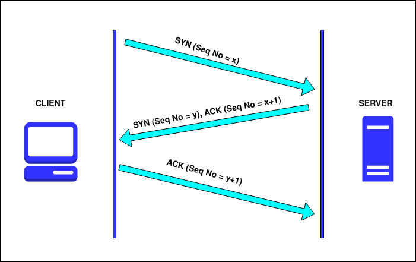
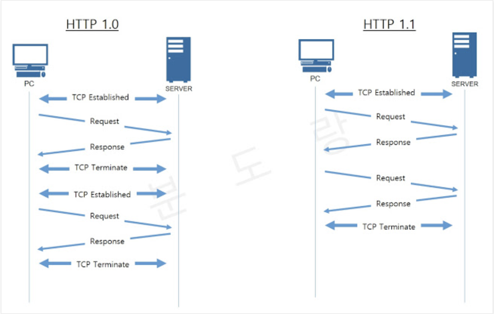
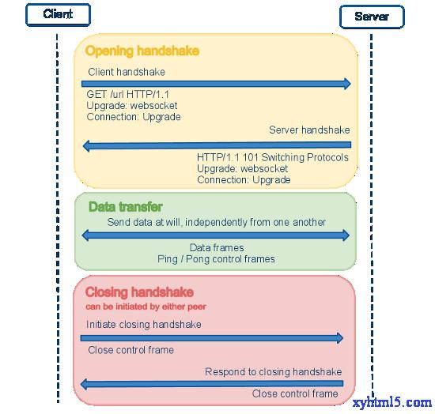

# WebSockets


- [HTTP/1.0 vs HTTP/1.1](#HTTP_1.0_HTTP_1.1)
- [Introduction to WebSockets](#Introduction_WebSockets)
- [WebSockets with Spring](#WebSockets_with_Spring)
- [Java Spring client - *for testing*](#Java_Spring_client)
- [WebSockets using RabbitMQ broker](#WebSockets_using_RabbitMQ_broker)
- [WebSockets in Angular Project](#WebSockets_in_Angular_Project)


## <a name='HTTP_1.0_HTTP_1.1'> HTTP/1.0 vs HTTP/1.1 </a>

#### TCP Network Layer protocol




#### HTTP/1.0 vs HTTP/1.1

- **HTTP/1.0** allows only one single request/response per TCP connection, then the connection get closed

```
GET /contact HTTP/1.0                       <--- HTTP/1.0
Host: www.exampletestserver.io
User-Agent: Mozilla/4.0 (compatible; MSIE 7.0; Windows NT 6.0)
Accept: text/*, text/html, text/html;level=1, */*Accept-Language: en-us
```

```
HTTP/1.0 200 OK
Date: Wed, 24 Jun 2020 11:26:43 GMT
Content-Type: text/html; charset=utf-8
Connection: close                           <--- Connection is terminated by default
Server: cloudserver
```


- HTTP/1.1 allows multiple requests/responses per TCP connection, thanks to HTTP/101 Header 
    - The **Keep-Alive** header:  Used to set up persistent communications between hosts. That means the connection can be reused for more than one request, which reduces request latency perceptibly because the client does not need to re-negotiate the TCP 3-Way-Handshake connection after the first request has been sent.
    - The **Upgrade** header: Used to upgrade the connection to an enhanced protocol mode (such as WebSockets).
    
```
GET /contact HTTP/1.1                       <--- HTTP/1.1
Host: www.exampletestserver.io
User-Agent: Mozilla/4.0 (compatible; MSIE 7.0; Windows NT 6.0)
Accept: text/*, text/html, text/html;level=1, */*Accept-Language: en-us
```

```
HTTP/1.1 200 OK
Date: Wed, 24 Jun 2020 11:59:14 GMT
Content-Type: text/html; charset=utf-8
Connection: Keep-Alive                           <--- Connection is kept-alive
Transfer-Encoding: chunked
Server: cloudflare
```





## <a name='Introduction_WebSockets'> Introduction to WebSockets </a>

WebSockets is a bi-directional, full-duplex, persistent connection between a web browser and a server. Once a WebSocket connection is established the connection stays open until the client or server decides to close this connection


- Client: Request Upgrade 
```
GET /chat HTTP/1.1
Host: server.example.com
Upgrade: websocket
Connection: Upgrade
Sec-WebSocket-Key: x3JJHMbDL1EzLkh9GBhXDw==
Sec-WebSocket-Protocol: chat, superchat
Sec-WebSocket-Version: 13
Origin: http://example.com
```

- Server: Response **101 Switching Protocols**

```
HTTP/1.1 101 Switching Protocols
Upgrade: websocket
Connection: Upgrade
Sec-WebSocket-Accept: HSmrc0sMlYUkAGmm5OPpG2HaGWk=
Sec-WebSocket-Protocol: chat
```


**Websocket naturaly providing with Ping/Pong messages not to close the connection**




## <a name='WebSockets_with_Spring'> WebSockets with Spring </a>

### Example (1) : using @SendTo Annotation

**@SendTo**:  
Annotation that indicates a method's return value should be converted to a Message if necessary and sent to the specified destination.

#### Maven dependency

```xml
<dependency>
    <groupId>org.springframework</groupId>
    <artifactId>spring-websocket</artifactId>
    <version>5.2.2.RELEASE</version>
</dependency>

<dependency>
    <groupId>org.springframework</groupId>
    <artifactId>spring-messaging</artifactId>
    <version>5.2.2.RELEASE</version>
</dependency>
```


In addition, as we'll use JSON to build the body of our messages, we need to add the Jackson dependencies. This allows Spring to convert our Java object to/from JSON:

```xml
<dependency>
    <groupId>com.fasterxml.jackson.core</groupId>
    <artifactId>jackson-core</artifactId>
    <version>2.10.2</version>
</dependency>

<dependency>
    <groupId>com.fasterxml.jackson.core</groupId>
    <artifactId>jackson-databind</artifactId> 
    <version>2.10.2</version>
</dependency>
```


#### Enable WebSocket in Spring

```java
@Configuration
@EnableWebSocketMessageBroker
public class WebSocketConfig extends AbstractWebSocketMessageBrokerConfigurer {

    @Override
    public void configureMessageBroker(MessageBrokerRegistry config) {
        config.enableSimpleBroker("/topic");
        config.setApplicationDestinationPrefixes("/app");
    }

    @Override
    public void registerStompEndpoints(StompEndpointRegistry registry) {
         registry.addEndpoint("/chat");
         registry.addEndpoint("/chat").withSockJS();
    }
}
```

- First, we enable an in-memory message broker to carry the messages back to the client on destinations prefixed with “/topic”.
- We complete our simple configuration by designating the “/app” prefix to filter destinations targeting application annotated methods (via @MessageMapping)
- The registerStompEndpoints method registers the “/chat” endpoint, enabling Spring’s STOMP support. Keep in mind that we are also adding here an endpoint that works without the SockJS for the sake of elasticity.
- It also enables the SockJS fallback options, so that alternative messaging options may be used if WebSockets are not available. This is useful since WebSocket is not supported in all browsers yet and may be precluded by restrictive network proxies


#### Create the Message Model

```java
public class Message {

    private String from;
    private String text;

    // getters and setters
}
```


```json
{
    "from": "John",
    "text": "Hello!"
}
```


#### Create a Message-Handling Controller

```java
@MessageMapping("/chat")
@SendTo("/topic/messages")
public OutputMessage send(Message message) throws Exception {
    String time = new SimpleDateFormat("HH:mm").format(new Date());
    return new OutputMessage(message.getFrom(), message.getText(), time);
}
```

#### @MessageMapping

- The **@MessageMapping** annotation is used for repetitive messaging from application to clients.

In the following example, the method annotated with the @MessageMapping annotation with the void return type receives a SEND frame from a client to the /app/request destination, performs some action but does not send any response.
```java
@Controller
public class MessageMappingController {
   @MessageMapping("/request")
   public void handleMessageWithoutResponse(String message) {
       logger.info("Message without response: {}", message);
   }
}
```

In the following example, the method annotated with the @MessageMapping and @SendTo annotations with the String return type receives a SEND frame from a client to the /app/request destination, performs some action, and sends a MESSAGE frame to the explicit /queue/responses destination.
```java
@Controller
public class MessageMappingController {
   @MessageMapping("/request")
   @SendTo("/queue/responses")
   public String handleMessageWithExplicitResponse(String message) {
       logger.info("Message with response: {}", message);
       return "response to " + HtmlUtils.htmlEscape(message);
   }
}
```

-`In the following example, the method annotated with the @MessageMapping annotation with the String return type receives a SEND frame from a client to the /app/request destination, performs some action, and sends a MESSAGE frame to the implicit /app/request destination (with the /topic prefix and the /request suffix of the inbound destination)
```java
@Controller
public class MessageMappingController {
   @MessageMapping("/request")
   public String handleMessageWithImplicitResponse(String message) {
       logger.info("Message with response: {}", message);
       return "response to " + HtmlUtils.htmlEscape(message);
   }
}
```

#### @MessageExceptionHandler
- The @MessageExceptionHandler annotation is used to handle exceptions in the @SubscribeMapping and @MessageMapping annotated controllers.

In the following example, the method annotated with the @MessageMapping annotations receives a SEND frame from a client to the /app/request destination. In case of success, the method sends a MESSAGE frame to the /queue/responses destination. In case of an error, the exception handling method sends a MESSAGE frame to the /queue/errors destination.

```java
@Controller
public class MessageMappingController {
   @MessageMapping("/request")
   @SendTo("/queue/responses")
   public String handleMessageWithResponse(String message) {
       logger.info("Message with response: {}" + message);
       if (message.equals("zero")) {
           throw new RuntimeException(String.format("'%s' is rejected", message));
       }
       return "response to " + HtmlUtils.htmlEscape(message);
   }
   @MessageExceptionHandler
   @SendTo("/queue/errors")
   public String handleException(Throwable exception) {
       return "server exception: " + exception.getMessage();
   }
}
```

#### Sending messages by message templates
- It is possible to send MESSAGE frames to destinations by message templates using the methods of the MessageSendingOperations interface. Also, it is possible to use an implementation of this interface, the SimpMessagingTemplate class, that has additional methods to send messages to specific users.

In the following example, a client sends a SUBSCRIBE frame to the /topic/periodic destination. The server broadcasts MESSAGE frames to each subscriber of the /topic/periodic destination.

```java
@Component
public class ScheduledController {
   private final MessageSendingOperations<String> messageSendingOperations;
   public ScheduledController(MessageSendingOperations<String> messageSendingOperations) {
       this.messageSendingOperations = messageSendingOperations;
   }
   @Scheduled(fixedDelay = 10000)
   public void sendPeriodicMessages() {
       String broadcast = String.format("server periodic message %s via the broker", LocalTime.now());
       this.messageSendingOperations.convertAndSend("/topic/periodic", broadcast);
   }
}
```


#### Create a Browser Client

we'll use the sockjs-client library to build a simple HTML page that interacts with our messaging system.

```html
<html>
    <head>
        <title>Chat WebSocket</title>
        <script src="resources/js/sockjs-0.3.4.js"></script>
        <script src="resources/js/stomp.js"></script>
        <script type="text/javascript">
            var stompClient = null;
            
            function setConnected(connected) {
                document.getElementById('connect').disabled = connected;
                document.getElementById('disconnect').disabled = !connected;
                document.getElementById('conversationDiv').style.visibility = connected ? 'visible' : 'hidden';
                document.getElementById('response').innerHTML = '';
            }
            
            function connect() {
                var socket = new SockJS('/chat');
                stompClient = Stomp.over(socket);  
                stompClient.connect({}, function(frame) {
                    setConnected(true);
                    console.log('Connected: ' + frame);
                    stompClient.subscribe('/topic/messages', function(messageOutput) {
                        showMessageOutput(JSON.parse(messageOutput.body));
                    });
                });
            }
            
            function disconnect() {
                if(stompClient != null) {
                    stompClient.disconnect();
                }
                setConnected(false);
                console.log("Disconnected");
            }
            
            function sendMessage() {
                var from = document.getElementById('from').value;
                var text = document.getElementById('text').value;
                stompClient.send("/app/chat", {}, 
                  JSON.stringify({'from':from, 'text':text}));
            }
            
            function showMessageOutput(messageOutput) {
                var response = document.getElementById('response');
                var p = document.createElement('p');
                p.style.wordWrap = 'break-word';
                p.appendChild(document.createTextNode(messageOutput.from + ": " 
                  + messageOutput.text + " (" + messageOutput.time + ")"));
                response.appendChild(p);
            }
        </script>
    </head>
    <body onload="disconnect()">
        <div>
            <div>
                <input type="text" id="from" placeholder="Choose a nickname"/>
            </div>
            <br />
            <div>
                <button id="connect" onclick="connect();">Connect</button>
                <button id="disconnect" disabled="disabled" onclick="disconnect();">
                    Disconnect
                </button>
            </div>
            <br />
            <div id="conversationDiv">
                <input type="text" id="text" placeholder="Write a message..."/>
                <button id="sendMessage" onclick="sendMessage();">Send</button>
                <p id="response"></p>
            </div>
        </div>

    </body>
</html>
```


### Example (2) : using SimpMessagingTemplate


```java
@Configuration
@EnableWebSocketMessageBroker
public class WebSocketConfig
  extends AbstractWebSocketMessageBrokerConfigurer {
	
    @Override
    public void configureMessageBroker(MessageBrokerRegistry config) {
        config.enableSimpleBroker("/topic/", "/queue/");
	    config.setApplicationDestinationPrefixes("/app");
    }
	 
    @Override
    public void registerStompEndpoints(StompEndpointRegistry registry) {
	    registry.addEndpoint("/greeting");
        // registry.addEndpoint("/greeting").withSockJS();
    }	
}
```

- the destinations with the /queue and /topic prefixes are handled by the embedded simple STOMP broker

```java
@Controller
public class WebSocketController {


    private Gson gson = new Gson();
 
    @MessageMapping("/message")
    @SendTo("/topic/reply")
    public String processMessageFromClient(@Payload String message) throws Exception {
	    return gson.fromJson(message, Map.class)
          .get("name").toString();
    }
	
    @MessageExceptionHandler
    @SendTo("/topic/errors")
    public String handleException(Throwable exception) {
        return exception.getMessage();
    }
}
```

OR using **SimpMessagingTemplate**


```java
@Controller
public class WebSocketController {


    @Autowired
    private SimpMessagingTemplate simpMessagingTemplate;
 
    @MessageMapping("/message")
    public void processMessageFromClient(@Payload String message) throws Exception {
        // timestamp ...
        simpMessagingTemplate.convertAndSend("/topic/reply", new Simple(message, timestamp));
        
        return gson.fromJson(message, Map.class)
          .get("name").toString();
    }
        
    @MessageExceptionHandler
    @SendTo("/topic/errors")
    public String handleException(Throwable exception) {
        return exception.getMessage();
    }
}
```


```js
function connect() {
    var socket = new WebSocket('ws://localhost:8080/greeting');
    ws = Stomp.over(socket);

    ws.connect({}, function(frame) {
        ws.subscribe("/user/topic/errors", function(message) {
            alert("Error " + message.body);
        });

        ws.subscribe("/user/topic/reply", function(message) {
            alert("Message " + message.body);
        });
    }, function(error) {
        alert("STOMP error " + error);
    });
}

function disconnect() {
    if (ws != null) {
        ws.close();
    }
    setConnected(false);
    console.log("Disconnected");
}
```


## <a name='Java_Spring_client'> Java Spring client </a>

To handle STOMP session events, the client implements the StompSessionHandler interface. The handler uses the subscribe method to subscribe to server destinations, the handleFrame callback method to receive messages from a server, and the sendMessage method to send messages to the server.

```java
public class ClientStompSessionHandler extends StompSessionHandlerAdapter {
   
@Override
   public void afterConnected(StompSession session, StompHeaders headers) {
       logger.info("Client connected: headers {}", headers);

       session.subscribe("/app/subscribe", this);
       session.subscribe("/queue/responses", this);
       session.subscribe("/queue/errors", this);
       session.subscribe("/topic/periodic", this);


       String message = "one-time message from client";
       logger.info("Client sends: {}", message);
       session.send("/app/request", message);
   }

   @Override
   public void handleFrame(StompHeaders headers, Object payload) {
       logger.info("Client received: payload {}, headers {}", payload, headers);
   }

   @Override
   public void handleException(StompSession session, StompCommand command, StompHeaders headers, byte[] payload, Throwable exception) {
       logger.error("Client error: exception {}, command {}, payload {}, headers {}",
               exception.getMessage(), command, payload, headers);
   }

   @Override
   public void handleTransportError(StompSession session, Throwable exception) {
       logger.error("Client transport error: error {}", exception.getMessage());
   }

}
```

The following Spring configuration enables STOMP over WebSocket support in the Spring client. The configuration defines three Spring beans:
- the implemented ClientStompSessionHandler class as an implementation of StompSessionHandler interface — for handling STOMP session events
- the SockJsClient class with selected transports as an implementation of WebSocketClient interface — to provide transports to connect to the WebSocket/SockJS server
- the WebSocketStompClient class — to connect to a STOMP server using the given URL with the provided transports and to handle STOMP session events in the provided event handler.


The SockJsClient object uses two transports:
- the WebSocketTransport object, which supports SockJS WebSocket transport
- the RestTemplateXhrTransport object, which supports SockJS XhrStreaming and XhrPolling transports

```java
@Configuration
public class ClientWebSocketSockJsStompConfig {

   @Bean
   public WebSocketStompClient webSocketStompClient(WebSocketClient webSocketClient, StompSessionHandler stompSessionHandler) {
       WebSocketStompClient webSocketStompClient = new WebSocketStompClient(webSocketClient);
       webSocketStompClient.setMessageConverter(new StringMessageConverter());
       webSocketStompClient.connect("http://localhost:8080/websocket-sockjs-stomp", stompSessionHandler);
       return webSocketStompClient;
   }

   @Bean
   public WebSocketClient webSocketClient() {
       List<Transport> transports = new ArrayList<>();
       transports.add(new WebSocketTransport(new StandardWebSocketClient()));
       transports.add(new RestTemplateXhrTransport());
       return new SockJsClient(transports);
   }

   @Bean
   public StompSessionHandler stompSessionHandler() {
       return new ClientStompSessionHandler();
   }

}
```


## <a name='WebSockets_using_RabbitMQ_broker'> WebSockets using RabbitMQ broker </a>

```java
@Configuration
@EnableWebSocketMessageBroker
public class WebSocketConfig extends AbstractWebSocketMessageBrokerConfigurer {

  @Override
  public void configureMessageBroker(MessageBrokerRegistry config) {
    config
      .setApplicationDestinationPrefixes("/app")
      .enableStompBrokerRelay("/topic")
      .setRelayHost("localhost")
      .setRelayPort(61613)
      .setClientLogin("guest")
      .setClientPasscode("guest");
  }

  @Override
  public void registerStompEndpoints(StompEndpointRegistry registry) {
    registry.addEndpoint("/websocket-app").withSockJS();
  }

}
```

## <a name='WebSockets_in_Angular_Project'> WebSockets in Angular Project </a>


- **Stomp Service**
```js
import { Injectable } from '@angular/core';
import { Observable, of } from 'rxjs';
import * as SockJS from 'sockjs-client';
import * as Stomp from 'stompjs';

@Injectable({
    providedIn: 'root',
})
export class StompService {
    private connecting: boolean = false;
    private topicQueue: any[] = [];

    socket = new SockJS('http://localhost:8080/sba-websocket');
    stompClient = Stomp.over(this.socket);

    subscribe(topic: string, callback: any): void {
        // If stomp client is currently connecting add the topic to the queue
        if (this.connecting) {
            this.topicQueue.push({
                topic,
                callback
            });
            return;
        }

        const connected: boolean = this.stompClient.connected;
        if (connected) {
            // Once we are connected set connecting flag to false
            this.connecting = false;
            this.subscribeToTopic(topic, callback);
            return;
        }

        // If stomp client is not connected connect and subscribe to topic
        this.connecting = true;
        this.stompClient.connect({}, (): any => {
            this.subscribeToTopic(topic, callback);

            // Once we are connected loop the queue and subscribe to remaining topics from it
            this.topicQueue.forEach((item:any) => {
                this.subscribeToTopic(item.topic, item.callback);
            })

            // Once done empty the queue
            this.topicQueue = [];
        });
    }

    private subscribeToTopic(topic: string, callback: any): void {
        this.stompClient.subscribe(topic, (response?:string): any => {
            callback(response);
        });
    }
```

- **Stomp Service Usage**
```js
@Component({
  selector: 'app-vehicle',
  templateUrl: './vehicle.component.html',
  styleUrls: ['./vehicle.component.css']
})
export class VehicleComponent implements OnInit {

      // your class member data go here
    
      // inject "StompService" service
      constructor(private stompService: StompService) {}
    
      ngOnInit(): void {
        this.stompService.subscribe('/topic/topicName', (): void => {
          this.refreshView(this.parameters);
        });
      }

      private refreshView(parameters:any): void {
         // here goes the code to refresh the view
      }

}
```

