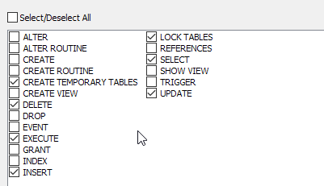
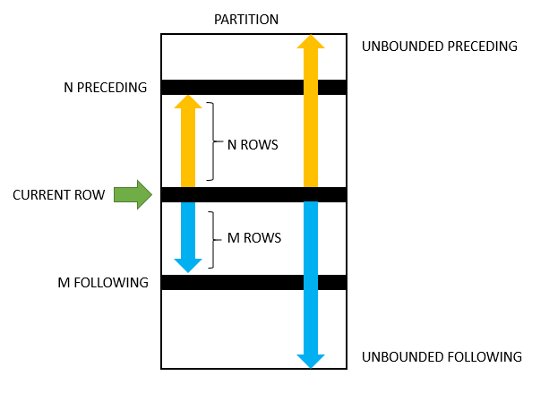

# Mysql


- [Install Mysql on Ubuntu and ROOT login](#Install_Mysql_on_Ubuntu)
- [Create DB users and grant Permission](#Create_db_users)
- [LOCK TABLES](#LOCK_TABLES)
- [FLUSH TABLES](#FLUSH_TABLES)
- [Mysql Server Administration](#Mysql_Server_Administration)
- [Useful FUNCTIONS](#Useful_FUNCTIONS)
- [INSERT IGNORE](#INSERT_IGNORE)
- [SHOW database info](#SHOW_database_info)
- [Create ER Diagram using MySQL Workbench](#Create_ER_Diagram_using_MySQL_Workbench)
- [INFORMATION_SCHEMA](#INFORMATION_SCHEMA)
- [Mysql Socket](#Mysql_Socket)
- [sysbench](#sysbench)
- [Mysql Data types Best Practices](#Mysql_Data_types_Best_Practices)
- [REGEXP](#REGEXP)
- [Mysql Engines](#Mysql_Engines)
- [Geometry spatial data-type](#Geometry_spatial_datatype)
- [Slow Query Log](#Slow_Query_Log)
- [Building the best INDEX](#Building_the_best_INDEX)
- [Finding and removing unused indexes](#Finding_and_removing_unused_indexes)
- [Mysql table size](#Mysql_table_size)
- [EXPLAIN / EXPLAIN ANALYZE query plan](#EXPLAIN_ANALYZE_query_plan)
- [EXPLAIN ANALYZE](#EXPLAIN_ANALYZE)
- [Mysql query profiling](#Mysql_query_profiling)
- [Window Function Frame](#Window_Function_Frame)
- [Summary table](#Summary_table)
- [STORED PROCEDURE vs FUNCTION](#STORED_PROCEDURE_FUNCTION)
- [SHADOW table](#SHADOW_table)
- [DB Normalization and Denormalization](#DB_Normalization_Denormalization)
- [CHECK TABLE](#CHECK_TABLE)
- [REPAIR TABLE](#REPAIR_TABLE)
- [ANALYZE TABLE](#ANALYZE_TABLE)
- [OPTIMIZE TABLE](#OPTIMIZE_TABLE)
- [Binary Log - BinLog](#Binary_Log)
- [Mysql Events](#Mysql_Events)
- [REPLACE Statement](#REPLACE_Statement)
- [LOAD DATA INFILE and SELECT INTO OUTFILE](#LOAD_DATA_INFILE_SELECT_INTO_OUTFILE)
- [Mysql Backup and Restore](#Mysql_Backup_Restore)
- [When to use MyIsam vs InnoDB ?](#MyIsam_InnoDB)
- [FOREIGN KEY Constraints](#FOREIGN_KEY_Constraints)
- [FULLTEXT SEARCH](#FULLTEXT_SEARCH)
- [mysqlcheck: Check and Repair Tables & Databases](#mysqlcheck)
- [Mysql Advanced topics](#Mysql_Advanced_topics)


## <a name='Install_Mysql_on_Ubuntu'> Install Mysql on Ubuntu and ROOT login </a>

install mysql server
```ssh
sudo apt install mysql-server
```

- Upon mysql server installation, a user "root" will be created with empty string password
- If a mysql user has password set to empty string, so he can login without password
- By default, mysql used the linux user if "-u <user>" doesnt specified

    ```sh
    sudo mysql
    ```
  will log to mysql with no password

### Configure mysql after installation
Using **mysql_secure_installation**

- This script will attempt to set a password for the installation’s root MySQL account but, by default on Ubuntu installations, this account is not configured to connect using a password
- To avoid entering this recursive loop, though, you’ll need to first adjust how your root MySQL user authenticates.
```sh
sudo mysql
```
- Then run the following ALTER USER command to change the root user’s authentication method to one that uses a password. The following example changes the authentication method to mysql_native_password:
```sql
ALTER USER 'root'@'localhost' IDENTIFIED WITH mysql_native_password BY 'password';
```
- then exit
```sql
exit
```
- Following that, you can run the mysql_secure_installation script without issue.
```sh
sudo mysql_secure_installation
```
- Once the security script completes, you can then reopen MySQL and change the root user’s authentication method back to the default, auth_socket. To authenticate as the root MySQL user using a password, run this command:
```sh
mysql -u root -p
```
- Then go back to using the default authentication method
```
ALTER USER 'root'@'localhost' IDENTIFIED WITH auth_socket;
```
- This will mean that you can once again connect to MySQL as your root user without password locally (NOT remotly)


### Mysql authentication (authentication plugins)

- **mysql_native_password**
  - performs authentication using the native password hashing method.
  - For greater security, this deployment uses the sha256_password and auth_socket authentication plugins for user authentication.
- **SHA-256 Authentication**
  - When a user account is configured to authenticate using the sha256_password plugin, the server uses the sha256_password plugin to encrypt the user password using SHA-256 password hashing.
  - The password hash is stored in the plugin and in the authentication_string column of the mysql.user system table.
  - Implements basic SHA-256 authentication
- **caching_sha2_password**  -  *default*
  - In MySQL 8.0, caching_sha2_password is the default authentication plugin rather than mysql_native_password.
  - caching_sha2_password: Implements SHA-256 authentication (like sha256_password), but uses caching on the server side for better performance and has additional features for wider applicability.
- **auth_socket**
  - authenticates clients that connect to the MySQL server from the local host through the Unix socket file.
  - auth_socket authentication is well suited to server administration user accounts for which access must be tightly restricted.

```sql
SELECT USER(),CURRENT_USER(),@@PROXY_USER;

SELECT user, plugin FROM mysql.user;

SELECT CURRENT_USER() AS User, plugin AS Auth_Method FROM mysql.user WHERE CURRENT_USER()=CONCAT(user,'@',host);
```

### Mysql binding address
- for Mysql-8 go to **/etc/mysql/mysql.conf.d/mysqld.cnf**
  > bind-address		= 127.0.0.1
- For MySql version 8.0.13 and above, you can specify a list of comma-separated IP addresses.
  > bind-address = 10.0.0.1,10.0.1.1,10.0.2.1
- Binding to 127.0.0.x won't make it available to all the devices, it will make it available locally only.
- If you wish to make it available to all the interfaces, you should use 0.0.0.0.


## <a name='Create_db_users'> Create DB users and grant Permission </a>

### mysql user in production
- You should absolutely use a restricted user to access the database as much as possible.
- Never use **root** user as application user
- **root** user should only access the server locally (NOT remotly) by setting the authentication to **auth_socket**


### Create/update/delete DB User

Show DB users
```sql
SELECT user, authentication_string, plugin FROM mysql.user;
```

Show current logged in user
```sql
SELECT current_user();
```

to create db user
```sql
CREATE USER 'username'@'host' IDENTIFIED WITH authentication_plugin BY 'password';
```
After CREATE USER, you specify a username. This is immediately followed by an @ sign and then the hostname from which this user will connect.

Run the following command to create a user that authenticates with ***caching_sha2_password***
```sql
CREATE USER 'sammy'@'localhost' IDENTIFIED BY 'password';
```

but you may want to create a user that will authenticate with the older, though still secure, mysql_native_password plugin instead:
```sql
CREATE USER 'sammy'@'localhost' IDENTIFIED WITH mysql_native_password BY 'password';
```

you can alter/update user info:
```sql
ALTER USER 'sammy'@'localhost' IDENTIFIED WITH BY 'password';

-- OR

ALTER USER 'sammy'@'localhost' IDENTIFIED WITH mysql_native_password BY 'password';
```

to delete a user
```sql
DROP USER 'username'@'host';
```

### Grant Privileges to a user

to show grants
```sql
-- for the current user
SHOW GRANTS;

-- for the a specific user
SHOW GRANTS FOR '<user>'@'<host>';
```

```sql
GRANT PRIVILEGE ON database.table TO 'username'@'host';
```

An additional clause, called **WITH GRANT OPTION**, can be appended to grant statements to allow the user account to manage grants for other users at a particular scope.


exmples:
```sql
-- this will provide them with broad superuser privileges don't do that in production
GRANT ALL PRIVILEGES ON *.* TO 'sammy'@'localhost' WITH GRANT OPTION;

GRANT CREATE, ALTER, DROP, INSERT, UPDATE, INDEX, DELETE, SELECT, REFERENCES, RELOAD on *.* TO 'sammy'@'localhost' WITH GRANT OPTION;

GRANT SELECT ON accounting.* TO 'meredith'@'localhost';

GRANT UPDATE ON accounting.revenue TO 'frank'@'localhost';

GRANT SELECT,INSERT,UPDATE,DELETE ON library.* TO 'librarymanager'@'localhost' WITH GRANT OPTION;

-- read only access
GRANT SELECT ON sales.* TO 'salesreport'@'localhost';

FLUSH PRIVILEGES;
```

then you can:
```sql
FLUSH PRIVILEGES;
```

Notes:
- Privileges assigned through GRANT option do not need FLUSH PRIVILEGES to take effect - MySQL server will notice these changes and reload the grant tables immediately.
- You should use FLUSH PRIVILEGES; only if you modify the grant tables directly using statements such as INSERT, UPDATE, or DELETE


#### Production config example



Surely it depends on the app.


to revoke grants
```sql
REVOKE <privileges> ON <database>.<object> FROM '<user>'@'<host>'

REVOKE SELECT ON *.* FROM 'sally'@'localhost';

REVOKE SELECT ON accounting.* FROM 'meredith'@'localhost';

```

### Using partial revokes to fine tune privileges

To enable partial revocation in MySQL, you need to enable it. You can turn it on persistently by typing the following in supported versions (MySQL 8.0.16 or later):

```sql
SET PERSIST partial_revokes = ON;
```

```sql
CREATE USER 'normaladmin'@'localhost' IDENTIFIED BY '<password>';
GRANT ALL PRIVILEGES ON *.* TO 'normaladmin'@'localhost';
REVOKE ALL PRIVILEGES ON mysql.* FROM 'normaladmin'@'localhost';
GRANT SELECT ON mysql.* TO 'normaladmin'@'localhost';
```
Here, we've created a user and granted them full privileges for the entire MySQL server. Afterwards, we revoke those privileges specifically in the context of the mysql database. We then re-grant the SELECT privilege so that the account can still read values from the database.

to double check
```sql
SHOW GRANTS FOR 'normaladmin'@'localhost'
```


## <a name='LOCK_TABLES'> LOCK TABLES </a>

- **READ LOCK** − If you apply this lock on a table the write operations on it are restricted. i.e., only the sessions that holds the lock can write into this table.

- **WRITE LOCK** − This lock allows restricts the sessions (that does not possess the lock) from performing the read and write operations on a table.

```sql
LOCK TABLES SalesDetails READ, CustContactDetails WRITE;
...
UNLOCK TABLES;
```

```sql
LOCK TABLES; -- will lock all tables in the server
...
UNLOCK TABLES;
```

```sql
FLUSH TABLES WITH READ LOCK;
...
UNLOCK TABLES;
```

## <a name='FLUSH_TABLES'> FLUSH TABLES </a>

```sql
FLUSH TABLES; --All databases

FLUSH TABLES WITH READ LOCK; --All databases

FLUSH LOGS;

FLUSH BINARY LOGS;

FLUSH ENGINE LOGS;

FLUSH ERROR LOGS;
```

#### "FLUSH LOGS" is equivelant to:
```sql
FLUSH BINARY LOGS
FLUSH ENGINE LOGS
FLUSH ERROR LOGS
FLUSH GENERAL LOGS
FLUSH RELAY LOGS
FLUSH SLOW LOGS
```

It’s handy to ask the server to begin a new binary log (do this after locking the tables, but before taking a backup):
> mysql> FLUSH LOGS;

example:

```sql
LOCK TABLES; -- will lock all tables in the server
FLUSH TABLES; --All databases
FLUSH LOGS;

// take backups

UNLOCK TABLES;
```

OR

```sql
FLUSH TABLES WITH READ LOCK; --All databases
FLUSH LOGS;

// take backups

UNLOCK TABLES;
```

## <a name='Mysql_Server_Administration'> Mysql Server Administration </a>

```sh
# Mysql 8 Config file
/etc/mysql/mysql.conf.d/mysqld.cnf

# start/stop/restart and status
sudo service mysql status

# Mysql 8 Custom restart
sudo mysqld --basedir=/usr --datadir=/var/lib/mysql --user=mysql --default_authentication_plugin=mysql_native_password  --socket=/var/run/mysqld/mysqld.sock

# start Mysql client
mysql -h <hostname>  -P <portnumber> -u <username> -p<password> <database>

example:
mysql -h 127.0.0.1  -P 3306 -u mina -p#Mina_1234$ myapp

# -e : execute command and quit; example
mysql -e -u mina -p#Mina_1234$ 'SHOW GLOBAL VARIABLES'

# show connection with the running queries
SHOW FULL PROCESSLIST;

# show server status
SHOW STATUS;
SHOW STATUS LIKE 'Com_delete';
SHOW STATUS LIKE '%Com_delete%';
SHOW STATUS WHERE Variable_name LIKE 'Handler%' OR Variable_name LIKE 'Created%';
SHOW STATUS LIKE 'Last_query_cost';

#Connections Status
#----------------------
#Connections, Max_used_connections, Threads_connected
#• Aborted_clients, Aborted_connects
#• Bytes_received, Bytes_sent
#• Slow_launch_threads, Threads_cached, Threads_created, Threads_running


# show Mysql server variables
SHOW GLOBAL VARIABLES
SHOW GLOBAL STATUS
SHOW VARIABLES LIKE 'have_query_cache';
show variables like 'datadir'; 
SHOW VARIABLES LIKE 'max_allowed_packet';
show variables like 'innodb_buffer_pool_size';  -- Recommended range: 60~80%
show variables like 'time_zone';
show variables like 'auto_increment_increment';
show variables like 'auto_increment_offset';

# define variable per session
SET @input := 'hello world';
SELECT BENCHMARK(1000000, MD5(@input));

# display sql statements belongs to specific user that runs for more than certain time
SELECT *
FROM INFORMATION_SCHEMA.PROCESSLIST
WHERE user='root' and time > 200


# Prepare KILL stmnts for All queries belongs to specific user that runs for more than certain time
SELECT concat('KILL ',id,';') 
FROM INFORMATION_SCHEMA.PROCESSLIST
WHERE user='root' and time > 200


# Display current connection ID (thread ID)
SELECT CONNECTION_ID();

# display Warnings after running any command
SHOW WARNINGS;

# get the last inserted ID
SELECT LAST_INSERT_ID() ;
 
# Set variable in Mysql Config file permenantly
[mysqld]
Innodb_buffer_pool_size = XX


```


## <a name='Useful_FUNCTIONS'> Useful FUNCTIONS </a>

```
MD5()
SHA1()
UUID()
UUID_SHORT()   <-- sequential
IFNULL()       <-- Return the specified value IF the expression is NULL, otherwise return the expression:
NULLIF(expr1, expr2);   <-- Return NULL if expr1 = expr2
CONV(number, from_base, to_base)  <-- The CONV() function converts a number from one numeric base system to another (example: SELECT CONV(1025, 10, 2); )
GROUP_CONCAT(expr);    <-- Returns a string with concatenated non-NULL value from a group. A list of comma(,) separated values (exmaple: SELECT pub_id,GROUP_CONCAT(cate_id) FROM book_mast GROUP BY pub_id;)
NOW()
CONCAT()
LEFT(string, number_of_chars)    <-- extracts a number of characters from a string (starting from left); example (SELECT LEFT("SQL Tutorial", 3) AS ExtractString;).
RIGHT(string, number_of_chars)   <-- extracts a number of characters from a string (starting from right); example (SELECT RIGHT("SQL Tutorial", 4) AS ExtractString;).
CONNECTION_ID()
CONVERT_TZ()	
CURDATE()
CURRENT_DATE()	
CURRENT_TIME()
CURRENT_TIMESTAMP()	
CURTIME()
DATABASE()	
ENCRYPT() 
AES_ENCRYPT();
FOUND_ROWS()  <-- to get the total number of rows affected by the last statement
LAST_INSERT_ID()
FROM_BASE64()
TO_BASE64()
LOAD_FILE()  <-- check secure_file_priv or load from "/var/lib/mysql-files"  
CONVERT(LOAD_FILE('/var/lib/mysql-files/scores.txt') using utf8);  <-- load  the file as binary data, you can use CONVERT()
RAND()	
SLEEP()	
SYSDATE()
UNIX_TIMESTAMP() 	
USER()
VERSION()
STDDEV()
STDDEV_POP()
STDDEV_SAMP()
VARIANCE()
VAR_POP()
VAR_SAMP()
SOUNDEX()  <-- search by the soundex of the english word/name
REPLACE()
FIND_IN_SET()
GROUP_CONCAT()
UPPER()
LOWER()
SUBSTR()
FOUND_ROWS()
STR_TO_DATE()
DATE_FORMAT()
LAST_DAY()


```


#### UUID
- If you do store UUID values, you should remove the dashes or, even better, convert the
  UUID values to 16-byte numbers with UNHEX() and store them in a BINARY(16) column.
  You can retrieve the values in hexadecimal format with the HEX() function.

- look at UUID_SHORT()

### IP Address
- IPv4: they are really unsigned 32-bit integers.
- Storing Integer as data type is better than TEXT
- MySQL provides the INET_ATON() and INET_NTOA() functions to convert between the two representations.

## ON DUPLICATE KEY UPDATE

ON DUPLICATE KEY UPDATE is a MariaDB/MySQL extension to the INSERT statement that, if it finds a duplicate unique or primary key, will instead perform an UPDATE.

The row/s affected value is reported as 1 if a row is inserted, and 2 if a row is updated, unless the API's CLIENT_FOUND_ROWS flag is set.

```sql
CREATE TABLE ins_duplicate (id INT PRIMARY KEY, animal VARCHAR(30));
INSERT INTO ins_duplicate VALUES (1,'Aardvark'), (2,'Cheetah'), (3,'Zebra');

INSERT INTO ins_duplicate VALUES (4,'Gorilla') 
  ON DUPLICATE KEY UPDATE animal='Gorilla';
Query OK, 1 row affected (0.07 sec)

SELECT * FROM ins_duplicate;
+----+----------+
| id | animal   |
+----+----------+
|  1 | Aardvark |
|  2 | Cheetah  |
|  3 | Zebra    |
|  4 | Gorilla  |
+----+----------+


INSERT INTO ins_duplicate VALUES (1,'Antelope');
ERROR 1062 (23000): Duplicate entry '1' for key 'PRIMARY'

INSERT INTO ins_duplicate VALUES (1,'Antelope') 
  ON DUPLICATE KEY UPDATE animal='Antelope';
Query OK, 2 rows affected (0.09 sec)

--Note: The row/s affected value is reported as 1 if a row is inserted, and 2 if a row is updated, unless the API's CLIENT_FOUND_ROWS flag is set.
```
- Check here, there is a good case
  > https://stackoverflow.com/questions/1044874/conditional-on-duplicate-key-update

```sql

CREATE TABLE `tbl` (
    `hat` varchar(11) default NULL,
    `mittens` varchar(11) default NULL,
    `name` varchar(11) default NULL,
    `stamp` timestamp NOT NULL default CURRENT_TIMESTAMP on update CURRENT_TIMESTAMP,
    UNIQUE KEY `clothes` (`hat`,`mittens`)
    ) ENGINE=MyISAM;
    
    
INSERT INTO tbl (hat, mittens, name) 
VALUES ('yellow','purple','jimmy')
ON DUPLICATE KEY UPDATE name = CASE WHEN name <> VALUES(name) 
                                    THEN VALUES(name) ELSE name END;
                                    
INSERT INTO tbl (hat, mittens, name) 
VALUES ('yellow','purple','jimmy')
ON DUPLICATE KEY UPDATE name = CASE WHEN name <> VALUES(name) 
                                    THEN VALUES(name) ELSE name END
                      , last_update = CASE WHEN name <> VALUES(name) 
                                      THEN now() ELSE last_update END;                                    
```

## <a name='INSERT_IGNORE'> INSERT IGNORE </a>

- to ignore duplicate value
```sql
INSERT IGNORE INTO `TEST` (NAME, VALUE)
SELECT NAME, VALUE FROM `TESTLOAD`;
```

## <a name='SHOW_database_info'> SHOW database info </a>

```sql
HELP SHOW;


SHOW {BINARY | MASTER} LOGS
SHOW BINLOG EVENTS [IN 'log_name'] [FROM pos] [LIMIT [offset,] row_count]
SHOW {CHARACTER SET | CHARSET} [like_or_where]
SHOW COLLATION [like_or_where]
SHOW [FULL] COLUMNS FROM tbl_name [FROM db_name] [like_or_where]
SHOW CREATE DATABASE db_name
SHOW CREATE EVENT event_name
SHOW CREATE FUNCTION func_name
SHOW CREATE PROCEDURE proc_name
SHOW CREATE TABLE tbl_name
SHOW CREATE TRIGGER trigger_name
SHOW CREATE VIEW view_name
SHOW DATABASES [like_or_where]
SHOW ENGINE engine_name {STATUS | MUTEX}
SHOW [STORAGE] ENGINES
SHOW ERRORS [LIMIT [offset,] row_count]
SHOW EVENTS
SHOW FUNCTION CODE func_name
SHOW FUNCTION STATUS [like_or_where]
SHOW GRANTS FOR user
SHOW INDEX FROM tbl_name [FROM db_name]
SHOW MASTER STATUS
SHOW OPEN TABLES [FROM db_name] [like_or_where]
SHOW PLUGINS
SHOW PROCEDURE CODE proc_name
SHOW PROCEDURE STATUS [like_or_where]
SHOW PRIVILEGES
SHOW [FULL] PROCESSLIST
SHOW PROFILE [types] [FOR QUERY n] [OFFSET n] [LIMIT n]
SHOW PROFILES
SHOW RELAYLOG EVENTS [IN 'log_name'] [FROM pos] [LIMIT [offset,] row_count]
SHOW {REPLICAS | SLAVE HOSTS}
SHOW {REPLICA | SLAVE} STATUS [FOR CHANNEL channel]
SHOW [GLOBAL | SESSION] STATUS [like_or_where]
SHOW TABLE STATUS [FROM db_name] [like_or_where]
SHOW [FULL] TABLES [FROM db_name] [like_or_where]
SHOW TRIGGERS [FROM db_name] [like_or_where]
SHOW [GLOBAL | SESSION] VARIABLES [like_or_where]
SHOW WARNINGS [LIMIT [offset,] row_count]

like_or_where: {
    LIKE 'pattern'
  | WHERE expr
}

```

```sql
HELP DESC;


{EXPLAIN | DESCRIBE | DESC}
    tbl_name [col_name | wild]

{EXPLAIN | DESCRIBE | DESC}
    [explain_type]
    {explainable_stmt | FOR CONNECTION connection_id}

{EXPLAIN | DESCRIBE | DESC} ANALYZE [FORMAT = TREE] select_statement

explain_type: {
    FORMAT = format_name
}

format_name: {
    TRADITIONAL
  | JSON
  | TREE
}

explainable_stmt: {
    SELECT statement
  | TABLE statement
  | DELETE statement
  | INSERT statement
  | REPLACE statement
  | UPDATE statement
}

```


## <a name='Create_ER_Diagram_using_MySQL_Workbench'> Create ER Diagram using MySQL Workbench </a>

1. Select "Database" Menu -> "Reverse Engineer" sub-menu
2. Fill-in connection option then click next
3. Mysql workbench will connect to DBMS to gather information
4. Select the database scheme you want to create ERD for then hit next
5. Mysql workbench will retrieve all objects of the selected schema
6. Next step is to Select Objects to be included in the ERD, click Execute
7. Mysql will start the reverse engineering process, once done click next
8. Finally, Mysql workbench will display the Reverse engineering results
9. Click "Close", Hence "*.mwb" file is created for ERD


## <a name='INFORMATION_SCHEMA'> INFORMATION_SCHEMA </a>

```sql
SELECT Auto_increment FROM INFORMATION_SCHEMA.TABLES 
  WHERE TABLE_NAME='xyz';
+----------------+
| Auto_increment |
+----------------+
|              5 |
+----------------+

```

## <a name='Mysql_Socket'> Mysql Socket </a>

The **.sock** extension is used by Unix domain sockets as a convention, but not as a requirement. Unix domain sockets are special files used by different processes to communicate with each other - much like TCP/IP sockets.


```sh
$ grep socket /etc/mysql/mysql.conf.d/mysqld.cnf
# socket	= /var/run/mysqld/mysqld.sock


$ ll /var/run/mysqld/mysqld.sock
srwxrwxrwx 1 mysql mysql 0 Jun 28 11:17 /var/run/mysqld/mysqld.sock=

```


## <a name='sysbench'> sysbench </a>

### Create mysql user for sysbench
```sql
mysql> create database sbtest;
mysql> create user sbtest_user identified by 'Password#123';
mysql> grant all on sbtest.* to `sbtest_user`@`%`;
mysql> show grants for sbtest_user;
+---------------------------------------------------------+
| Grants for sbtest_user@%                                |
+---------------------------------------------------------+
| GRANT USAGE ON *.* TO `sbtest_user`@`%`                 |
| GRANT ALL PRIVILEGES ON `sbtest`.* TO `sbtest_user`@`%` |
+---------------------------------------------------------+
```

### Prepare the data
```sh
sysbench \
--db-driver=mysql \
--mysql-user=sbtest_user \
--mysql_password=Password#123 \
--mysql-db=sbtest \
--mysql-host=127.0.0.1 \
--mysql-port=3306 \
--tables=16 \
--table-size=10000 \
/usr/share/sysbench/oltp_read_write.lua prepare

```
> --tables     -> Number of tables
> --table-size -> Number of rows per table

### Run the test
```sh
sysbench \
--db-driver=mysql \
--mysql-user=sbtest_user \
--mysql_password=Password#123 \
--mysql-db=sbtest \
--mysql-host=127.0.0.1 \
--mysql-port=3306 \
--tables=16 \
--table-size=10000 \
--threads=8 \
--time=300 \
--events=0 \
--report-interval=1 \
--rate=40 \
/usr/share/sysbench/oltp_read_write.lua run

```
> --threads         -> Number of conenctions
> --time            -> How long SysBench should keep running, 0 for unlimited time
> --events          -> Number of queries to execute,  0 for unlimited queries
> --report-interval       -> Report statistcs every N second
> --rate            -> average transactions rate, 0 for unlimited rate

### The most important statistics to look into (QPS: Queries per second)
```
    transactions:                        5589   (15.94 per sec.)
    queries:                             112214 (320.02 per sec.)
```


## <a name='Mysql_Data_types_Best_Practices'> Mysql Data types Best Practices </a>

### Signed and UnSignaed Inetegers
| Type | Storage (Bytes) | Minimum Value Signed | Minimum Value Unsigned | Maximum Value Signed | Maximum Value Unsigned |
| --- | --- | --- | --- | --- | --- |
| TINYINT | 1 | -128 | 0 | 127 | 255 |
| SMALLINT | 2 | -32768 | 0 | 32767 | 65535 |
| MEDIUMINT | 3 | -8388608 | 0 | 8388607 | 16777215 |
| INT | 4 | -2147483648 | 0 | 2147483647 | 4294967295 |
| BIGINT | 8 | -2^63 | 0 | 2^63-1 | 2^64-1 |

### Fixed-Point Types vs Floating point and

#### Fixed-Point Types (Exact Value) - DECIMAL, NUMERIC

The DECIMAL and NUMERIC types store exact numeric data values. These types are used when it is important to preserve exact precision, for example with monetary data.

```
DECIMAL(5,2) 
```
The syntax is DECIMAL(M,D)
M - total length
D - digits right of the decimal point
For example, suppose you want to store a maximum of 10 digits, with two digits after the decimal, the syntax would be
```
DECIMAL(10,2)
```

#### Floating-Point Types (Approximate Value) - FLOAT, DOUBLE
The FLOAT and DOUBLE types represent approximate numeric data values. MySQL uses four bytes for single-precision values and eight bytes for double-precision values.

#### Different between Decimal and Double
- Shouldn't use DOUBLE to store money on a MySQL database


### Bit-Value Type - BIT
The BIT data type is used to store bit values. A type of BIT(M) enables storage of M-bit values. M can range from 1 to 64.

```sql
is_editable BIT(1) NOT NULL
```

### CHAR and VARCHAR

CHAR is a fixed length text while VARCHAR is a variable length

### JSON

```sql
attributes JSON NOT NULL
```

### ENUM

```sql
rating ENUM('G','PG','PG-13','R','NC-17') NOT NULL
```

### SET   (NOT Recommended)

```sql
special_features SET('Trailers','Commentaries','Deleted Scenes','Behind the Scenes') NOT NULL
```

example:
```sql
mysql> CREATE TABLE myset (col SET('a', 'b', 'c', 'd'));

INSERT INTO myset (col) VALUES 
('a,d'), ('d,a'), ('a,d,a'), ('a,d,d'), ('d,a,d');

mysql> SELECT col FROM myset;
+------+
| col  |
+------+
| a,d  |
| a,d  |
| a,d  |
| a,d  |
| a,d  |
+------+

mysql> INSERT INTO myset (col) VALUES ('a,d,d,s');
Query OK, 1 row affected, 1 warning (0.03 sec)

mysql> SHOW WARNINGS;
+---------+------+------------------------------------------+
| Level   | Code | Message                                  |
+---------+------+------------------------------------------+
| Warning | 1265 | Data truncated for column 'col' at row 1 |
+---------+------+------------------------------------------+
1 row in set (0.04 sec)

mysql> SELECT col FROM myset;
+------+
| col  |
+------+
| a,d  |
| a,d  |
| a,d  |
| a,d  |
| a,d  |
| a,d  |
+------+


mysql> SELECT * FROM tbl_name WHERE FIND_IN_SET('d',col) > 0;
mysql> SELECT * FROM tbl_name WHERE col LIKE '%value%';
```

### BLOB

```sql
picture BLOB

CREATE TABLE user 
(
user_id INTEGER, 
picture BLOB
);

```


### GEOMETRY

```sql
location geometry NOT NULL 
```

### DATE, DATETIME, DATE and TIMESTAMP

#### DATE
'YYYY-MM-DD'
> example: 2023:07:23

#### TIME
'HH:mm:ss'
> example: 11:12:00

#### DATETIME vs TIMESTAMP
- Both store "YYYY-MM-DD HH:MM:SS"
- Timestamps in MySQL are generally used to track changes to records, and are often updated every time the record is changed. If you want to store a specific value you should use a datetime field.
- Range
  - Datetime data type supports a date along with time in the range between 1000-01-01 00:00:00 and 9999-12-31 23:59:59.
  - Timestamp data type supports a date along with time in the range between ‘1970-01-01 00:00:01’ to ‘2038-01-19 08:44:07’
- Indexing can be done on timestamp data but datetime data cannot be indexed
- performance tests showed that integer unix timestamp is better than DateTime, comparing integers are slightly faster than comparing dates s


```sql
CREATE table test_datetime(
time DATETIME NOT NULL DEFAULT CURRENT_TIMESTAMP ON UPDATE CURRENT_TIMESTAMP
);

INSERT INTO test_datetime (time) values (CURRENT_TIMESTAMP);

SELECT * from test_datetime;
+---------------------+
| time                |
+---------------------+
| 2017-11-14 17:29:03 |
+---------------------+
1 row in set (0.00 sec)

-- change the timzezone per session
SET @@session.time_zone = '-5:00';
Query OK, 0 rows affected (0.00 sec)

SELECT * from test_timestamp;
+---------------------+
| time                |
+---------------------+
| 2017-11-14 06:59:50 |
+---------------------+
1 row in set (0.00 sec)

```

### Working with Intervals, Durations and Periods

```sql
SELECT SUM(cnt) FROM msg_per_hr
WHERE hr BETWEEN CONCAT(LEFT(NOW(), 14), '00:00') - INTERVAL 23 HOUR AND CONCAT(LEFT(NOW(), 14), '00:00') - INTERVAL 1 HOUR;

SELECT COUNT(*) FROM message
WHERE posted >= NOW() - INTERVAL 24 HOUR
AND posted < CONCAT(LEFT(NOW(), 14), '00:00') - INTERVAL 23 HOUR;

SELECT COUNT(*) FROM message
WHERE posted >= CONCAT(LEFT(NOW(), 14), '00:00');

DELETE FROM messages WHERE created < DATE_SUB(NOW(),INTERVAL 3 MONTH);

-- BETWEEN NOW() AND DATE_ADD(NOW(), INTERVAL 30 DAY)
-- last_online > DATE_SUB(NOW(), INTERVAL 7 DAY)

-- `last_update` timestamp NOT NULL DEFAULT CURRENT_TIMESTAMP ON UPDATE CURRENT_TIMESTAMP

``` 


```sql
SELECT SUM(cnt) FROM msg_per_hr
WHERE hr BETWEEN
CONCAT(LEFT(NOW(), 14), '00:00') - INTERVAL 23 HOUR
AND CONCAT(LEFT(NOW(), 14), '00:00') - INTERVAL 1 HOUR;

SELECT COUNT(*) FROM message
WHERE posted >= NOW() - INTERVAL 24 HOUR
AND posted < CONCAT(LEFT(NOW(), 14), '00:00') - INTERVAL 23 HOUR;

SELECT COUNT(*) FROM message
WHERE posted >= CONCAT(LEFT(NOW(), 14), '00:00');
```
| Name | Description |
| --- | --- |
| ADDDATE() | Add time values (intervals) to a date value |
| ADDTIME() | Add time |
| CONVERT_TZ() | Convert from one time zone to another |
| CURDATE() | Return the current date |
| CURRENT_DATE(), CURRENT_DATE | Synonyms for CURDATE() |
| CURRENT_TIME(), CURRENT_TIME | Synonyms for CURTIME() |
| CURRENT_TIMESTAMP(), CURRENT_TIMESTAMP | Synonyms for NOW() |
| CURTIME() | Return the current time |
| DATE() | Extract the date part of a date or datetime expression |
| DATE_ADD() | Add time values (intervals) to a date value |
| DATE_FORMAT() | Format date as specified |
| DATE_SUB() | Subtract a time value (interval) from a date |
| DATEDIFF() | Subtract two dates |
| DAY() | Synonym for DAYOFMONTH() |
| DAYNAME() | Return the name of the weekday |
| DAYOFMONTH() | Return the day of the month (0-31) |
| DAYOFWEEK() | Return the weekday index of the argument |
| DAYOFYEAR() | Return the day of the year (1-366) |
| EXTRACT() | Extract part of a date |
| FROM_DAYS() | Convert a day number to a date |
| FROM_UNIXTIME() | Format Unix timestamp as a date |
| GET_FORMAT() | Return a date format string |
| HOUR() | Extract the hour |
| LAST_DAY | Return the last day of the month for the argument |
| LOCALTIME(), LOCALTIME | Synonym for NOW() |
| LOCALTIMESTAMP, LOCALTIMESTAMP() | Synonym for NOW() |
| MAKEDATE() | Create a date from the year and day of year |
| MAKETIME() | Create time from hour, minute, second |
| MICROSECOND() | Return the microseconds from argument |
| MINUTE() | Return the minute from the argument |
| MONTH() | Return the month from the date passed |
| MONTHNAME() | Return the name of the month |
| NOW() | Return the current date and time |
| PERIOD_ADD() | Add a period to a year-month |
| PERIOD_DIFF() | Return the number of months between periods |
| QUARTER() | Return the quarter from a date argument |
| SEC_TO_TIME() | Converts seconds to 'hh:mm:ss' format |
| SECOND() | Return the second (0-59) |
| STR_TO_DATE() | Convert a string to a date |
| SUBDATE() | Synonym for DATE_SUB() when invoked with three arguments |
| SUBTIME() | Subtract times |
| SYSDATE() | Return the time at which the function executes |
| TIME() | Extract the time portion of the expression passed |
| TIME_FORMAT() | Format as time |
| TIME_TO_SEC() | Return the argument converted to seconds |
| TIMEDIFF() | Subtract time |
| TIMESTAMP() | With a single argument, this function returns the date or datetime expression; with two arguments, the sum of the arguments |
| TIMESTAMPADD() | Add an interval to a datetime expression |
| TIMESTAMPDIFF() | Return the difference of two datetime expressions, using the units specified |
| TO_DAYS() | Return the date argument converted to days |
| TO_SECONDS() | Return the date or datetime argument converted to seconds since Year 0 |
| UNIX_TIMESTAMP() | Return a Unix timestamp |
| UTC_DATE() | Return the current UTC date |
| UTC_TIME() | Return the current UTC time |
| UTC_TIMESTAMP() | Return the current UTC date and time |
| WEEK() | Return the week number |
| WEEKDAY() | Return the weekday index |
| WEEKOFYEAR() | Return the calendar week of the date (1-53) |
| YEAR() | Return the year |
| YEARWEEK() | Return the year and week |

### Named Time Zones


```sql
mysql> SELECT CONVERT_TZ('2020-11-19 19:59:00', '+00:00', '+05:30')
    -> ;
+-------------------------------------------------------+
| CONVERT_TZ('2020-11-19 19:59:00', '+00:00', '+05:30') |
+-------------------------------------------------------+
| 2020-11-20 01:29:00                                   |
+-------------------------------------------------------+
1 row in set (0.01 sec)

mysql> SELECT CONVERT_TZ('2020-11-19 19:59:00', '+00:00', '+02:00');
+-------------------------------------------------------+
| CONVERT_TZ('2020-11-19 19:59:00', '+00:00', '+02:00') |
+-------------------------------------------------------+
| 2020-11-19 21:59:00                                   |
+-------------------------------------------------------+
1 row in set (0.00 sec)

mysql> SELECT CONVERT_TZ('2020-12-01 01:00:00','Europe/Helsinki','US/Eastern') AS Result;
+--------+
| Result |
+--------+
| NULL   |
+--------+
1 row in set (0.00 sec)

```

Before jumping in, it’s probably a good idea to check whether or not your system has already been configured for named time zones.

```sql
mysql> SELECT * 
    -> FROM mysql.time_zone_name
    -> LIMIT 10;
Empty set (0.00 sec)

```
It is NOT configured

Use "mysql_tzinfo_to_sql" utility to populate the tables in "mysql" db

```sh
mysql_tzinfo_to_sql /usr/share/zoneinfo | mysql -u root -p mysql
```

```sql
mysql> SELECT CONVERT_TZ('2020-12-01 01:00:00','Europe/Helsinki','US/Eastern') AS Result;
+---------------------+
| Result              |
+---------------------+
| 2020-11-30 18:00:00 |
+---------------------+
1 row in set (0.00 sec)

```

### NOT NULL
However, if you’re planning to index columns, avoid making them nullable if possible.


## <a name='REGEXP'> REGEXP </a>

- A regular expression uses the backslash as an escape character

```sql
SELECT column_lists FROM table_name WHERE field_name REGEXP 'pattern';  

SELECT * FROM student_info WHERE stud_name REGEXP '^[ab]';
SELECT * FROM student_info WHERE stud_name REGEXP 'k$'; 
SELECT * FROM student_info WHERE stud_name REGEXP 'k$'; 
```


## <a name='Mysql_Engines'> Mysql Engines </a>

- InnoDB (default)
- MyISAM
- Archive Storage (Only inserted or selected with NO update or delete)
  > suitable for logging user activities or log http requests
  > PRIMARY KEY is NOT allowed
  > uses zlib for data compression
  > small data file size
  > doesnt allow indexing and the select needs full table scan

```sql
ALTER TABLE my_table AUTO_INCREMENT=0, ENGINE=ARCHIVE;
```

## <a name='Geometry_spatial_datatype'> Geometry spatial data-type </a>

### start with plain coordinates for simplification
> SRID = 0 : for plain coordinates
```sql

-- SRID 0:  for a flat coordinates (Not spherical coordinates)
CREATE TABLE IF NOT EXISTS `locations_flat`(
    `id` INT NOT NULL PRIMARY KEY AUTO_INCREMENT,
    `name` VARCHAR(100),
    `position` POINT NOT NULL SRID 0
);
SHOW COLUMNS FROM `locations_flat`;

INSERT INTO `locations_flat`(`name`, `position`)
VALUES
 ( 'point_1', ST_GeomFromText( 'POINT( 1 1 )', 0 ) ),
 ( 'point_2', ST_GeomFromText( 'POINT( 2 2 )', 0 ) ),
 ( 'point_3', ST_GeomFromText( 'POINT( 3 3 )', 0 ) );
 
 
SELECT *, ST_ASTEXT(`position`) AS `pos_wkt`
FROM `locations_flat` LIMIT 10; 


-- assume that this is a user location
SET @user_location = ST_GeomFromText( 'POINT(0 0)' );

-- If we want to search for places which are within 100 unit distance from him 
SELECT *,
    ST_AsText(`position`) AS `pos_wkt`,
    ST_Distance(`position`, @user_location) AS `distance`
FROM `locations_flat`
WHERE ST_Distance(`position`, @user_location) <= 100;

-- check whether a geometry (point) lies inside it or not.
SET @user_location = ST_GeomFromText( 'POINT(0 0)' );
SET @area_to_search = ST_Buffer( @user_location, 100 );
SELECT 
    *,
    ST_AsText(`position`) AS `pos_wkt`,
    ST_Distance(`position`, @user_location) AS `distance`
FROM
    `locations_flat`
WHERE ST_Within( `position`, @area_to_search ) = 1;

-- create index on POINT
CREATE TABLE IF NOT EXISTS `locations_flat`(
    `id` INT NOT NULL PRIMARY KEY AUTO_INCREMENT,
    `name` VARCHAR(100),
    `position` POINT NOT NULL SRID 0,
    SPATIAL INDEX(`position`)    -- <-------here is the index
);
-- ALTER TABLE `locations_flat` ADD SPATIAL INDEX(`position`);
-- CREATE SPATIAL INDEX position_index ON locations_flat(`position`);

-- Verify index
SHOW INDEXES FROM `locations_flat`;

```

SRID for the geographic coordinate system is **4326**

```sql
mysql> SELECT * FROM ST_SPATIAL_REFERENCE_SYSTEMS
       WHERE SRS_ID = 4326\G
*************************** 1. row ***************************
                SRS_NAME: WGS 84
                  SRS_ID: 4326
            ORGANIZATION: EPSG
ORGANIZATION_COORDSYS_ID: 4326
              DEFINITION: GEOGCS["WGS 84",DATUM["World Geodetic System 1984",
                          SPHEROID["WGS 84",6378137,298.257223563,
                          AUTHORITY["EPSG","7030"]],AUTHORITY["EPSG","6326"]],
                          PRIMEM["Greenwich",0,AUTHORITY["EPSG","8901"]],
                          UNIT["degree",0.017453292519943278,
                          AUTHORITY["EPSG","9122"]],
                          AXIS["Lat",NORTH],AXIS["Long",EAST],
                          AUTHORITY["EPSG","4326"]]
             DESCRIPTION:
```

### Next, let's move to the Geographic earth coordinates
> SRID = 4326 : for spherical coordinates

```sql
CREATE TABLE IF NOT EXISTS `locations_earth`(
    `id` INT NOT NULL PRIMARY KEY AUTO_INCREMENT,
    `name` VARCHAR(100),
    `position` POINT NOT NULL SRID 4326,
    SPATIAL INDEX(`position`)
);
SHOW COLUMNS FROM `locations_earth`;

-- POINT(lat, long)
INSERT INTO `locations_earth`(`name`, `position`) VALUES
 ('point_1', ST_GeomFromText('POINT(0.09000 0.18000)', 4326)),
 ('point_2', ST_GeomFromText('POINT(0.18000 0.36000)', 4326)),
 ('point_3', ST_GeomFromText('POINT(0.27000 0.54000)', 4326));
 
 
-- in Delhi - India, I am going to pick Lotus Temple (28.553298, 77.259221) and India Gate (28.612849, 77.229883)

SET @lotus_temple := ST_GeomFromText( 'POINT(28.553298 77.259221)', 4326, 'axis-order=lat-long' );
SET @india_gate := ST_GeomFromText( 'POINT(28.612849 77.229883)', 4326 );
SELECT
    ST_Latitude( @lotus_temple ) AS `lat_lotus_temple`,
    ST_Longitude( @lotus_temple ) AS `long_lotus_temple`,
    ST_Latitude( @india_gate ) AS `lat_india_gate`,
    ST_Longitude( @india_gate ) AS `long_india_gate`,
    ST_Distance_Sphere( @lotus_temple, @india_gate ) AS `distance`;
    
-- Let’s say that we are looking for places in 1000km (1000 * 1000m) radius from location(30, 50). Here 30 is latitude and 50 is longitude. Using same old SQL query, we get below result.

SET @user_location = ST_GeomFromText( 'POINT(30 50)', 4326 );
SELECT 
    *,
    ST_AsText(`position`) AS `pos_wkt`,
    ST_Distance_Sphere(`position`, @user_location) AS `distance`
FROM
    `locations_earth`
WHERE ST_Distance_Sphere(`position`, @user_location) <= (1000*1000);

-- the above query is doing full table scan 'cus we are comapring te value returned from ST_Distance_Sphere

```

### Get GPS location from the web browser
```html
<!DOCTYPE html>
<html>
<body>

<p>Click the button to get your coordinates.</p>

<button onclick="getLocation()">Try It</button>

<p id="demo"></p>

<script>
var x = document.getElementById("demo");

function getLocation() {
  if (navigator.geolocation) {
    navigator.geolocation.getCurrentPosition(showPosition);
  } else { 
    x.innerHTML = "Geolocation is not supported by this browser.";
  }
}

function showPosition(position) {
  x.innerHTML = "Latitude: " + position.coords.latitude + 
  "<br>Longitude: " + position.coords.longitude +
  "<br>Accuracy: " + position.coords.accuracy;
  
}
</script>

</body>
</html>


```

## <a name='Slow_Query_Log'> Slow Query Log </a>

- By default, the slow query log is disabled
- To check if it is enabled or Not
```sql
mysql> show variables like 'slow_query_log';
+----------------+-------+
| Variable_name  | Value |
+----------------+-------+
| slow_query_log | OFF   |
+----------------+-------+
1 row in set (0.01 sec)
```
- By default, administrative statements are not logged, nor are queries that do not use indexes for lookups. This behavior can be changed using **log_slow_admin_statements** and **log_queries_not_using_indexes**, as described later.

```sql
mysql> show variables like 'log_queries_not_using_indexes';
+-------------------------------+-------+
| Variable_name                 | Value |
+-------------------------------+-------+
| log_queries_not_using_indexes | OFF   |
+-------------------------------+-------+
1 row in set (0.02 sec)

mysql> show variables like 'log_slow_admin_statements';
+---------------------------+-------+
| Variable_name             | Value |
+---------------------------+-------+
| log_slow_admin_statements | OFF   |
+---------------------------+-------+
1 row in set (0.01 sec)
```

- the default min query time is 10 and the unit is microsecond
```sql
mysql> show variables like 'long_query_time';
+-----------------+-----------+
| Variable_name   | Value     |
+-----------------+-----------+
| long_query_time | 10.000000 |
+-----------------+-----------+
1 row in set (0.01 sec)

```

- to enable the slow query log

```ssh
# sudo nano /etc/mysql/mysql.conf.d/mysqld.cnf
[mysqld]
    long_query_time=5
    slow_query_log=1
    log_queries_not_using_indexes = 1
    log_slow_admin_statements = 1;
    #slow_query_log_file=/var/lib/mysql/mysqld-slow.log  <-- optional
    
// then restart mysql
sudo service mysql stop
sudo service mysql start

sudo service mysql status
```  


- to confirm that the changes are active
```sql
show variables like '%slow%';
show variables like '%long%';
show variables like '%log_queries_not_using_indexes%';
```
- to verify that the slow queries are logged
```sh
# in one terminal, tail the slow log file
sudo tail -f /var/lib/mysql/mina-server-slow.log

# and in the other terminal, issue a long query
SELECT SLEEP(6);

# make sure that this query is logged in the file
```

- Enabling Slow query log Online
```sql
mysql> SET @@GLOBAL.LONG_QUERY_TIME=5;
Query OK, 0 rows affected (0.00 sec)

mysql> SET @@GLOBAL.slow_query_log_file='/var/log/mysql/mysql-slow.log';
Query OK, 0 rows affected (0.00 sec)

mysql> SET @@GLOBAL.slow_query_log=1;
Query OK, 0 rows affected (0.01 sec)

```
- you can use **mysqldumpslow** command to process a slow query log file and summarize its contents


###  mysqldumpslow — Summarize Slow Query Log Files

```sh
sudo mysqldumpslow /var/lib/mysql/mina-server-slow.log

# The following will show you the top 5 queries which returned the maximum rows. It can help you find the queries where you missed LIMIT clause
mysqldumpslow -a -s r -t 5 /var/log/mysql/mysql-slow.log

# This one will sort output by count - the number of times the query is found in the slow log.
mysqldumpslow -a -s c -t 5 /var/log/mysql/mysql-slow.log

-a    Do not abstract all numbers to N and strings to S
-n    Abstract numbers with at least the specified digits
--debug    Write debugging information
-g    Only consider statements that match the pattern
--help    Display help message and exit
-h    Host name of the server in the log file name
-i    Name of the server instance
-l    Do not subtract lock time from total time
-r    Reverse the sort order
-s    How to sort output
-t    Display only first num queries
--verbose    Verbose mode[code]

```

Also, you can use **pt-query-digest** from percona to analyse the slow queries

```sh
sudo pt-query-digest /var/lib/mysql/mina-server-slow.log
```
It aggregates all the queries and analyse them

most important lines to look at 
>  Overall: 2 total, 1 unique, 0.00 QPS, 0.02x concurrency

means total 2 queries in the file, but only one single unique query type

- Exec time vs Lock time
> Exec time    100     14s      6s      8s      7s      8s      1s      7s
> 
> Lock time      0       0       0       0       0       0       0       0


- Row sent vs Row Examine
> Rows sent    100       2       1       1       1       1       0       1

> Rows examine 100       2       1       1       1       1       0       1


### Good trick

to log **ALL** queries regardless of their execution time, set **long_query_time** to ZERO

> long_query_time=0

then you can use **pt-query-digest** to analyse them
```
# Profile
# Rank Query ID                           Response time  Calls R/Call V/M 
# ==== ================================== ============== ===== ====== ====
#    1 0x59A74D08D407B5EDF9A57DD5A41825CA 22.0466 100.0%     3 7.3489  0.12 SELECT


```
Reference: https://www.youtube.com/watch?v=INovio_FuTU


## <a name='Building_the_best_INDEX'> Building the best INDEX </a>

THIS IS  A PERFECT REFERENCE - more than enough
> Reference: https://mariadb.com/kb/en/building-the-best-index-for-a-given-select/
 
also, It is cached here as html page as it is a very good complete guide to build a perfect index


### Decide which index is better using "FORCE INDEX"

```sql

CREATE TABLE `files` (
  `did` int(10) unsigned NOT NULL DEFAULT '0',
  `filename` varbinary(200) NOT NULL,
  `ext` varbinary(5) DEFAULT NULL,
  `fsize` double DEFAULT NULL,
  `filetime` datetime DEFAULT NULL,
  PRIMARY KEY (`did`,`filename`),
  KEY `fe` (`filetime`,`ext`),          -- This?
  KEY `ef` (`ext`,`filetime`)           -- or This?
) ENGINE=InnoDB DEFAULT CHARSET=utf8 ;
```

The query involves both ext and filetime:

```sql
WHERE ext = '...'
AND filetime BETWEEN ... AND ...
```


let's try ***FORCE INDEX*** to pick either **ef** or **fe**

```sql
mysql> EXPLAIN SELECT COUNT(*), AVG(fsize)
    FROM files FORCE INDEX(fe)
    WHERE ext = 'gif' AND filetime >= '2015-01-01'
                      AND filetime <  '2015-01-01' + INTERVAL 1 MONTH;
+----+-------------+-------+-------+---------------+------+---------+------+-------+-----------------------+
| id | select_type | table | type  | possible_keys | key  | key_len | ref  | rows  | Extra                 |
+----+-------------+-------+-------+---------------+------+---------+------+-------+-----------------------+
|  1 | SIMPLE      | files | range | fe            | fe   | 14      | NULL | 16684 | Using index condition |
+----+-------------+-------+-------+---------------+------+---------+------+-------+-----------------------+


mysql> EXPLAIN SELECT COUNT(*), AVG(fsize)
    FROM files FORCE INDEX(ef)
    WHERE ext = 'gif' AND filetime >= '2015-01-01'
                      AND filetime <  '2015-01-01' + INTERVAL 1 MONTH;
+----+-------------+-------+-------+---------------+------+---------+------+------+-----------------------+
| id | select_type | table | type  | possible_keys | key  | key_len | ref  | rows | Extra                 |
+----+-------------+-------+-------+---------------+------+---------+------+------+-----------------------+
|  1 | SIMPLE      | files | range | ef            | ef   | 14      | NULL |  538 | Using index condition |
+----+-------------+-------+-------+---------------+------+---------+------+------+-----------------------+


```

Clearly, the **rows** says ***ef is better***. (538 vs 16684)


## <a name='Finding_and_removing_unused_indexes'> Finding and removing unused indexes </a>

```sql
SELECT table_name, index_name, non_unique, seq_in_index, column_name, collation, cardinality, sub_part, packed, index_type, comment, index_comment
FROM information_schema.STATISTICS
WHERE table_schema = 'database_name'
AND index_name != 'PRIMARY'
AND (cardinality IS NULL OR cardinality = 0)
ORDER BY table_name, index_name, seq_in_index;
```
Replace "database_name" with the desired database.

then you can drop the index
```sql
ALTER TABLE your_table_name DROP INDEX your_index_name;
```

To get a list of all indexes for all tables in your database, run:
```sql
SELECT * FROM information_schema.statistics;
```

## <a name='Mysql_table_size'> Mysql table size </a>

###  list the size of every table in every database, the largest first:

```sql
SELECT 
     table_schema as `Database`, 
     table_name AS `Table`, 
     round(((data_length + index_length) / 1024 / 1024), 2) `Size in MB` 
FROM information_schema.TABLES 
ORDER BY (data_length + index_length) DESC;
```

### show the size of a table (although you need to substitute the variables first):

```sql
SELECT 
    table_name AS `Table`, 
    round(((data_length + index_length) / 1024 / 1024), 2) `Size in MB` 
FROM information_schema.TABLES 
WHERE table_schema = "$DB_NAME"
    AND table_name = "$TABLE_NAME";
```

## <a name='EXPLAIN_ANALYZE_query_plan'> EXPLAIN / EXPLAIN ANALYZE query plan </a>

Reference: https://mariadb.com/kb/en/explain/

EXPLAIN ANALYZE also prints the actual costs of individual iterators in the execution plan.

```
Warning
=======
EXPLAIN ANALYZE actually runs the query, so if you don’t want to run the query against your live database, do not use EXPLAIN ANALYZE.
```

### MySQL EXPLAIN access types

From best to worst, in terms of performance:
| Type value | Definition |
| --- | --- |
| NULL | This access method means MySQL can resolve the query during the optimization phase and will not even access the table or index during the execution stage. |
| system | The table is empty or has one row. |
| const | The value of the column can be treated as a constant (there is one row matching the query)<br><br>Note: Primary Key Lookup, Unique Index Lookup |
| eq_ref | The index is clustered and is being used by the operation (either the index is a PRIMARY KEY or UNIQUE INDEX with all key columns defined as NOT NULL) |
| ref | The indexed column was accessed using an equality operator<br><br>Note: The ref_or_null access type is a variation on ref. It means MySQL must do a second lookup to find NULL entries after doing the initial lookup. |
| fulltext | Operation (JOIN) is using the table’s fulltext index |
| index | The entire index is scanned to find a match for the query<br><br>Note: The main advantage is that this avoids sorting. The biggest disadvantage is the cost of reading an entire table in index order. This usually means accessing the rows in random order, which is very expensive. |
| range | A range scan is a limited index scan. It begins at some point in the index and returns rows that match a range of values.<br><br>Note: This is better than a full index scan because it doesn’t go through the entire index. |
| all | MySQL scans the entire table to satisfy the query |

- What does eq_ref and ref types mean in MySQL explain ?
  > https://stackoverflow.com/questions/4508055/what-does-eq-ref-and-ref-types-mean-in-mysql-explain

- The ref Column
  This column shows which columns or constant from preceding tables are being used to look up values in the index named in the key column.

- The rows Column
  This column shows the number of rows MySQL estimates it will need to read to find the desired rows.

- The filtered Column
  This column shows a pessimistic estimate of the percentage of rows that will satisfy some condition on the table,


### The EXTRA column in MySQL EXPLAIN#

The EXTRA column in a MySQL EXPLAIN output contains extra information
| EXTRA column value | Definition |
| --- | --- |
| Using index | Indicates that MySQL will use a covering index to avoid accessing the table. |
| Using where | The MySQL server will post-filter rows after the storage engine retrieves them. |
| Using temporary | MySQL will use a temporary table while sorting the query’s result |
| Using filesort | MySQL will use an external sort to order the results, instead of reading the rows from the table in index order. MySQL has two filesort algorithms. Either type can be done in memory or on disk. EXPLAIN doesn’t tell you which type of filesort MySQL will use, and it doesn’t tell you whether the sort will be done in memory or on disk. |
| “Range checked for each record” | (index map:N). This value means there’s no good index, and the indexes will be reevaluated for each row in a join. N is a bitmap of the indexes shown in possible_keys and is redundant. |
| Using index condition | Tables are read by accessing index tuples and testing them first to determine whether to read full table rows. |
| Backward index scan | MySQL uses a descending index to complete the query |
| const row not found | The queried table was empty |
| Distinct | MySQL is scouring the database for any distinct values that might appear in the column |
| No tables used | The query has no FROM clause |
| Using index for group-by | MySQL was able to use a certain index to optimize GROUP BY operations |


### Indexing JSON in MySQL
MySQL does give us a way to indirectly index parts of our stored JSON documents.

### 1) generated column method

```sql
CREATE TABLE `activity_log` (
  `id` int(11) NOT NULL AUTO_INCREMENT,
  `properties` json NOT NULL,
  `created_at` timestamp NOT NULL DEFAULT CURRENT_TIMESTAMP,
   PRIMARY KEY (`id`)
)
```

```json
{
  "uuid": "e7af5df8-f477-4b9b-b074-ad72fe17f502",
  "request": {
    "email": "little.bobby@tables.com",
    "firstName": "Little",
    "formType": "vehicle-inquiry",
    "lastName": "Bobby",
    "message": "Hello, can you tell me what the specs are for this vehicle?",
    "postcode": "75016",
    "townCity": "Dallas"
  }
}
```

```
SELECT properties->>"$.request.email" FROM activity_log;
+--------------------------------+
| properties->>"$.request.email" |
+--------------------------------+
| little.bobby@tables.com        |
+--------------------------------+

```
Now that we’ve confirmed our expression is valid and accurate, let’s use it to create a generated column.

```sql
ALTER TABLE activity_log ADD COLUMN email VARCHAR(255)
  GENERATED ALWAYS as (properties->>"$.request.email");
```
You’ll see that MySQL is now maintaining this column for us. If we were to update the JSON value, the generated column value would change as well.

```sql
mysql> SELECT id, email FROM activity_log;
+----+-------------------------+
| id | email                   |
+----+-------------------------+
|  1 | little.bobby@tables.com |
+----+-------------------------+
```

```sql
ALTER TABLE activity_log ADD INDEX email (email) USING BTREE;
```

```sql
EXPLAIN SELECT * FROM activity_log WHERE email = 'little.bobby@tables.com';

EXPLAIN SELECT * FROM activity_log
    ->   WHERE properties->>"$.request.email" = 'little.bobby@tables.com';
    
```

### 2) Functional indexes method

Beginning with MySQL 8.0.13, you're able to skip the intermediate step of creating a generated column and create what is called a "functional index."


```sql
ALTER TABLE activity_log
  ADD INDEX email ((properties->>"$.request.email")) USING BTREE;
```

Error:
> Query 1 ERROR: Cannot create a functional index on an expression that returns a BLOB or TEXT. Please consider using CAST.

So what’s going on here? In our earlier examples, we were the ones in charge of creating the generated column and we declared it as a VARCHAR(255), which is easily indexable by MySQL.

However, when we use a functional index, MySQL is going to create that column for us based on the data type that it infers. JSON_UNQUOTE returns a LONGTEXT value, which is not able to be indexed.

```sql
ALTER TABLE activity_log
  ADD INDEX email ((CAST(properties->>"$.request.email" as CHAR(255)))) USING BTREE;
```  


```sql
EXPLAIN SELECT * FROM activity_log
WHERE properties->>"$.request.email" = 'little.bobby@tables.com';
```
Unfortunately, our index isn’t being considered at all, so we’re not out of the woods yet

Unless otherwise specified, casting a value to a string sets the collation to utf8mb4_0900_ai_ci. The JSON extraction functions, on the other hand, return a string with a utf8mb4_bin collation.

```sql
ALTER TABLE activity_log
  ADD INDEX email ((
    CAST(properties->>"$.request.email" as CHAR(255)) COLLATE utf8mb4_bin
  )) USING BTREE;
```  

Now
```sql
EXPLAIN SELECT * FROM activity_log
WHERE properties->>"$.request.email" = 'little.bobby@tables.com';
```

## <a name='EXPLAIN_ANALYZE'> EXPLAIN ANALYZE </a>

- EXPLAIN ANALYZE is a profiling tool
- It will plan the query, instrument it and execute it while counting rows and measuring time spent at various points in the execution plan.
-

mysql EXPLAIN plan
FORMAT=TREE
FORMAT=JSON


## <a name='Mysql_query_profiling'> Mysql query profiling </a>

```sql
set profiling=1;
Query OK, 0 rows affected, 1 warning (0.00 sec)

# run the query you want to profile
SELECT .....

 show profile;
 +----------------------+----------+
| Status               | Duration |
+----------------------+----------+
| starting             | 0.000122 |
| checking permissions | 0.000006 |
| checking permissions | 0.000004 |
| checking permissions | 0.000003 |
| checking permissions | 0.000003 |
| checking permissions | 0.000005 |
| Opening tables       | 0.000026 |
| init                 | 0.000044 |
| System lock          | 0.000013 |
| optimizing           | 0.000020 |
| statistics           | 0.000058 |
| preparing            | 0.000024 |
| executing            | 0.000004 |
| Sending data         | 0.001262 |
| end                  | 0.000008 |
| query end            | 0.000006 |
| closing tables       | 0.000010 |
| freeing items        | 0.000021 |
| cleaning up          | 0.000014 |
+----------------------+----------+
19 rows in set, 1 warning (0.00 sec)
 ```


## <a name='Window_Function_Frame'> Window Function Frame </a>

| Name | Description |
| --- | --- |
| CUME_DIST() | Cumulative distribution value |
| DENSE_RANK() | Rank of current row within its partition, without gaps |
| FIRST_VALUE() | Value of argument from first row of window frame |
| LAG() | Value of argument from row lagging current row within partition |
| LAST_VALUE() | Value of argument from last row of window frame |
| LEAD() | Value of argument from row leading current row within partition |
| NTH_VALUE() | Value of argument from N-th row of window frame |
| NTILE() | Bucket number of current row within its partition. |
| PERCENT_RANK() | Percentage rank value |
| RANK() | Rank of current row within its partition, with gaps |
| ROW_NUMBER() | Number of current row within its partition |

examples:

```sql
mysql> SELECT
         val,
         ROW_NUMBER()   OVER w AS 'row_number',
         CUME_DIST()    OVER w AS 'cume_dist',
         PERCENT_RANK() OVER w AS 'percent_rank'
       FROM numbers
       WINDOW w AS (ORDER BY val);
+------+------------+--------------------+--------------+
| val  | row_number | cume_dist          | percent_rank |
+------+------------+--------------------+--------------+
|    1 |          1 | 0.2222222222222222 |            0 |
|    1 |          2 | 0.2222222222222222 |            0 |
|    2 |          3 | 0.3333333333333333 |         0.25 |
|    3 |          4 | 0.6666666666666666 |        0.375 |
|    3 |          5 | 0.6666666666666666 |        0.375 |
|    3 |          6 | 0.6666666666666666 |        0.375 |
|    4 |          7 | 0.8888888888888888 |         0.75 |
|    4 |          8 | 0.8888888888888888 |         0.75 |
|    5 |          9 |                  1 |            1 |
+------+------------+--------------------+--------------+


mysql> SELECT
         time, subject, val,
         FIRST_VALUE(val)  OVER w AS 'first',
         LAST_VALUE(val)   OVER w AS 'last',
         NTH_VALUE(val, 2) OVER w AS 'second',
         NTH_VALUE(val, 4) OVER w AS 'fourth'
       FROM observations
       WINDOW w AS (PARTITION BY subject ORDER BY time
                    ROWS UNBOUNDED PRECEDING);
+----------+---------+------+-------+------+--------+--------+
| time     | subject | val  | first | last | second | fourth |
+----------+---------+------+-------+------+--------+--------+
| 07:00:00 | st113   |   10 |    10 |   10 |   NULL |   NULL |
| 07:15:00 | st113   |    9 |    10 |    9 |      9 |   NULL |
| 07:30:00 | st113   |   25 |    10 |   25 |      9 |   NULL |
| 07:45:00 | st113   |   20 |    10 |   20 |      9 |     20 |
| 07:00:00 | xh458   |    0 |     0 |    0 |   NULL |   NULL |
| 07:15:00 | xh458   |   10 |     0 |   10 |     10 |   NULL |
| 07:30:00 | xh458   |    5 |     0 |    5 |     10 |   NULL |
| 07:45:00 | xh458   |   30 |     0 |   30 |     10 |     30 |
| 08:00:00 | xh458   |   25 |     0 |   25 |     10 |     30 |
+----------+---------+------+-------+------+--------+--------+


mysql> SELECT
         t, val,
         LAG(val)        OVER w AS 'lag',
         LEAD(val)       OVER w AS 'lead',
         val - LAG(val)  OVER w AS 'lag diff',
         val - LEAD(val) OVER w AS 'lead diff'
       FROM series
       WINDOW w AS (ORDER BY t);
+----------+------+------+------+----------+-----------+
| t        | val  | lag  | lead | lag diff | lead diff |
+----------+------+------+------+----------+-----------+
| 12:00:00 |  100 | NULL |  125 |     NULL |       -25 |
| 13:00:00 |  125 |  100 |  132 |       25 |        -7 |
| 14:00:00 |  132 |  125 |  145 |        7 |       -13 |
| 15:00:00 |  145 |  132 |  140 |       13 |         5 |
| 16:00:00 |  140 |  145 |  150 |       -5 |       -10 |
| 17:00:00 |  150 |  140 |  200 |       10 |       -50 |
| 18:00:00 |  200 |  150 | NULL |       50 |      NULL |
+----------+------+------+------+----------+-----------+


mysql> SELECT
         val,
         ROW_NUMBER() OVER w AS 'row_number',
         RANK()       OVER w AS 'rank',
         DENSE_RANK() OVER w AS 'dense_rank'
       FROM numbers
       WINDOW w AS (ORDER BY val);
+------+------------+------+------------+
| val  | row_number | rank | dense_rank |
+------+------------+------+------------+
|    1 |          1 |    1 |          1 |
|    1 |          2 |    1 |          1 |
|    2 |          3 |    3 |          2 |
|    3 |          4 |    4 |          3 |
|    3 |          5 |    4 |          3 |
|    3 |          6 |    4 |          3 |
|    4 |          7 |    7 |          4 |
|    4 |          8 |    7 |          4 |
|    5 |          9 |    9 |          5 |
+------+------------+------+------------+

```

### Frames in windows function

```sql
mysql> SELECT
         time, subject, val,
         SUM(val) OVER (PARTITION BY subject ORDER BY time
                        ROWS UNBOUNDED PRECEDING)
           AS running_total,
         AVG(val) OVER (PARTITION BY subject ORDER BY time
                        ROWS BETWEEN 1 PRECEDING AND 1 FOLLOWING)
           AS running_average
       FROM observations;
+----------+---------+------+---------------+-----------------+
| time     | subject | val  | running_total | running_average |
+----------+---------+------+---------------+-----------------+
| 07:00:00 | st113   |   10 |            10 |          9.5000 |
| 07:15:00 | st113   |    9 |            19 |         14.6667 |
| 07:30:00 | st113   |   25 |            44 |         18.0000 |
| 07:45:00 | st113   |   20 |            64 |         22.5000 |
| 07:00:00 | xh458   |    0 |             0 |          5.0000 |
| 07:15:00 | xh458   |   10 |            10 |          5.0000 |
| 07:30:00 | xh458   |    5 |            15 |         15.0000 |
| 07:45:00 | xh458   |   30 |            45 |         20.0000 |
| 08:00:00 | xh458   |   25 |            70 |         27.5000 |
+----------+---------+------+---------------+-----------------+
```

The frame unit specifies the type of relationship between the current row and frame rows. It can be ROWS or RANGE. The offsets of the current row and frame rows are the row numbers if the frame unit is ROWS and row values the frame unit is RANGE.




Examples of valid expr PRECEDING and expr FOLLOWING indicators:
```
10 PRECEDING
INTERVAL 5 DAY PRECEDING
5 FOLLOWING
INTERVAL '2:30' MINUTE_SECOND FOLLOWING
```

default
```
RANGE BETWEEN UNBOUNDED PRECEDING AND UNBOUNDED FOLLOWING
```


```
RANGE BETWEEN UNBOUNDED PRECEDING AND CURRENT ROW
```

## <a name='Summary_table'> Summary table </a>

### Creating your summary table

```sql
CREATE TABLE payment_summary (
  id BIGINT UNSIGNED AUTO_INCREMENT PRIMARY KEY,
  amount DECIMAL(9,2),
  `year` YEAR,
  `month` TINYINT UNSIGNED
);
```

### Populating your summary table

```sql
INSERT INTO payment_summary (amount, year, month) SELECT
  sum(amount) as amount,
  YEAR(payment_date) as `year`,
  MONTH(payment_date) as `month`
FROM
  payments
WHERE
  payment_date < DATE_FORMAT(CURRENT_DATE, '%Y-%m-01')
GROUP BY
  `year`, `month`
```

### Combining your summary table with live data

```sql
SELECT
  amount,
  year,
  month
FROM
  payment_summary

UNION ALL

SELECT
  sum(amount) as amount,
  YEAR(payment_date) as `year`,
  MONTH(payment_date) as `month`
FROM
  payments
WHERE
  payment_date >= DATE_FORMAT(CURRENT_DATE, '%Y-%m-01')
```

## Performance Schema and Performance Schema

```aidl

SELECT STATE, SUM(DURATION) AS Total_R,
 ROUND(100 * SUM(DURATION) /
 (SELECT SUM(DURATION)
 FROM INFORMATION_SCHEMA.PROFILING
 WHERE QUERY_ID = @query_id
 ), 2) AS Pct_R,
 COUNT(*) AS Calls,
 SUM(DURATION) / COUNT(*) AS "R/Call"
 FROM INFORMATION_SCHEMA.PROFILING
 WHERE QUERY_ID = @query_id
 GROUP BY STATE
 ORDER BY Total_R DESC;
 
 
SELECT event_name, count_star, sum_timer_wait
FROM performance_schema.events_waits_summary_global_by_event_name
ORDER BY sum_timer_wait DESC
LIMIT 5;
 
```

## <a name='STORED_PROCEDURE_FUNCTION'> STORED PROCEDURE vs FUNCTION </a>

```sql
CREATE PROCEDURE proc_name ([parameters])
 [characteristics]
 routine_body


CREATE FUNCTION func_name ([parameters])
 RETURNS data_type       // diffrent
 [characteristics]
 routine_body
```

- to check stored procedures or functions
```
help show
```

### Function
```sql
CREATE FUNCTION hello (s CHAR(20))
   RETURNS CHAR(50) DETERMINISTIC
   RETURN CONCAT('Hello, ',s,'!');
Query OK, 0 rows affected (0.00 sec)

CREATE TABLE names (id int, name varchar(20));
INSERT INTO names VALUES (1, 'Bob');
INSERT INTO names VALUES (2, 'John');
INSERT INTO names VALUES (3, 'Paul');

SELECT hello(name) FROM names;
+--------------+
| hello(name)  |
+--------------+
| Hello, Bob!  |
| Hello, John! |
| Hello, Paul! |
+--------------+
3 rows in set (0.00 sec)
```


### Stored Procedure

```sql
-- chenge delimiter to be // instead of ;
delimiter //

CREATE PROCEDURE simpleproc (IN s CHAR(100))
BEGIN
   SELECT CONCAT('Hello, ', s, '!');
END//
Query OK, 0 rows affected (0.00 sec)

-- set the delimiter back to be ;
delimiter ;

CALL simpleproc('World');
+---------------------------+
| CONCAT('Hello, ', s, '!') |
+---------------------------+
| Hello, World!             |
+---------------------------+
1 row in set (0.00 sec)

```

- stored procedure return ResultSet
```sql
delimiter //

CREATE PROCEDURE simpleproc2 (IN s CHAR(100))
BEGIN
SELECT n.*, CONCAT('Hello, ', s, '!') FROM names n;
END//
Query OK, 0 rows affected (0.00 sec)

-- set the delimiter back to be ;
delimiter ;

CALL simpleproc2('World');
```

Note:
mysqldump will backup by default all the triggers but NOT the stored procedures/functions. There are 2 mysqldump parameters that control this behavior:

--routines - FALSE by default
--triggers - TRUE by default


## <a name='SHADOW_table'> SHADOW table </a>

You'll need to rename the tables using a single MySQL statement so it's performed as a single mysql atomic operation

```sql 
DROP TABLE IF EXISTS my_summary_new, my_summary_old;

CREATE TABLE my_summary_new LIKE my_summary;

-- populate my_summary_new as desired
RENAME TABLE my_summary TO my_summary_old, my_summary_new TO my_summary;

DROP TABLE my_summary_old;

//  you can swap the tables with an atomic rename.
```

## <a name='DB_Normalization_Denormalization'> DB Normalization and Denormalization </a>

- Database normalization is the process of structuring a relational database in accordance with a series of so-called normal forms to reduce data redundancy and improve data integrity
- Denormalization is the inverse process of normalization where the redundancy is added to the data intentionally to improve the performance of the specific application and data integrity. The reason for performing denormalization is the overheads produced in the query processor by an over-normalized structure. Denormalization reduces the number of tables, and the complicated table joins because a higher number of joins can slow down the process.


## <a name='CHECK_TABLE'> CHECK TABLE </a>

check table for error
```sql
CHECK TABLE tbl_name;


mysql> CHECK TABLE bank;
+------------+-------+----------+----------+
| Table      | Op    | Msg_type | Msg_text |
+------------+-------+----------+----------+
| myapp.bank | check | status   | OK       |
+------------+-------+----------+----------+
1 row in set (0.01 sec)

```

## <a name='REPAIR_TABLE'> REPAIR TABLE </a>

repairs a possibly corrupted table, for certain storage engines only (like myisam)

```sql
REPAIR TABLE tbl_name;

mysql> REPAIR TABLE bank;
+------------+--------+----------+---------------------------------------------------------+
| Table      | Op     | Msg_type | Msg_text                                                |
+------------+--------+----------+---------------------------------------------------------+
| myapp.bank | repair | note     | The storage engine for the table doesn't support repair |
+------------+--------+----------+---------------------------------------------------------+
1 row in set (0.02 sec)

mysql> REPAIR TABLE my_atm;
+--------------+--------+----------+----------+
| Table        | Op     | Msg_type | Msg_text |
+--------------+--------+----------+----------+
| myapp.my_atm | repair | status   | OK       |
+--------------+--------+----------+----------+
1 row in set (0.01 sec)

```

## <a name='ANALYZE_TABLE'> ANALYZE TABLE </a>

analyzes the specified table

```sql
ANALYZE TABLE tbl_name;

mysql> ANALYZE TABLE bank;
+------------+---------+----------+----------+
| Table      | Op      | Msg_type | Msg_text |
+------------+---------+----------+----------+
| myapp.bank | analyze | status   | OK       |
+------------+---------+----------+----------+
1 row in set (0.03 sec)

```
## <a name='OPTIMIZE_TABLE'> OPTIMIZE TABLE </a>

reorganizes the physical storage of table data and associated index data, to reduce storage space and improve I/O efficiency when accessing the table.

-After doing substantial insert, update, or delete operations on an InnoDB table that has its own .ibd file because it was created with the innodb_file_per_table option enabled. The table and indexes are reorganized, and disk space can be reclaimed for use by the operating system.
- After deleting a large part of a MyISAM or ARCHIVE table, or making many changes to a MyISAM or ARCHIVE table with variable-length rows (tables that have VARCHAR, VARBINARY, BLOB, or TEXT columns). Deleted rows are maintained in a linked list and subsequent INSERT operations reuse old row positions. You can use OPTIMIZE TABLE to reclaim the unused space
- After doing substantial insert, update, or delete operations on columns that are part of a FULLTEXT index in an InnoDB table.

```sql
OPTIMIZE TABLE tbl_name;

mysql> OPTIMIZE TABLE bank;
+------------+----------+----------+-------------------------------------------------------------------+
| Table      | Op       | Msg_type | Msg_text                                                          |
+------------+----------+----------+-------------------------------------------------------------------+
| myapp.bank | optimize | note     | Table does not support optimize, doing recreate + analyze instead |
| myapp.bank | optimize | status   | OK                                                                |
+------------+----------+----------+-------------------------------------------------------------------+
2 rows in set (0.14 sec)

mysql> OPTIMIZE TABLE my_atm;
+--------------+----------+----------+----------+
| Table        | Op       | Msg_type | Msg_text |
+--------------+----------+----------+----------+
| myapp.my_atm | optimize | status   | OK       |
+--------------+----------+----------+----------+
1 row in set (0.02 sec)

```


## <a name='Binary_Log'> Binary Log - BinLog </a>

```sql
show variables like '%bin%';

-- to make usre that binlog is enabled
show variables like '%log_bin%';

- to show binlog expiration - rotation
show variables like '%binlog_expire_logs_seconds%';

mysql> show variables like '%binlog_expire_logs_seconds%';
+----------------------------+---------+
| Variable_name              | Value   |
+----------------------------+---------+
| binlog_expire_logs_seconds | 2592000 |
+----------------------------+---------+
1 row in set (0.01 sec)

-- 2592000 seconds = 30 days


mysql> show variables like '%log_bin%';
+---------------------------------+-----------------------------+
| Variable_name                   | Value                       |
+---------------------------------+-----------------------------+
| log_bin                         | ON                          |
| log_bin_basename                | /var/lib/mysql/binlog       |
| log_bin_index                   | /var/lib/mysql/binlog.index |
| log_bin_trust_function_creators | OFF                         |
| log_bin_use_v1_row_events       | OFF                         |
| sql_log_bin                     | ON                          |
+---------------------------------+-----------------------------+

-- to retrieve a list of all the BinLogs present in your system
SHOW BINARY LOGS;

-- to determine the name of the current binary log file
SHOW MASTER STATUS;

show variables like "%binlog_format%"

-- SET GLOBAL binlog_format = 'STATEMENT';
-- SET GLOBAL binlog_format = 'MIXED';		
-- SET GLOBAL binlog_format = 'ROW';


SHOW MASTER LOGS; -- like "SHOW BINARY LOGS;" exactly
SHOW BINLOG EVENTS;
SHOW BINLOG EVENTS\G

-- to display events in specific file
SHOW BINLOG EVENTS IN 'binlog.000242';
SHOW BINLOG EVENTS IN 'binlog.000242' limit 1;
SHOW BINLOG EVENTS IN 'binlog.000242' limit 10\G

-- flush and rotate binlog
mysql> SHOW MASTER STATUS;
+---------------+----------+--------------+------------------+-------------------+
| File          | Position | Binlog_Do_DB | Binlog_Ignore_DB | Executed_Gtid_Set |
+---------------+----------+--------------+------------------+-------------------+
| binlog.000244 |     1002 |              |                  |                   |
+---------------+----------+--------------+------------------+-------------------+
1 row in set (0.00 sec)

mysql> FLUSH LOGS;
Query OK, 0 rows affected (0.05 sec)

mysql> SHOW MASTER STATUS;
+---------------+----------+--------------+------------------+-------------------+
| File          | Position | Binlog_Do_DB | Binlog_Ignore_DB | Executed_Gtid_Set |
+---------------+----------+--------------+------------------+-------------------+
| binlog.000245 |      157 |              |                  |                   |
+---------------+----------+--------------+------------------+-------------------+
1 row in set (0.00 sec)


-- purge bin log manually
PURGE BINARY LOGS BEFORE (date(now()) + interval 0 second - interval 10 day);
PURGE BINARY LOGS BEFORE CURRENT_DATE - INTERVAL N DAY

```

### binlog format

```
1 # at 277
2 #071030 10:47:21 server id 3 end_log_pos 369 Query thread_id=13 exec_time=0
 error_code=0
3 SET TIMESTAMP=1193755641/*!*/;
4 insert into test(a) values(2)/*!*/;
```

Line 1 contains the byte offset within the log file (in this case, 277).
Line 2 contains the following items:
- The date and time of the event, which MySQL also uses to generate the *SET TIME
STAMP* statement.
- The *server ID* of the originating server, which is necessary to prevent endless loops
in replication and other problems.
- The *end_log_pos*, which is the byte offset of the next event. This value is incorrect
for most of the events in a multi-statement transaction. MySQL copies the events
into a buffer on the master during such transactions, but it doesn’t know the next
log event’s position when it does so.
- The event type. Our sample’s type is *Query*, but there are many different types.
- The thread ID of the thread that executed the event on the originating server, which
is important for auditing as well as for executing the *CONNECTION_ID()* function.
- The *exec_time*, which is the difference between the statement’s timestamp and the time at which it was written to the binary log. It’s a good idea not to rely on this  value, because it can be very wrong on replicas that have fallen behind in
replication.
- Any error code the event raised on the originating server. If the event causes a different error when replayed on a replica, then replication will fail as a safety precaution.

you can use **mysqlbinlog** to read binlog data
```sh
sudo mysqlbinlog /var/lib/mysql/binlog.000242

# filter logs by specific database (ex: myapp database)
sudo mysqlbinlog -d myapp  /var/lib/mysql/binlog.000242
```
sudo is needed to access "/var/lib/mysql" directory


to disable binlog, edit **/etc/mysql/mysql.conf.d/mysqld.cnf**, then you have to restart mysql
```
[mysqld]
skip-log-bin

-- or

[mysqld]
disable_log_bin
```

skip first N entries
```sh
sudo mysqlbinlog -o 5 /var/lib/mysql/binlog.000242
```

The following command will start reading the binary log entries from position (offset) number 15028.
```sh
sudo mysqlbinlog -j 15028 /var/lib/mysql/binlog.000242
```
for good reference, visit
> https://www.thegeekstuff.com/2017/08/mysqlbinlog-examples/

### Replay binlog
```sh
mysqlbinlog binlog.000001 binlog.000002 | mysql -u root -p

sudo mysqlbinlog  /var/lib/mysql/binlog.000242 | mysql -h 127.0.0.1  -P 3306 -u user -ppwd

# OR

sudo mysqlbinlog  /var/lib/mysql/binlog.000242 > /tmp/binlogtest.sql
mysql -u user -p -e "source /tmp/binlogtest.sql"

```

### Replay binlog and skip specific position in the log file

#### pre-recover process
```sh
# (1) stop the server
/etc/init.d/mysql stop   (service mysql stop)

# (2) copy the corrupted database directory to different place (ex: sakila database)
mv /var/lib/mysql/sakila /var/lib/mysql/sakila.tmp

# (3) get the last backup directory
cp -a /backup/sakila /var/lib/mysql
#-r copies the contents of directories, and if a directory has subdirectories they are copied (recursively) too. 
#-p option, the copy has the same modification time, the same access time
#-a = -r + -p

# (4) We disable normal connections by adding the following to the server’s  config file
[mysqld]
skip-networking    <-- no remote connection allowd
socket=/tmp/mysql_recover.sock   <-- disable mysql socket
skip-log-bin       <-- disable binlog
disable_log_bin    <-- disable binlog

# (5) Now it’s safe to start the server:
server1# /etc/init.d/mysql start   (service mysql start)

# (6) make sure that the binlog is disable
mysql> show variables like '%log_bin%';
+---------------------------------+-----------------------------+
| Variable_name                   | Value                       |
+---------------------------------+-----------------------------+
| log_bin                         | OFF                         |
| log_bin_basename                | /var/lib/mysql/binlog       |
| log_bin_index                   | /var/lib/mysql/binlog.index |
| log_bin_trust_function_creators | OFF                         |
| log_bin_use_v1_row_events       | OFF                         |
| sql_log_bin                     | OFF                         |
+---------------------------------+-----------------------------+


```

#### find the problematic statement in the binary log

```sh
sudo mysqlbinlog --database=sakila /var/log/mysql/mysql-bin.000215 | grep -B3 -i 'drop table sakila.payment'
#-B3 : Print 3 lines of leading context before matching  lines. Places a line containing a group separator (--) between contiguous groups of matches.

# at 352                        <--- the target offset
#070919 16:11:23 server id 1 end_log_pos 429 Query thread_id=16 exec_time=0
error_code=0
SET TIMESTAMP=1190232683/*!*/;
DROP TABLE sakila.payment/*!*/;    <--- the target line (query to skip)
```
> The statement we want to skip is at position **352** in the log file, and the next statement
is at position **429**. We can replay the log up to position **352**, and then from **429** on,
with the following commands:

```sh
sudo mysqlbinlog --database=sakila /var/log/mysql/mysql-bin.000215 --stop-position=352 | mysql -u username -pPWD
sudo mysqlbinlog --database=sakila /var/log/mysql/mysql-bin.000215 --start-position=429 | mysql -u username -pPWD

```


### verify database restoration


> Now all we have to do is check the data just to be sure, stop the server and undo the
changes to mysql config file, and restart the server.


## <a name='Mysql_Events'> Mysql Events </a>

schedule an event (like linux cronjob)

```sql
CREATE EVENT optimize_somedb ON SCHEDULE EVERY 1 WEEK
DO
BEGIN
 DECLARE CONTINUE HANLDER FOR SQLEXCEPTION
 BEGIN END;
 IF GET_LOCK('somedb', 0) THEN
 DO CALL optimize_tables('somedb');  -- DO OPTIMIZE mytable;
 END IF;
 DO RELEASE_LOCK('somedb');
END
```

## <a name='REPLACE_Statement'> REPLACE Statement </a>

REPLACE works exactly like INSERT, except that if an old row in the table has the same value as a new row for a PRIMARY KEY or a UNIQUE index, the old row is deleted before the new row is inserted.

> REPLACE --->>> DELETE + INSERT or INSERT NEW           
> INSERT ... ON DUPLICATE KEY UPDATE ---> INSERT NEW or UPDATE


```sql
CREATE TABLE Person (  
  ID int AUTO_INCREMENT PRIMARY KEY,  
  Name varchar(45) DEFAULT NULL,  
  Email varchar(45) DEFAULT NULL UNIQUE,  
  City varchar(25) DEFAULT NULL  
);  


INSERT INTO Person(ID, Name, Email, City)   
VALUES (1,'Mike', 'mike@javatpoint.com', 'California'),   
(2, 'Alexandar', 'alexandar@javatpoint.com', 'New York'),   
(3, 'Adam', 'adam@javatpoint.com', 'Los Angeles'),  
(4, 'Peter', 'Peter@javatpoint.com', 'Alaska');


REPLACE INTO Person (id, city)  
VALUES(4,'Amsterdam');  


REPLACE INTO Person  
SET ID = 1,  
    Name = 'Mike',  
    City = 'Birmingham';  

```

## <a name='LOAD_DATA_INFILE_SELECT_INTO_OUTFILE'> LOAD DATA INFILE and SELECT INTO OUTFILE </a>

### LOAD DATA INFILE


#### Index Handling
You can ignore foreign key constraints during the data loading process by issuing the 
**SET Foreign_Key_Checks = 0** statement before running the LOAD DATA command.

#### Duplicate-Key and Error Handling
To effectively handle & control cases where the new rows you want to input have the same unique
key values(PRIMARY KEY or UNIQUE index values) as the existing table rows, you can use the following modifiers:

- **REPLACE**: Using the REPLACE modifier, you can replace the existing rows with new rows with the same unique key values.
- **IGNORE**: Using the IGNORE modifier, you can discard the new rows that duplicate an existing row on a unique key value. The LOCAL modifier has the same effect as IGNORE. This is because the server has no way to stop the transfer of files in the middle of the process.

For cases when none of REPLACE, IGNORE, or LOCAL is specified, an error will occur if duplicate key values ​​are detected and the rest of the text file is ignored.

#### LOAD DATA LOCAL INFILE

- The Server attempts to read the input file from its own file system. By contrast, when you 
- execute the **LOAD DATA LOCAL INFILE** statement, the client attempts to read the input file from its file system, and it sends the contents of the input file to the Mysql Server.


#### Security policy for loading file

- Operations must follow the settings of the **secure_file_priv** system variable
- if you start mysqld with the **local_infile** system variable disabled, **LOCAL** will generate an error.

```sql

mysql> show variables like '%secure_file_priv%';
+------------------+-------+
| Variable_name    | Value |
+------------------+-------+
| secure_file_priv |       |
+------------------+-------+
1 row in set (0.01 sec)


mysql> show variables like '%local_infile%';
+---------------+-------+
| Variable_name | Value |
+---------------+-------+
| local_infile  | OFF   |
+---------------+-------+
1 row in set (0.00 sec)

```


before loading the data
```sh
sudo cp /path/to/file/mydata.csv /var/lib/mysql-files/mydata.csv
sudo chown mysql:mysql /var/lib/mysql-files/mydata.csv
```

```sql
mysql> LOAD DATA INFILE '/tmp/t1.txt'
 -> INTO TABLE test.t1
 -> FIELDS TERMINATED BY ',' 
 -> OPTIONALLY ENCLOSED BY '"'
 -> LINES TERMINATED BY '\r\n';

sudo cp /path/to/file/mydata.csv /var/lib/mysql-files/mydata.csv
sudo chown mysql:mysql /var/lib/mysql-files/mydata.csv

LOAD DATA INFILE '/var/lib/mysql-files/mydata.csv' 
INTO TABLE tbl1
FIELDS TERMINATED BY ','
ENCLOSED BY '"'
LINES TERMINATED BY '\n'
IGNORE 1 LINES;

LOAD DATA INFILE '/var/lib/mysql-files/mydata.csv' 
INTO TABLE tbl1
FIELDS TERMINATED BY ','
ENCLOSED BY '"'
LINES TERMINATED BY '\r\n'
IGNORE 1 LINES
(zip_code, city, country, state, @cfips, @sfips, @tz, @ds, @lat, @longt) -- the columns in the file
SET county_fips = NULLIF(@cfips, ''),
state_fips = NULLIF(@sfips, ''),
timezone = NULLIF(@tz, ''),
daylight_savings = NULLIF(@ds, ''),
latitude = IF(@lat = '', 0.0,CAST(@lat as DECIMAL(10, 7))),
longitude = IF(@longt = '', 0.0,CAST(@longt as DECIMAL(10, 7)));


LOAD DATA INFILE '/var/lib/mysql-files/mydata.csv' 
INTO TABLE tbl1
FIELDS TERMINATED BY ','
ENCLOSED BY '"'
LINES TERMINATED BY '\r\n'
IGNORE 1 LINES
(postal_code, city, province, timezone, @lat, @longt)
SET latitude = CAST(@lat as DECIMAL(10, 7)),
longitude = CAST(@longt as DECIMAL(10, 7));

LOAD DATA INFILE 'c:/tmp/items.csv'
INTO TABLE items
FIELDS TERMINATED BY ',' ENCLOSED BY '"'
LINES TERMINATED BY 'n'
IGNORE 1 ROWS
(item_name,@manufacturing_date,cost)
SET manufacturing_date = STR_TO_DATE(@manufacturing_date, '%m/%d/%Y');

# Use REPLACE to handle duplicates 
LOAD DATA LOCAL INFILE '/var/lib/mysql-files/mydata.csv'
REPLACE
INTO TABLE TEST
FIELDS TERMINATED BY ',' 
OPTIONALLY ENCLOSED BY '"'
LINES TERMINATED BY '\r\n'
IGNORE 1 LINES
(NAME, VALUE);
```


### SELECT INTO OUTFILE 

```sql
mysql> SELECT * INTO OUTFILE '/tmp/t1.txt'
 -> FIELDS TERMINATED BY ',' 
 -> OPTIONALLY ENCLOSED BY '"'
 -> LINES TERMINATED BY '\n'
 -> FROM test.t1;
```
make sure that mysql user has **write** permission on the destination directory


## <a name='Mysql_Backup_Restore'> Mysql Backup and Restore </a>

IMPORTANT
> **Our best recommendation is:
One or two physical backups locally on the backup server (as long as space allows it).
Seven daily and four weekly logical backups locally on the backup server.
30 days of binlog backups locally on the backup server.
For offsite backups (like S3, Google Cloud, etc.), keep monthly backups for one year or more.**


### Hot Physical backup (while the server is running)

```sh
# recommendation: if it is a shell script
set -u;     # raise an error when there’s an undefined variable
set -e;     # Exit immediately if a command exits with a non-zero status.

# (1) Flush the data of all tables from memory to hard drive
# Allow only READ operations (No WRITE is allowed)
mysql -e "FLUSH TABLES WITH READ LOCK;" 


# (2) copy the database to save location
# for specific database directory (sakila db)
cp -a /var/lib/mysql/sakila /backup/sakila;
# or even better the whole mysql directory
cp -a /var/lib/mysql /backup/mysql-instance;


# (3) Flush all logs to the hard drive
mysql -e "FLUSH LOGS;" 


# (4) Save binlog location
mysql -e "SHOW MASTER STATUS" --vertical > /backup/master.info;


# (5) Un-lock all tables, Allow READ and WRITE operations back
mysql -e "UNLOCK TABLES;" 
```

### Hot Logical backup (while the server is running)

```sh
# recommendation: if it is a shell script
set -u;     # raise an error when there’s an undefined variable
set -e;     # Exit immediately if a command exits with a non-zero status.


# (1) Flush the data of all tables from memory to hard drive
# Allow only READ operations (No WRITE is allowed)
mysql -e "FLUSH TABLES WITH READ LOCK;" 

#OR another option depends on the requirements

#LOCK TABLES;        # lock all tables in all databases
#LOCK TABLES <database.table> READ [, ...]; # lock specific table(s)
#FLUSH TABLES;       # flush the data of all tables to the desk
#FLUSH TABLES <database.table> [, ...];    # flush the data of a specific table(s) to the desk

# (2) take logical backup of your databases
# for more info see the below script for mysqldump usage
mysqldump --all-databases --result-file=/backups/path/dump.sql
 
 
# (3) Flush all logs to the hard drive
mysql -e "FLUSH LOGS;" 


# (4) Save binlog location
mysql -e "SHOW MASTER STATUS" --vertical > /backups/path/master.info;


# (5) Un-lock all tables, Allow READ and WRITE operations back
mysql -e "UNLOCK TABLES;" 

```

### mysqldump 

```sh
#!/bin/bash

# recommendation: if it is a shell script
set -u;     # raise an error when there’s an undefined variable
set -e;     # Exit immediately if a command exits with a non-zero status.

#if needed
#mysqldump --max_allowed_packet=1G
-------------------------------------------------------------
#mysqldump will backup by default all the triggers but NOT the stored procedures/functions. There are 2 mysqldump parameters that control this behavior:
#
#--routines - FALSE by default
#--triggers - TRUE by default
-------------------------------------------------------------
#-- some usfull options
#--opt  // page 690
#--allow-keywords, --quote-names
#--complete-insert
#--tz-utc
#--lock-all-tables
#--tab
#--skip-extended-insert
#--single-transaction
#--master-data
-------------------------------------------------------------
# dump myapp database
mysqldump --host=127.0.0.1 --protocol=TCP --port=3306 --user=mina --password=#Mina_1234$ \
  --result-file=./myapp-full-backup-$(date +%F).sql --databases myapp \
  --events \
  --triggers \
  --routines \
  --create-options \
  --dump-date \
  --verbose

# dump all databases
mysqldump --host=127.0.0.1 --protocol=TCP --port=3306 --user=mina --password=#Mina_1234$ \
  --result-file=./all.sql \
  --all-databases \
  --events \
  --triggers \
  --routines \
  --create-options \
  --dump-date \
  --verbose

# dump specific table
mysqldump --host=127.0.0.1 --protocol=TCP --port=3306 --user=mina --password=#Mina_1234$ \
  --result-file=./myapp_orders.sql \
  --events \
  --triggers \
  --routines \
  --create-options \
  --verbose \
  myapp Orders

# --lock-table good for myisam
# --single-transaction good for innodb

# --single-transaction --quick --lock-table --flush-logs
# what is the default value

#Use of --opt is the same as specifying --add-drop-table, --add-locks, --create-options,
#--disable-keys, --extended-insert, --lock-tables, --quick, and --set-charset.
#All of the options that --opt stands for also are on by default because --opt is on by default.

```


### Physical Recover

```sh
# recommendation: if it is a shell script
set -u;     # raise an error when there’s an undefined variable
set -e;     # Exit immediately if a command exits with a non-zero status.

# (1) stop the server 
/etc/init.d/mysql stop   (service mysql stop)

# (2) copy the corrupted database directory to different place (ex: sakila database)
mv /var/lib/mysql/sakila /var/lib/mysql/sakila.tmp

# (3) get the last backup directory
cp -a /backup/sakila /var/lib/mysql
#-r copies the contents of directories, and if a directory has subdirectories they are copied (recursively) too. 
#-p option, the copy has the same modification time, the same access time
#-a = -r + -p

# (4) We disable normal connections by adding the following to the server’s  config file
[mysqld]
skip-networking    <-- no remote connection allowd
socket=/tmp/mysql_recover.sock   <-- disable mysql socket
skip-log-bin       <-- disable binlog
disable_log_bin    <-- disable binlog

# (5) Now it’s safe to start the server:
server1# /etc/init.d/mysql start   (service mysql start)

# (6) make sure that the binlog is disable
mysql> show variables like '%log_bin%';
+---------------------------------+-----------------------------+
| Variable_name                   | Value                       |
+---------------------------------+-----------------------------+
| log_bin                         | OFF                         |
| log_bin_basename                | /var/lib/mysql/binlog       |
| log_bin_index                   | /var/lib/mysql/binlog.index |
| log_bin_trust_function_creators | OFF                         |
| log_bin_use_v1_row_events       | OFF                         |
| sql_log_bin                     | OFF                         |
+---------------------------------+-----------------------------+


```


### Logical Recover (without server restart needed)

```sh
# recommendation: if it is a shell script
set -u;     # raise an error when there’s an undefined variable
set -e;     # Exit immediately if a command exits with a non-zero status.

mysql -e "SET SQL_LOG_BIN=0;SOURCE sakila-backup.sql;SQL_LOG_BIN=1;" 

```

## <a name='MyIsam_InnoDB'> When to use MyIsam vs InnoDB ? </a>

- InnoDB implements row-level lock while MyISAM can do only a table-level lock.
- You will find better crash recovery in InnoDB.
- InnoDB also implements transactions, foreign keys and relationship constraints while MyISAM does not.
- Shortly put, MyISAM will be better for OLAP (analytics, mostly reads) and InnoDB will be better for OLTP (transactions, mostly writes, or at least many writes)


## <a name='FOREIGN_KEY_Constraints'> FOREIGN KEY Constraints </a>

When an UPDATE or DELETE operation affects a key value in the parent table that has matching rows in the child table, the result depends on the referential action

```sql
[CONSTRAINT [symbol]] FOREIGN KEY
    [index_name] (col_name, ...)
    REFERENCES tbl_name (col_name,...)
    [ON DELETE reference_option]
    [ON UPDATE reference_option]

reference_option:
    RESTRICT | CASCADE | SET NULL | NO ACTION | SET DEFAULT
    
    
CONSTRAINT fk_category FOREIGN KEY (category_id) 
        REFERENCES categories(category_id)  
        ON DELETE CASCADE 
```
### Reference options
- **CASCADE**: if a row from the parent table is deleted or updated, the values of the matching rows in the child table automatically deleted or updated.
- **SET NULL**:  if a row from the parent table is deleted or updated, the values of the foreign key column (or columns) in the child table are set to NULL.
- **RESTRICT**:  if a row from the parent table has a matching row in the child table, MySQL rejects deleting or updating rows in the parent table.
- **NO ACTION** ***(default)***: is the same as RESTRICT.
- **SET DEFAULT**: is recognized by the MySQL parser. However, this action is rejected by both InnoDB and NDB tables.

### foreign key index

MySQL requires that foreign key columns be indexed; if you create a table with a foreign key constraint but no index on a given column, an index is created.


## <a name='FULLTEXT_SEARCH'> FULLTEXT SEARCH </a>

```sql
CREATE TABLE Articles (  
    id INT AUTO_INCREMENT NOT NULL PRIMARY KEY,  
    title VARCHAR(220),  
    body TEXT,  
    FULLTEXT (title, body)  
); 

INSERT INTO Articles VALUES  
('0', 'MySQL Tutorial', 'MySQL tutorial provides basic and advanced concepts for beginners ...'),  
('0', 'How To Install MySQL', 'Here we will learn how we to download and install MySQL ...'),  
('0', 'Optimising MySQL', 'In this tutorial we will show ...'),  
('0', 'MySQL vs. MongoDB', 'In the following database comparison ...'),  
('0', 'MySQL Versions', 'This section shows all MySQL versions ...');  


-- usage
SELECT * FROM articles   
WHERE MATCH (title, body) AGAINST ('tutorial');  


AGAINST (“+Demo -Demo2” IN BOOLEAN MODE);
AGAINST(‘“search string”’ IN BOOLEAN MODE);

```

- “+” means AND;
- “-” means NOT;
- The “(“ and “)” operators allows to create subexpressions;
- “<” and “>” operators change the rank of the search value lower or higher;
- “~” lowers the value’s contribution to the search results;
- Double quotes (“”) only match literal values;
- “*” is a wildcard operator (refer to the explanation above).

## <a name='mysqlcheck'> mysqlcheck: Check and Repair Tables & Databases </a>

```sql
mysqlcheck -c <dbname> -h 127.0.0.1  -P 3306 -u <username> -p<PWD>
// -c: check

mysqlcheck --all-databases -h 127.0.0.1  -P 3306 -u <username> -p<PWD>
```


## <a name='Mysql_Advanced_topics'> Mysql Advanced topics </a>

1) partitions
2) Sharding
3) Replication


