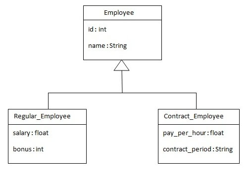
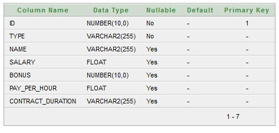
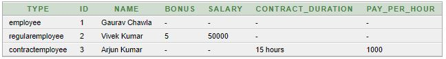
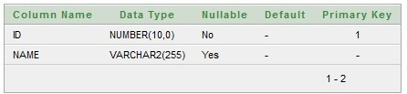
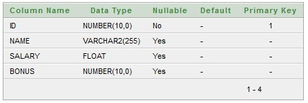
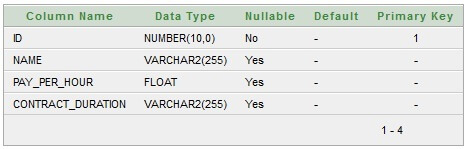
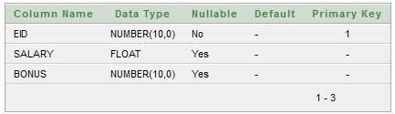
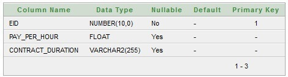
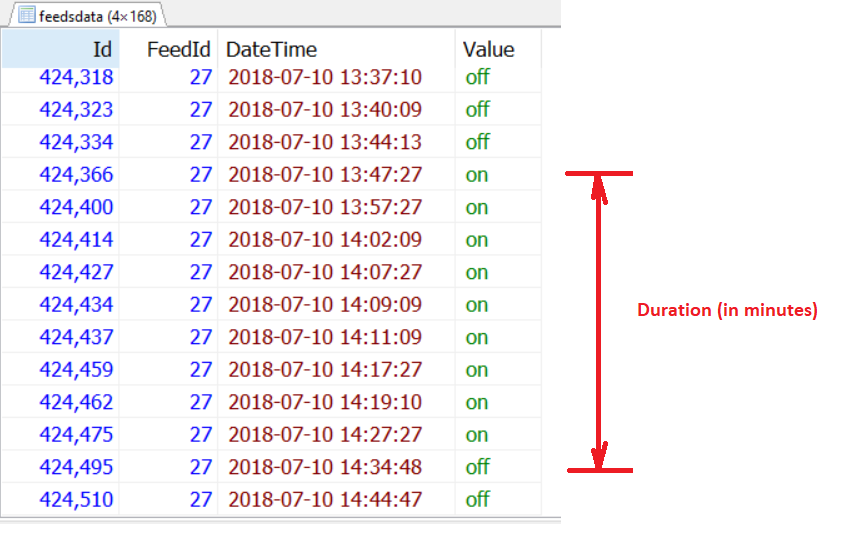

# SQL Query writing Art

- [Better UNION with LIMIT closure](#Better_UNION_with_LIMIT_closure)
- [Swap column's values](#Swap_columns_values)
- [WHERE vs HAVING](#WHERE_HAVING)
- [WITH clause (Common Table Expression)](#WITH_clause_Common_Table_Expression)
- [SELECT from VALUES](#SELECT_from_VALUES)
- [Counter Tables](#Counter_Tables)
- [Email sending queue](#Email_sending_queue)
- [ORDER BY Random](#ORDER_BY_Random)
- [Batch Job and booking System](#Batch_Job_and_booking_System)
- [Table Inheritance Design](#Table_Inheritance_Design)
- [Generate Serial Number](#Generate_Serial_Number)
- [Generate Serial Intervals](#Generate_Serial_Intervals)
- [Interval grouping (histogram)](#Interval_grouping_histogram)
- [Calculating duration between two events](#Calculating_duration_between_two_events)
- [Check overlap of date ranges](#Check_overlap_of_date_ranges)


## <a name='Better_UNION_with_LIMIT_closure'> Better UNION with LIMIT closure </a>

```sql
   ( SELECT ... LIMIT 200 )   -- Note: OFFSET 0, LIMIT 190+10
   UNION DISTINCT -- (or ALL)
   ( SELECT ... LIMIT 200 )
   LIMIT 190, 10              -- Same as originally
```

## <a name='Swap_columns_values'> Swap column's values </a>

```sql
The UPDATE table SET X=Y, Y=X approach obviously doesn't work, as it'll just set both values to Y

# smart solution
UPDATE swaptest SET X=X+Y,Y=X-Y,X=X-Y;
```

## <a name='WHERE_HAVING'> WHERE vs HAVING </a>

```sql
WHERE is used to select data in the original tables being processed.

HAVING is used to filter data in the result set that was produced by the query. This means it can reference aggregate values and aliases in the SELECT clause
```
Difference between the having and where clause in sql is that the where clause can not be used with aggregates, but the having clause can.


## <a name='WITH_clause_Common_Table_Expression'> WITH clause (Common Table Expression) </a>

- you can specify multiple tables
```
-- single table
WITH
   exp1 AS (SELECT ID, FIRST_NAME, LAST_NAME FROM EMPLOYEE)
SELECT * FROM exp;

-- multiple tables
WITH
   exp1 AS (SELECT ID, FIRST_NAME, LAST_NAME FROM EMPLOYEE),
   exp2 AS (SELECT EMAIL, PHONE FROM CONTACT)
SELECT * FROM exp1 JOIN exp2;

-- recursive
WITH RECURSIVE   
odd_num_cte (id, n) AS  
(  
SELECT 1, 1   
union all  
SELECT id+1, n+2 from odd_num_cte where id < 5   
)  
SELECT * FROM odd_num_cte;  

```

## <a name='SELECT_from_VALUES'> SELECT from VALUES </a>

```
SELECT *  from (VALUES ROW(1,2) UNION VALUES ROW(10,15)) tablename(c1, c2);

+----+----+
| c1 | c2 |
+----+----+
|  1 |  2 |
| 10 | 15 |
+----+----+
2 rows in set (0.00 sec)

```


## <a name='Counter_Tables'> Counter Tables </a>

```sql
CREATE TABLE hit_counter (
 slot tinyint unsigned not null primary key,
 cnt int unsigned not null
) ENGINE=InnoDB;

-- Prepopulate the table by adding 100 rows to it. Now the query can just choose a random
slot and update it:

UPDATE hit_counter SET cnt = cnt + 1 WHERE slot = RAND() * 100;

SELECT SUM(cnt) FROM hit_counter;

-- You don’t want to pregenerate rows for this scenario. Instead, you can use ON DUPLICATE
KEY UPDATE:
INSERT INTO daily_hit_counter(day, slot, cnt)
 -> VALUES(CURRENT_DATE, RAND() * 100, 1)
 -> ON DUPLICATE KEY UPDATE cnt = cnt + 1;
 
```

## <a name='Email_sending_queue'> Email sending queue </a>

```sql
CREATE TABLE emails 
(
 id INT NOT NULL PRIMARY KEY AUTO_INCREMENT,
 
 -- columns for the message, from, to, subject, etc.
 -- ...
 
 status ENUM('unsent', 'claimed', 'sent'),  -- we may need 'fail' status
 owner INT UNSIGNED NOT NULL DEFAULT 0,
 ts TIMESTAMP,
 
 KEY (owner, status, ts)
);
```

### Poor solution with table lock (using SELECT ... FOR UPDATE)

```sql
BEGIN;
SELECT id FROM unsent_emails
WHERE owner = 0 AND status = 'unsent'
LIMIT 10 FOR UPDATE;
-- result: 123, 456, 789

UPDATE unsent_emails
SET status = 'claimed', owner = CONNECTION_ID()
WHERE id IN(123, 456, 789);
COMMIT;
```


### Better solution with NO lock

```sql
SET AUTOCOMMIT = 1;
COMMIT;

UPDATE unsent_emails
SET status = 'claimed', owner = CONNECTION_ID()
WHERE owner = 0 AND status = 'unsent'
LIMIT 10;

SET AUTOCOMMIT = 0;

SELECT id FROM unsent_emails
WHERE owner = CONNECTION_ID() AND status = 'claimed';
-- result: 123, 456, 789
```

## <a name='ORDER_BY_Random'> ORDER BY Random </a>

```sql
SELECT * FROM TableName ORDER BY RAND() LIMIT 10;
```
- The MySQL RAND() function produces a random value for every table row.
- After this, the ORDER BY clause helps to sort all the table rows by the random value or number produced by the function RAND() in MySQL.
- Next is the LIMIT clause, which picks the initial table row in a set of results that are ordered randomly.


## <a name='Batch_Job_and_booking_System'> Batch Job and booking System </a>

> Reference: https://dev.mysql.com/blog-archive/mysql-8-0-1-using-skip-locked-and-nowait-to-handle-hot-rows/


```sql
CREATE TABLE seats (
  seat_no INT PRIMARY KEY,
  booked ENUM('YES', 'NO') DEFAULT 'NO'
);
 
# generate 100 sample rows
INSERT INTO seats (seat_no)
WITH RECURSIVE my_cte AS
(
SELECT 1 AS n
UNION ALL
SELECT 1+n FROM my_cte WHERE n<100
)
SELECT * FROM my_cte;

```

If I want a lock on seats 2 to 3, I just need to:

```sql
START TRANSACTION;
SELECT * FROM seats WHERE seat_no BETWEEN 2 AND 3 AND booked = 'NO'
FOR UPDATE SKIP LOCKED;    <-- key point here
```

I can either take them:
```sql
UPDATE seats SET booked = 'YES' WHERE seat_no BETWEEN 2 AND 3
COMMIT;
```


```sql
START TRANSACTION;
SELECT * FROM seats WHERE seat_no IN (3, 4) FOR UPDATE;


SELECT object_name, index_name, lock_type, lock_mode, lock_data
FROM performance_schema.data_locks WHERE object_name = 'seats';

+-------------+------------+-----------+-----------+-----------+
| object_name | index_name | lock_type | lock_mode | lock_data |
+-------------+------------+-----------+-----------+-----------+
| seats       | NULL       | TABLE     | IX        | NULL      |
| seats       | PRIMARY    | RECORD    | X         | 3         |
| seats       | PRIMARY    | RECORD    | X         | 4         |
+-------------+------------+-----------+-----------+-----------+
```

### Lock only the tables you want (using OF)

```sql
DROP TABLE IF EXISTS seats;
CREATE TABLE seat_rows ( row_no INT PRIMARY KEY, cost DECIMAL );
CREATE TABLE seats (
 seat_no INT NOT NULL,
 row_no INT NOT NULL,
 booked ENUM('YES', 'NO') DEFAULT 'NO',
 PRIMARY KEY (seat_no, row_no)
);

# generate 20 stadium rows with 100 seats/row
INSERT INTO seats (seat_no, row_no)
WITH RECURSIVE my_seats AS
(
SELECT 1 AS n
UNION ALL
SELECT 1+n FROM my_seats WHERE n<100
), my_rows AS
(
SELECT 1 AS n
UNION ALL
SELECT 1+n FROM my_rows WHERE n<20
)
SELECT * FROM my_seats, my_rows;

# Add pricing information for rows

INSERT INTO seat_rows (row_no, cost)
WITH RECURSIVE my_rows AS
(
SELECT 1 AS n
UNION ALL
SELECT 1+n FROM my_rows WHERE n<20
)
SELECT n, 100-(n*2) FROM my_rows;


START TRANSACTION;
SELECT seat_no, row_no, cost
FROM seats s JOIN seat_rows sr USING ( row_no )
WHERE seat_no IN ( 3,4 ) AND sr.row_no IN ( 5,6 )
AND booked = 'NO'
FOR UPDATE OF s SKIP LOCKED;     <--- OF s
```


In some cases it may be better for the statement to fail immediately (using NOWAIT)

```sql
START TRANSACTION;

# Attempt to acquire lock, fail immediately
# if not possible 

SELECT seat_no
FROM seats JOIN seat_rows USING ( row_no )
WHERE seat_no IN (3,4) AND seat_rows.row_no IN (12)
AND booked = 'NO'
FOR UPDATE OF seats SKIP LOCKED
FOR SHARE OF seat_rows NOWAIT;
```

Without NOWAIT, this query would have waited for **innodb_lock_wait_timeout** (default: 50) seconds while attempting to acquire the shared lock on seat_rows.  With NOWAIT, it is now instructed to throw an error immediately:
> ERROR 3572 (HY000): Do not wait for lock.


## <a name='Table_Inheritance_Design'> Table Inheritance Design </a>

1) Single table
2) Concrete tables   **Bad design**
3) Joining tables    **the best**



### Method (1) - Single table





### Method (2) - Concrete tables







### Method (2) - Joining tables






## <a name='Generate_Serial_Number'> Generate Serial Number </a>

```sql
WITH RECURSIVE seq AS 
(
    SELECT 0 AS value 
    UNION ALL 
    SELECT value + 1 FROM seq WHERE value < 30
)
SELECT value FROM seq;
```


## <a name='Generate_Serial_Intervals'> Generate Serial Intervals </a>

```sql
WITH RECURSIVE seq AS (
SELECT UNIX_TIMESTAMP('2010-11-16 10:32:22') - (UNIX_TIMESTAMP('2010-11-16 10:32:22') MOD 300) AS value
UNION ALL
SELECT value + 300 FROM seq WHERE value < UNIX_TIMESTAMP('2010-11-16 10:58:08')
)
SELECT FROM_UNIXTIME(value) FROM seq;
```


## <a name='Interval_grouping_histogram'> Interval grouping (histogram) </a>

```
event_time           event_name  count(event_name)
-------------------  ----  -------------
2010-11-16 10:32:22  John  2
2010-11-16 10:35:12  John  7
2010-11-16 10:36:34  John  1
2010-11-16 10:37:45  John  2
2010-11-16 10:48:26  John  8
2010-11-16 10:55:00  John  9
2010-11-16 10:58:08  John  2


event_time           event_name  count(event_name)
-------------------  ----  -------------
2010-11-16 10:30:00  John  2
2010-11-16 10:35:00  John  10
2010-11-16 10:40:00  John  0
2010-11-16 10:45:00  John  8
2010-11-16 10:50:00  John  0
2010-11-16 10:55:00  John  11
```

```sql
CREATE TABLE interval_group_test
(
event_time TIMESTAMP NOT NULL,
event_name VARCHAR(20) NOT NULL,
count INT UNSIGNED NOT NULL DEFAULT '0'
);

INSERT INTO interval_group_test VALUES
('2010-11-16 10:32:22', 'John', 2),
('2010-11-16 10:35:12', 'John', 7),
('2010-11-16 10:36:34', 'John', 1),
('2010-11-16 10:37:45', 'John', 2),
('2010-11-16 10:48:26', 'John', 8),
('2010-11-16 10:55:00', 'John', 9),
('2010-11-16 10:58:08', 'John', 2);
```


```sql
SELECT UNIX_TIMESTAMP(event_time) AS event_times, event_name, SUM(count)
FROM interval_group_test
GROUP BY UNIX_TIMESTAMP(event_time) DIV 300, event_name;

SELECT FROM_UNIXTIME(event_times * 300) AS event_times, event_name, cnt
FROM(
    SELECT UNIX_TIMESTAMP(event_time) DIV 300 AS event_times, event_name, SUM(count) AS cnt
    FROM interval_group_test
    GROUP BY UNIX_TIMESTAMP(event_time) DIV 300, event_name
) as foo;


+---------------------+------------+------+
| event_times         | event_name | cnt  |
+---------------------+------------+------+
| 2010-11-16 10:30:00 | John       |    2 |
| 2010-11-16 10:35:00 | John       |   10 |
| 2010-11-16 10:45:00 | John       |    8 |
| 2010-11-16 10:55:00 | John       |   11 |
+---------------------+------------+------+

```

Hint:
> you can use the technique **Generate Serial Intervals** then join with the above output result set to cover the zero intervals


## <a name='Calculating_duration_between_two_events'> Calculating duration between two events </a>




```sql
CREATE TABLE interval_duration_test
(
event_time TIMESTAMP NOT NULL,
event_status ENUM('ON', 'OFF') NOT NULL
);

INSERT INTO interval_duration_test VALUES
('2018-07-10 13:37:10', 'OFF'),
('2018-07-10 13:40:09', 'OFF'),
('2018-07-10 13:44:13', 'OFF'),
('2018-07-10 13:47:27', 'ON'),
('2018-07-10 13:57:27', 'ON'),
('2018-07-10 14:02:09', 'ON'),
('2018-07-10 14:07:27', 'ON'),
('2018-07-10 14:09:09', 'ON'),
('2018-07-10 14:11:09', 'ON'),
('2018-07-10 14:17:27', 'ON'),
('2018-07-10 14:19:10', 'ON'),
('2018-07-10 14:27:27', 'ON'),
('2018-07-10 14:34:48', 'OFF'),
('2018-07-10 14:44:47', 'OFF');

```


```sql
SELECT SEC_TO_TIME(seconds) AS time_diff,
event_status
FROM
(
    SELECT TIMESTAMPDIFF(SECOND, event_time, LEAD(event_time, 1) OVER(ORDER BY event_time)) AS seconds, event_status
    FROM
    (
        SELECT event_time, event_status
        FROM (
            SELECT event_time, event_status, LAG(event_status, 1) OVER(ORDER BY event_time) as previous_status
            FROM interval_duration_test
        ) foo 
        WHERE previous_status IS NULL OR event_status != previous_status
        UNION ALL
        SELECT MAX(event_time), NULL AS event_status FROM interval_duration_test
    ) AS sub
) bar
WHERE bar.event_status IS NOT NULL;


+-----------+--------------+
| time_diff | event_status |
+-----------+--------------+
| 00:10:17  | OFF          |
| 00:47:21  | ON           |
| 00:09:59  | OFF          |
+-----------+--------------+

```

## <a name='Check_overlap_of_date_ranges'> Check overlap of date ranges </a>

```sql
WHERE new_start < existing_end AND new_end   > existing_start;
```

#### Example:
```sql
CREATE TABLE session (
 id int(11) NOT NULL PRIMARY KEY AUTO_INCREMENT,
 start_date date,
 end_date date
);

INSERT INTO session (start_date, end_date) VALUES
("2010-01-01", "2010-01-10"), 
("2010-01-20", "2010-01-30"), 
("2010-02-01", "2010-02-15");

-- Check 2010-01-05 to 2010-01-25
SELECT *  FROM session
WHERE '2010-01-05' < end_date AND '2010-01-25' > start_date;
```


