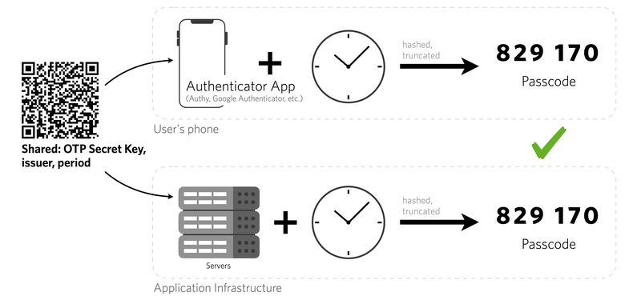

# 2FA - Two Factor Authentication 


- [2FA Introduction](#2FA_Introduction)
- [2FA with Java](#2FA_with_Java)


## <a name='2FA_Introduction'> 2FA Introduction </a>

- It’s a second step in login sequence that asks you to enter 6-digits code sent to you by email, text message or **Google Authenticator** app and this code expires in 20 or 30 seconds or so. 
- Also you need to install Google Authenticator app (or any other authentication app) to your smartphone. It’s totally free and is available on App Store and Play Market. In order to add new entry to Google Authenticator app you need to enter manually a **secret key** or scan a **QR code**.
- Google Authenticator requires **20 bytes secret key** encoded as **base32** string.
- The server saves a random secret code for each user to be used later in generating verification code

#### Common 2F Authentication apps
- Google Authenticator
- Microsoft Authenticator
- Authy
- Duo
- 1password


#### Generating recovery codes for a 2FA

- It is highly recommended to generate **10** recovery codes for each user so that he can use them for loging in case he lost his phone or 2FA app got removed from his device
- The most common format of the recovery code is 10 chars separated by "-" char
- Example:
    - FDG5-FD51F
    - R4JD-OPPOI
    - 65E43-56E60
- You have to prompt the user to save those recovery codes in a save place so that he can use them to recover his account in case he lost his mobile phone
- those recovery code should be saved in the database and linked with the user
- Each recovery code is valid for only one time, IF the use make use of one recovery code, he can't use it again and should show up in UI as strike through  like ~~DS59R-ASFSD~~   
- the user can have an option to re-generate another 10 recovery code if he fells that he runs out of recovery codes
- Take a **Github** as reference for this feature

#### Time-based One time password




Token = HMAC-SHA-1(secret,  (unix_time/30) )

- unix_time in millisecond is divided by 30; that's why the token is valid only for 30 seconds
- secret code: the Authenticator app (like Google Authenticator mobile application) and the server has the same secret as they exchange it when the user setup 2FA
- both **unix_time** and **secret code** is taken as input to Hash function **HMAC-SHA-1** which generates the token

## <a name='2FA_with_Java'> 2FA with Java </a>

#### Required libs

```xml
<dependency>
    <groupId>de.taimos</groupId>
    <artifactId>totp</artifactId>
    <version>1.0</version>
</dependency>

<dependency>
    <groupId>commons-codec</groupId>
    <artifactId>commons-codec</artifactId>
    <version>1.10</version>
</dependency>

<dependency>
    <groupId>com.google.zxing</groupId>
    <artifactId>javase</artifactId>
    <version>3.2.1</version>
</dependency>
```

- **totp** - **The Time-based One-Time Password** algorithm (TOTP) is an extension of the HMAC-based One-time Password algorithm (HOTP) generating a one-time password by instead taking uniqueness from the current time.
- **commons-codec** - for converting inputs to hex and base32.
- **zxing** - library for generating QR codes.


#### Generate Secret key

Google Authenticator requires 20 bytes secret key encoded as base32 string. We need to generate this key using the following code:

```java
public static String generateSecretKey() {
    SecureRandom random = new SecureRandom();
    byte[] bytes = new byte[20];
    random.nextBytes(bytes);
    Base32 base32 = new Base32();
    return base32.encodeToString(bytes);
}
```

Output secret 
```
QDWSM3OYBPGTEESPB5FKVDM3CSMCWHVK
```

Now open your Google Authenticator app. Press ‘plus’ button to add a new entry and select ‘Manual entry’. In the ‘Account’ field enter your email address or any name and in ‘Key’ field paste our secret key. Press save button. You should see your entry in the list with 6-digits code that is changing every 30 seconds.


#### Generate QR Code

Google Authenticator needs to scan a QR code, It requires some special format.

so here is our method to generate this data.
```java
public static String getGoogleAuthenticatorCode(String secretKey, String account, String issuer) {
    try {
        return "otpauth://totp/"
                + URLEncoder.encode(issuer + ":" + account, "UTF-8").replace("+", "%20")
                + "?secret=" + URLEncoder.encode(secretKey, "UTF-8").replace("+", "%20")
                + "&issuer=" + URLEncoder.encode(issuer, "UTF-8").replace("+", "%20");
    } catch (UnsupportedEncodingException e) {
        throw new IllegalStateException(e);
    }
}
```

- **Account** is the user id in system. Usually it’s user’s email or username. It’s used to label entries within Google Authenticator.
- **Issuer** is a company or organization name and is also used for labelling purposes.
- All dynamic values must be URL encoded.
- Google Authenticator doesn’t seem to deal with spaces encoded as plus signs. Encoding spaces as %20 seems to work.


Github Example:
```
otpauth://totp/GitHub:MinaSeddik?secret=EHRTDNJVYMMGJASY&issuer=GitHub
```
Where
- Account = MinaSeddik
- secret = EHRTDNJVYMMGJASY
- issuer = GitHub


Now run the above code with some test account name, issuer name and secret key generated previously
```java
String secretKey = "UIGDQ3OYBPGTEVSPB5FKVDM3CSNCWHVK";
String email = "MinaTest";                        // email or username
String companyName = "My Awesome Company";

String barCodeUrl = getGoogleAuthenticatorCode(secretKey, email, companyName);

System.out.println(barCodeUrl);
```

Output:
```
otpauth://totp/Awesome%20Company%3AMinaTest?secret=UIGDQ3OYBPGTEVSPB5FKVDM3CSNCWHVK&issuer=Awesome%20Company
```

Last step is to generate the QR code:

```java
public static void generateQRCode(String barCodeData, String filePath, int height, int width) throws WriterException, IOException {
    BitMatrix matrix = new MultiFormatWriter().encode(barCodeData, BarcodeFormat.QR_CODE, width, height);

    try (FileOutputStream out = new FileOutputStream(filePath)) {
        MatrixToImageWriter.writeToStream(matrix, "png", out);
    }

}
```


#### Testing

We can simulate user’ login into the system. Let’s imagine that user entered his credentials and now he need to enter 2FA code from Google Authenticator. Here is the easiest code snippet:

```java
Scanner scanner = new Scanner(System.in);
String code = scanner.nextLine();
if (code.equals(getTOTPCode(secretKey))) {
    System.out.println("Logged in successfully");
} else {
    System.out.println("Invalid 2FA Code");
}
```


#### Using Google Authenticator OR Sending SMS

- Once the end-user want to setup a 2FA, we will create an specific **secret** for him and save it in the database record relating to this user
- the user can choose the 2FA method
    - Set up using an app
    - Set up using SMS (Need to register a phone number)
- In case of he choose to use SMS, we will use the secret to this user to generate the OTP and send to the registered phone number 
- You can see Github flow for better understanding


