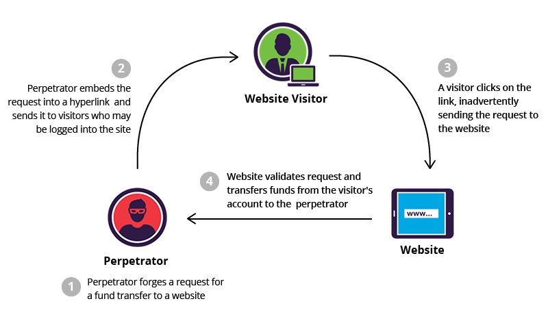

# Cross-Site Request Forgery (CSRF)


- [What is Cross-Site Request Forgery (CSRF) ?](#Cross_Site_Request_Forgery)
- [CSRF protection](#CSRF_protection)
- [Spring MVC Application Protection](#Spring_MVC_Application_Protection)
- [Stateless Spring API](#Stateless_Spring_API)
- [Spring CRF test](#Spring_CRF_test)


## <a name='Cross_Site_Request_Forgery'> What is Cross-Site Request Forgery (CSRF) ? </a>




#### Does every web request send the browser's cookies?

Yes, as long as the URL requested is within the same domain and path defined in the cookie (and all of the other restrictions -- secure, httponly, not expired, etc) hold, then the cookie will be sent for every request.

The server sends the following in its response header to set a cookie field.
> Set-Cookie:name=value

Example:
> **Set-Cookie:name=value[; expires=date][; domain=domain][; path=path][; secure][; HttpOnly]**

OR 

> **Set-Cookie:JSESSION=HFGSJKDFFG78DSF976FD;expires=Wed, 21 Oct 2015 07:28:00 GMT;domain=google.com**

If there is a cookie set, then the browser sends the following in its request header.
> Cookie:name=value

Example:
> **Cookie:JSESSION=HFGSJKDFFG78DSF976FD;domain=google.com**


#### Cross-Site Request Forgery Attack Flow


1. the attacker inject a form to the victim browser
2. All the fields in the form is hidden and have a value by default
3. this form has counterpart button labeled "win iphone" and it actually sends a submit request to the website (say, bank website)
4. since the browser send the cookie to the specified domain of the form and this cookie contains the sessionId of the victim, then the web-site will validates the request and take action as it is the real user


## <a name='CSRF_protection'> CSRF protection </a>

#### Using Anti CSRF tokens
- The Fix is **Anti CSRF tokens** which is randomly generated by the web application and sent to the web site
- The web application form add extra hidden field to the form for CSFR randomly generated token for each request
- The application will check it to match with the previously generated token

#### Using JWT as protection
**The Bearer Tokens are the best defense against CSRF attack**, since It is sent via an **Authorization** Header

As a result, If you only use authentication via Bearer tokens and not via cookies, then there is no concern of CSRF vulnerability, and no extra steps are required for security.

#### Full Scenario in simple words

- Cross-Site Request Forgery (CSRF) in simple words
    - Assume you are currently logged into your online banking at `www.mybank.com`
    - Assume a money transfer from `mybank.com` will result in a request of (conceptually) the form `http://www.mybank.com/transfer?to=<SomeAccountnumber>;amount=<SomeAmount>`. (Your account number is not needed, because it is implied by your login.)
    - You visit `www.cute-cat-pictures.org`, not knowing that it is a malicious site.
    - If the owner of that site knows the form of the above request (easy!) and correctly guesses you are logged into `mybank.com` (requires some luck!), they could include on their page a request like `http://www.mybank.com/transfer?to=123456;amount=10000` (where `123456` is the number of their Cayman Islands account and `10000` is an amount that you previously thought you were glad to possess).
    - You retrieved that `www.cute-cat-pictures.org` page, so your browser will make that request.
    - Your bank cannot recognize this origin of the request: Your web browser will send the request along with your `www.mybank.com` cookie and it will look perfectly legitimate. There goes your money!

This is the world **without CSRF tokens**.

Now for the better one **with CSRF tokens**:

- The transfer request is extended with a third argument: `http://www.mybank.com/transfer?to=123456;amount=10000;token=31415926535897932384626433832795028841971`.
- That token is a huge, impossible-to-guess random number that `mybank.com` will include on their own web page when they serve it to you. It is different each time they serve any page to anybody.
- The attacker is not able to guess the token, is not able to convince your web browser to surrender it (if the browser works correctly...), and so the attacker will not be able to create a valid request, because requests with the wrong token (or no token) will be refused by `www.mybank.com`.


## <a name='Spring_MVC_Application_Protection'> Spring MVC Application Protection </a>

**To protect MVC applications, Spring adds a CSRF token to each generated view. This token must be submitted to the server on every HTTP request that modifies state (PATCH, POST, PUT and DELETE — not GET).** This protects our application against CSRF attacks since an attacker can't get this token from their own page.

#### Spring Security Configuration

- Starting from Spring Security 4.x, the CSRF protection is enabled by default.
- This default configuration adds the CSRF token to the HttpServletRequest attribute named **_csrf**.
- If we need to, we can disable this configuration:
```java
@Override
protected void configure(HttpSecurity http) throws Exception {
    http
      .csrf().disable();
}
```

#### Client Configuration

- we need to include the CSRF token in our requests.
- The **_csrf** attribute contains the following information:
    - **token** – the CSRF token value
    - **parameterName** – name of the HTML form parameter, which must include the token value
    - **headerName** – name of the HTTP header, which must include the token value

- If our views use HTML forms, we'll use the parameterName and token values to add a hidden input:
```html
<input type="hidden" name="${_csrf.parameterName}" value="${_csrf.token}"/>
```

- If our views use JSON, we need to use the headerName and token values to add an HTTP header.
    - We'll first need to include the token value and the header name in meta tags:
    ```html
        <meta name="_csrf" content="${_csrf.token}"/>
        <meta name="_csrf_header" content="${_csrf.headerName}"/>
    ```
    - Then let's retrieve the meta tag values with JQuery:
    ```html
        var token = $("meta[name='_csrf']").attr("content");
        var header = $("meta[name='_csrf_header']").attr("content");
    ```
    - Finally, let's use these values to set our XHR header:
    ```js
      $(document).ajaxSend(function(e, xhr, options) {
          xhr.setRequestHeader(header, token);
      });
    ```


## <a name='Stateless_Spring_API'> Stateless Spring API </a>

- **If our stateless API uses token-based authentication, such as JWT, we don't need CSRF protection, and we must disable it as we saw earlier.**
- **However, if our stateless API uses a session cookie authentication, we need to enable CSRF protection as we'll see next.**

#### Back-end Configuration

- Our stateless API can't add the CSRF token like our MVC configuration because it doesn't generate any HTML view.
- In that case, we can send the CSRF token in a cookie using CookieCsrfTokenRepository:
```java
@Configuration
public class SpringSecurityConfiguration extends WebSecurityConfigurerAdapter {
    @Override
    public void configure(HttpSecurity http) throws {
        http
          .csrf()
          .csrfTokenRepository(CookieCsrfTokenRepository.withHttpOnlyFalse());
    }
}
```
This configuration will set a XSRF-TOKEN cookie to the front end. Because we set the HTTP-only flag to false, the front end will be able to retrieve this cookie using JavaScript.

#### Front-end Configuration

With JavaScript, we need to search the XSRF-TOKEN cookie value from the document.cookie list.

As this list is stored as a string, we can retrieve it using this regex:
```js
const csrfToken = document.cookie.replace(/(?:(?:^|.*;\s*)XSRF-TOKEN\s*\=\s*([^;]*).*$)|^.*$/, '$1');
```

Then we must send the token to every REST request that modifies the API state: POST, PUT, DELETE and PATCH.

**Spring expects to receive it in the X-XSRF-TOKEN header.**

We can simply set it with the JavaScript Fetch API:
```js
fetch(url, {
  method: 'POST',
  body: /* data to send */,
  headers: { 'X-XSRF-TOKEN': csrfToken },
})
```


## <a name='Spring_CRF_test'> Spring CRF test </a>

#### CSRF Disabled Test
Let's first try to submit a simple POST request when CSRF is disabled:

```java
@ContextConfiguration(classes = { SecurityWithoutCsrfConfig.class, ...})
public class CsrfDisabledIntegrationTest extends CsrfAbstractIntegrationTest {

    @Test
    public void givenNotAuth_whenAddFoo_thenUnauthorized() throws Exception {
        mvc.perform(
          post("/foos").contentType(MediaType.APPLICATION_JSON)
            .content(createFoo())
          ).andExpect(status().isUnauthorized());
    }

    @Test 
    public void givenAuth_whenAddFoo_thenCreated() throws Exception {
        mvc.perform(
          post("/foos").contentType(MediaType.APPLICATION_JSON)
            .content(createFoo())
            .with(testUser())
        ).andExpect(status().isCreated()); 
    } 
}
```

Here we're using a base class to hold the common testing helper logic — the CsrfAbstractIntegrationTest:

```java
@RunWith(SpringJUnit4ClassRunner.class)
@WebAppConfiguration
public class CsrfAbstractIntegrationTest {
    
    @Autowired
    private WebApplicationContext context;

    @Autowired
    private Filter springSecurityFilterChain;

    protected MockMvc mvc;

    @Before
    public void setup() {
        mvc = MockMvcBuilders.webAppContextSetup(context)
          .addFilters(springSecurityFilterChain)
          .build();
    }

    protected RequestPostProcessor testUser() {
        return user("user").password("userPass").roles("USER");
    }

    protected String createFoo() throws JsonProcessingException {
        return new ObjectMapper().writeValueAsString(new Foo(randomAlphabetic(6)));
    }
}
```

We should note that the request was successfully executed when the user had the right security credentials — no extra information was required.


#### CSRF Enabled  Test

Now let's enable CSRF protection and see the difference:
```java
@ContextConfiguration(classes = { SecurityWithCsrfConfig.class, ...})
public class CsrfEnabledIntegrationTest extends CsrfAbstractIntegrationTest {

    @Test
    public void givenNoCsrf_whenAddFoo_thenForbidden() throws Exception {
        mvc.perform(
          post("/foos").contentType(MediaType.APPLICATION_JSON)
            .content(createFoo())
            .with(testUser())
          ).andExpect(status().isForbidden());
    }

    @Test
    public void givenCsrf_whenAddFoo_thenCreated() throws Exception {
        mvc.perform(
          post("/foos").contentType(MediaType.APPLICATION_JSON)
            .content(createFoo())
            .with(testUser()).with(csrf())
          ).andExpect(status().isCreated());
    }
}
```

We can see how this test is using a different security configuration — one that has the CSRF protection enabled.

Now the POST request will simply fail if the CSRF token isn't included, which of course means that the earlier attacks are no longer an option.

Furthermore, the **csrf()** method in the test creates a RequestPostProcessor that automatically populates a valid CSRF token in the request for testing purposes.

