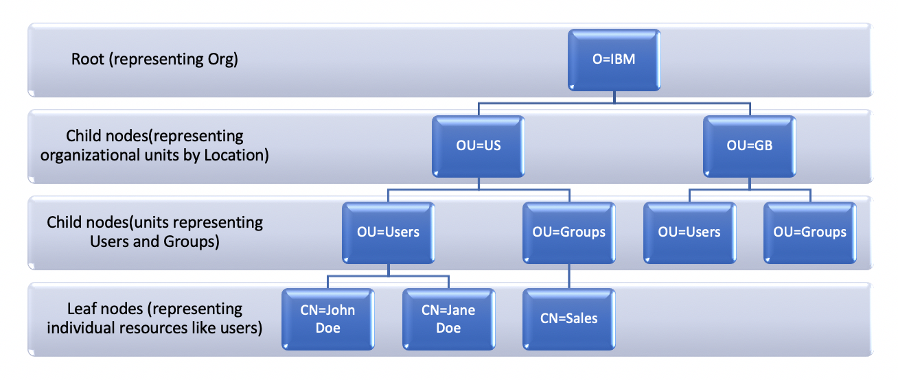

# LDAP - Lightweight Directory Access Protocol


- [Introduction to LDAP](#Introduction_to_LDAP)
- [LDAP with Java](#LDAP_with_Java)
- [LDAP with Spring](#LDAP_with_Spring)


## <a name='Introduction_to_LDAP'> Introduction to LDAP </a>

- LDAP is Lightweight Directory Access Protocol. 
- LDAP is a global directory service **protocol** 


- LDAP is based on client-server model and runs on a layer above the TCP/IP stack. 
- LDAP provides a facility to connect to, access, modify, and search the internet directory.
- LDAP servers contain information which is organized in the form of a **directory tree**.



##### LDAP Servers
- Openldap
- Apache ldap directory stodio
- Window server ldap


#### LDAP directory tree structure


- LDAP Entity types
    - **DC** = Domain Component
    - **OU** = Organizational Unit
    - **CN** = Common Name

These are all parts of the X.500 Directory Specification, which defines nodes in a LDAP directory.

##### What is DN ?!
- **DN** (Distinguished Name) is a sequence of relative distinguished names (RDN) connected by commas
- DN Example
    ```
    CN=Karen Berge,CN=admin,DC=corp,DC=Fabrikam,DC=COM
    ```


#### Example

```
("CN=Dev-India,OU=Distribution Groups,DC=gp,DC=gl,DC=google,DC=com");
```

- You read it from right to left,
- From the `com` Domain Component, find the `google` Domain Component, and then inside it the `gl` Domain Component and then inside it the `gp` Domain Component.
- In the `gp` Domain Component, find the Organizational Unit called `Distribution Groups` and then find the object that has a common name of `Dev-India`


- the following paths represent **DN**s (and their value depends on what you want to get after the query is run):
    - "DC=gp,DC=gl,DC=google,DC=com"
    - "OU=Distribution Groups,DC=gp,DC=gl,DC=google,DC=com"
    - "OU=People,DC=gp,DC=gl,DC=google,DC=com"
    - "OU=Groups,DC=gp,DC=gl,DC=google,DC=com"
    - "CN=QA-Romania,OU=Distribution Groups,DC=gp,DC=gl,DC=google,DC=com"
    - "CN=Dev-India,OU=Distribution Groups,DC=gp,DC=gl,DC=google,DC=com"
    - "CN=Diana Anton,OU=People,DC=gp,DC=gl,DC=google,DC=com"


#### Entity Attributes

- Attributes :   
Attributes hold the data for an entry. Each attribute has an attribute type, zero or more attribute options, and a set of values that comprise the actual data

- Object Classes :   
Object classes are schema elements that specify collections of attribute types that may be related to a particular type of object, process, or other entity. 


Examples:
- **InetOrgPerson** is ObjectClass Types often set for a **user** entity, It is useful when we want to lookup people in ActiveDirectory

- **UniqueMember** is a LDAP Group attribute, It is useful when we want to add a user to a group, A group can have multiple It is useful when we want to lookup people in ActiveDirectory attributes (entry pwe each user)
    - The value of this attribute is the **DN** of the user
    - example:
    ```
        UniqueMember = CN=Karen Berge,CN=admin,DC=corp,DC=Fabrikam,DC=COM
    ```

- When you plan to authenticate user via ldap, Make sure that you retrieve 
1. uid (user_id): the unique identifier of a user
2. email: make sure that the email is unique across all users
3. cn: this is NOT a unique value so we can't depend on for user identity
4. user_name
5. full_name
6. user_password: you have to know the hashing algorithm of the password for verification
7. is_active
8. subscribed groups of the user

Simply you can iterate on all attributes of any user to know all the available data attributes


#### LDAP Search Filters

- Search user with username = "ianderson"
```
(uid=ianderson)
```

- ANDing
```
(&(uid=ianderson)(sn:caseExactMatch:=Anderson))
```

- ORing
```
(|(uid=user)(objectClass=inetOrgPerson))
```

- NEGATION (not)
```
(!(title:dn:caseExactMatch:=Thick as a Brick))
```

##### Filter Assertions
For general information about the ldapsearch tool, see “LDAP: Using ldapsearch”.

- equality: (objectClass=inetOrgPerson)
- presence: (objectClass=*)
- substring: (mail=ma*@example.com)
- greater than: (employeeNumber>=5) but see syntax and matching rules below
- less than: (employeeNumber<=5) but see syntax and matching rules below
- approx: (uid~=ianderson)
- extensible match: (uid:caseExactMatch:=UsEr.0)


## <a name='LDAP_with_Java'> LDAP with Java </a>

#### Get all attributes


- Connect to LDAP server
```java
public class DirectoryUtil {
 private final static String FACTORY = "com.sun.jndi.ldap.LdapCtxFactory";
 private final static String PROVIDER_URL = "ldap://localhost:10389";
 private static final Properties properties = new Properties();

 static {
  initProperties();
 }

 private static void initProperties() {
  properties.put(Context.INITIAL_CONTEXT_FACTORY, FACTORY);
  properties.put(Context.PROVIDER_URL, PROVIDER_URL);
  properties.put("com.sun.jndi.ldap.connect.pool", "true");
 }

 public static DirContext getContext() throws NamingException {
  DirContext context = new InitialDirContext(properties);
  return context;
 }
}
```

```java
public class Test {

 static void printAttrs(Attributes attrs) throws NamingException {
  if (Objects.isNull(attrs)) {
   return;
  }

  NamingEnumeration<?> attributes = attrs.getAll();

  while (attributes.hasMoreElements()) {
   Attribute attr = (Attribute) attributes.next();
   String id = attr.getID();

   System.out.println("attribute : " + id);
   NamingEnumeration<?> values = attr.getAll();
   while (values.hasMoreElements()) {
    System.out.println("Value " + values.next());
   }

  }

 }

 public static void main(String[] args) throws NamingException {
  DirContext context = DirectoryUtil.getContext();
  Attributes attributes = context
    .getAttributes("cn=Krishna,ou=people,dc=example,dc=com");
  printAttrs(attributes);
  context.close();
 }
}
```


#### Java Full Example
- List all users
- Add user
- Add user to a group
- Remove user from a group
- Search user
- Delete user
- Update user password

```java
public class App {

	DirContext connection;

	/* create connection during object creation */
	public void newConnection() {
		Properties env = new Properties();
		env.put(Context.INITIAL_CONTEXT_FACTORY, "com.sun.jndi.ldap.LdapCtxFactory");
		env.put(Context.PROVIDER_URL, "ldap://localhost:10389");
    
        // LDAP requires the DN to authenticate the user
		env.put(Context.SECURITY_PRINCIPAL, "uid=admin, ou=system"); 
		env.put(Context.SECURITY_CREDENTIALS, "secret");


		try {
			connection = new InitialDirContext(env);
			System.out.println("Hello World!" + connection);
		} catch (AuthenticationException ex) {
			System.out.println(ex.getMessage());
		} catch (NamingException e) {
			// TODO Auto-generated catch block
			e.printStackTrace();
		}
	}

	public void getAllUsers() throws NamingException {
		String searchFilter = "(objectClass=inetOrgPerson)";
		String[] reqAtt = { "cn", "sn" };
		SearchControls controls = new SearchControls();
		controls.setSearchScope(SearchControls.SUBTREE_SCOPE);
		controls.setReturningAttributes(reqAtt);

		NamingEnumeration users = connection.search("ou=users,ou=system", searchFilter, controls);

		SearchResult result = null;
		while (users.hasMore()) {
			result = (SearchResult) users.next();
			Attributes attr = result.getAttributes();
			String name = attr.get("cn").get(0).toString();
			//deleteUserFromGroup(name,"Administrators");
			System.out.println(attr.get("cn"));
			System.out.println(attr.get("sn"));
		}

	}

	public void addUser() {
		Attributes attributes = new BasicAttributes();
		Attribute attribute = new BasicAttribute("objectClass");
		attribute.add("inetOrgPerson");

		attributes.put(attribute);
		// user details
		attributes.put("sn", "Ricky");
		try {
			connection.createSubcontext("cn=Tommy,ou=users,ou=system", attributes);
			System.out.println("success");
		} catch (NamingException e) {
			// TODO Auto-generated catch block
			e.printStackTrace();
		}

	}

	public void addUserToGroup(String username, String groupName)
	{
		ModificationItem[] mods = new ModificationItem[1];
		Attribute attribute = new BasicAttribute("uniqueMember","cn="+username+",ou=users,ou=system");
		mods[0] = new ModificationItem(DirContext.ADD_ATTRIBUTE, attribute);
		try {
			connection.modifyAttributes("cn="+groupName+",ou=groups,ou=system", mods);
			System.out.println("success");
		} catch (NamingException e) {
			// TODO Auto-generated catch block
			e.printStackTrace();
		}
		
	}
	public void deleteUser()
	{
		try {
			connection.destroySubcontext("cn=Tommy,ou=users,ou=system");
			System.out.println("success");
		} catch (NamingException e) {
			// TODO Auto-generated catch block
			e.printStackTrace();
		}
	}
	
	public void deleteUserFromGroup(String username, String groupName)
	{
		ModificationItem[] mods = new ModificationItem[1];
		Attribute attribute = new BasicAttribute("uniqueMember","cn="+username+",ou=users,ou=system");
		mods[0] = new ModificationItem(DirContext.REMOVE_ATTRIBUTE, attribute);
		try {
			connection.modifyAttributes("cn="+groupName+",ou=groups,ou=system", mods);
			System.out.println("success");
		} catch (NamingException e) {
			// TODO Auto-generated catch block
			e.printStackTrace();
		}
		
	}

	public void searchUsers() throws NamingException {
		//String searchFilter = "(uid=1)"; //  for one user
		//String searchFilter = "(&(uid=1)(cn=Smith))"; // and condition 
		String searchFilter = "(|(uid=1)(uid=2)(cn=Smith))"; // or condition
		String[] reqAtt = { "cn", "sn","uid" };
		SearchControls controls = new SearchControls();
		controls.setSearchScope(SearchControls.SUBTREE_SCOPE);
		controls.setReturningAttributes(reqAtt);

		NamingEnumeration users = connection.search("ou=users,ou=system", searchFilter, controls);

		SearchResult result = null;
		while (users.hasMore()) {
			result = (SearchResult) users.next();
			Attributes attr = result.getAttributes();
			String name = attr.get("cn").get(0).toString();
			//deleteUserFromGroup(name,"Administrators");
			System.out.println(attr.get("cn"));
			System.out.println(attr.get("sn"));
			System.out.println(attr.get("uid"));
		}

	}
	
	/* use this to authenticate any existing user */
	public static boolean authUser(String username, String password)
	{
		try {
			Properties env = new Properties();
			env.put(Context.INITIAL_CONTEXT_FACTORY, "com.sun.jndi.ldap.LdapCtxFactory");
			env.put(Context.PROVIDER_URL, "ldap://localhost:10389");
			env.put(Context.SECURITY_PRINCIPAL, "cn="+username+",ou=users,ou=system");  //check the DN correctly
			env.put(Context.SECURITY_CREDENTIALS, password);
			DirContext con = new InitialDirContext(env);
			System.out.println("success");
			con.close();
			return true;
		}catch (Exception e) {
			System.out.println("failed: "+e.getMessage());
			return false;
		}
	}
	
	/* use this to update user password */
	public void updateUserPassword(String username, String password) {
		try {
			String dnBase=",ou=users,ou=system";
			ModificationItem[] mods= new ModificationItem[1];
			mods[0] = new ModificationItem(DirContext.REPLACE_ATTRIBUTE, new BasicAttribute("userPassword", password));// if you want, then you can delete the old password and after that you can replace with new password 
			connection.modifyAttributes("cn="+username +dnBase, mods);//try to form DN dynamically
			System.out.println("success");
		}catch (Exception e) {
			System.out.println("failed: "+e.getMessage());
		}
	}
	
	public static void main(String[] args) throws NamingException {

		 App app = new App();
		// app.newConnection();
		// app.addUser();
		// app.getAllUsers();
		// app.deleteUser();
		// app.searchUsers();
		 
		//System.out.println(authUser("test","1574"));
		 app.updateUserPassword("test", "123");
		  
	}
}
```

#### testing
we'll use the embedded version of the **ApacheDS** directory server. This is an LDAP server built using Java and designed to run in embedded mode within unit tests.
```xml
<dependency>
    <groupId>org.apache.directory.server</groupId>
    <artifactId>apacheds-test-framework</artifactId>
    <version>2.0.0.AM26</version>
    <scope>test</scope>
</dependency>
```


Usage example:
```xml
package com.baeldung.jndi.ldap.auth;

import static org.assertj.core.api.Assertions.assertThat;
import static org.assertj.core.api.Assertions.assertThatCode;
import static org.assertj.core.api.Assertions.assertThatExceptionOfType;

import java.util.Hashtable;

import javax.naming.AuthenticationException;
import javax.naming.Context;
import javax.naming.NamingEnumeration;
import javax.naming.directory.Attributes;
import javax.naming.directory.DirContext;
import javax.naming.directory.InitialDirContext;
import javax.naming.directory.SearchControls;
import javax.naming.directory.SearchResult;

import org.apache.directory.server.annotations.CreateLdapServer;
import org.apache.directory.server.annotations.CreateTransport;
import org.apache.directory.server.core.annotations.ApplyLdifFiles;
import org.apache.directory.server.core.annotations.CreateDS;
import org.apache.directory.server.core.annotations.CreatePartition;
import org.apache.directory.server.core.integ.AbstractLdapTestUnit;
import org.apache.directory.server.core.integ.FrameworkRunner;
import org.junit.Test;
import org.junit.runner.RunWith;

@RunWith(FrameworkRunner.class)
@CreateLdapServer(transports = { @CreateTransport(protocol = "LDAP", address = "localhost", port = 10390)})
@CreateDS(
  allowAnonAccess = false, partitions = {@CreatePartition(name = "TestPartition", suffix = "dc=baeldung,dc=com")})
@ApplyLdifFiles({"users.ldif"})
// class marked as manual test, as it has to run independently from the other unit tests in the module
public class JndiLdapAuthManualTest extends AbstractLdapTestUnit {
    
    private static void authenticateUser(Hashtable<String, String> environment) throws Exception {
        DirContext context = new InitialDirContext(environment);   
        context.close();       
    }

    @Test
    public void givenPreloadedLDAPUserJoe_whenAuthUserWithCorrectPW_thenAuthSucceeds() throws Exception {
        
        Hashtable<String, String> environment = new Hashtable<String, String>();
        environment.put(Context.INITIAL_CONTEXT_FACTORY, "com.sun.jndi.ldap.LdapCtxFactory");
        environment.put(Context.PROVIDER_URL, "ldap://localhost:10390");
        environment.put(Context.SECURITY_AUTHENTICATION, "simple");
        
        environment.put(Context.SECURITY_PRINCIPAL, "cn=Joe Simms,ou=Users,dc=baeldung,dc=com");
        environment.put(Context.SECURITY_CREDENTIALS, "12345");
        
        assertThatCode(() -> authenticateUser(environment)).doesNotThrowAnyException();
    }
    
    @Test
    public void givenPreloadedLDAPUserJoe_whenAuthUserWithWrongPW_thenAuthFails() throws Exception {
        
        Hashtable<String, String> environment = new Hashtable<String, String>();
        environment.put(Context.INITIAL_CONTEXT_FACTORY, "com.sun.jndi.ldap.LdapCtxFactory");
        environment.put(Context.PROVIDER_URL, "ldap://localhost:10390");
        environment.put(Context.SECURITY_AUTHENTICATION, "simple");
        
        environment.put(Context.SECURITY_PRINCIPAL, "cn=Joe Simms,ou=Users,dc=baeldung,dc=com");
        environment.put(Context.SECURITY_CREDENTIALS, "wronguserpw");
        
        assertThatExceptionOfType(AuthenticationException.class).isThrownBy(() -> authenticateUser(environment));
    }
    
    @Test
    public void givenPreloadedLDAPUserJoe_whenSearchAndAuthUserWithCorrectPW_thenAuthSucceeds() throws Exception {
        
        // first authenticate against LDAP as admin to search up DN of user : Joe Simms
        
        Hashtable<String, String> environment = new Hashtable<String, String>();
        environment.put(Context.INITIAL_CONTEXT_FACTORY, "com.sun.jndi.ldap.LdapCtxFactory");
        environment.put(Context.PROVIDER_URL, "ldap://localhost:10390");
        environment.put(Context.SECURITY_AUTHENTICATION, "simple");        
        environment.put(Context.SECURITY_PRINCIPAL, "uid=admin,ou=system");
        environment.put(Context.SECURITY_CREDENTIALS, "secret");
        
        DirContext adminContext = new InitialDirContext(environment);
        
        // define the search filter to find the person with CN : Joe Simms
        String filter = "(&(objectClass=person)(cn=Joe Simms))";

        // declare the attributes we want returned for the object being searched
        String[] attrIDs = { "cn" };

        // define the search controls
        SearchControls searchControls = new SearchControls();
        searchControls.setReturningAttributes(attrIDs);
        searchControls.setSearchScope(SearchControls.SUBTREE_SCOPE);
        
        // search for User with filter cn=Joe Simms
        NamingEnumeration<SearchResult> searchResults = adminContext.search("dc=baeldung,dc=com", filter, searchControls);
        if (searchResults.hasMore()) {
            
            SearchResult result = (SearchResult) searchResults.next();
            Attributes attrs = result.getAttributes();
            
            String distinguishedName = result.getNameInNamespace();
            assertThat(distinguishedName).isEqualTo("cn=Joe Simms,ou=Users,dc=baeldung,dc=com");
            
            String commonName = attrs.get("cn").toString();
            assertThat(commonName).isEqualTo("cn: Joe Simms");
            
            // authenticate new context with DN for user Joe Simms, using correct password
        
            environment.put(Context.SECURITY_PRINCIPAL, distinguishedName);
            environment.put(Context.SECURITY_CREDENTIALS, "12345");
            
            assertThatCode(() -> authenticateUser(environment)).doesNotThrowAnyException();
        }
        
        adminContext.close();               
    }    
    
    @Test
    public void givenPreloadedLDAPUserJoe_whenSearchAndAuthUserWithWrongPW_thenAuthFails() throws Exception {
        
        // first authenticate against LDAP as admin to search up DN of user : Joe Simms
        
        Hashtable<String, String> environment = new Hashtable<String, String>();
        environment.put(Context.INITIAL_CONTEXT_FACTORY, "com.sun.jndi.ldap.LdapCtxFactory");
        environment.put(Context.PROVIDER_URL, "ldap://localhost:10390");
        environment.put(Context.SECURITY_AUTHENTICATION, "simple");
        environment.put(Context.SECURITY_PRINCIPAL, "uid=admin,ou=system");
        environment.put(Context.SECURITY_CREDENTIALS, "secret");
        DirContext adminContext = new InitialDirContext(environment);
        
        // define the search filter to find the person with CN : Joe Simms
        String filter = "(&(objectClass=person)(cn=Joe Simms))";

        // declare the attributes we want returned for the object being searched
        String[] attrIDs = { "cn" };

        // define the search controls
        SearchControls searchControls = new SearchControls();
        searchControls.setReturningAttributes(attrIDs);
        searchControls.setSearchScope(SearchControls.SUBTREE_SCOPE);
        
        // search for User with filter cn=Joe Simms
        NamingEnumeration<SearchResult> searchResults = adminContext.search("dc=baeldung,dc=com", filter, searchControls);
        if (searchResults.hasMore()) {
            
            SearchResult result = (SearchResult) searchResults.next();
            Attributes attrs = result.getAttributes();
            
            String distinguishedName = result.getNameInNamespace();
            assertThat(distinguishedName).isEqualTo("cn=Joe Simms,ou=Users,dc=baeldung,dc=com");

            String commonName = attrs.get("cn").toString();
            assertThat(commonName).isEqualTo("cn: Joe Simms");
            
            // authenticate new context with DN for user Joe Simms, using wrong password
        
            environment.put(Context.SECURITY_PRINCIPAL, distinguishedName);
            environment.put(Context.SECURITY_CREDENTIALS, "wronguserpassword");
            
            assertThatExceptionOfType(AuthenticationException.class).isThrownBy(() -> authenticateUser(environment));
        }
        
        adminContext.close();               
    }
}
```


Add "users.ldif" to the classpath

```
version: 1
dn: dc=baeldung,dc=com
objectClass: domain
objectClass: top
dc: baeldung

dn: ou=Users,dc=baeldung,dc=com
objectClass: organizationalUnit
objectClass: top
ou: Users

dn: cn=Joe Simms,ou=Users,dc=baeldung,dc=com
objectClass: inetOrgPerson
objectClass: organizationalPerson
objectClass: person
objectClass: top
cn: Joe Simms
sn: Simms
uid: user1
userPassword: 12345
```


#### Authenticating the User

```java
Hashtable<String, String> environment = new Hashtable<String, String>();

environment.put(Context.INITIAL_CONTEXT_FACTORY, "com.sun.jndi.ldap.LdapCtxFactory");
environment.put(Context.PROVIDER_URL, "ldap://localhost:10389");
environment.put(Context.SECURITY_AUTHENTICATION, "simple");
environment.put(Context.SECURITY_PRINCIPAL, "cn=Joe Simms,ou=Users,dc=baeldung,dc=com");
environment.put(Context.SECURITY_CREDENTIALS, "12345");
```


```java
DirContext context = new InitialDirContext(environment);
context.close()
```

Valid authentication
```java
assertThatCode(() -> authenticateUser(environment)).doesNotThrowAnyException();
```


Handling User Authentication Failure

```java
environment.put(Context.SECURITY_CREDENTIALS, "wrongpassword");

// .....

assertThatExceptionOfType(AuthenticationException.class).isThrownBy(() -> authenticateUser(environment));
```

#### Looking up the User’s DN as Administrator

```java
String filter = "(&(objectClass=person)(cn=Joe Simms))";

// ...

String[] attrIDs = { "cn" };
SearchControls searchControls = new SearchControls();
searchControls.setReturningAttributes(attrIDs);
searchControls.setSearchScope(SearchControls.SUBTREE_SCOPE);

// ...

NamingEnumeration<SearchResult> searchResults = adminContext.search("dc=baeldung,dc=com", filter, searchControls);
  
String commonName = null;
String distinguishedName = null;
if (searchResults.hasMore()) {
    
    SearchResult result = (SearchResult) searchResults.next();
    Attributes attrs = result.getAttributes();
    
    distinguishedName = result.getNameInNamespace();
    assertThat(distinguishedName, isEqualTo("cn=Joe Simms,ou=Users,dc=baeldung,dc=com")));

    commonName = attrs.get("cn").toString();
    assertThat(commonName, isEqualTo("cn: Joe Simms")));
}

// ...

// Authenticating with the User’s Looked up DN
environment.put(Context.SECURITY_PRINCIPAL, distinguishedName);
environment.put(Context.SECURITY_CREDENTIALS, "12345");

// ...

assertThatCode(() -> authenticateUser(environment)).doesNotThrowAnyException();

// ...

adminContext.close();
```


#### Get groups of a user in ldap

you're searching from groups, so the filter should include `(objectclass=groupOfNames)`

Finally, you're searching for the groups a user is member of, and the filter should be `(member=cn=root,ou=django,dc=openldap)`

The the search filter will be 
```
(&(objectClass=groupOfNames)(member=cn=root,ou=django,dc=openldap))
```


Another way, 
To get groups of user for user1 this search filter should be enough:
```
(&(memberUid=user1))
```


## <a name='LDAP_with_Spring'> LDAP with Spring </a>


#### Spring - getDnForUser by uid

```java
private String getDnForUser(String uid) {
  List<String> result = ldapTemplate.search(
      query().where("uid").is(uid),
      new AbstractContextMapper() {
         protected String doMapFromContext(DirContextOperations ctx) {
            return ctx.getNameInNamespace();
         }
      });

  if(result.size() != 1) {
    throw new RuntimeException("User not found or not unique");
  }

  return result.get(0);
}
```


#### Spring - Authenticate user

#### Best spring-boot for ldap auth
> **https://spring.io/guides/gs/authenticating-ldap/** 


```java
public boolean authenticate(String userDn, String credentials) {
  DirContext ctx = null;
  try {
    ctx = contextSource.getContext(userDn, credentials);
    return true;
  } catch (Exception e) {
    // Context creation failed - authentication did not succeed
    logger.error("Login failed", e);
    return false;
  } finally {
    // It is imperative that the created DirContext instance is always closed
    LdapUtils.closeContext(ctx);
  }
}
```

#### LDAP for development

for spring-boot
```xml
<dependency>
		<groupId>org.springframework.boot</groupId>
		<artifactId>spring-boot-starter-security</artifactId>
</dependency>
<dependency>
		<groupId>org.springframework.ldap</groupId>
		<artifactId>spring-ldap-core</artifactId>
</dependency>
<dependency>
		<groupId>org.springframework.security</groupId>
		<artifactId>spring-security-ldap</artifactId>
</dependency>
<dependency>
		<groupId>com.unboundid</groupId>
		<artifactId>unboundid-ldapsdk</artifactId>
</dependency>
```

in **application.properties** file
```
#LDAP config
spring.ldap.embedded.base-dn=dc=time-tracking-service,dc=com  <-- base root dn
spring.ldap.embedded.credential.username=uid=admin
spring.ldap.embedded.credential.password=pass1
spring.ldap.embedded.ldif=classpath:users.ldif
spring.ldap.embedded.validation.enabled=false
spring.ldap.embedded.port=8389
ldap.url=ldap://localhost:8389/
```

Add "src/main/resources/users.ldif"
```java
dn: dc=springframework,dc=org
objectclass: top
objectclass: domain
objectclass: extensibleObject
dc: springframework

dn: ou=groups,dc=springframework,dc=org
objectclass: top
objectclass: organizationalUnit
ou: groups

dn: ou=subgroups,ou=groups,dc=springframework,dc=org
objectclass: top
objectclass: organizationalUnit
ou: subgroups

dn: ou=people,dc=springframework,dc=org
objectclass: top
objectclass: organizationalUnit
ou: people

dn: ou=space cadets,dc=springframework,dc=org
objectclass: top
objectclass: organizationalUnit
ou: space cadets

dn: ou=\"quoted people\",dc=springframework,dc=org
objectclass: top
objectclass: organizationalUnit
ou: "quoted people"

dn: ou=otherpeople,dc=springframework,dc=org
objectclass: top
objectclass: organizationalUnit
ou: otherpeople

dn: uid=ben,ou=people,dc=springframework,dc=org
objectclass: top
objectclass: person
objectclass: organizationalPerson
objectclass: inetOrgPerson
cn: Ben Alex
sn: Alex
uid: ben
userPassword: $2a$10$c6bSeWPhg06xB1lvmaWNNe4NROmZiSpYhlocU/98HNr2MhIOiSt36

dn: uid=bob,ou=people,dc=springframework,dc=org
objectclass: top
objectclass: person
objectclass: organizationalPerson
objectclass: inetOrgPerson
cn: Bob Hamilton
sn: Hamilton
uid: bob
userPassword: bobspassword

dn: uid=joe,ou=otherpeople,dc=springframework,dc=org
objectclass: top
objectclass: person
objectclass: organizationalPerson
objectclass: inetOrgPerson
cn: Joe Smeth
sn: Smeth
uid: joe
userPassword: joespassword

dn: cn=mouse\, jerry,ou=people,dc=springframework,dc=org
objectclass: top
objectclass: person
objectclass: organizationalPerson
objectclass: inetOrgPerson
cn: Mouse, Jerry
sn: Mouse
uid: jerry
userPassword: jerryspassword

dn: cn=slash/guy,ou=people,dc=springframework,dc=org
objectclass: top
objectclass: person
objectclass: organizationalPerson
objectclass: inetOrgPerson
cn: slash/guy
sn: Slash
uid: slashguy
userPassword: slashguyspassword

dn: cn=quote\"guy,ou=\"quoted people\",dc=springframework,dc=org
objectclass: top
objectclass: person
objectclass: organizationalPerson
objectclass: inetOrgPerson
cn: quote\"guy
sn: Quote
uid: quoteguy
userPassword: quoteguyspassword

dn: uid=space cadet,ou=space cadets,dc=springframework,dc=org
objectclass: top
objectclass: person
objectclass: organizationalPerson
objectclass: inetOrgPerson
cn: Space Cadet
sn: Cadet
uid: space cadet
userPassword: spacecadetspassword


dn: cn=developers,ou=groups,dc=springframework,dc=org
objectclass: top
objectclass: groupOfUniqueNames
cn: developers
ou: developer
uniqueMember: uid=ben,ou=people,dc=springframework,dc=org
uniqueMember: uid=bob,ou=people,dc=springframework,dc=org

dn: cn=managers,ou=groups,dc=springframework,dc=org
objectclass: top
objectclass: groupOfUniqueNames
cn: managers
ou: manager
uniqueMember: uid=ben,ou=people,dc=springframework,dc=org
uniqueMember: cn=mouse\, jerry,ou=people,dc=springframework,dc=org

dn: cn=submanagers,ou=subgroups,ou=groups,dc=springframework,dc=org
objectclass: top
objectclass: groupOfUniqueNames
cn: submanagers
ou: submanager
uniqueMember: uid=ben,ou=people,dc=springframework,dc=org
```


```java
@Configuration
public class WebSecurityConfig extends WebSecurityConfigurerAdapter {

  @Override
  protected void configure(HttpSecurity http) throws Exception {
    http
      .authorizeRequests()
        .anyRequest().fullyAuthenticated()
        .and()
      .formLogin();
  }

  @Override
  public void configure(AuthenticationManagerBuilder auth) throws Exception {
    auth
      .ldapAuthentication()
        .userDnPatterns("uid={0},ou=people")
        .groupSearchBase("ou=groups")
        .contextSource()
          .url("ldap://localhost:8389/dc=springframework,dc=org")
          .and()
        .passwordCompare()
          .passwordEncoder(new BCryptPasswordEncoder())
          .passwordAttribute("userPassword");
  }

}
```

Now we can test using :    
A user name of **ben** and a password of **benspassword**.


