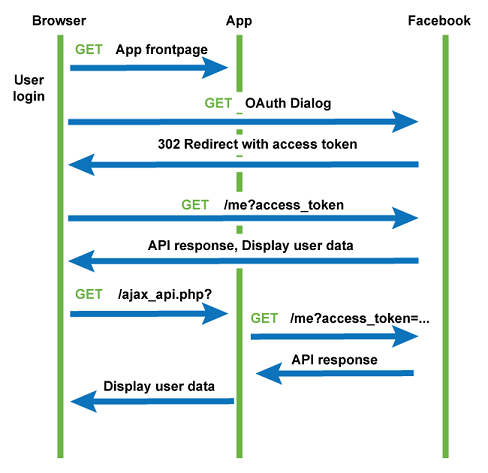

# OAuth 2.0  


- [OAuth 2.0 protocol](#OAuth2_protocol)
- [Secure an APIs with OAuth 2.0](#Secure_APIs_with_OAuth2)


## <a name='OAuth2_protocol'> OAuth 2.0 protocol </a>




- OAuth is an open authorization protocol, which allows accessing the resources of the resource owner by enabling the client applications on HTTP services such as Facebook, GitHub, etc. It allows sharing of resources stored on one site to another site without using their credentials. 
- OAuth 2.0 relies on SSL which is used to ensure cryptography industry protocols and are being used to keep the data safe.


#### OAuth 2.0 Flow

- **Step (1)** − First, the user accesses the client web application and the client applicant asks the user to use **Authorization server** like google, facebook or github, ... etc for Authorization
- **Step (2)** − Next, the client application will provide the user with a link to login to the **Authorization server**        
    **Example:** 
    > **GET**
     **https://accounts.google.com/o/oauth2/v2/auth?client_id=710207886425-1tsa2j5dh5o3sj020bum2epgbncbhgo1.apps.googleusercontent.com&redirect_uri=https://www.getpostman.com/oauth2/callback&response_type=code&scope=https://www.googleapis.com/auth/drive**
    - Query parameters:
        - **client_id** - which you obtain from the Authorization server (in case of google: API Console [Credentials page](https://console.cloud.google.com/apis/credentials). 
        - **redirect_uri** - should be the HTTP endpoint on your server that will receive the response, (in case of google: The value must exactly match one of the authorized redirect URIs for the OAuth 2.0 client, which you configured in the API Console Credentials page. If this value doesn't match an authorized URI, the request will fail with a redirect_uri_mismatch error.
        - **response_type ~~(or grant_type)~~** - which define the authentication flows either **Implicit Flow** or **Authentication Flow**, in case of google it should be the basic authorization code flow request should be **code**.
        - **scope** - is a mechanism in OAuth 2.0 to limit an application's access to a user's account. (which parts of info/action will have access to?!)                                                                                                                                                 
- **Step (3)** − The user logs in using the authenticating application.
- **Step (4)** − The authenticating server redirects the user to a redirect_url with authorization code.
- **Step (5)** − The user accesses the page located at redirect URI in the client application.
- **Step (6)** − The client application will be provided with the **authentication code** and scope then send them to the authorization server with client_id and secret to obtain **access_token**.    
    **Example:**
    > **POST**
     **https://oauth2.googleapis.com/token?client_id=710207886425-1tsa2j5dh5o3sj020bum2epgbncbhgo1.apps.googleusercontent.com&client_secret=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&code=4/0AX4XfWhNSxWAWx18HtYWWXELcUL4GbUh7ZGUpoXvZwthbOgGxQ9g4R4hoE_BV7WMqxYtvg&redirect_uri=https://www.getpostman.com/oauth2/callback&grant_type=authorization_code**
- **Step (7)** − The Authorization server returns an **access token** to the client application.     
    **Example:**
    ```json
    {
        "access_token": "ya89.a0ARrdaM-NRDUsvYaN84dmPkuM6hicGHE9esGH00FXgnOHPyY32ohRRYnOGugLvBCPSbTFlPlGVYfPbf_YS1raKdEpGp9HzABjkFlYuqxLXCHQiP0dX2LbWJMINUOd9QtGdO3pjelZBIjsZjnNEZSQjs6RKsYA",
        "expires_in": 3599,
        "scope": "https://www.googleapis.com/auth/drive",
        "token_type": "Bearer"
    }
    ```
- **Step (8)** − Once the client application gets an access token, the user starts accessing the resources of the resource owner using the client application.
The client provides an access token to the resource server to access protected resources. The resource server must validate and verify that the access token is valid and has not expired.      
    **Example**
    ```
    GET https://www.googleapis.com/auth/drive HTTP /1.1
    Host: example.com
    Authorization: Bearer [token-value]
    ```
Note: use of a **state** parameter to prevent CSRF attacks.    


## <a name='Secure_APIs_with_OAuth2'> Secure an APIs with OAuth 2.0 </a>

Check [Securing APIs using OAuth 2.0](./api-auth.md#Securing_APIs_using_OAuth2)


