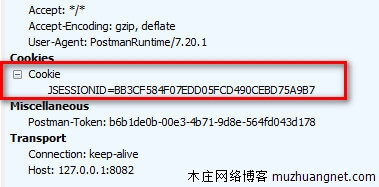

# Session Management

- [Introduction to Sessions](#Introduction_to_Sessions)
- [Where to store session in the browser ?!](#Where_store_session_in_browser)
- [Session Tracking Example using Java Servlets](#Session_Tracking_Example_using_Java_Servlets)
- [Session timeout best practices](#Session_timeout_best_practices)


## <a name='Introduction_to_Sessions'> Introduction to Sessions </a>

- HTTP is a "stateless" protocol which means each time a client retrieves a Web page, the client opens a separate connection to the Web server and the server automatically does not keep any record of previous client request.
- Still there are following three ways to maintain session between web client and web server
    - Cookies
    - Hidden Form Fields
        ```html
          <input type = "hidden" name = "sessionid" value = "12345">
        ```
    - URL Rewriting
        ```
            http://mywebsite.com/file.htm;sessionid = 12345
        ```


## <a name='Where_store_session_in_browser'> Where to store session in the browser ?! </a>

#### Local Storage
The data stored in **localStorage** persists until explicitly deleted. Changes made are saved and available for all current and future visits to the site.

#### Session Storage
For **sessionStorage**, changes are only available per tab. Changes made are saved and available for the current page in that tab until it is closed. Once it is closed, the stored data is deleted.

So it depends on the nature of the business, If the returned user need to log-in again, so the session storage is to save in session storage
but if the returned user will have to use the we app without need to log-in again then, local storage is the good choice


## <a name='Session_Tracking_Example_using_Java_Servlets'> Session Tracking Example using Java Servlets </a>

```java
public class SessionTrack extends HttpServlet {
 
   public void doGet(HttpServletRequest request, HttpServletResponse response) throws ServletException, IOException {
         
      // Create a session object if it is already not  created.
      HttpSession session = request.getSession(true);
         
      // Get session creation time.
      Date createTime = new Date(session.getCreationTime());
         
      // Get last access time of this web page.
      Date lastAccessTime = new Date(session.getLastAccessedTime());

      String userIDKey = new String("userID");
      String userID = new String("ABCD");

      // Check if this is new comer on your web page.
      if (session.isNew()) {
         title = "Welcome to my website";
         session.setAttribute(userIDKey, userID);
      } else {
         userID = (String)session.getAttribute(userIDKey);
      }

      // Set response content type
      response.setContentType("text/html");
      PrintWriter out = response.getWriter();

      String doc ="<!doctype html public \"-//w3c//dtd html 4.0 transitional//en\">\n";
      out.println(docType + "<html> ....");

   }
}
```

#### Session Information
```
id: 0AE3EC93FF44E3C525B4351B77ABB2D5   <---- JSESSIONID value in the Cookie
Creation Time: Tue Jun 08 17:26:40 GMT+04:00 2022
User ID: 23654
```




#### Log out

```java
// Don't Create a session object if it is NOT exist
HttpSession session = request.getSession(false);

// invalidates the session but doesn't affect the identity information in the request.
session.invalidate();

//Clears the identity information in the request but doesn't affect the session
request.logout();
```

#### Java Session Timeout

##### Global Session Timeout in the web.xml
```xml
<?xml version="1.0" encoding="UTF-8"?>
<web-app ...>

    ...
    <session-config>
        <session-timeout>10</session-timeout>
    </session-config>

</web-app>
```
Note that the value of the timeout is set in minutes, not in seconds.

##### Programmatic Timeout per Individual Session
The timeout of the current session only can be specified programmatically via the API of the javax.servlet.http.HttpSession:

```java
HttpSession session = request.getSession();
session.setMaxInactiveInterval(10*60);
```
The setMaxInactiveInterval method accepts a value in seconds.


##### Session never expired

An interval value of zero or less indicates that the session should never timeout.

```java
session.setMaxInactiveInterval(0);
session.setMaxInactiveInterval(-1);
session.setMaxInactiveInterval(-2);
```

If we have both XML and program configuration then web.xml value will be overridden by the programmatically set value.

##### Tomcat Session Timeout

```bash
$tomcat_home/conf/web.xml
```
This default deployment descriptor does configure a <session-timeout> with to a value of 30 minutes.


## <a name='Session_timeout_best_practices'> Session timeout best practices </a>

#### Google 
- Default Google Workspace session timeout of **14 days**


#### Banking web sites
- your Online Banking session will automatically "time out" after **10 minutes of inactivity**.

ex: DNBC Financial Group
 - you will have about **15 minutes** before the session closes and you would have to sign in again to make any more transactions.


#### Federal guideline perspective, the draft NIST 800-63B – Digital Identity Guidelines
- Reauthentication of the subscriber SHALL be repeated following no more than 30 minutes of user inactivity.


      