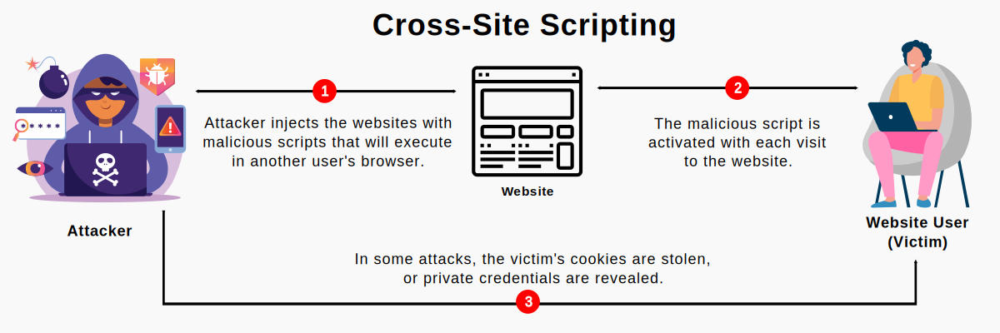

# XSS Cross Side Scripting

- [XSS - Cross Side Scripting](#Cross_Side_Scripting)
- [XSS protection](#XSS_protection)

## <a name='Cross_Side_Scripting'> XSS - Cross Side Scripting </a>

#### What is cross-site scripting?
Cross site scripting (XSS) is an attack in which an attacker injects malicious executable scripts into the code of a trusted application or website. 
  
  
 

.png)

## <a name='XSS_protection'> XSS protection </a>

- Keep Software Up-To-Date
- Sanitize And Validate Input Fields
- Ue http-only Cookie
    - However this security feature was never indented to stop XSS because there are many workaround of this bt the hackers

