# Postman for REST API testing


- [Query parameters and Path parameters](#Query_parameters_path_parameters)
- [Sending body data ](#Sending_body_data)
    - [form-data (Multipart)](#form_data)
    - [x-www-form-urlencoded (URL-encoded)](#x_www_form_urlencoded)
    - [What is the difference between the other two, form-data and x-www-form-urlencoded?](#form_data_www_form_urlencoded)
    - [Raw text/plain](#text_plain)
    - [Raw json](#raw_json)
- [Authenticating requests](#Authenticating_requests)
    - [No Auth](#No_Auth)
    - [API Key](#API_Key)
    - [Bearer Token](#Bearer_Token)
    - [Basic Auth](#Basic_Auth)
    - [Digest Auth](#Digest_Auth)
    - [OAuth 2.0](#OAuth_2.0)               **<----- NOT READY YET , TO BE DOCUMENTED**
- [Variables and Environments](#Variables_Environments)
    - [Variable Scopes](#Variable_scopes)
    - [Defining Variables](#Defining_variables)
    - [Using Variables](#Using_variables)
    - [Using dynamic variables](#Using_dynamic_variables)
- [Working with Certificates](#certificates)    
    - [Enable/Disable SSL certificate verification](#Enable_Disable_SSL_certificate_verification)
- [Publishing Your API](#Publishing_Your_API)        
    - [Postman project structure](#Postman_project_structure)    
    - [Invite team member by email](#Invite_team_member_by_email)    
    - [Export Collection](#Export_Collection)    
    - [Share Collection](#Share_Collection)    
    - [Import Collection](#Import_Collection)    


## <a name='Query_parameters_path_parameters'> Query parameters and Path parameters </a>

#### Query parameters
Sending parameters in the URL :  
http://ww.example.com/test?**id=1&type=new**


#### Path parameters
art of the request URL, and are referenced using placeholders preceded by : as in the following example:    
http://ww.example.com/customer/**:id**/
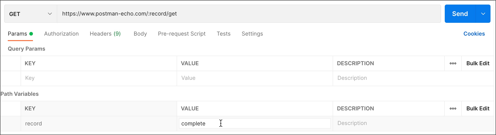


> **Parameters aren't automatically URL-encoded. Right-click selected text, and choose EncodeURIComponent to manually encode a parameter value.**

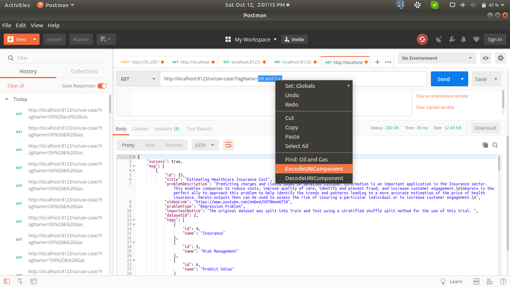    
    
    
## <a name='Sending_body_data'> Sending body data </a>

The Body tab in Postman allows you to specify the data you need to send with a request. You can send various different types of body data to suit your API.

### <a name='form_data'> form-data (Multipart) </a>
Website forms often send data to APIs as **multipart/form-data**


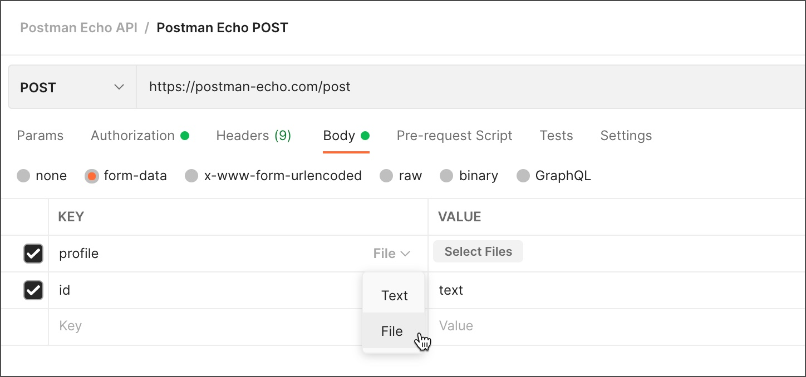

### <a name='x_www_form_urlencoded'> x-www-form-urlencoded (URL-encoded) </a>

URL-encoded data uses the same encoding as URL parameters. If your API requires url-encoded data, select x-www-form-urlencoded in the Body tab of your request


### <a name='form_data_www_form_urlencoded'> What is the difference between the other two, form-data and x-www-form-urlencoded?  </a>

These are different Form content types defined by W3C. If you want to send simple text/ ASCII data, then x-www-form-urlencoded will work. This is the default.

But if you have to send non-ASCII text or large binary data, the form-data is for that.

#### form-data

- Header:
```
content-type: multipart/form-data; boundary=--------------------------590299136414163472038474
```
  
- Body
```
key1=value1key2=value2
```  

Also it is used for file upload:  
Let's take a look at what happens when you select a file and submit your form
```
POST /upload?upload_progress_id=12344 HTTP/1.1
Host: localhost:3000
Content-Length: 1325
Origin: http://localhost:3000
... other headers ...
Content-Type: multipart/form-data; boundary=----WebKitFormBoundaryePkpFF7tjBAqx29L

------WebKitFormBoundaryePkpFF7tjBAqx29L
Content-Disposition: form-data; name="MAX_FILE_SIZE"

100000
------WebKitFormBoundaryePkpFF7tjBAqx29L
Content-Disposition: form-data; name="uploadedfile"; filename="hello.o"
Content-Type: application/x-object

... contents of file goes here ...
------WebKitFormBoundaryePkpFF7tjBAqx29L--
```

that means, we have 2 fields
1) MAX_FILE_SIZE = 100000
2) File: filename = hello.o


#### x-www-form-urlencoded

- Header:
```
Content-Type: application/x-www-form-urlencoded
```
  
- Body
```
key1=value1&key2=value2
```  


### <a name='text_plain'> Raw text/plain </a>

- Header:
```
Content-Type: text/plain
```
  
- Body
```
This is some text.
```  


### <a name='raw_json'> Raw json </a>

- Header:
```
Content-Type: application/json
```
  
- Body
```
{"key1":"value1","key2":"value2"}
```  

Authenticating requests


## <a name='Authenticating_requests'> Authenticating requests </a>

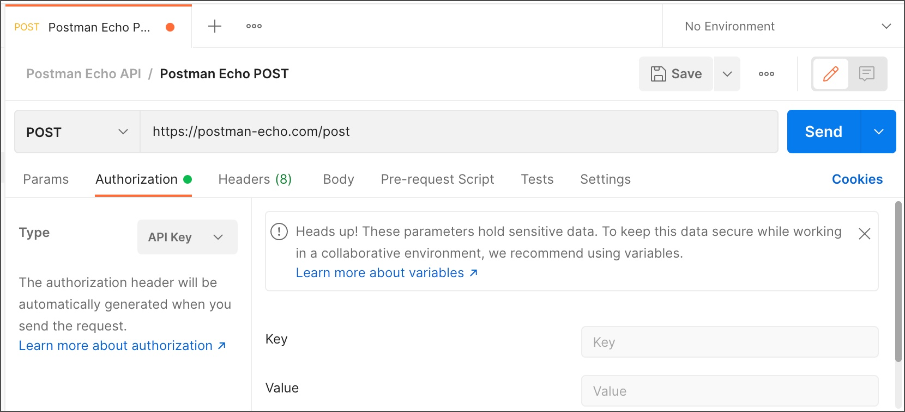

When you select a type from the Type dropdown list, Postman will indicate which parts of the request your details will be included in, for example the header, body, URL, or query parameters. 

### Authorization types

By default, requests inside the collection or folder will inherit auth with **Inheriting authorization** option


#### <a name='No_Auth'> No Auth </a>
Postman won't send authorization details 

#### <a name='API_Key'> API Key </a>

In the request Authorization tab, select API Key from the Type list. Enter your key name and value, 
and select either **Header** or **Query Params** from the Add to dropdown list. 
You can store your values in variables for additional security.

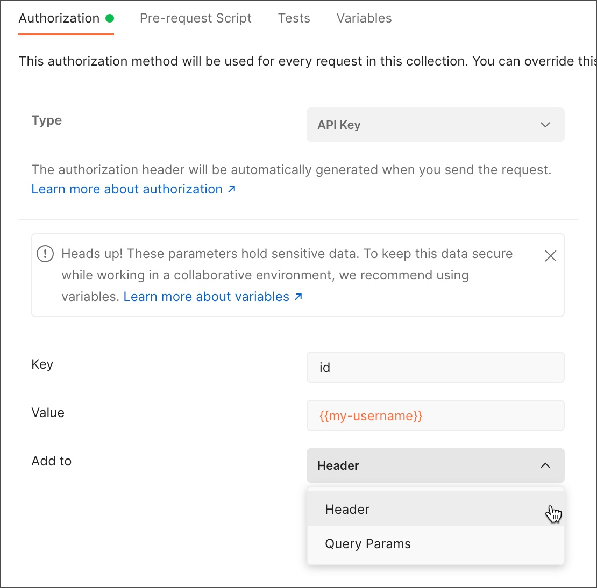

#### <a name='Bearer_Token'> Bearer Token </a>

Bearer tokens enable requests to authenticate using an access key, such as a JSON Web Token (JWT). The token is a text string, included in the request header

Postman will append the token value to the text Bearer in the required format to the request Authorization header as follows:

```
Bearer <Your API key>
```

#### <a name='Basic_Auth'> Basic Auth </a>

Enter your API username and password in the Username and Password fields. For additional security, store these in variables.

```
Basic <Base64 encoded username and password>
```

#### <a name='Digest_Auth'> Digest Auth </a>

With Digest auth, the client sends a first request to the API, and the server responds with a few details, including a number that can be used only once (a nonce), a realm value, and a 401 unauthorized response. You then send back an encrypted array of data including a username and password combined with the data received from the server in the first request. The server uses the passed data to generate an encrypted string and compares it against what you sent in order to authenticate your request.


- **Realm** - A string specified by the server in the WWW-Authenticate response header.
- **Nonce** - A unique string specified by the server in the WWW-Authenticate response header.
- **Algorithm** - A string that indicates a pair of algorithms used to produce the digest and a checksum. Postman supports MD5 and SHA algorithms.
- **qop** - The quality of protection applied to the message. The value must be one of the alternatives specified by the server in the WWW-Authenticate response header.
- **Nonce Count** - The hexadecimal count of the number of requests (including the current request) that the client has sent with the nonce value in this request.
- **Client Nonce** - An opaque quoted string value provided by the client, used by both client and server to avoid chosen plaintext attacks, to provide mutual authentication, and to provide some message integrity protection.
- **Opaque** - A string of data specified by the server in the WWW-Authenticate response header, which will be used unchanged with URIs in the same protection space.


#### <a name='OAuth_2.0'> OAuth 2.0 </a>

To be done


## <a name='Variables_Environments'> Variables and Environments </a>

Variables enable you to store and reuse values in Postman. 
By storing a value as a variable, 
you can reference it throughout your collections, environments, requests, and test scripts. 

> Hit the **Eye icon in the right panel of postman** to manage Variables and Environments


#### <a name='create_use_variable'> Create and use a variable </a>

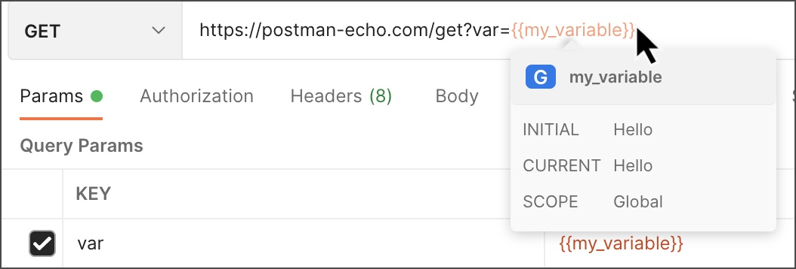

1. Select the environment quick look icon Quick Look icon at the top right of Postman.
2. Next to Globals, select Edit.
3. Add a variable named my_variable and give it an initial value of Hello.
4. Select Save icon Save, then close the environment tab.
5. Open a new request tab and enter **https://postman-echo.com/get?var={{my_variable}}**

#### <a name='Variable_scopes'> Variable Scopes </a>

- **Global variables** enable you to access data between collections, requests, test scripts, and environments. 
- **Collection variables** are available throughout the requests in a collection and are independent of environments.
- **Environment variables** enable you to scope your work to different environments, for example local development versus testing or production
- **Data variables** come from external CSV and JSON files to define data sets
- **Local variables** are temporary variables that are accessed in your request scripts.

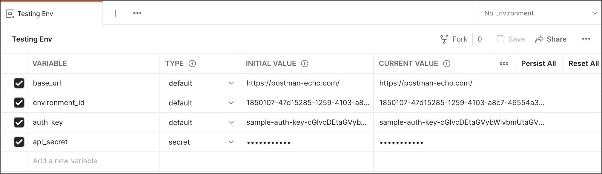

##### Notes
> **Postman stores variables as strings. If you store objects or arrays, remember to JSON.stringify() them before storing, and JSON.parse() them when you retrieve them.**

> **Varable type is either default (will show up) OR secret (displayed as asterisks)**


#### <a name='Defining_variables'> Defining Variables </a>

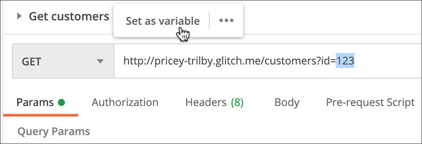
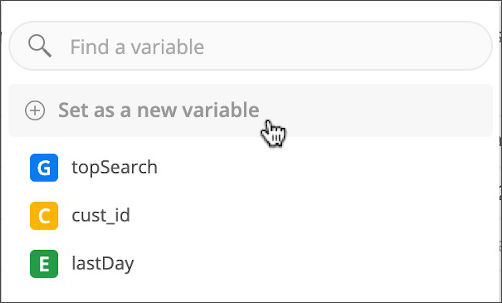
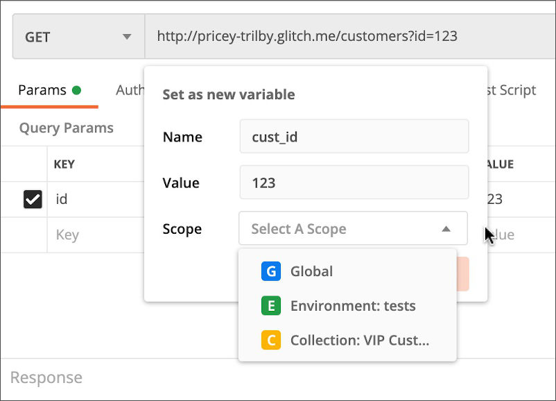


#### <a name='Using_variables'> Using Variables </a>

```
{{username}}
```

```
https://postman-echo.com/get?customer_id={{cust_id}}
```

```json
{ "customer_id" : "{{cust_id}}" }
```


#### <a name='Using_dynamic_variables'> Using dynamic variables </a>

Postman provides dynamic variables you can use in your requests.

Examples of dynamic variables:
- **{{$guid}}**: A v4-style GUID
- ***{{$timestamp}}**: The current Unix timestamp in seconds
- **{{$randomInt}}**: A random integer between 0 and 1000

For full list of postman dynamic variables
> **https://learning.postman.com/docs/writing-scripts/script-references/variables-list/**


## <a name='certificates'> Working with Certificates </a>

#### <a name='Enable_Disable_SSL_certificate_verification'> Enable/Disable SSL certificate verification </a>

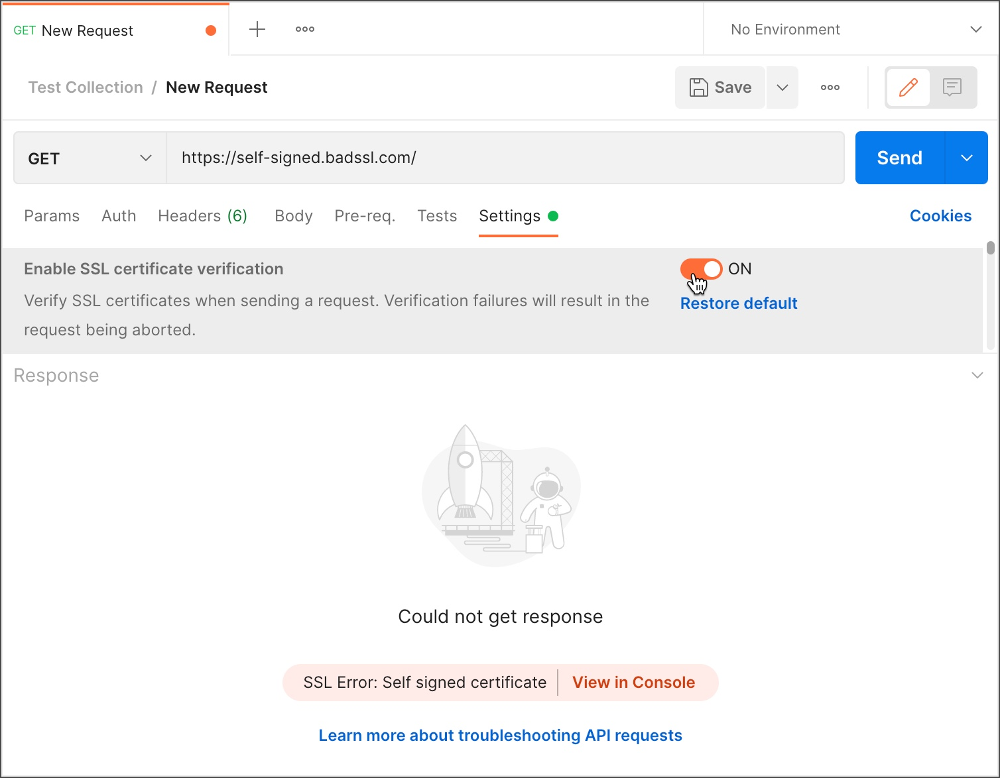


1. Open the request and select the Settings tab.
2. Select Enable SSL certificate verification to turn off this setting.
3. Send the request again.


## <a name='Publishing_Your_API'> Publishing Your API </a>

through Postman, you can puplish and share collections

#### <a name='Postman_project_structure'> Postman project structure </a>

The project is called **Workspace** and each workspace can have multiple **collection**  
The collection is a set of requests

#### <a name='Invite_team_member_by_email'> Invite team member by email </a>

Simply hit **invite** button on the top right corner of the app, then write the email of the user you want to invite and specify his role

Roles:
- Admin
- Editor
- Viewer

#### <a name='Export_Collection'> Export Collection  </a>

To export a collection, Simply hit **... (3 points)** of the collection you want to export, select **export**   
Now, you can export a collection to **json file** using the recommended format "Collection v2.1"

#### <a name='Share_Collection'> Share Collection  </a>

To share a collection, Simply hit **... (3 points)** of the collection you want to share,, select **share**    
Now, you can share a collection via **link** or specify **email of the team member** you want to share with

#### <a name='Import_Collection'> Import Collection </a>

To import a collection, Simply hit **import** button on the top left panel of the active workspace name,
Now, you can import a collection from **json file** or from a **link** or any other option


