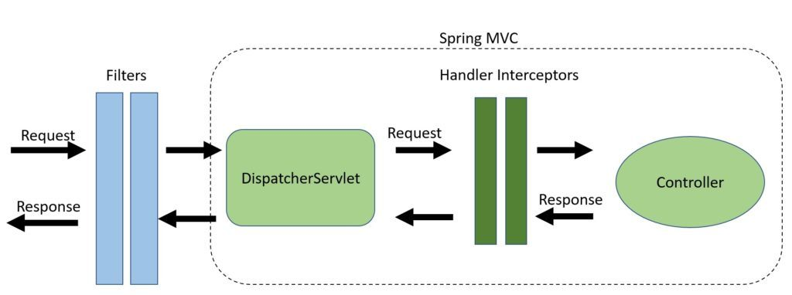

# Spring MVC


- [spring-web vs spring-webmvc](#spring-web_vs_spring-webmvc) 
- [@Controller vs @RestController](#controller_restController)   
- [@EnableWebMvc](#enableWebMvc)
- [Http Message Converters](#Http_Message_Converters)
- [Custom HTTP Converters Configuration](#custom_http_converters_configuration)
- [Converter and GenericConverter](#Converter_GenericConverter)
- [Custom Argument Resolver](#Custom_Argument_Resolver)
- [@InitBinder](#InitBinder)
- [@RequestBody vs @ResponseBody](#requestBody_responseBody)      
- [@ModelAttribute](#modelAttribute)    
- [@RequestBody vs @ModelAttribute](#requestBody_modelAttribute)    
- [@GetMapping and @PostMapping with produces and consumes](#getMapping_postMapping)  
- [@RequestParam vs @PathVariable](#requestParam_pathVariable)      
- [@ExceptionHandler vs @ControllerAdvice - Spring Error Handling](#exceptionHandler_controllerAdvice)      
- [GET, POST, PUT, DELETE Best Practices using Spring](#get_post_put_delete)      
- [Validation](#spring_validation)      
- [@ContextConfiguration vs @SpringApplicationConfiguration](#ContextConfiguration_SpringApplicationConfiguration)      
- [Unit test](#unit_test)      
- [Running Logic on Startup](#Running_Logic_on_Startup)   
- [@Async and @EnableAsync](#Async_EnableAsync)      
- [@Scheduled and @EnableScheduling](#Scheduled_EnableScheduling)    
- [File Download](#File_Download)    
- [File Upload](#File_Upload)    
- [Filters](#Filters)    
- [Filters vs HandlerInterceptors](#Filters_HandlerInterceptors) 


## <a name='spring-web_vs_spring-webmvc'> spring-web vs spring-webmvc </a>

```xml
<dependency>
    <groupId>org.springframework</groupId>
    <artifactId>spring-webmvc</artifactId>
    <version>3.1.2.RELEASE</version>
</dependency>
```

VS

```xml
<dependency>
    <groupId>org.springframework</groupId>
    <artifactId>spring-web</artifactId>
    <version>3.1.2.RELEASE</version>
</dependency>
```

**spring-web** provides core HTTP integration, including some handy Servlet filters, Spring HTTP Invoker, infrastructure to integrate with other web frameworks and HTTP technologies e.g. Hessian, Burlap.

**spring-webmvc** is an implementation of Spring MVC. 
- spring-webmvc depends on on spring-web, thus including it will transitively add spring-web. 
- You don't have to add spring-web explicitly.


## <a name='controller_restController'> @Controller vs @RestController </a>

- **@Controller** is used to mark classes as Spring Controller.
    - It is belongs to spring core (NOT spring mvc)
- **@RestController** is a convenience annotation that does nothing more than adding the ***@Controller*** and ***@ResponseBody*** annotations

So the following two controller definitions should do the same
```

import org.springframework.stereotype.Controller;
import org.springframework.web.bind.annotation.RestController;
import org.springframework.web.bind.annotation.ResponseBody;


<!-- https://mvnrepository.com/artifact/org.springframework/spring-webmvc -->
<dependency>
    <groupId>org.springframework</groupId>
    <artifactId>spring-webmvc</artifactId>
    <version>5.3.18</version>
</dependency>


@Controller             <--- spring-webmvc< lib
@ResponseBody           <--- spring-webmvc< lib
public class MyController { }

@RestController         <--- spring-webmvc< lib
public class MyRestController { }
```

## <a name='enableWebMvc'> @EnableWebMvc </a>

The @EnableWebMvc annotation is used for enabling Spring MVC in an application and works by importing the Spring MVC Configuration from WebMvcConfigurationSupport.

The XML equivalent with similar functionality is &lt;mvc:annotation-driven/&gt;.

&lt;mvc:annotation-driven/&gt; means that you can define spring beans dependencies without actually having to specify a bunch of elements in XML or implement an interface or extend a base class. For example @Repository to tell spring that a class is a Dao without having to extend JpaDaoSupport or some other subclass of DaoSupport. Similarly @Controller tells spring that the class specified contains methods that will handle Http requests without you having to implement the Controller interface or extend a subclass that implements the controller.

The configuration can be customized by the @Configuration class implementing the WebMvcConfigurer:

```java
@Configuration
@EnableWebMvc
public class SpringMvcConfig implements WebMvcConfigurer {

    @Override
    public void configureMessageConverters(
      List<HttpMessageConverter<?>> converters) {
 
        converters.add(new MyHttpMessageConverter());
    }
 
    // ...
}
```

Note that this class implements **WebMvcConfigurer** – which will allow us to change the default list of Http Converters with our own.


In a typical spring MVC app you will find that there are two spring configuration files, a file that configures the application context usually started with the Spring context listener.

```xml
<listener>
    <listener-class>org.springframework.web.context.ContextLoaderListener</listener-class>
</listener>
```

And a Spring MVC configuration file usually started with the Spring dispatcher servlet. For example.
```xml
<servlet>
    <servlet-name>main</servlet-name>
    <servlet-class>org.springframework.web.servlet.DispatcherServlet</servlet-class>
    <load-on-startup>1</load-on-startup>
</servlet>
<servlet-mapping>
    <servlet-name>main</servlet-name>
    <url-pattern>/</url-pattern>
</servlet-mapping>
```

Spring has support for hierarchical bean factories, so in the case of the Spring MVC, the dispatcher servlet context is a child of the main application context. If the servlet context was asked for a bean called "abc" it will look in the servlet context first, if it does not find it there it will look in the parent context, which is the application context.


## <a name='Http_Message_Converters'> Http Message Converters </a>
Once there is a Configuration class annotated with **@EnableWebMvc**

By default, the following HttpMessageConverters instances are pre-enabled:

- **ByteArrayHttpMessageConverter** – converts byte arrays
- **StringHttpMessageConverter** – converts Strings
- **ResourceHttpMessageConverter** – converts org.springframework.core.io.Resource for any type of octet stream
- **SourceHttpMessageConverter** – converts javax.xml.transform.Source
- **FormHttpMessageConverter** – converts form data to/from a MultiValueMap<String, String>.
- **Jaxb2RootElementHttpMessageConverter** – converts Java objects to/from XML (added only if JAXB2 is present on the classpath)
- **MappingJackson2HttpMessageConverter** – converts JSON **(added only if Jackson 2 is present on the classpath)**
    - Jackson is currently the leading option for parsing JSON in Java. The Jackson library is composed of three components: Jackson Databind, Core, and Annotation. Jackson Databind has internal dependencies on Jackson Core and Annotation. Therefore, adding Jackson Databind to your Maven POM dependency list will include the other dependencies as well.
    ```xml
    <dependency>
        <groupId>com.fasterxml.jackson.core</groupId>
        <artifactId>jackson-databind</artifactId>
           <version>2.7.4</version>
    </dependency>
    ```
- **MappingJacksonHttpMessageConverter** – converts JSON (added only if Jackson is present on the classpath)
- **AtomFeedHttpMessageConverter** – converts Atom feeds (added only if Rome is present on the classpath)
- **RssChannelHttpMessageConverter** – converts RSS feeds (added only if Rome is present on the classpath)

Each HttpMessageConverter implementation has one or several associated MIME Types.

When receiving a new request, Spring will use the “Accept” header to determine the media type that it needs to respond with.

It will then try to find a registered converter that's capable of handling that specific media type. Finally, it will use this to convert the entity and send back the response.

The process is similar for receiving a request which contains JSON information. The framework will use the “Content-Type” header to determine the media type of the request body.


## <a name='custom_http_converters_configuration'> Custom HTTP Converters Configuration </a>

We can also customize the message converters by implementing the WebMvcConfigurer interface and overriding the configureMessageConverters method:

```java
@EnableWebMvc
@Configuration
@ComponentScan({ "com.mypackage.web" })
public class WebConfig implements WebMvcConfigurer {

    @Override
    public void configureMessageConverters(List<HttpMessageConverter<?>> messageConverters) {
        messageConverters.add(createXmlHttpMessageConverter());
        messageConverters.add(new MappingJackson2HttpMessageConverter());
    }

    private HttpMessageConverter<Object> createXmlHttpMessageConverter() {
        MarshallingHttpMessageConverter xmlConverter = new MarshallingHttpMessageConverter();
        
        XStreamMarshaller xstreamMarshaller = new XStreamMarshaller();
        xmlConverter.setMarshaller(xstreamMarshaller);
        xmlConverter.setUnmarshaller(xstreamMarshaller);

        return xmlConverter;
    } 
}
```
- very important Note:  
**Also be aware that by extending this support class, we're losing the default message converters which were previously pre-registered.**

We can of course now do the same for Jackson – by defining our own MappingJackson2HttpMessageConverter. We can now set a custom ObjectMapper on this converter and have it configured as we need to.

If we're using **Spring Boot** we can avoid implementing the WebMvcConfigurer and adding all the Message Converters manually as we did above.

We can just define different HttpMessageConverter beans in the context, and Spring Boot will add them automatically to the autoconfiguration that it creates:

```java
@Bean
public HttpMessageConverter<Object> createXmlHttpMessageConverter() {
    MarshallingHttpMessageConverter xmlConverter = new MarshallingHttpMessageConverter();

    // ...

    return xmlConverter;
}
```

#### Spring Boot Support

If we're using Spring Boot we can avoid implementing the WebMvcConfigurer and adding all the Message Converters manually as we did above.

We can just define different HttpMessageConverter beans in the context, and Spring Boot will add them automatically to the autoconfiguration that it creates:

```java
@Bean
public HttpMessageConverter<Object> createXmlHttpMessageConverter() {
    MarshallingHttpMessageConverter xmlConverter = new MarshallingHttpMessageConverter();

    // ...

    return xmlConverter;
}
```

```java
@Bean
public HttpMessageConverter<BufferedImage> createImageHttpMessageConverter() {
    return new BufferedImageHttpMessageConverter();
}
```

## <a name='Converter_GenericConverter'> Converter and GenericConverter </a>

Spring provides out-of-the-box various converters for built-in types; this means converting to/from basic types like String, Integer, Boolean and a number of other types.

#### Built-in Converters
We'll start with the converters available out-of-the-box in Spring; let's have a look at the String to Integer conversion:

```java
@Autowired
ConversionService conversionService;

@Test
public void whenConvertStringToIntegerUsingDefaultConverter_thenSuccess() {
    assertThat(
      conversionService.convert("25", Integer.class)).isEqualTo(25);
}
```

The only thing we need to do here is to autowire the ConversionService provided by Spring and call the convert() method. 

#### Creating a Custom Converter

```java
public class Employee {

    private long id;
    private double salary;

    // standard constructors, getters, setters
}
```

The String will be a comma-separated pair representing id and salary. For example, “1,50000.00”.

In order to create our custom Converter, we need to implement the Converter<S, T> interface and implement the convert() method:

```java
public class StringToEmployeeConverter implements Converter<String, Employee> {

    @Override
    public Employee convert(String from) {
        String[] data = from.split(",");
        return new Employee(Long.parseLong(data[0]), Double.parseDouble(data[1]));
    }
}
```

We're not done yet. We also need to tell Spring about this new converter by adding the StringToEmployeeConverter to the FormatterRegistry. This can be done by implementing the WebMvcConfigurer and overriding addFormatters() method:

```java
@Configuration
public class WebConfig implements WebMvcConfigurer {

    @Override
    public void addFormatters(FormatterRegistry registry) {
        registry.addConverter(new StringToEmployeeConverter());
    }
}
```

And that's it. Our new Converter is now available to the ConversionService and we can use it in the same way as any other built-in Converter:

```java
@Test
public void whenConvertStringToEmployee_thenSuccess() {
    Employee employee = conversionService
      .convert("1,50000.00", Employee.class);
    Employee actualEmployee = new Employee(1, 50000.00);
    
    assertThat(conversionService.convert("1,50000.00", 
      Employee.class))
      .isEqualToComparingFieldByField(actualEmployee);
}
```

#### Implicit Conversion

Beyond these explicit conversion using the ConversionService, **Spring is also capable of implicitly converting values right in Controller methods for all registered converters**:

```java
@RestController
public class StringToEmployeeConverterController {

    @GetMapping("/string-to-employee")
    public ResponseEntity<Object> getStringToEmployee(@RequestParam("employee") Employee employee) {
        // ...
        return ResponseEntity.ok(employee);
    }
}
```

```java
@Test
public void getStringToEmployeeTest() throws Exception {
    mockMvc.perform(get("/string-to-employee?employee=1,2000"))
      .andDo(print())
      .andExpect(jsonPath("$.id", is(1)))
      .andExpect(jsonPath("$.salary", is(2000.0)))
}
```

#### Creating a ConverterFactory

It's also possible to create a ConverterFactory that creates Converters on demand. This is particularly helpful in creating Converters for Enums.

```java
public enum Modes {
    ALPHA, BETA;
}
```

Next, let's create a StringToEnumConverterFactory that can generate Converters for converting a String to any Enum:

```java
@Component
public class StringToEnumConverterFactory implements ConverterFactory<String, Enum> {

    private static class StringToEnumConverter<T extends Enum> implements Converter<String, T> {

        private Class<T> enumType;

        public StringToEnumConverter(Class<T> enumType) {
            this.enumType = enumType;
        }

        @Override
        public T convert(String source) {
            return (T) Enum.valueOf(this.enumType, source.trim());
        }
    }

    @Override
    public <T extends Enum> Converter<String, T> getConverter(
      Class<T> targetType) {
        return new StringToEnumConverter(targetType);
    }
}
```

As we can see, the factory class internally uses an implementation of Converter interface.

One thing to note here is that although we'll use our Modes Enum to demonstrate the usage, we haven't mentioned the Enum anywhere in the StringToEnumConverterFactory. Our factory class is generic enough to generate the Converters on demand for any Enum type.

**The next step is to register this factory class as we registered our Converter in the previous example:**

```java
@Override
public void addFormatters(FormatterRegistry registry) {
    registry.addConverter(new StringToEmployeeConverter());
    registry.addConverterFactory(new StringToEnumConverterFactory());
}
```

```java
@Test
public void whenConvertStringToEnum_thenSuccess() {
    assertThat(conversionService.convert("ALPHA", Modes.class))
      .isEqualTo(Modes.ALPHA);
}
```

#### Creating a GenericConverter

A GenericConverter provides us more flexibility to create a Converter for a more generic use at the cost of losing some type safety.

Let's consider an example of converting an Integer, Double, or a String to a BigDecimal value.We don't need to write three Converters for this. A simple GenericConverter could serve the purpose.
 
The first step is to tell Spring what types of conversion are supported. We do this by creating a Set of ConvertiblePair:

```java
public class GenericBigDecimalConverter implements GenericConverter {

    @Override
    public Set<ConvertiblePair> getConvertibleTypes () {
    
        ConvertiblePair[] pairs = new ConvertiblePair[] {
              new ConvertiblePair(Number.class, BigDecimal.class),
              new ConvertiblePair(String.class, BigDecimal.class)};
            return ImmutableSet.copyOf(pairs);
        }
}
```

The next step is to override the convert() method in the same class:

```java
@Override
public Object convert (Object source, TypeDescriptor sourceType, 
  TypeDescriptor targetType) {

    if (sourceType.getType() == BigDecimal.class) {
        return source;
    }

    if(sourceType.getType() == String.class) {
        String number = (String) source;
        return new BigDecimal(number);
    } else {
        Number number = (Number) source;
        BigDecimal converted = new BigDecimal(number.doubleValue());
        return converted.setScale(2, BigDecimal.ROUND_HALF_EVEN);
    }
}
```

As you might have already guessed, the next step is to register this Converter:

```java
@Override
public void addFormatters(FormatterRegistry registry) {
    registry.addConverter(new StringToEmployeeConverter());
    registry.addConverterFactory(new StringToEnumConverterFactory());
    registry.addConverter(new GenericBigDecimalConverter());
}
```


```java
@Test
public void whenConvertingToBigDecimalUsingGenericConverter_thenSuccess() {
    assertThat(conversionService
      .convert(Integer.valueOf(11), BigDecimal.class))
      .isEqualTo(BigDecimal.valueOf(11.00)
      .setScale(2, BigDecimal.ROUND_HALF_EVEN));
    assertThat(conversionService
      .convert(Double.valueOf(25.23), BigDecimal.class))
      .isEqualByComparingTo(BigDecimal.valueOf(Double.valueOf(25.23)));
    assertThat(conversionService.convert("2.32", BigDecimal.class))
      .isEqualTo(BigDecimal.valueOf(2.32));
}
```

## <a name='Custom_Argument_Resolver'> Custom Argument Resolver </a>

There are cases when we want to bind data to objects, but it comes either in a non-direct way (for example, from Session, Header or Cookie variables) or even stored in a data source. In those cases, we need to use a different solution.

we will define an annotation for such parameters:
```java
@Retention(RetentionPolicy.RUNTIME)
@Target(ElementType.PARAMETER)
public @interface Version {
}
```

we will implement a custom HandlerMethodArgumentResolver:

```java
public class HeaderVersionArgumentResolver implements HandlerMethodArgumentResolver {

    @Override
    public boolean supportsParameter(MethodParameter methodParameter) {
        return methodParameter.getParameterAnnotation(Version.class) != null;
    }

    @Override
    public Object resolveArgument(MethodParameter methodParameter, 
                                  ModelAndViewContainer modelAndViewContainer, 
                                  NativeWebRequest nativeWebRequest, 
                                  WebDataBinderFactory webDataBinderFactory) throws Exception {
 
        HttpServletRequest request = (HttpServletRequest) nativeWebRequest.getNativeRequest();

        return request.getHeader("Version");
    }
}
```

letting Spring know where to search for them:

```java
@Configuration
public class WebConfig implements WebMvcConfigurer {

    //...

    @Override
    public void addArgumentResolvers(
      List<HandlerMethodArgumentResolver> argumentResolvers) {
        argumentResolvers.add(new HeaderVersionArgumentResolver());
    }
}
```

Now we can use it in a controller:
```java
@GetMapping("/entity/{id}")
public ResponseEntity findByVersion(
  @PathVariable Long id, @Version String version) {
    return ...;
}
```

## <a name='InitBinder'> @InitBinder </a>

#### example (1)

If the user inserts some blank spaces for a particular value and submits the form, the validator block will not treat it as Null as spaces are present, Hence the system will take the value as spaces and the subsequent processing will be done.

```java
@Initbinder
public void initBinder(WebDataBinder dataBinder) {
StringTrimmerEditor stringTrimmerEditor = new StringTrimmerEditor(true);
dataBinder.registerCustomEditor(String.class, stringTrimmerEditor);
}
```


#### example (2)

```java
@InitBinder
public void initBinder(WebDataBinder binder) {
    SimpleDateFormat dateFormat = new SimpleDateFormat("yyyy-MM-dd");

    binder.registerCustomEditor(Date.class, new CustomDateEditor(dateFormat, true));
}
```

we can use it in the controller as
```java
@GetMapping("/data/value")
 public void getDate(@RequestParam("date") Date date) {

 }
```

#### example (3)

##### Problem statement:


- In a Spring MVC based web application, all the data which is submitted from the UI comes to the Controller classes where the request is mapped.
- Sometimes what may happen is request is not reaching the controller methods and in your AJAX calls you may get an HTTP 404 response in your error handling block.
- Developers try to investigate these sort of issues by putting a debug on the controller method or request interceptors(if you have one) or filters ,check the data which is sent through AJAX,check request mappings etc.
- But none of the above approaches helps them to resolve the problem because you are getting 404 on the browser and everything else seems to be working fine.
- Now next step you may try is putting a breakpoint in the DispatcherServlet code as this is the first entry point java class invoked by the Spring framework before executing interceptors/filters and controllers in the chain.
- Looking at the exception you may figure out that Spring framework is trying to **retrieve more than 255 objects** and hence failing with **IndexOutOfBoundsException**.

**Issue is by default spring only maps only 255 objects to the java bean.**

Spring developers has done this to prevent OutOfMemory problem.


##### Solution:
Use
> setAutoGrowCollectionLimit (int) 

And you have to be very careful while setting the max size as you may get OutOfMemory issues in your application if you set this value very high.

```java
@Controller
public class Controller {

   //Externalize this value
    @Value("${myApplication.autoGrowCollectionLimit:600}")
    private int autoGrowCollectionLimit;


    @InitBinder
    public void initBinder(WebDataBinder dataBinder) {
        dataBinder.setAutoGrowCollectionLimit(autoGrowCollectionLimit);
    }

}
```


## <a name='requestBody_responseBody'> @RequestBody vs @ResponseBody </a>

- @RequestBody
    Simply put, **the @RequestBody annotation maps the HttpRequest body to a transfer or domain object, enabling automatic deserialization** of the inbound HttpRequest body onto a Java object.
    
    ```java
    @PostMapping("/request")
    public ResponseEntity postController(@RequestBody LoginForm loginForm) {
    
        exampleService.fakeAuthenticate(loginForm);
    
        return ResponseEntity.ok(HttpStatus.OK);
    }
    ```
    Spring automatically deserializes the JSON into a Java type, assuming an appropriate one is specified.
    
    By default, the type we annotate with the @RequestBody annotation must correspond to the JSON sent from our client-side controller:

    **@RequestBody**. This annotation sends a request with a body.
    Normally, when you submit a form or a particular content, this
    class receives a JSON format ToDo, then the HttpMessageConverter
    deserializes the JSON into a ToDo instance; this is done automatically
    thanks to Spring Boot and its auto-configuration because it registers
    the MappingJackson2HttpMessageConverter by default.
    
    **ResponseEntity<T>**. This class returns a full response,
    including HTTP headers, and the body is converted through
    HttpMessageConverters and written to the HTTP response. The
    ResponseEntity<T> class supports a fluent API, so it is easy to create
    the response.


- @ResponseBody

    The @ResponseBody annotation tells a controller that the object returned is automatically serialized into JSON and passed back into the HttpResponse object.
    
    Suppose we have a custom Response object:
    ```java
    public class ResponseTransfer {
        private String text; 
        
        // standard getters/setters
    }
    ```
    Next, the associated controller can be implemented:
    
    ```java
    @Controller
    @RequestMapping("/post")
    public class ExamplePostController {
    
        @Autowired
        ExampleService exampleService;
    
        @PostMapping("/response")
        @ResponseBody
        public ResponseTransfer postResponseController(@RequestBody LoginForm loginForm) {
            return new ResponseTransfer("Thanks For Posting!!!");
         }
    }
    ```

## <a name='modelAttribute'> @ModelAttribute </a>

```java
public class Person {
    private String name;

    public String getName() {
        return name;
    }

    public void setName(final String name) {
        this.name = name;
    }
}
```

As described in the Spring MVC documentation - the **@ModelAttribute** annotation can be used on **methods** or on **method arguments**. And of course we can have both use at the same time in one controller.

1.Method annotation
```java
@ModelAttribute(“cities”)
 public List<String> checkOptions(){
 return new Arrays.asList(new[]{“Sofia”,”Pleven","Ruse”});//and so on
}
```

Purpose of such method is to add attribute in the model. So in our case cities key will have the list new Arras.asList(new[]{“Sofia”,”Pleven","Ruse”}) as value in the Model (you can think of Model as map(key:value)). @ModelAttribute methods in a controller are invoked before @RequestMapping methods, within the same controller.

2.Method argument

```java
public String findPerson(@ModelAttriute(value="person") Person person) {
    //..Some logic with person
    return "person.jsp";
}
```

An @ModelAttribute on a method argument indicates the argument should be retrieved from the model. So in this case we expect that we have in the Model person object as key and we want to get its value and put it to the method argument Person person. If such does not exists or (sometimes you misspell the (value="persson")) then Spring will not find it in the Model and will create empty Person object using its defaults. Then will take the request parameters and try to data bind them in the Person object using their names.


## <a name='requestBody_modelAttribute'> @RequestBody vs @ModelAttribute </a>

the **@ModelAttribute** will take a query string. so, all the data are being pass to the server through the url.

As for **@RequestBody**, all the data will be pass to the server through a full JSON body.

## <a name='getMapping_postMapping'> @GetMapping and @PostMapping with produces and consumes </a>

The @PostMapping is specialized version of @RequestMapping annotation that acts as a shortcut for @RequestMapping(method = RequestMethod. POST) .

```
@PostMapping(value = "/content", produces = MediaType.APPLICATION_JSON_VALUE)
@ResponseBody
public ResponseTransfer postResponseJsonContent( @RequestBody LoginForm loginForm) {
    return new ResponseTransfer("JSON Content!");
}
```

```
@GetMapping(value = "/content", , consumes = MediaType.APPLICATION_XML_VALUE)
@ResponseBody
public ResponseTransfer gettResponseJsonContent( @RequestBody LoginForm loginForm) {
    return new ResponseTransfer("JSON Content!");
}
```

Now, depending on the value of an Accept parameter sent in the request's header, we'll get different responses.

Let's see this in action:
```
curl -i \ 
-H "Accept: application/json" \ 
-H "Content-Type:application/json" \ 
-X POST --data 
  '{"username": "johnny", "password": "password"}' "https://localhost:8080/.../content"
```


## <a name='requestParam_pathVariable'> @RequestParam vs @PathVariable </a>

#### @RequestParam

1. Simple Mapping
    ```
    @GetMapping("/api/foos")
    @ResponseBody
    public String getFoos(@RequestParam String id) {
        return "ID: " + id;
    }
    ``` 

2. Specifying the Request Parameter Name
    ```
        @PostMapping("/api/foos")
        @ResponseBody
        public String addFoo(@RequestParam(name = "id") String fooId, @RequestParam String name) { 
            return "ID: " + fooId + " Name: " + name;
        }
    ```

3. Optional Request Parameters
    ```
    @GetMapping("/api/foos")
    @ResponseBody
    public String getFoos(@RequestParam(required = false) String id) { 
        return "ID: " + id;
    }
    ```
    
    ```
    @GetMapping("/api/foos")
    @ResponseBody
    public String getFoos(@RequestParam Optional<String> id){
        return "ID: " + id.orElseGet(() -> "not provided");
    }
    ```

4. Default Value for the Request Parameter
    ```
    @GetMapping("/api/foos")
    @ResponseBody
    public String getFoos(@RequestParam(defaultValue = "test") String id) {
        return "ID: " + id;
    }
    ```

5. Mapping All Parameters
    ```
    @PostMapping("/api/foos")
    @ResponseBody
    public String updateFoos(@RequestParam Map<String,String> allParams) {
        return "Parameters are " + allParams.entrySet();
    }
    ```

    > curl -X POST -F 'name=abc' -F 'id=123' http://localhost:8080/spring-mvc-basics/api/foos

6. Mapping a Multi-Value Parameter
    ```
    @GetMapping("/api/foos")
    @ResponseBody
    public String getFoos(@RequestParam List<String> id) {
        return "IDs are " + id;
    }
    ```
   
    comma-delimited id parameter
    > http://localhost:8080/spring-mvc-basics/api/foos?id=1,2,3
      
#### @PathVariable

1. Simple Mapping
    ```
    @GetMapping("/api/employees/{id}")
    @ResponseBody
    public String getEmployeesById(@PathVariable String id) {
        return "ID: " + id;
    }
    ```

2. Specifying the Path Variable Name
    ```
    @GetMapping("/api/employeeswithvariable/{id}")
    @ResponseBody
    public String getEmployeesByIdWithVariableName(@PathVariable("id") String employeeId) {
        return "ID: " + employeeId;
    }
    ```

3. Multiple Path Variables in a Single Request
    ```
    @GetMapping("/api/employees/{id}/{name}")
    @ResponseBody
    public String getEmployeesByIdAndName(@PathVariable String id, @PathVariable String name) {
        return "ID: " + id + ", name: " + name;
    }
    ```
    
    **We can also handle more than one @PathVariable parameter using a method parameter of type java.util.Map<String, String>:**
    ```
    @GetMapping("/api/employeeswithmapvariable/{id}/{name}")
    @ResponseBody
    public String getEmployeesByIdAndNameWithMapVariable(@PathVariable Map<String, String> pathVarsMap) {
        String id = pathVarsMap.get("id");
        String name = pathVarsMap.get("name");
        if (id != null && name != null) {
            return "ID: " + id + ", name: " + name;
        } else {
            return "Missing Parameters";
        }
    }
    ```

4. Optional Path Variables
    In Spring, method parameters annotated with @PathVariable are required by default:
    ```
    @GetMapping(value = { "/api/employeeswithrequired", "/api/employeeswithrequired/{id}" })
    @ResponseBody
    public String getEmployeesByIdWithRequired(@PathVariable String id) {
        return "ID: " + id;
    }
    ```
    
    Setting @PathVariable as Not Required
    ```
    @GetMapping(value = { "/api/employeeswithrequiredfalse", "/api/employeeswithrequiredfalse/{id}" })
    @ResponseBody
    public String getEmployeesByIdWithRequiredFalse(@PathVariable(required = false) String id) {
        if (id != null) {
            return "ID: " + id;
        } else {
            return "ID missing";
        }
    }
    ```
    
    Using java.util.Optional
    ```
    @GetMapping(value = { "/api/employeeswithoptional", "/api/employeeswithoptional/{id}" })
    @ResponseBody
    public String getEmployeesByIdWithOptional(@PathVariable Optional<String> id) {
        if (id.isPresent()) {
            return "ID: " + id.get();
        } else {
            return "ID missing";
        }
    }
    ```

5. Using a Method Parameter of Type Map<String, String>
    ```
    @GetMapping(value = { "/api/employeeswithmap/{id}", "/api/employeeswithmap" })
    @ResponseBody
    public String getEmployeesByIdWithMap(@PathVariable Map<String, String> pathVarsMap) {
        String id = pathVarsMap.get("id");
        if (id != null) {
            return "ID: " + id;
        } else {
            return "ID missing";
        }
    }
    ```

6. Default Value for @PathVariable
    ```
    @GetMapping(value = { "/api/defaultemployeeswithoptional", "/api/defaultemployeeswithoptional/{id}" })
    @ResponseBody
    public String getDefaultEmployeesByIdWithOptional(@PathVariable Optional<String> id) {
        if (id.isPresent()) {
            return "ID: " + id.get();
        } else {
            return "ID: Default Employee";
        }
    }
    ```

## <a name='exceptionHandler_controllerAdvice'> @ExceptionHandler vs @ControllerAdvice - Spring Error Handling </a>

### @ExceptionHandler
@ExceptionHandler works at the Controller level and it is only active for that particular Controller, not globally for the entire application.   
only exceptions from this controller is routed to his @ExceptionHandler

```java
public class FooController{
    
    @ExceptionHandler({ CustomException1.class, CustomException2.class })
    public void handleException() {
        // ...
    }
}
```
The @ExceptionHandler annotated method is only active for that particular Controller

### @ControllerAdvice
@ControllerAdvice used for global error handling in the Spring MVC application.It also has full control over the body of the response and the status code.  
you can have a centralized way to handle exceptions, binding, etc. it applies to all the defined controller.


```java
@ControllerAdvice
public class RestResponseEntityExceptionHandler extends ResponseEntityExceptionHandler {

    @ExceptionHandler(value = { IllegalArgumentException.class, IllegalStateException.class })
    protected ResponseEntity<Object> handleConflict(RuntimeException ex, WebRequest request) {
        String bodyOfResponse = "This should be application specific";
        return handleExceptionInternal(ex, bodyOfResponse, new HttpHeaders(), HttpStatus.CONFLICT, request);
    }
}
```

#### example (1)

```java
public class CityNotFoundException extends RuntimeException {

    public CityNotFoundException(Long id) {
        super(String.format("City with Id %d not found", id));
    }
}
```

```java
public class NoDataFoundException extends RuntimeException {

    public NoDataFoundException() {
        super("No data found");
    }
}
```


```java
@Data
public class Error {
    String message;
    String type;
    String code;
    String trackId;
    String timestamp;

    // needed constractors ....
}
```

```json
{
    "error": {
        "message": "Missing redirect_uri parameter.",
        "type": "OAuthException",
        "code": 191,
        "fbtrace_id": "AWswcVwbcqfgrSgjG80MtqJ"
    }
}
```


```java
@ControllerAdvice
public class ControllerAdvisor extends ResponseEntityExceptionHandler {

    @ExceptionHandler(CityNotFoundException.class)
    public ResponseEntity<Error> handleCityNotFoundException(CityNotFoundException ex, WebRequest request) {

        Error error = new Error();
        error.setTimeStamp(...);
        error.setMessage(...);
        error.setCode(...);
        error.setType(...);
        error.setTrackId(...);

        return new ResponseEntity<Error>(error, HttpStatus.NOT_FOUND);
    }

    @ExceptionHandler(NoDataFoundException.class)
    public ResponseEntity<Error> handleNodataFoundException(NoDataFoundException ex, WebRequest request) {

        Map<String, Object> body = new LinkedHashMap<>();
        body.put("timestamp", LocalDateTime.now());
        body.put("message", "No cities found");

        return new ResponseEntity<Error>(body, HttpStatus.NOT_FOUND);
    }

    @Override
    protected ResponseEntity<Error> handleMethodArgumentNotValid(MethodArgumentNotValidException ex, HttpHeaders headers, HttpStatus status, WebRequest request) {

        Map<String, Object> body = new LinkedHashMap<>();
        body.put("timestamp", LocalDate.now());
        body.put("status", status.value());

        List<String> errors = ex.getBindingResult()
                .getFieldErrors()
                .stream()
                .map(x -> x.getDefaultMessage())
                .collect(Collectors.toList());

        body.put("errors", errors);

        return new ResponseEntity<>(body, HttpStatus.BAD_REQUEST);
    }
}
```

yet another example:
```java
@ControllerAdvice
public class RestResponseEntityExceptionHandler 
  extends ResponseEntityExceptionHandler {

    @ExceptionHandler(value = { IllegalArgumentException.class, IllegalStateException.class })
    protected ResponseEntity<Object> handleConflict(RuntimeException ex, WebRequest request) {
        String bodyOfResponse = "This should be application specific";
        return handleExceptionInternal(ex, bodyOfResponse, new HttpHeaders(), HttpStatus.CONFLICT, request);
    }
}
```


## <a name='get_post_put_delete'> GET, POST, PUT, DELETE Best Practices </a>


### Retrieve a Resource using GET Method

```java
   @RestController
   @RequestMapping("/api")
   public class HomeController {
   
       @GetMapping("/v1/books")
       public ResponseEntity<Iterable<Book>> getBooks() {

            return ResponseEntity.ok(repository.findAll());   // <---- HTTP code 200 OK
       }
   
       @GetMapping("/v1/books/{book_id}")
       public ResponseEntity<Book> getBook(@PathVariable String book_id) {
        
            return ResponseEntity.ok(repository.findById(id));  // <---- HTTP code 200 OK
       }
   
   }
```

OR

```java
   @RestController
   @RequestMapping("/api")
   public class HomeController {
   
       @GetMapping("/v1/books")
       public List<Book> getBooks() {
            List<Book> list = repository.findAll();
            return list;        // <---- HTTP code 200 OK
       }
   
       @GetMapping("/v1/books/{book_id}")
       public Book getBook(@PathVariable("book_id") String bookId) {
            Book book = repository.findById(bookId);
            return book;        // <---- HTTP code 200 OK
       }
   
   }
```

### Update a Resource (Partial Update) using PATCH Method
- PATCH is used for partial update of a resource

```java
   @RestController
   @RequestMapping("/api")
   public class HomeController {
   
        @PatchMapping("/v1/books/{book_id}")    // <---- Use PATCH for partial update
        public ResponseEntity<Book> setCompleted(@PathVariable("book_id") String bookId) {
            ToDo result = repository.findById(id);
            result.setCompleted(true);
            repository.save(result);
    
            URI location = ServletUriComponentsBuilder.fromCurrentRequest()
                                                      .buildAndExpand(result.getId())
                                                      .toUri();

            return ResponseEntity.ok().header("Location", location.toString()).build();
        }
   
   }
```

### Create / Update a Resource (Complete Update)
- PUT is used for Complete update of a resource
- POST is used to create a resource

```java
   @RestController
   @RequestMapping("/api")
   public class HomeController {
   
        @RequestMapping(value="/v1/books", method = { RequestMethod.POST, RequestMethod.PUT})  // <---- Use PUT for update and POST for Create
        public ResponseEntity<?> createUpdateBook(@Valid @RequestBody ToDo toDo, Errors errors){      // <---- Validation , Do I need @RequestBody annotation here ?!
            if (errors.hasErrors()) {
                return ResponseEntity.badRequest()
                                     .body(BookValidationErrorBuilder.fromBindingErrors(errors));
            }

            ToDo result = repository.save(toDo);
            URI location = ServletUriComponentsBuilder.fromCurrentRequest()
                                                      .path("/{id}")
                                                      .buildAndExpand(result.getId())
                                                      .toUri();
            return ResponseEntity.created(location).build();    // <---- HTTP code 201 CREATED with location header
            // Here you should test if the resource is created return HTTP 201 CREATED with location header
            // IF the resource is updated, return HTTP 200 OK with location header, like partial update above
        }
   
   }
```


### DELETE a Resource 

```java
   @RestController
   @RequestMapping("/api")
   public class HomeController {
   
        @DeleteMapping("/v1/books/{book_id}")
        public ResponseEntity<?> setCompleted(@PathVariable("book_id") String bookId) {
            repository.delete(BookBuilder.create().withId(id).build());
            return ResponseEntity.noContent().build();   // <---- HTTP code 204 No Content
        }
   
   }
```


## <a name='spring_validation'> Validation </a>

### Java Bean Validation Basics
the basics of validating a Java bean with the standard framework — JSR 380, also known as Bean Validation 2.0.

**JSR 380** is a specification of the Java API for bean validation, part of Jakarta EE and JavaSE. This ensures that the properties of a bean meet specific criteria, using annotations such as @NotNull, @Min, and @Max.

This version requires Java 8 or higher, and takes advantage of new features added in Java 8, such as type annotations and support for new types like Optional and LocalDate.

#### Dependencies

**Validation API**  
Per the JSR 380 specification, the validation-api dependency contains the standard validation APIs:

```xml
<dependency>
    <groupId>javax.validation</groupId>
    <artifactId>validation-api</artifactId>
    <version>2.0.1.Final</version>
</dependency>
```

**Validation API Reference Implementation**   
Hibernate Validator is the reference implementation of the validation API:

```xml
<dependency>
    <groupId>org.hibernate.validator</groupId>
    <artifactId>hibernate-validator</artifactId>
    <version>6.0.13.Final</version>
</dependency>
```

A quick note: **hibernate-validator** is entirely separate from the persistence aspects of Hibernate. So, by adding it as a dependency, we're not adding these persistence aspects into the project.

**Expression Language Dependencies**   
JSR 380 supports variable interpolation, allowing expressions inside the violation messages.

To parse these expressions, we'll add the javax.el dependency from GlassFish, that contains  an implementation of the Expression Language specification:

```xml
<dependency>
    <groupId>org.glassfish</groupId>
    <artifactId>javax.el</artifactId>
    <version>3.0.0</version>
</dependency>
```


#### Validation Annotations - @Valid

```java
import javax.validation.constraints.AssertTrue;
import javax.validation.constraints.Max;
import javax.validation.constraints.Min;
import javax.validation.constraints.NotNull;
import javax.validation.constraints.Size;
import javax.validation.constraints.Email;

public class User implements Serializable {

    private static final long serialVersionUID = 1L;

    @NotNull(message = "Name cannot be null")
    @Size(min = 1, max = 60, message = "{user.firstName.size}")   // <---- spring sp-el (expression language)
    private String name;

    @AssertTrue
    private boolean working;

    @Size(min = 10, max = 200, message = "About Me must be between 10 and 200 characters")
    private String aboutMe;

    @Min(value = 18, message = "Age should not be less than 18")
    @Max(value = 150, message = "Age should not be greater than 150")
    private int age;

    @Email(message = "Email should be valid")
    private String email;

    @Pattern(message="max 5 words please" , regexp="^[a-zA-Z+#\-.0-9]{1,5}(\s[a-zA-Z+#\-.0-9]{1,5}){0,4}$")
    private String keyword;

    // standard setters and getters 
}
```

All of the annotations used in the example are standard JSR annotations:

- **@NotNull** validates that the annotated property value is not null.
- **@AssertTrue** validates that the annotated property value is true.
- **@AssertFalse** validates that the annotated property value is false.
- **@Size** validates that the annotated property value has a size between the attributes min and max; can be applied to String, Collection, Map, and array properties.
- **@Min** validates that the annotated property has a value no smaller than the value attribute.
- **@Max** validates that the annotated property has a value no larger than the value attribute.
- **@Email** validates that the annotated property is a valid email address.
- **@Pattern** regex validation   (takes flag argument for more regex options)
- **@CreditCardNumber** credit card validation 
- **@URL** URL validation
- **@Digits** accepts digits only   
- **@DecimalMax**  max decimal
- **@DecimalMin**  min decimal


Some annotations accept additional attributes, but the message attribute is common to all of them. This is the message that will usually be rendered when the value of the respective property fails validation.

And some additional annotations that can be found in the JSR:

- **@NotEmpty** validates that the property is not null or empty; can be applied to String, Collection, Map or Array values.
- **@NotBlank** can be applied only to text values and validates that the property is not null or whitespace.
- **@Positive** and **@PositiveOrZero** apply to numeric values and validate that they are strictly positive, or positive including 0.
- **@Negative** and **@NegativeOrZero** apply to numeric values and validate that they are strictly negative, or negative including 0.
- **@Past** and **@PastOrPresent** validate that a date value is in the past or the past including the present; can be applied to date types including those added in Java 8.
- **@Future** and @FutureOrPresent validate that a date value is in the future, or in the future including the present.


The validation annotations can also be applied to elements of a collection:
> List<@NotBlank String> preferences;

- Use **@Valid** annotation

```java
@RestController
public class UserController {
    

    @RequestMapping(value = "/saveBasicUserInfo", method = RequestMethod.POST)
    public ResponseEntity<?> saveBasicUserInfo(@Valid @ModelAttribute("user") User user, BindingResult result, Model model /* Optional if needed*/) {
        if (result.hasErrors()) {
            return ResponseEntity.badRequest().body(result);;
        }
    
        // calling service(s) for business logic
    
        return ResponseEntity.ok().build();
    }

    @RequestMapping(value = "/saveBasicUserInfo2", method = RequestMethod.POST)
    public ResponseEntity<?> saveBasicUserInfo2(@Valid @ModelAttribute("user") User user, Errors errors , Model model /* Optional if needed*/) {
       
        //If error, just return a 400 bad request, along with the error message
        if (errors.hasErrors()) {                
            return ResponseEntity.badRequest().body(errors);
        }
        // calling service(s) for business logic
    
        return ResponseEntity.ok().build();        
    }

}
```
- The **Errors** or **BindingResult** parameters have to follow the model object that is being bound immediately 

#### Configure and Customize error messages

As we mentioned in the examples above, you can add a message property to the specific annotation, for example:
```java
@NotNull(message = "First name is a required field")
@Size(min = 1, max = 60, message = "First name cannot be longer than 60 characters")
private String firstName;
```

Now, if you prefer using message bundles **messages.properties**  
First of all, let’s create a messages.properties file in **src/main/resources** and add the following properties:
```
user.firstName.notNull=First name is a required field
user.firstName.size=First name cannot be longer than 60 characters
```

The next step is to change the message property of each annotation like this:
```java
@NotNull(message = "{user.firstName.notNull}")
@Size(min = 1, max = 60, message = "{user.firstName.size}")
private String firstName;
```

And finally, we have to register our own LocalValidatorFactoryBean that is linked to the MessageSource. This new bean has to be placed in any configuration file, or in your main class. If you would forget to do this, you’ll see that the message is simply {user.firstName.notNull}, which isn’t exactly what we want.

```java
@Bean
public LocalValidatorFactoryBean validator(MessageSource messageSource) {
    LocalValidatorFactoryBean validatorFactoryBean = new LocalValidatorFactoryBean();
    validatorFactoryBean.setValidationMessageSource(messageSource);
    return validatorFactoryBean;
}
```

Now, if we run the application again, we’ll see the error message appear. But wait, we’re not done yet! One thing I don’t like yet is that we’ve now hardcoded the amount (60 characters) in two places, both in the @Size annotation and the message property.

With the bean validation API, we can use substitutions for certain properties within our messages. For example:

```
user.firstName.size=First name cannot be longer than {max} characters
```

Now we only have the “60” in one place, great!

Note: for spring-boot configuration, you just need to add the following dependency in the pom.xml
```xml
<dependency>
    <groupId>org.springframework.boot</groupId>
    <artifactId>spring-boot-starter-validation</artifactId>
</dependency>
``` 


#### Programmatic Validation

- set things up programmatically
```java
ValidatorFactory factory = Validation.buildDefaultValidatorFactory();
Validator validator = factory.getValidator();
```

- Defining the Bean
```java
User user = new User();
user.setWorking(true);
user.setAboutMe("Its all about me!");
user.setAge(50);
```

- Validate the Bean
```java
Set<ConstraintViolation<User>> violations = validator.validate(user);

for (ConstraintViolation<User> violation : violations) {
    log.error(violation.getMessage()); 
}
```

OR

```java
validator.validate(user, bindingResult);  
if (bindingResult.hasErrors()) {  
    // do something  
}
```

### @Valid and @Validated 

In Spring, we use JSR-303's @Valid annotation for method level validation. We also use it to mark a member attribute for validation. 

Groups help to limit the constraints applied during validation. One particular use case is UI wizards. In the first step, we may have a certain sub-group of fields. In the subsequent step, there may be another group belonging to the same bean. So we need to apply constraints on these limited fields in each step, but @Valid doesn't support this.

In this case, **for group-level, we have to use Spring's @Validated**, which is a variant of JSR-303's @Valid.  This is used at the method-level. For marking member attributes, we continue to use the @Valid annotation.

we'll need to create two marker interfaces, a separate one for each group or each step. We can refer to our article on group validation for the exact implementation of this. Here, let's focus on the differences in the annotations.

We'll have the **BasicInfo** for the first step, and the **AdvanceInfo** for the second step. Furthermore, we'll update our UserAccount class to use these marker interfaces:

```java
public class UserAccount {
    
    @NotNull(groups = BasicInfo.class)
    @Size(min = 4, max = 15, groups = BasicInfo.class)
    private String password;
 
    @NotBlank(groups = BasicInfo.class)
    private String name;
 
    @Min(value = 18, message = "Age should not be less than 18", groups = AdvanceInfo.class) 
    private int age;
 
    @NotBlank(groups = AdvanceInfo.class)
    private String phone;
    
    // standard constructors / setters / getters / toString   
    
}
```
In addition, we'll update our controller to use the @Validated annotation instead of @Valid:

```java
@RequestMapping(value = "/saveBasicInfoStep1", method = RequestMethod.POST)
public String saveBasicInfoStep1(@Validated(BasicInfo.class)  @ModelAttribute("useraccount") UserAccount useraccount,  BindingResult result, ModelMap model) {
    if (result.hasErrors()) {
        return "error";
    }
    return "success";
}
```

### Nested Object validation

```java
public class UserAddress {

    @NotBlank
    private String countryCode;

    // standard constructors / setters / getters / toString
}
```

To ensure validation of this nested object, we'll decorate the attribute with the @Valid annotation:
```java
public class UserAccount {
    
    //...
    
    @Valid
    @NotNull(groups = AdvanceInfo.class)   // <---- we can remove "groups = AdvanceInfo.class" as requirements
    private UserAddress useraddress;
    
    // standard constructors / setters / getters / toString 
}
```

### Custom Validation

#### example (1)


```java
@Documented
@Constraint(validatedBy = ContactNumberValidator.class)
@Target( { ElementType.METHOD, ElementType.FIELD })
@Retention(RetentionPolicy.RUNTIME)
public @interface ContactNumberConstraint {
    String message() default "Invalid phone number";
    Class<?>[] groups() default {};
    Class<? extends Payload>[] payload() default {};
}
```

With the @Constraint annotation, we defined the class that is going to validate our field. The message() is the error message that is showed in the user interface. Finally, the additional code is mostly boilerplate code to conform to the Spring standards.

```java
public class ContactNumberValidator implements ConstraintValidator<ContactNumberConstraint, String> {

    @Override
    public void initialize(ContactNumberConstraint contactNumber) {
    }

    @Override
    public boolean isValid(String contactField, ConstraintValidatorContext cxt) {
        return contactField != null && contactField.matches("[0-9]+") && (contactField.length() > 8) && (contactField.length() < 14);
    }

}
```

Note:  
When the argument fails to pass the validation, in our case @ContactNumberConstraint, 
spring-mvc / spring-boot throws a **MethodArgumentNotValidException** exception.   
then you can add exception handlers to extract a default message from the custom validator annotation exception — MethodArgumentNotValidException using **@ControllerAdvice**


```java
public class UserAccount {
    
    @ContactNumberConstraint
    private String phone;
    
    // standard constructors / setters / getters / toString 
}
```

#### example (2)

```java
@Documented
@Retention(RUNTIME)
@Target({FIELD, ANNOTATION_TYPE, PARAMETER})
@Constraint(validatedBy = AdultValidator.class)
public @interface Adult {
    String message() default "{adult}";
    Class<?>[] groups() default { };
    Class<? extends Payload>[] payload() default { };
}
```


```java
@Component
public class AdultValidator implements ConstraintValidator<Adult, LocalDate> {
    private static final int ADULT_AGE = 18;

    @Override
    public boolean isValid(LocalDate dateOfBirth, ConstraintValidatorContext constraintValidatorContext) {
        return dateOfBirth != null && LocalDate.now().minusYears(ADULT_AGE).isAfter(dateOfBirth);
    }
}
```

Note:  
When the argument fails to pass the validation, in our case @Adult, 
spring-mvc / spring-boot throws a **MethodArgumentNotValidException** exception.   
then you can add exception handlers to extract a default message from the custom validator annotation exception — MethodArgumentNotValidException using **@ControllerAdvice**


```java
public class UserAccount {
    
    @ContactNumberConstraint
    private String phone;

    @NotNull
    @Past
    @Adult
    private LocalDate dateOfBirth;
    
    // standard constructors / setters / getters / toString 
}
```

### Custom Class Level Validation (validate more than one attribute of the class)

A custom validation annotation can also be defined at the class level to validate more than one attribute of the class.

A common use case for this scenario is verifying if two fields of a class have matching values.

The annotation will have two parameters, field and fieldMatch, that represent the names of the fields to compare:

```java
@Constraint(validatedBy = FieldsValueMatchValidator.class)
@Target({ ElementType.TYPE })
@Retention(RetentionPolicy.RUNTIME)
public @interface FieldsValueMatch {

    String message() default "Fields values don't match!";

    String field();

    String fieldMatch();

    @Target({ ElementType.TYPE })
    @Retention(RetentionPolicy.RUNTIME)
    @interface List {
        FieldsValueMatch[] value();
    }
}
```

We can see our custom annotation also contains a List sub-interface for defining multiple FieldsValueMatch annotations on a class.

```java
public class FieldsValueMatchValidator implements ConstraintValidator<FieldsValueMatch, Object> {

    private String field;
    private String fieldMatch;

    @Override
    public void initialize(FieldsValueMatch constraintAnnotation) {
        this.field = constraintAnnotation.field();
        this.fieldMatch = constraintAnnotation.fieldMatch();
    }

    @Override
    public boolean isValid(Object value, ConstraintValidatorContext context) {

        Object fieldValue = new BeanWrapperImpl(value).getPropertyValue(field);
        Object fieldMatchValue = new BeanWrapperImpl(value).getPropertyValue(fieldMatch);
        
        if (fieldValue != null) {
            return fieldValue.equals(fieldMatchValue);
        } else {
            return fieldMatchValue == null;
        }
    }
}
```

Applying the Annotation:

```java
@FieldsValueMatch.List({ 
    @FieldsValueMatch(
      field = "password", 
      fieldMatch = "verifyPassword", 
      message = "Passwords do not match!"
    ), 
    @FieldsValueMatch(
      field = "email", 
      fieldMatch = "verifyEmail", 
      message = "Email addresses do not match!"
    )
})
public class NewUserForm {
    private String email;
    private String verifyEmail;
    private String password;
    private String verifyPassword;

    // standard constructor, getters, setters
}
```


```java
@Controller
public class NewUserController {

    @GetMapping("/user")
    public String loadFormPage(Model model) {
        model.addAttribute("newUserForm", new NewUserForm());
        return "userHome";
    }

    @PostMapping("/user")
    public String submitForm(@Valid NewUserForm newUserForm, BindingResult result, Model model) {
        if (result.hasErrors()) {
            return "userHome";
        }
        model.addAttribute("message", "Valid form");
        return "userHome";
    }
}
```


### Customize error messages

```java
@ControllerAdvice
public class MethodArgumentNotValidExceptionHandler {

    @ResponseStatus(BAD_REQUEST)
    @ResponseBody
    @ExceptionHandler(MethodArgumentNotValidException.class)
    public Error methodArgumentNotValidException(MethodArgumentNotValidException ex) {
        BindingResult result = ex.getBindingResult();
        List<org.springframework.validation.FieldError> fieldErrors = result.getFieldErrors();
        return processFieldErrors(fieldErrors);
    }

    private Error processFieldErrors(List<org.springframework.validation.FieldError> fieldErrors) {
        Error error = new Error(BAD_REQUEST.value(), "validation error");
        for (org.springframework.validation.FieldError fieldError: fieldErrors) {
            error.addFieldError(fieldError.getField(), fieldError.getDefaultMessage());
        }
        return error;
    }

    static class Error {
        private final int status;
        private final String message;
        private List<FieldError> fieldErrors = new ArrayList<>();

        Error(int status, String message) {
            this.status = status;
            this.message = message;
        }

        public int getStatus() {
            return status;
        }

        public String getMessage() {
            return message;
        }

        public void addFieldError(String path, String message) {
            FieldError error = new FieldError(path, message);
            fieldErrors.add(error);
        }

        public List<FieldError> getFieldErrors() {
            return fieldErrors;
        }
    }
}
```

### Custom Password validation

this example show proper password constraints during registration, something like – the password should contain a special character, or it should be at least 8 characters long.

We want to be able to use powerful password rules – but we don't want to actually implement these rules manually. So, we're going to make good use of the mature **Passay library**.

```xml
<dependency>
      <groupId>org.passay</groupId>
      <artifactId>passay</artifactId>
      <version>1.6.1</version>
  </dependency>
```


```java
@Documented
@Constraint(validatedBy = PasswordConstraintValidator.class)
@Target({ TYPE, FIELD, ANNOTATION_TYPE })
@Retention(RUNTIME)
public @interface ValidPassword {

    String message() default "Invalid Password";

    Class<?>[] groups() default {};

    Class<? extends Payload>[] payload() default {};

}
```

And use it in the User:

```java
public class User {
    
    @ValidPassword
    private String password;
    
    // standard constructors / setters / getters / toString 
}
```


```java
public class PasswordConstraintValidator implements ConstraintValidator<ValidPassword, String> {

    @Override
    public void initialize(ValidPassword arg0) {
    }

    @Override
    public boolean isValid(String password, ConstraintValidatorContext context) {
        PasswordValidator validator = new PasswordValidator(Arrays.asList(
           new LengthRule(8, 30), 
           new UppercaseCharacterRule(1), 
           new DigitCharacterRule(1), 
           new SpecialCharacterRule(1), 
           new NumericalSequenceRule(3,false), 
           new AlphabeticalSequenceRule(3,false), 
           new QwertySequenceRule(3,false),
           new WhitespaceRule()));

        RuleResult result = validator.validate(new PasswordData(password));
        if (result.isValid()) {
            return true;
        }
        context.disableDefaultConstraintViolation();
        context.buildConstraintViolationWithTemplate(Joiner.on(",").join(validator.getMessages(result)))
               .addConstraintViolation();
        return false;
    }
}
```

### MultipartFile custom validation


```java
@Documented
@Constraint(validatedBy = ImageSizeValidator.class)
@Target({ TYPE, FIELD, ANNOTATION_TYPE })
@Retention(RUNTIME)
public @interface CheckImageSize {

    String message() default "Invalid Image size";

    Class<?>[] groups() default {};

    Class<? extends Payload>[] payload() default {};

}
```

```java
@Documented
@Constraint(validatedBy = ImageFormatValidator.class)
@Target({ TYPE, FIELD, ANNOTATION_TYPE })
@Retention(RUNTIME)
public @interface CheckImageFormat    {

    String message() default "Invalid Image size";

    Class<?>[] groups() default {};

    Class<? extends Payload>[] payload() default {};

}
```


```java
public class ImageSizeValidator implements ConstraintValidator<CheckImageSize, MultipartFile> {

    @Override
    public void initialize(CheckImageSize arg0) {
    }

    @Override
    public boolean isValid(MultipartFile multipartFile, ConstraintValidatorContext context) {
            // checking logic
    }
}
```

```java
public class ImageFormatValidator implements ConstraintValidator<CheckImageFormat, MultipartFile> {

    @Override
    public void initialize(CheckImageFormat arg0) {
    }

    @Override
    public boolean isValid(MultipartFile multipartFile, ConstraintValidatorContext context) {
            // checking logic
    }
}
```

And use it in the UserProfileInfo:

```java
public class UserProfileInfo {
    
    @CheckImageFormat   
    @CheckImageSize
    private MultipartFile profileImage;
    
    // standard constructors / setters / getters / toString 
}
```


Handle error
```java
@ControllerAdvice
public class ApiExceptionHandler {
        
        ExceptionHandler(MethodArgumentNotValidException.class)
        protected ResponseEntity<Object> handleMethodArgumentNotValid(MethodArgumentNotValidException ex, WebRequest request) {
        
        ...
        }
    }
```


## <a name='ContextConfiguration_SpringApplicationConfiguration'> @ContextConfiguration vs @SpringApplicationConfiguration </a>

@ContextConfiguration is an annotation from the Spring Test Framework, which is suitable for every Spring application, @SpringApplicationConfiguration is from Spring Boot and is actually a composite annotation, which includes ContextConfiguration with the custom SpringApplicationContextLoader as loader.

Even though both **@ContextConfiguration** and **@SpringApplicationConfiguration** annotations are used along withSpringJUnit4ClassRunner to specify how to **load the Spring application context**

Although @ContextConfiguration does a great job in loading application context it doesn’t take full advantage of Spring Boot features.
 
 Spring Boot applications are ultimately loaded by either SpringApplication ( in case of the JAR) or SpringBootServletInitializer. This class not only loads the application context but also enables logging and loading of external properties specified in application.properties or application.yml file, and other features of Spring Boot framework, which is not loaded or enabled by the 
 @ContextConfiguration annotation.
 


## <a name='unit_test'> Unit test using spring (Complex and I'd rather use spring-boot test) </a>

Every unit test which we write to test the behavior of a controller method consists of these steps:

- We send a request to the tested controller method.
- We verify that we received the expected response.


```java
@Controller
public class TodoController {
 
    private final TodoService service;
     
    @RequestMapping(value = "/", method = RequestMethod.GET)
    public String findAll(Model model) {
        List<Todo> models = service.findAll();
        model.addAttribute("todos", models);
        return "todo/list";
    }
}
```


```java
@ExtendWith(SpringRunner.class)
@ContextConfiguration(classes = {TestContext.class, WebAppContext.class})
@TestPropertySource("/appTest.properties")
@WebAppConfiguration
public class TodoControllerTest {
 
    private MockMvc mockMvc;
 
    @Autowired
    private TodoService todoServiceMock;
 
    //Add WebApplicationContext field here


     @Before
      public void setUp() {
        MockitoAnnotations.initMocks(this);
        mockMvc = MockMvcBuilders.standaloneSetup(new TodoController())
                .build();
      }
     
    @Test
    public void findAll_ShouldAddTodoEntriesToModelAndRenderTodoListView() throws Exception {
        Todo first = new TodoBuilder()
                .id(1L)
                .description("Lorem ipsum")
                .title("Foo")
                .build();
 
        Todo second = new TodoBuilder()
                .id(2L)
                .description("Lorem ipsum")
                .title("Bar")
                .build();
 
        when(todoServiceMock.findAll()).thenReturn(Arrays.asList(first, second));
 
        mockMvc.perform(get("/"))
                .andExpect(status().isOk())
                .andExpect(view().name("todo/list"))
                .andExpect(forwardedUrl("/WEB-INF/jsp/todo/list.jsp"))
                .andExpect(model().attribute("todos", hasSize(2)))
                .andExpect(model().attribute("todos", hasItem(
                        allOf(
                                hasProperty("id", is(1L)),
                                hasProperty("description", is("Lorem ipsum")),
                                hasProperty("title", is("Foo"))
                        )
                )))
                .andExpect(model().attribute("todos", hasItem(
                        allOf(
                                hasProperty("id", is(2L)),
                                hasProperty("description", is("Lorem ipsum")),
                                hasProperty("title", is("Bar"))
                        )
                )));
 
        verify(todoServiceMock, times(1)).findAll();
        verifyNoMoreInteractions(todoServiceMock);
    }
}
```

- **@RunWith(SpringJUnit4ClassRunner.class)**: Indicates that the class should use Spring's JUnit facilities.
- **@ContextConfiguration(locations = {...})**: Indicates which XML files contain the ApplicationContext.
OR
- **@ContextConfiguration(classes = {...})**: Indicates which classes contain the ApplicationContext.

If you are using annotations rather than XML files, 
then any class that you are unit testing that requires Spring dependency injection needs to be put into the **@ContextConfiguration** annotation. For example:

```java
@RunWith(SpringJUnit4ClassRunner.class)
@ContextConfiguration(classes = TestContext.class)
class TodoControllerTest {
    
    @Autowired
    private TodoService todoServiceMock;


}
```


**TestContext**: Returns all beans, which are required for the test. 
Use Mockito to mock the dependencies of your controller, because we want to test only the controller and not the service layer.


example:
```java
@Configuration
public class TestContext {
 
    @Bean
    public MessageSource messageSource() {
        ResourceBundleMessageSource messageSource = new ResourceBundleMessageSource();
 
        messageSource.setBasename("i18n/messages");
        messageSource.setUseCodeAsDefaultMessage(true);
 
        return messageSource;
    }
 
    @Bean
    public TodoService todoService() {
        return Mockito.mock(TodoService.class);
    }
}
```


### Unit test Using spring boot
```java
@RunWith(SpringRunner.class)   // OR @ExtendWith(SpringExtension.class) for Junit 5 
@WebMvcTest
@AutoConfigureMockMvc
public class UserControllerIntegrationTest {

    @MockBean
    private UserRepository userRepository;
    
    @Autowired
    private UserController userController;

    @Autowired
    private MockMvc mockMvc;

    //...
    @Test
    public void whenPostRequestToUsersAndValidUser_thenCorrectResponse() throws Exception {
        MediaType textPlainUtf8 = new MediaType(MediaType.TEXT_PLAIN, Charset.forName("UTF-8"));
        String user = "{\"name\": \"bob\", \"email\" : \"bob@domain.com\"}";
        mockMvc.perform(MockMvcRequestBuilders.post("/users")
          .content(user)
          .contentType(MediaType.APPLICATION_JSON_UTF8))
          .andExpect(MockMvcResultMatchers.status().isOk())
          .andExpect(MockMvcResultMatchers.content()
            .contentType(textPlainUtf8));
    }
    
    @Test
    public void whenPostRequestToUsersAndInValidUser_thenCorrectResponse() throws Exception {
        String user = "{\"name\": \"\", \"email\" : \"bob@domain.com\"}";
        mockMvc.perform(MockMvcRequestBuilders.post("/users")
          .content(user)
          .contentType(MediaType.APPLICATION_JSON_UTF8))
          .andExpect(MockMvcResultMatchers.status().isBadRequest())
          .andExpect(MockMvcResultMatchers.jsonPath("$.name", Is.is("Name is mandatory")))
          .andExpect(MockMvcResultMatchers.content()
            .contentType(MediaType.APPLICATION_JSON_UTF8));
        }

    @Test
    public void givenSaveBasicInfo_whenCorrectInput_thenSuccess() throws Exception {
        this.mockMvc.perform(MockMvcRequestBuilders.post("/saveBasicInfo")
          .accept(MediaType.TEXT_HTML)
          .param("name", "test123")
          .param("password", "pass"))
          .andExpect(view().name("success"))
          .andExpect(status().isOk())
          .andDo(print());
    }

    @Test
    public void givenSaveBasicInfoStep1_whenCorrectInput_thenSuccess() throws Exception {
        this.mockMvc.perform(MockMvcRequestBuilders.post("/saveBasicInfoStep1")
          .accept(MediaType.TEXT_HTML)
          .param("name", "test123")
          .param("password", "pass"))
          .andExpect(view().name("success"))
          .andExpect(status().isOk())
          .andDo(print());
    }

    @Test
    public void 
      givenPhoneURIWithPostAndFormData_whenMockMVC_thenVerifyErrorResponse() {
     
        this.mockMvc.perform(MockMvcRequestBuilders.post("/addValidatePhone").
          accept(MediaType.TEXT_HTML).
          param("phoneInput", "123")).
          andExpect(model().attributeHasFieldErrorCode(
              "validatedPhone","phone","ContactNumberConstraint")).
          andExpect(view().name("phoneHome")).
          andExpect(status().isOk()).
          andDo(print());
    }
}
```


## <a name='Running_Logic_on_Startup'> Running Logic on Startup </a>


In order to benefit from Inverse of Control, we need to renounce partial control over the application's flow to the container. This is why instantiation, setup logic on startup, etc. need special attention.

#### @PostConstruct Annotation

```
@Component
public class PostConstructExampleBean {

    private static final Logger LOG = Logger.getLogger(PostConstructExampleBean.class);

    @Autowired
    private Environment environment;

    @PostConstruct
    public void init() {
        LOG.info(Arrays.asList(environment.getDefaultProfiles()));
    }
}
```

We can see that the Environment instance was safely injected and then called in the @PostConstruct annotated method without throwing a NullPointerException.


#### The InitializingBean Interface

The InitializingBean approach works in a similar way. Instead of annotating a method, we need to implement the InitializingBean interface and the afterPropertiesSet() method.

```java
@Component
public class InitializingBeanExampleBean implements InitializingBean {

    private static final Logger LOG = Logger.getLogger(InitializingBeanExampleBean.class);

    @Autowired
    private Environment environment;

    @Override
    public void afterPropertiesSet() throws Exception {
        LOG.info(Arrays.asList(environment.getDefaultProfiles()));
    }
}
```

#### An ApplicationListener

We can use this approach for **running logic after the Spring context has been initialized**. 
So, we aren't focusing on any particular bean. We're instead waiting for all of them to initialize.

```java
@Component
public class StartupApplicationListenerExample implements ApplicationListener<ContextRefreshedEvent> {

    private static final Logger LOG = Logger.getLogger(StartupApplicationListenerExample.class);

    public static int counter;

    @Override public void onApplicationEvent(ContextRefreshedEvent event) {
        LOG.info("Increment counter");
        counter++;
    }
}
```

We can get the same results by using the newly introduced @EventListener annotation:

```java
@Component
public class EventListenerExampleBean {

    private static final Logger LOG = Logger.getLogger(EventListenerExampleBean.class);

    public static int counter;

    @EventListener
    public void onApplicationEvent(ContextRefreshedEvent event) {
        LOG.info("Increment counter");
        counter++;
    }
}
```

#### @Bean initMethod Attribute

We can use the initMethod property to run a method after a bean's initialization.

```java
public class InitMethodExampleBean {

    private static final Logger LOG = Logger.getLogger(InitMethodExampleBean.class);

    @Autowired
    private Environment environment;

    public void init() {
        LOG.info(Arrays.asList(environment.getDefaultProfiles()));
    }
}
```

Then we can define the bean using the @Bean annotation:
```java
@Bean(initMethod="init")
public InitMethodExampleBean initMethodExampleBean() {
    return new InitMethodExampleBean();
}
```


#### Spring Boot CommandLineRunner

Spring Boot provides a CommandLineRunner interface with a callback run() method. This can be invoked at **application startup after the Spring application context is instantiated.**

```java
@Component
public class CommandLineAppStartupRunner implements CommandLineRunner {
    private static final Logger LOG =
      LoggerFactory.getLogger(CommandLineAppStartupRunner.class);

    public static int counter;

    @Override
    public void run(String...args) throws Exception {
        LOG.info("Increment counter");
        counter++;
    }
}
```

#### Spring Boot ApplicationRunner

```java
@Component
public class AppStartupRunner implements ApplicationRunner {
    private static final Logger LOG =
      LoggerFactory.getLogger(AppStartupRunner.class);

    public static int counter;

    @Override
    public void run(ApplicationArguments args) throws Exception {
        LOG.info("Application started with option names : {}", 
          args.getOptionNames());
        LOG.info("Increment counter");
        counter++;
    }
}
```


#### Combining Mechanisms

1. constructor
2. @PostConstruct annotated methods
3. InitializingBean's afterPropertiesSet() method
4. initialization method specified as init-method in XML

```java
@Component
@Scope(value = "prototype")
public class AllStrategiesExampleBean implements InitializingBean {

    private static final Logger LOG 
      = Logger.getLogger(AllStrategiesExampleBean.class);

    public AllStrategiesExampleBean() {
        LOG.info("Constructor");
    }

    @Override
    public void afterPropertiesSet() throws Exception {
        LOG.info("InitializingBean");
    }

    @PostConstruct
    public void postConstruct() {
        LOG.info("PostConstruct");
    }

    public void init() {
        LOG.info("init-method");
    }
}
```

If we try to instantiate this bean, we can see logs that match the order specified above:

```
[main] INFO o.b.startup.AllStrategiesExampleBean - Constructor
[main] INFO o.b.startup.AllStrategiesExampleBean - PostConstruct
[main] INFO o.b.startup.AllStrategiesExampleBean - InitializingBean
[main] INFO o.b.startup.AllStrategiesExampleBean - init-method
```


## <a name='Async_EnableAsync'> @Async and @EnableAsync </a>

It is asynchronous execution support in Spring.  
Simply put, annotating a method of a bean with @Async will make it execute in a separate thread. In other words, the caller will not wait for the completion of the called method.

enabling asynchronous processing with Java configuration using **@EnableAsync**

```java
@Configuration
@EnableAsync
public class SpringAsyncConfig { ... }
```

for xml configuration
```xml
<task:executor id="myexecutor" pool-size="5"  />
<task:annotation-driven executor="myexecutor"/>
```

#### Async Rules - @Async has two limitations:

- **It must be applied to public methods only.**
- **Self-invocation — calling the async method from within the same class — won't work.**

The reasons are simple: The method needs to be public so that it can be proxied. And self-invocation doesn't work because it bypasses the proxy and calls the underlying method directly.


#### Methods With Void Return Type
```java
@Async
public void asyncMethodWithVoidReturnType() {
    System.out.println("Execute method asynchronously. " 
      + Thread.currentThread().getName());
}
```

#### Methods With Return Type
```java
@Async
public Future<String> asyncMethodWithReturnType() {
    System.out.println("Execute method asynchronously - " + Thread.currentThread().getName());
    try {
        Thread.sleep(5000);
        return new AsyncResult<String>("hello world !!!!");
    } catch (InterruptedException e) {
        //
    }

    return null;
}
```

Spring also provides an AsyncResult class that implements Future. We can use this to track the result of asynchronous method execution.

```java
public void testAsyncAnnotationForMethodsWithReturnType()
  throws InterruptedException, ExecutionException {
    System.out.println("Invoking an asynchronous method. " 
      + Thread.currentThread().getName());
    Future<String> future = asyncAnnotationExample.asyncMethodWithReturnType();

    while (true) {
        if (future.isDone()) {
            System.out.println("Result from asynchronous process - " + future.get());
            break;
        }
        System.out.println("Continue doing something else. ");
        Thread.sleep(1000);
    }
}
```


#### The Executor

Override the Executor at the Application Level

```java
@Configuration
@EnableAsync
public class SpringAsyncConfig implements AsyncConfigurer {
    
    @Override
    public Executor asyncExecutor() {
        ThreadPoolTaskExecutor executor = new ThreadPoolTaskExecutor();
        executor.setCorePoolSize(3);
        executor.setMaxPoolSize(3);
        executor.setQueueCapacity(100);
        executor.setThreadNamePrefix("AsynchThread-");
        executor.initialize();
        return executor;
      }

}
```

#### Exception Handling

When a method return type is a Future, exception handling is easy. Future.get() method will throw the exception.

But if the return type is void, exceptions will not be propagated to the calling thread. So, we need to add extra configurations to handle exceptions.

```java
public class CustomAsyncExceptionHandler implements AsyncUncaughtExceptionHandler {

    @Override
    public void handleUncaughtException(Throwable throwable, Method method, Object... obj) {
 
        System.out.println("Exception message - " + throwable.getMessage());
        System.out.println("Method name - " + method.getName());
        for (Object param : obj) {
            System.out.println("Parameter value - " + param);
        }
    }
    
}
```

Now, register the CustomAsyncExceptionHandler in the above SpringAsyncConfig:
```java
@Configuration
@EnableAsync
public class SpringAsyncConfig implements AsyncConfigurer {
    
    @Override
    public Executor asyncExecutor() {
        ThreadPoolTaskExecutor executor = new ThreadPoolTaskExecutor();
        executor.setCorePoolSize(3);
        executor.setMaxPoolSize(3);
        executor.setQueueCapacity(100);
        executor.setThreadNamePrefix("AsynchThread-");
        executor.initialize();
        return executor;
      }

    @Override
    public AsyncUncaughtExceptionHandler getAsyncUncaughtExceptionHandler() {
        return new CustomAsyncExceptionHandler();
    }

}
```

#### Using Spring Boot

> spring.task.execution.pool.max-size=16
> spring.task.execution.pool.queue-capacity=100
> spring.task.execution.pool.keep-alive=10s

Review the documentation:   
**https://docs.spring.io/spring-boot/docs/current/reference/htmlsingle/#features.task-execution-and-scheduling**


## <a name='Scheduled_EnableScheduling'> @Scheduled and @EnableScheduling </a>

The simple rules that we need to follow to annotate a method with @Scheduled are:
- the method should typically have a void return type (if not, the returned value will be ignored)
- the method should not expect any parameters

To enable support for scheduling tasks and the @Scheduled annotation in Spring,
```java
@Configuration
@EnableScheduling
public class SpringConfig {
    ...
}
```

we can do the same in XML:
```xml
<task:annotation-driven>
```


#### Schedule a Task at Fixed Delay

configuring a task to run after a fixed delay:

```java
@Scheduled(fixedDelay = 1000)
public void scheduleFixedDelayTask() {
    System.out.println(
      "Fixed delay task - " + System.currentTimeMillis() / 1000);
}
```

In this case, the duration between the end of the last execution and the start of the next execution is fixed. The task always waits until the previous one is finished.

This option should be used when it’s mandatory that the previous execution is completed before running again.


#### Schedule a Task at a Fixed Rate

execute a task at a fixed interval of time:
```java
@Scheduled(fixedRate = 1000)
public void scheduleFixedRateTask() {
    System.out.println(
      "Fixed rate task - " + System.currentTimeMillis() / 1000);
}
```

This option should be used when each execution of the task is independent.

Note that scheduled tasks don't run in parallel by default. So even if we used fixedRate, the next task won't be invoked until the previous one is done.


Note:
**If we want to support parallel behavior in scheduled tasks, we need to add the @Async annotation:**
```java
@EnableAsync
public class ScheduledFixedRateExample {
    @Async
    @Scheduled(fixedRate = 1000)
    public void scheduleFixedRateTaskAsync() throws InterruptedException {
        System.out.println(
          "Fixed rate task async - " + System.currentTimeMillis() / 1000);
        Thread.sleep(2000);
    }

}
```

#### Fixed Rate vs Fixed Delay

The **fixedDelay** property makes sure that there is a delay of n millisecond between the finish time of an execution of a task and the start time of the next execution of the task.

The **fixedRate** property runs the scheduled task at every n millisecond. It doesn't check for any previous executions of the task.

#### Schedule a Task With Initial Delay
```java
@Scheduled(fixedDelay = 1000, initialDelay = 1000)
public void scheduleFixedRateWithInitialDelayTask() {
 
    long now = System.currentTimeMillis() / 1000;
    System.out.println(
      "Fixed rate task with one second initial delay - " + now);
}
```

The task will be executed the first time after the initialDelay value, and it will continue to be executed according to the fixedDelay.

#### Schedule a Task Using Cron Expressions

```java
@Scheduled(cron = "0 15 10 15 * ?")
public void scheduleTaskUsingCronExpression() {
 
    long now = System.currentTimeMillis() / 1000;
    System.out.println("schedule tasks using cron jobs - " + now);
}
```
Note that in this example, we're scheduling a task to be executed at 10:15 AM on the 15th day of every month.

By default, Spring will use the server's local time zone for the cron expression. However, we can use the zone attribute to change this timezone:

> @Scheduled(cron = "0 15 10 15 * ?", zone = "Europe/Paris")


#### Parameterizing the Schedule

> @Scheduled(fixedDelayString = "${fixedDelay.in.milliseconds}")

> @Scheduled(fixedRateString = "${fixedRate.in.milliseconds}")

> @Scheduled(cron = "${cron.expression}")


#### EnableScheduling configuration

```java
@Configuration
@EnableScheduling
public class MySpringConfig {

    @Bean
    public TaskScheduler  taskScheduler() {
        ThreadPoolTaskScheduler threadPoolTaskScheduler = new ThreadPoolTaskScheduler();
        threadPoolTaskScheduler.setPoolSize(5);
        threadPoolTaskScheduler.setThreadNamePrefix("ThreadPoolTaskScheduler");
        return threadPoolTaskScheduler;
    }

}
```

#### Using Spring Boot

> spring.task.scheduling.thread-name-prefix=scheduling-
>  spring.task.scheduling.pool.size=2


Review the documentation:   
**https://docs.spring.io/spring-boot/docs/current/reference/htmlsingle/#features.task-execution-and-scheduling**


## <a name='File_Download'> File Download </a>

#### Download PDF file with specifing the file name

```java
@RequestMapping(value = "/files/{file_name}", method = RequestMethod.GET)
public void getFile(@PathVariable("file_name") String fileName, HttpServletResponse response) {
    try {

      // get your file as InputStream
      InputStream is = ...;

    response.setContentType(MediaType.APPLICATION_PDF_VALUE);
    response.setHeader("Content-Disposition", "attachment; filename=\"somefile.pdf\""); 

      // copy it to response's OutputStream
      org.apache.commons.io.IOUtils.copy(is, response.getOutputStream());
      response.flushBuffer();

    
    } catch (IOException ex) {
      log.info("Error writing file to output stream. Filename was '{}'", fileName, ex);
      throw new RuntimeException("IOError writing file to output stream");
    }

}
```

#### Download image file

```java
@GetMapping(
  value = "/get-image-with-media-type",
  produces = MediaType.IMAGE_JPEG_VALUE
)
public @ResponseBody byte[] getImageWithMediaType() throws IOException {
    InputStream in = getClass()
      .getResourceAsStream("/com/baeldung/produceimage/image.jpg");
    return IOUtils.toByteArray(in);
}
```

#### Download text file

```java
@GetMapping(
  value = "/get-file",
  produces = MediaType.APPLICATION_OCTET_STREAM_VALUE
)
public @ResponseBody byte[] getFile() throws IOException {
    InputStream in = getClass()
      .getResourceAsStream("/com/baeldung/produceimage/data.txt");
    return IOUtils.toByteArray(in);
}
```


#### Better example - downloading text file

```java
@Controller
public class DemoController {

    @GetMapping(value = "/demo-file-download")
    public ResponseEntity<byte[]> demo() {                              // (1) Return byte array response
        String demoContent = "This is dynamically generated content in demo file"; // (2) Dynamic content

        HttpHeaders httpHeaders = new HttpHeaders();
        httpHeaders.set(HttpHeaders.CONTENT_TYPE, MediaType.APPLICATION_OCTET_STREAM_VALUE); // (3) Content-Type: application/octet-stream
        httpHeaders.set(HttpHeaders.CONTENT_DISPOSITION, ContentDisposition.attachment().filename("demo-file.txt").build().toString()); // (4) Content-Disposition: attachment; filename="demo-file.txt"

        return ResponseEntity.ok().headers(httpHeaders).body(demoContent.getBytes()); // (5) Return Response
    }
}
```

## <a name='File_Upload'> File Upload </a>

#### Uploading a File (Single file)
Spring allows us to enable this multipart support with pluggable MultipartResolver objects. 
The framework provides one MultipartResolver implementation for use with **Commons FileUpload** and another for use with **Servlet 3.0** multipart request parsing.


To use CommonsMultipartResolver 
```json
<dependency>
    <groupId>commons-fileupload</groupId>
    <artifactId>commons-fileupload</artifactId>
    <version>1.4</version>
</dependency>
```

Now we can define the CommonsMultipartResolver bean into our Spring configuration.

This MultipartResolver comes with a series of set method to define properties such as the maximum size for uploads:

```java
@Bean(name = "multipartResolver")
public CommonsMultipartResolver multipartResolver() {
    CommonsMultipartResolver multipartResolver = new CommonsMultipartResolver();
    multipartResolver.setMaxUploadSize(100000);
    return multipartResolver;
}
```

Suppose we have a multi-form data **multipart/form-data**
we need to set the encoding attribute of the form to **multipart/form-data**
```html
<form:form method="POST" action="/spring-mvc-xml/uploadFile" enctype="multipart/form-data">
    <table>
        <tr>
            <td><form:label path="file">Select a file to upload</form:label></td>
            <td><input type="file" name="file" /></td>
        </tr>
        <tr>
            <td><input type="submit" value="Submit" /></td>
        </tr>
    </table>
</form>
```


```java
@RequestMapping(value = "/uploadFile", method = RequestMethod.POST, consumes = {"multipart/form-data"})
 @ResponseBody 
 public String uploadFile(@RequestParam("file") MultipartFile file) {

     try {
         String uploadDir = "/uploads/";
         String realPath = request.getServletContext().getRealPath(uploadDir);
        
         File transferFile = new File(realPath + "/" + file.getOriginalFilename()); 
         file.transferTo(transferFile);
    
     } catch (Exception e) {
        e.printStackTrace();
        return "Failure";
     }

     return "Success";
 }
```


Notice that **@RequestParam("file")** should match the name field in the input file tag **name="file"**
```html
<input type="file" name="file" />
```

##### yet another example for clarification

```java
@RequestMapping(method = RequestMethod.POST, consumes = {"multipart/form-data"})
public String importQuestion(@Valid @RequestParam("uploadedFileName") 
MultipartFile multipart,  BindingResult result, ModelMap model) {
   logger.debug("Post method of uploaded Questions ");

    logger.debug("Uploaded file Name : " + multipart.getOriginalFilename());
   return "importQuestion";
}
```

and the input field should look like
```html
<input type="file" name="uploadedFileName" id="fileToUpload" required="" >
```

#### Uploading Multiple Files

To upload multiple files in a single request, we simply put multiple input file fields inside the form:
```html
<form:form method="POST" action="/spring-mvc-java/uploadMultiFile" enctype="multipart/form-data">
    <table>
        <tr>
            <td>Select a file to upload</td>
            <td><input type="file" name="files" /></td>
        </tr>
        <tr>
            <td>Select a file to upload</td>
            <td><input type="file" name="files" /></td>
        </tr>
        <tr>
            <td>Select a file to upload</td>
            <td><input type="file" name="files" /></td>
        </tr>
        <tr>
            <td><input type="submit" value="Submit" /></td>
        </tr>
    </table>
</form:form>
```

We need to take care that **each input field has the same name** so that it can be accessed as an array of MultipartFile:


```java
@RequestMapping(value = "/uploadMultiFile", method = RequestMethod.POST, consumes = {"multipart/form-data"})
public String submit(@RequestParam("files") MultipartFile[] files, ModelMap modelMap) {
    modelMap.addAttribute("files", files);

    // we can iterate through files to get the files
    
    return "fileUploadView";
}
```

#### Uploading Files With Additional Form Data

We can also send additional information to the server along with the file being uploaded. We just have to include the required fields in the form:

```html
<form:form method="POST" 
  action="/spring-mvc-java/uploadFileWithAddtionalData" enctype="multipart/form-data">
    <table>
        <tr>
            <td>Name</td>
            <td><input type="text" name="name" /></td>
        </tr>
        <tr>
            <td>Email</td>
            <td><input type="text" name="email" /></td>
        </tr>
        <tr>
            <td>Select a file to upload</td>
            <td><input type="file" name="file" /></td>
        </tr>
        <tr>
            <td><input type="submit" value="Submit" /></td>
        </tr>
    </table>
</form:form>
```

Note that Encoding type is **enctype="multipart/form-data"**

In the controller, we can get all the form data using the **@RequestParam** annotation:

```java
@PostMapping("/uploadFileWithAddtionalData")
public String submit(@RequestParam MultipartFile file, @RequestParam String name, @RequestParam String email, ModelMap modelMap) {

    modelMap.addAttribute("name", name);
    modelMap.addAttribute("email", email);
    modelMap.addAttribute("file", file);

    return "fileUploadView";
}
```


We can also encapsulate all the form fields in a model class and use @ModelAttribute annotation in the controller. This would be helpful when there's a lot of additional fields along with the file. Let' look at the code:

```java
public class FormDataWithFile {

    private String name;
    private String email;
    private MultipartFile file;

    // standard getters and setters
}
```


```java
@PostMapping("/uploadFileModelAttribute")
public String submit(@ModelAttribute FormDataWithFile formDataWithFile, ModelMap modelMap) {

    modelMap.addAttribute("formDataWithFile", formDataWithFile);

    return "fileUploadView";
}
```

also you can add validation with **@Valid**
```java
@PostMapping("/uploadFileModelAttribute")
public String submit(@Valid @ModelAttribute FormDataWithFile formDataWithFile, ModelMap modelMap) {

    modelMap.addAttribute("formDataWithFile", formDataWithFile);
    return "fileUploadView";
}
```


#### Spring Boot File Upload 

If we're using Spring Boot, everything we've seen so far still applies.  
However, Spring Boot makes it even easier to configure

```xml
<dependency>
    <groupId>org.springframework.boot</groupId>
    <artifactId>spring-boot-starter-web</artifactId>
    <version>2.6.1</version>
</dependency>
```

If we want to control the maximum file upload size, we can edit our **application.properties**:
```bash
spring.servlet.multipart.max-file-size=128KB
spring.servlet.multipart.max-request-size=128KB
```

We can also control whether file uploading is enabled, and the location for file upload:
```bash
spring.servlet.multipart.enabled=true
spring.servlet.multipart.location=${java.io.tmpdir}
```

Note that we've used ${java.io.tmpdir} to define the upload location so that we can use the temporary location for different operating systems.


## <a name='Filters'> Filters </a>


**Filter is not a spring bean(it is a web component) the injections won't work inside them. Springs wont inject inside web component.**

**Incorrect Filter, Injection will not work**
```java
public class MyFilter implements Filter {

    @Autowired
    InjectedBean someInjectedBean;
}
```

We can create filters using one of the following methods
1. Servlet Filter **(implements Filter)**
2. Spring Filter  **(implements org.springframework.web.filter.DelegatingFilterProxy)**  

#### Servlet Filter implementation 
```java
// Implements Filter class
public class LogFilter implements Filter  {

    @Override
    public void  init(FilterConfig config) throws ServletException {
      
      // Get init parameter 
      String testParam = config.getInitParameter("test-param"); 
    
      //Print the init parameter 
      System.out.println("Test Param: " + testParam); 
    }
   
   @Override
   public void  doFilter(ServletRequest request, ServletResponse response, FilterChain chain) throws java.io.IOException, ServletException {

      // Get the IP address of client machine.
      String ipAddress = request.getRemoteAddr();

      // Log the IP address and current timestamp.
      System.out.println("IP "+ ipAddress + ", Time " + new Date().toString());

      // Pass request back down the filter chain
      chain.doFilter(request,response);
   }

   @Override 
   public void destroy( ) {
      /* Called before the Filter instance is removed from service by the web container*/
   }

}
```

in **web.xml**
```xml
<filter>
   <filter-name>LogFilter</filter-name>
   <filter-class>LogFilter</filter-class>   <!-- full qualifiedClass name exL com.certifx.cd.LogFilter -->
   <init-param>
      <param-name>test-param</param-name>
      <param-value>Initialization Parameter</param-value>
   </init-param>
</filter>

<filter-mapping>
   <filter-name>LogFilter</filter-name>
   <url-pattern>/*</url-pattern>
</filter-mapping>
```


#### Using Multiple Servlet Filters

Your web application may define several different filters with a specific purpose. Consider, you define two filters AuthenFilter and LogFilter. Rest of the process would remain as explained above except you need to create a different mapping as mentioned below

```xml
<filter>
   <filter-name>LogFilter</filter-name>
   <filter-class>LogFilter</filter-class>
   <init-param>
      <param-name>test-param</param-name>
      <param-value>Initialization Paramter</param-value>
   </init-param>
</filter>

<filter>
   <filter-name>AuthenFilter</filter-name>
   <filter-class>AuthenFilter</filter-class>
   <init-param>
      <param-name>test-param</param-name>
      <param-value>Initialization Paramter</param-value>
   </init-param>
</filter>

<filter-mapping>
   <filter-name>LogFilter</filter-name>
   <url-pattern>/*</url-pattern>
</filter-mapping>

<filter-mapping>
   <filter-name>AuthenFilter</filter-name>
   <url-pattern>/*</url-pattern>
</filter-mapping>
```


The **order of filter-mapping elements in web.xml determines the order in which the web container applies the filter** to the servlet.    
For example, above example would apply LogFilter first and then it would apply AuthenFilter to any servlet


#### Spring Filter implementation 

using DelegatingFilterProxy

When using servlet filters, you obviously need to declare them in your web.xml, or they will be ignored by the servlet container. In Spring Security, the filter classes are also Spring beans defined in the application context and thus able to take advantage of Spring's rich dependency-injection facilities and lifecycle interfaces. Spring's DelegatingFilterProxy provides the link between web.xml and the application context.

When using DelegatingFilterProxy, you will see something like this in the **web.xml** file:

```xml
  <filter>
    <filter-name>myFilter</filter-name>
    <filter-class>org.springframework.web.filter.DelegatingFilterProxy</filter-class>
  </filter>

  <filter-mapping>
    <filter-name>myFilter</filter-name>
    <url-pattern>/*</url-pattern>
  </filter-mapping>
```


##### Spring Filter example

```java
public class MyFilter extends GenericFilterBean {

    @Autowired
    InjectedBean someInjectedBean;
 
    @Override
    public void doFilter(ServletRequest request, ServletResponse response, FilterChain chain) throws IOException, ServletException {
        
        // ... 

        chain.doFilter(request, response);
    }
}
```

Note that you can inject beans like **someInjectedBean** 

and in **web.xml**
```xml
<filter>
  <filter-name>myFilter</filter-name>
  <filter-class>org.springframework.web.filter.DelegatingFilterProxy</filter-class>
  <init-param>
    <param-name>targetBeanName</param-name>
    <param-value>myFilterBean</param-value>
  </init-param>
</filter>

<filter-mapping>
  <filter-name>myFilter</filter-name>
  <url-pattern>/myFilterPattern/*</url-pattern>
</filter-mapping>
```


## <a name='Filters_HandlerInterceptors'> Filters vs HandlerInterceptors </a>



#### Filters
- Filters are part of the webserver and not the Spring framework. For incoming requests, we can use filters to manipulate and even block requests from reaching any servlet. Vice versa, we can also block responses from reaching the client.
- Spring Security is a great example of using filters for authentication and authorization. To configure Spring Security, we simply need to add a single filter, the **DelegatingFilterProxy**. Spring Security can then intercept all incoming and outgoing traffic. This is why Spring Security can be used outside of Spring MVC.

#### HandlerInterceptors
- HandlerInterceptors are part of the Spring MVC framework and sit between the DispatcherServlet and our Controllers. We can intercept requests before they reach our controllers, and before and after the view is rendered.

##### Creating a HandlerInterceptor
To create a HandlerInterceptor, we create a class that implements the org.springframework.web.servlet.HandlerInterceptor interface. This gives us the option to override three methods:

- **preHandle()** – Executed before the target handler is called
- **postHandle()** – Executed after the target handler but before the DispatcherServlet renders the view
- **afterCompletion()** – Callback after completion of request processing and view rendering

```java
public class LogInterceptor implements HandlerInterceptor {

    private Logger logger = LoggerFactory.getLogger(LogInterceptor.class);

    @Override
    public boolean preHandle(HttpServletRequest request, HttpServletResponse response, Object handler) throws Exception {
        logger.info("preHandle");
        return true;
    }

    @Override
    public void postHandle(HttpServletRequest request, HttpServletResponse response, Object handler, ModelAndView modelAndView) throws Exception {
        logger.info("postHandle");
    }

    @Override
    public void afterCompletion(HttpServletRequest request, HttpServletResponse response, Object handler, Exception ex) throws Exception {
        logger.info("afterCompletion");
    }

}
```


