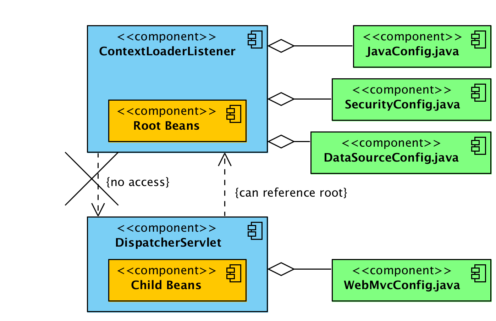
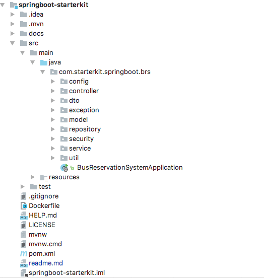

# Spring Framework


- [IoC Containers and Dependency Injection](#ioc_dependency_injection) 
- [Spring ApplicationContext](#spring_context)
  - [Configuring Beans in the Container](#configuring_beans)
  - [Types of ApplicationContext](#applicationContext_types)
- [ContextLoaderListener vs DispatcherServlet](#listener_servlet_dispatcher)  
- [**Best Practice:** Project Structure and Naming Convention](#Best_Practice_Project_Structure)
- [Running Logic on Startup](#Running_Logic_on_Startup)  
- [@Configuration @ComponantScan and @Bean](#configuration_componantScan_bean)  
- [@Component, @Controller, @Service and @Repository](#component_controller_service_repository)
- [@Import and @ImportResource](#Import_ImportResource)
- [@DependsOn](#depends_on)
- [Circular Dependency](#Circular_Dependency)
- [@Lazy loading vs @Eager Loading](#Lazy_loading_vs_Eager_Loading)
- [@Autowired, @Qualifier, @Primary and @Required](#Autowired_Qualifier_Primary_Required)
- [Spring scopes](#Spring_scopes)
- [@Profile and @ActiveProfiles - *Handling different config file (local, dev, qa, uat, prod)*](#Profile_ActiveProfiles)
- [@PropertySource, @PropertySources and @Value](#PropertySource_PropertySources_Value)
- [@PostConstractor](#PostConstractor)
- [@Order](#Order)
- [Unit test](#Unit_test)


## <a name='ioc_dependency_injection'> IoC Containers and Dependency Injection </a>

One of the main features of the Spring framework is the IoC (Inversion of Control) container. 
The Spring IoC container is responsible for managing the objects of an application. 
It uses dependency injection to achieve inversion of control.

The interfaces **BeanFactory** and **ApplicationContext** represent the Spring IoC container. 
Here, BeanFactory is the root interface for accessing the Spring container. 
It provides basic functionalities for managing beans.

the ApplicationContext is a sub-interface of the BeanFactory. 
Therefore, it offers all the functionalities of BeanFactory.


## <a name='spring_context'> Spring ApplicationContext </a>

As we know, the primary job of the ApplicationContext is to manage beans  
As such, an application must provide the bean configuration to the ApplicationContext container.   
A Spring bean configuration consists of one or more bean definitions. 


### <a name='configuring_beans'> Configuring Beans in the Container </a>

Spring supports different ways of configuring beans
#### 1. Java-Based Configuration
*uses @Bean-annotated methods within a @Configuration class.*

ex:
```java
    @Configuration
    public class AccountConfig {
    
      @Bean
      public AccountService accountService() {
        return new AccountService(accountRepository());
      }
    
      @Bean
      public AccountRepository accountRepository() {
        return new AccountRepository();
      }
    
    }
```

#### 2. Annotation-Based Configuration  
annotation-based configuration via XML configuration. Then we use a set of annotations on our Java classes, methods, constructors, or fields to configure beans. Some examples of these annotations are @Component, @Controller, @Service, @Repository, @Autowired, and @Qualifier.

First, we'll create the XML configuration, user-bean-config.xml, to enable annotations
```xml
<?xml version="1.0" encoding="UTF-8"?>
<beans xmlns="http://www.springframework.org/schema/beans"
  xmlns:xsi="http://www.w3.org/2001/XMLSchema-instance"
  xmlns:context="http://www.springframework.org/schema/context"
  xsi:schemaLocation="http://www.springframework.org/schema/beans
    http://www.springframework.org/schema/beans/spring-beans.xsd
    http://www.springframework.org/schema/context
    http://www.springframework.org/schema/context/spring-context.xsd">
  
  <context:annotation-config/>
  <context:component-scan base-package="com.baeldung.applicationcontext"/>

</beans>
```

Second, we'll create the UserService class and define it as a Spring bean using the @Component annotation:
```java
@Component
public class UserService {
  // user service code
}
```

a simple test case to test this configuration:
```java
ApplicationContext context = new ClassPathXmlApplicationContext("applicationcontext/user-bean-config.xml");
UserService userService = context.getBean(UserService.class);
assertNotNull(userService);
```

#### 3. XML-Based Configuration

we do all bean mappings in an XML configuration file.

```xml
<?xml version="1.0" encoding="UTF-8"?>
<beans xmlns="http://www.springframework.org/schema/beans"
  xmlns:xsi="http://www.w3.org/2001/XMLSchema-instance"
  xsi:schemaLocation="
    http://www.springframework.org/schema/beans 
    http://www.springframework.org/schema/beans/spring-beans.xsd">
	  
  <bean id="accountService" class="com.baeldung.applicationcontext.AccountService">
    <constructor-arg name="accountRepository" ref="accountRepository" />
  </bean>
	
  <bean id="accountRepository" class="com.baeldung.applicationcontext.AccountRepository" />
</beans>
```

### <a name='applicationContext_types'> Types of ApplicationContext </a>

#### 1. AnnotationConfigApplicationContext

It can take classes annotated with @Configuration, @Component, and JSR-330 metadata as input.
```java
ApplicationContext context = new AnnotationConfigApplicationContext(AccountConfig.class);
AccountService accountService = context.getBean(AccountService.class);
```

#### 2. AnnotationConfigWebApplicationContext

We may use this class when we configure Spring's ContextLoaderListener servlet listener or a Spring MVC DispatcherServlet in a web.xml file.

```java
public class MyWebApplicationInitializer implements WebApplicationInitializer {

  public void onStartup(ServletContext container) throws ServletException {
    AnnotationConfigWebApplicationContext context = new AnnotationConfigWebApplicationContext();
    context.register(AccountConfig.class);
    context.setServletContext(container);

    // servlet configuration
  }
}
```


#### 3. XmlWebApplicationContext

 configuring this container is like the AnnotationConfigWebApplicationContext class only, which means we can configure it in web.xml, 
 or implement the WebApplicationInitializer interface:
 
```java
public class MyXmlWebApplicationInitializer implements WebApplicationInitializer {

  public void onStartup(ServletContext container) throws ServletException {
    XmlWebApplicationContext context = new XmlWebApplicationContext();
    context.setConfigLocation("/WEB-INF/spring/applicationContext.xml");
    context.setServletContext(container);

    // Servlet configuration
  }

```

#### 4. FileSystemXMLApplicationContext

load an XML-based Spring configuration file from the file system

```java
String path = "C:/myProject/src/main/resources/applicationcontext/account-bean-config.xml";

ApplicationContext context = new FileSystemXmlApplicationContext(path);
AccountService accountService = context.getBean("accountService", AccountService.class);
```


#### 5. ClassPathXmlApplicationContext

load an XML configuration file from the classpath

```java
ApplicationContext context = new ClassPathXmlApplicationContext("applicationcontext/account-bean-config.xml");
AccountService accountService = context.getBean("accountService", AccountService.class);
```


## <a name='listener_servlet_dispatcher'> ContextLoaderListener vs DispatcherServlet </a>

### Root and child contexts
- Spring can have multiple contexts at a time. One of them will be root context, and all other contexts will be child contexts.
- All child contexts can access the beans defined in root context; but opposite is not true. Root context cannot access child contexts beans.

#### DispatcherServlet – Child application contexts

**DispatcherServlet** is essentially a Servlet (it extends HttpServlet) whose primary purpose is to handle incoming web requests matching the configured URL pattern. It take an incoming URI and find the right combination of controller and view.

in web.xml deployment descriptor file
```xml
<servlet>
  <servlet-name>employee-services</servlet-name>
  <servlet-class>org.springframework.web.servlet.DispatcherServlet</servlet-class>
  <init-param>
    <param-name>contextConfigLocation</param-name>
    <param-value>classpath:employee-services-servlet.xml</param-value>
  </init-param>
  <load-on-startup>1</load-on-startup>
</servlet>
```

If you do not provide configuration file then it will load its own configuration file using [servlet_name]-servlet.xml.

Web applications can define multiple number of DispatcherServlet entries. Each servlet will operate in its own namespace, loading its own application context with mappings, handlers, etc.

It means that each DispatcherServlet has access to web application context. Until specified, each DispatcherServlet creates own internal web application context.


#### ContextLoaderListener – Root application context

**ContextLoaderListener** creates the root application context and will be shared with child contexts created by all DispatcherServlet contexts. You can have only one entry of this in web.xml.
in web.xml deployment descriptor file
```xml
<listener>
  <listener-class>
    org.springframework.web.context.ContextLoaderListener
  </listener-class>
</listener>
  
<context-param>
  <param-name>contextConfigLocation</param-name>
  <param-value>/WEB-INF/spring/applicationContext.xml</param-value>
</context-param>
```


The context of ContextLoaderListener contains beans that globally visible, like services, repositories, infrastructure beans, etc. After the root application context is created, it’s stored in ServletContext as an attribute, the name is:

> in org/springframework/web/context/ContextLoader.java

```java
servletContext.setAttribute(WebApplicationContext.ROOT_WEB_APPLICATION_CONTEXT_ATTRIBUTE, this.context);
 
//Where attibute is defined in /org/springframework/web/context/WebApplicationContext.java as
 
WebApplicationContext.ROOT_WEB_APPLICATION_CONTEXT_ATTRIBUTE = WebApplicationContext.class.getName() + ".ROOT";

```

To get root application context in Spring controller, you can use WebApplicationContextUtils class.

> in Controller.java
```java
@Autowired
ServletContext context; 
 
ApplicationContext ac = WebApplicationContextUtils.getWebApplicationContext(context);
 
if(ac == null){
  return "root application context is null";
}
```

#### ContextLoaderListener vs DispatcherServlet



1. ContextLoaderListener creates root application context.
2. DispatcherServlet entries create one child application context per servlet entry.
3. Child contexts can access beans defined in root context.
4. Beans in root context cannot access beans in child contexts (directly).
5. All contexts are added to ServletContext.
6. You can access root context using WebApplicationContextUtils class.


For more details about ContextLoaderListener and DispatcherServlet;   
check out [tomcat web container listener](../Tomcat/README.md#listener) and [tomcat web container servlet](../Tomcat/README.md#servlet)


## <a name='Best_Practice_Project_Structure'> **Best Practice:** Project Structure and Naming Convention </a>

Reference: **https://medium.com/the-resonant-web/spring-boot-2-0-project-structure-and-best-practices-part-2-7137bdcba7d3**

- **config** - class which will read from property files
- **cache** - caching mechanism class files
- **constants** - constant defined class
- **controller** - controller class
- **exception** - exception class
- **model** - pojos classes will be present
- **security** - security classes
- **service** - Impl classes
- **util** - utility classes
- **validation** - validators classes
- **bootloader** - main class

AS



####Models & DTOs

- The various models of the application are organised under the model package, their DTOs(data transfer objects) are present under the dto package. There are different opinions about whether we should use DTOs or not, I belong to the set of minds who think we definitely should and not using DTOs makes your model layer very tightly coupled with the UI layer and that is something that no enterprise project should ever get into.

- DTOs let us transfer only the data that we need to share with the user interface and not the entire model object that we may have aggregated using several sub-objects and persisted in the database. The mapping of models to the DTOs can be handled using ModelMapper utility, however its only useful when your DTO is almost similar (literally) to the concerned models which is not always the case and hence I prefer using custom mapper classes. You can find some examples under the “dto/mapper” package.
## <a name='Running_Logic_on_Startup'> Running Logic on Startup </a>

check [**Running Logic on Startup**](#./spring-mvc#Running_Logic_on_Startup)  

##### Example
Model:
```java
@Getter
@Setter
@NoArgsConstructor
@Accessors(chain = true)
@Document(collection = "trip")
public class Trip {
    @Id
    private String id;

    private int fare;

    private int journeyTime;

    @DBRef
    private Stop sourceStop;

    @DBRef
    private Stop destStop;

    @DBRef
    private Bus bus;

    @DBRef
    private Agency agency;

}
```

DTO:
```java
@Getter
@Setter
@Accessors(chain = true)
@NoArgsConstructor
@ToString
@JsonInclude(value = JsonInclude.Include.NON_NULL)
@JsonIgnoreProperties(ignoreUnknown = true)
public class TripDto {

    private String id;

    private int fare;

    private int journeyTime;

    private String sourceStopCode;

    private String sourceStopName;

    private String destinationStopCode;

    private String destinationStopName;

    private String busCode;

    private String agencyCode;
}
```

Mapper:
```java
public class TripMapper {
    public static TripDto toTripDto(Trip trip) {
        return new TripDto()
                .setId(trip.getId())
                .setAgencyCode(trip.getAgency().getCode())
                .setSourceStopCode(trip.getSourceStop().getCode())
                .setSourceStopName(trip.getSourceStop().getName())
                .setDestinationStopCode(trip.getDestStop().getCode())
                .setDestinationStopName(trip.getDestStop().getName())
                .setBusCode(trip.getBus().getCode())
                .setJourneyTime(trip.getJourneyTime())
                .setFare(trip.getFare());
    }
}
```

#### Services and DAOs

- The data access objects (DAOs) are present in the repository package. They are all extensions of the MongoRepository interface helping the service layer to persist and retrieve the data from MongoDB.
- The service layer is defined under the service package, considering the current case study it made sense to create two basic services :
1. UserService and
2. BusReservationService

```java
public interface UserService {
    UserDto signup(UserDto userDto);
    UserDto findUserByEmail(String email);
    UserDto updateProfile(UserDto userDto);
    UserDto changePassword(UserDto userDto, String newPassword);
}
```

```java
public interface BusReservationService {

    Set<StopDto> getAllStops();
    StopDto getStopByCode(String stopCode);

    AgencyDto getAgency(UserDto userDto);
    AgencyDto addAgency(AgencyDto agencyDto);
    AgencyDto updateAgency(AgencyDto agencyDto, BusDto busDto);

    TripDto getTripById(String tripID);
    List<TripDto> addTrip(TripDto tripDto);
    List<TripDto> getAgencyTrips(String agencyCode);
    List<TripDto> getAvailableTripsBetweenStops(String sourceStopCode, String destinationStopCode);
   
    List<TripScheduleDto> getAvailableTripSchedules(String sourceStopCode, String destinationStopCode, String tripDate);
    TripScheduleDto getTripSchedule(TripDto tripDto, String tripDate, boolean createSchedForTrip);
    
    TicketDto bookTicket(TripScheduleDto tripScheduleDto, UserDto passenger);
}
```

Apart from noticing the method naming conventions, I am sure you have noticed that the service layer never accepts a model as input and never ever returns one either. This is another best practice that Spring developers should follow in a layered architecture. The controller layer interacts with the service layer to get a job done whenever it receives a request from the view or api layer, when it does it should not have access to the model objects and should always converse in terms of neutral DTOs.

```java
@Override
public UserDto updateProfile(UserDto userDto) {
   Optional<User> user = Optional.ofNullable(userRepository.findByEmail(userDto.getEmail()));
   if (user.isPresent()) {
        User userModel = user.get();
        userModel.setFirstName(userDto.getFirstName())
                 .setLastName(userDto.getLastName())
                 .setMobileNumber(userDto.getMobileNumber());
        return UserMapper.toUserDto(userRepository.save(userModel));
   }
   throw exception(USER, ENTITY_NOT_FOUND, userDto.getEmail());
}
```


## <a name='configuration_componantScan_bean'> @Configuration @ComponantScan and @Bean </a>

#### @Configuration
This annotation marks a class as a Configuration class for Java-based configuration. This is particularly important if you favor Java-based configuration over XML configuration.

#### @Bean
Configuration classes can contain bean definition methods annotated with @Bean:

```gitignore
@Configuration
class VehicleFactoryConfig {

    @Bean
    Engine engine() {
        return new Engine();
    }

}
```

#### @ComponentScan
This annotation enables component-scanning so that the web controller classes and other components you create will be automatically discovered and registered as beans in Spring's Application Context. All the @Controller, @Service, @Repository and @Componant classes you write are discovered by this annotation.

```
@Configuration
@ComponentScan(basePackages = "com.baeldung.annotations")
class VehicleFactoryConfig {}
```

```
@Configuration
@ComponentScan(basePackageClasses = VehicleFactoryConfig.class)
class VehicleFactoryConfig {}
```

```
@Configuration
@ComponentScan(basePackages = "com.baeldung.annotations")
@ComponentScan(basePackageClasses = VehicleFactoryConfig.class)
class VehicleFactoryConfig {}
```


```
@Configuration
@ComponentScans({ 
  @ComponentScan(basePackages = "com.baeldung.annotations"), 
  @ComponentScan(basePackageClasses = VehicleFactoryConfig.class)
})
class VehicleFactoryConfig {}
```


## <a name='component_controller_service_repository'> @Component, @Controller, @Service and @Repository </a>

#### @Component
@Component is a class level annotation. During the component scan, Spring Framework automatically detects classes annotated with @Component:

```
@Component
class CarUtility {
    // ...
}
```

By default, the bean instances of this class have the same name as the class name with a lowercase initial. In addition, we can specify a different name using the optional value argument of this annotation.

Since @Repository, @Service, @Configuration, and @Controller are all meta-annotations of @Component, they share the same bean naming behavior. Spring also automatically picks them up during the component scanning process.

#### @Controller
It is a spring annotation, However It's used in Spring MVC to define controller, which are first Spring bean and then the controller.


#### @Repository

DAO or Repository classes usually represent the database access layer in an application, and should be annotated with @Repository:

```
@Repository
class VehicleRepository {
    // ...
}
```

One advantage of using this annotation is that it has automatic persistence exception translation enabled. When using a persistence framework, such as Hibernate, native exceptions thrown within classes annotated with @Repository will be automatically translated into subclasses of Spring's DataAccessExeption.

To enable exception translation, we need to declare our own PersistenceExceptionTranslationPostProcessor bean:
```
@Bean
public PersistenceExceptionTranslationPostProcessor exceptionTranslation() {
    return new PersistenceExceptionTranslationPostProcessor();
}
```

#### @Service

The business logic of an application usually resides within the service layer, so we’ll use the @Service annotation to indicate that a class belongs to that layer:
```
@Service
public class VehicleService {
    // ...    
}
```

## <a name='Import_ImportResource'> @Import and @ImportResource </a>

#### @Import

Indicates one or more @Configuration classes to import. For import Java code-based configuration. e.g.

```java
@Configuration
@Import({ DataSourceConfig.class, TransactionConfig.class })
public class AppConfig { ... }
```

#### @ImportResource

Indicates one or more resources containing bean definitions to import. For import XML-based configuration or other non-@Configuration bean definition resources. e.g.

```java
@Configuration
@ImportResource({"classpath:spring-security.xml"})
public class SecurityConfig { ... }
```

## <a name='depends_on'> @DependsOn </a>

We should use this annotation for specifying bean dependencies.   
**Spring guarantees that the defined beans will be initialized before attempting an initialization of the current bean.**

As a part of a solution Spring documentation says:
> "Using DependsOn at the class level has no effect unless component-scanning is being used."

Let's say we have a FileProcessor which depends on a FileReader and FileWriter. In this case, FileReader and FileWriter should be initialized before the FileProcessor.

```java
@Configuration
@ComponentScan("com.example.dependson")
public class Config {
 
    @Bean
    @DependsOn({"fileReader","fileWriter"})
    public FileProcessor fileProcessor(){
        return new FileProcessor();
    }
    
    @Bean("fileReader")
    public FileReader fileReader() {
        return new FileReader();
    }
    
    @Bean("fileWriter")
    public FileWriter fileWriter() {
        return new FileWriter();
    }   
}
```

FileProcessor specifies its dependencies with @DependsOn. We can also annotate a Component with @DependsOn

```java
@Component
@DependsOn({"filereader", "fileWriter"})
public class FileProcessor {}
```

##### Key points
- While using @DependsOn, we must use component-scanning
- If a DependsOn-annotated class is declared via XML, DependsOn annotation metadata is ignored

##### Circular Dependency

in this case, it throws BeanCreationException and highlights that the beans have a circular dependency:

```java
@Bean("dummyFileProcessorCircular")
@DependsOn({"dummyFileReaderCircular"})
@Lazy
public FileProcessor dummyFileProcessorCircular() {
    return new FileProcessor(file);
}
```

Circular dependencies can happen if a bean has an eventual dependency on itself, creating a circle:

> Bean1 -> Bean4 -> Bean6 -> Bean1


## <a name='Circular_Dependency'> Circular Dependency </a>

#### Circular Dependency

A circular dependency occurs when a bean A depends on another bean B, and the bean B depends on bean A as well:
> Bean A → Bean B → Bean A

Of course, we could have more beans implied:
> Bean A → Bean B → Bean C → Bean D → Bean E → Bean A


Let's say we don't have a circular dependency. We instead have something like this:  
Bean A → Bean B → Bean C   
Spring will create bean C, then create bean B (and inject bean C into it), then create bean A (and inject bean B into it).

#### An Example

```java
@Component
public class CircularDependencyA {

    private CircularDependencyB circB;

    @Autowired
    public CircularDependencyA(CircularDependencyB circB) {
        this.circB = circB;
    }
}
```

```java
@Component
public class CircularDependencyB {

    private CircularDependencyA circA;

    @Autowired
    public CircularDependencyB(CircularDependencyA circA) {
        this.circA = circA;
    }
}
```

```java
@Configuration
@ComponentScan(basePackages = { "com.example.circulardependency" })
public class TestConfig {
}
```

```java
@RunWith(SpringJUnit4ClassRunner.class)
@ContextConfiguration(classes = { TestConfig.class })
public class CircularDependencyTest {

    @Test
    public void givenCircularDependency_whenConstructorInjection_thenItFails() {
        // Empty test; we just want the context to load
    }
}
```

If we try to run this test, we will get this exception:
```
BeanCurrentlyInCreationException: Error creating bean with name 'circularDependencyA':
Requested bean is currently in creation: Is there an unresolvable circular reference?
```

#### The Workarounds

##### Redesign
When we have a circular dependency, it’s likely we have a design problem and that the responsibilities are not well separated. We should try to redesign the components properly so that their hierarchy is well designed and there is no need for circular dependencies.

##### Use @Lazy
A simple way to break the cycle is by telling Spring to initialize one of the beans lazily. So, instead of fully initializing the bean, it will create a proxy to inject it into the other bean. The injected bean will only be fully created when it’s first needed.

```java
@Component
public class CircularDependencyA {

    private CircularDependencyB circB;

    @Autowired
    public CircularDependencyA(@Lazy CircularDependencyB circB) {
        this.circB = circB;
    }
}
```

##### Use Setter/Field Injection
One of the most popular workarounds, and also what the Spring documentation suggests, is using setter injection.

```java
@Component
public class CircularDependencyA {

    private CircularDependencyB circB;

    @Autowired
    public void setCircB(CircularDependencyB circB) {
        this.circB = circB;
    }

    public CircularDependencyB getCircB() {
        return circB;
    }
}
```


```java
@Component
public class CircularDependencyB {

    private CircularDependencyA circA;

    private String message = "Hi!";

    @Autowired
    public void setCircA(CircularDependencyA circA) {
        this.circA = circA;
    }

    public String getMessage() {
        return message;
    }
}
```

```java
@RunWith(SpringJUnit4ClassRunner.class)
@ContextConfiguration(classes = { TestConfig.class })
public class CircularDependencyTest {

    @Autowired
    ApplicationContext context;

    @Bean
    public CircularDependencyA getCircularDependencyA() {
        return new CircularDependencyA();
    }

    @Bean
    public CircularDependencyB getCircularDependencyB() {
        return new CircularDependencyB();
    }

    @Test
    public void givenCircularDependency_whenSetterInjection_thenItWorks() {
        CircularDependencyA circA = context.getBean(CircularDependencyA.class);

        Assert.assertEquals("Hi!", circA.getCircB().getMessage());
    }
}
```

##### USe @PostConstruct
Another way to break the cycle is by injecting a dependency using @Autowired on one of the beans and then using a method annotated with @PostConstruct to set the other dependency.

```java
@Component
public class CircularDependencyA {

    @Autowired
    private CircularDependencyB circB;

    @PostConstruct
    public void init() {
        circB.setCircA(this);
    }

    public CircularDependencyB getCircB() {
        return circB;
    }
}
```

```java
@Component
public class CircularDependencyB {

    private CircularDependencyA circA;
	
    private String message = "Hi!";

    public void setCircA(CircularDependencyA circA) {
        this.circA = circA;
    }
	
    public String getMessage() {
        return message;
    }
}
```

## <a name='Lazy_loading_vs_Eager_Loading'> @Lazy loading vs @Eager Loading </a>

While lazy loading delays the initialization of a resource, eager loading initializes or loads a resource as soon as the code is executed. Eager loading also involves pre-loading related entities referenced by a resource. 

- **Eager Loading** is a design pattern in which data initialization occurs on the spot.
- **Lazy Loading** is a design pattern that we use to defer initialization of an object as long as it's possible.


By default in Spring, all the defined beans, and their dependencies, are created when the application context is created.

In contrast, when we configure a bean with lazy initialization, the bean will only be created, and its dependencies injected, once they're needed.

Lazy loading is implementing using **proxy** design pattern


## <a name='Autowired_Qualifier_Primary_Required'> @Autowired, @Qualifier, @Primary and @Required </a>

#### @Autowired

- The @Autowired annotation is a great way of making the need to inject a dependency in Spring explicit. Although it's useful, there are use cases for which this annotation alone isn't enough for Spring to understand which bean to inject.
- By default, Spring resolves autowired entries by type.
- If more than one bean of the same type is available in the container, the framework will throw **NoUniqueBeanDefinitionException**, indicating that more than one bean is available for autowiring.


#### @Qualifier

You can use **@Qualifier** along with **@Autowired**. In fact spring will ask you explicitly select the bean if ambiguous bean type are found, in which case you should provide the qualifier

```java
@Component
@Qualifier("staff") 
public Staff implements Person {}

@Component
@Qualifier("employee") 
public Manager implements Person {}


@Component
public Payroll {

    private Person person;

    @Autowired
    public Payroll(@Qualifier("employee") Person person){
          this.person = person;
    }

}
```

#### @Primary

- There's another annotation called @Primary that we can use to decide which bean to inject when ambiguity is present regarding dependency injection.
- This annotation defines a preference when multiple beans of the same type are present. The bean associated with the @Primary annotation will be used unless otherwise indicated.

```java
@Configuration
public class Config {
 
    @Bean
    public Employee johnEmployee() {
        return new Employee("John");
    }
 
    @Bean
    @Primary
    public Employee tonyEmployee() {
        return new Employee("Tony");
    }
}
```

In this example, both methods return the same Employee type. The bean that Spring will inject is the one returned by the method tonyEmployee. This is because it contains the @Primary annotation. This annotation is useful when we want to **specify which bean of a certain type should be injected by default**.

It's worth noting that if both the @Qualifier and @Primary annotations are present, then the @Qualifier annotation will have precedence. Basically, @Primary defines a default, while @Qualifier is very specific.


#### @Required

> Deprecated as of 5.1, in favor of **using constructor injection for required settings** (or a custom `InitializingBean` implementation).

The @Required annotation applies to bean property setter methods and it indicates that the affected bean property must be populated in XML configuration file at configuration time. Otherwise, the container throws a BeanInitializationException exception.

```java
public class Student {
   private Integer age;
   private String name;

   @Required
   public void setAge(Integer age) {
      this.age = age;
   }
   public Integer getAge() {
      return age;
   }
   
   @Required
   public void setName(String name) {
      this.name = name;
   }
   public String getName() {
      return name;
   }
}
```

## <a name='Spring_scopes'> Spring scopes </a>

The latest version of the Spring framework defines 6 types of scopes:

- singleton
- prototype
- request
- session
- application
- websocket


#### Singleton Scope
When we define a bean with the singleton scope, the container creates a single instance of that bean; all requests for that bean name will return the same object, which is cached. Any modifications to the object will be reflected in all references to the bean. This scope is the default value if no other scope is specified.

#### Prototype Scope
A bean with the prototype scope will return a different instance every time it is requested from the container. It is defined by setting the value prototype to the @Scope annotation in the bean definition:

```java
@Bean
@Scope("prototype")
public Person personPrototype() {
    return new Person();
}
```

#### Request Scope
The request scope creates a bean instance for a single HTTP request.

#### Session Scope
The session scope creates a bean instance for an HTTP Session.

#### Application Scope
The application scope creates the bean instance for the lifecycle of a ServletContext.

#### Websocket Scope
The websocket scope creates it for a particular WebSocket session.


## <a name='Profile_ActiveProfiles'> @Profile and @ActiveProfiles - *Handling different config file (local, dev, qa, uat, prod)* </a>

Profiles are a core feature of the framework — allowing us to map our beans to different profiles — for example, dev, test, and prod.

#### Use @Profile on a Bean

We use the @Profile annotation — we are mapping the bean to that particular profile; the annotation simply takes the names of one (or multiple) profiles.

```java
@Component
@Profile("dev")
public class DevDatasourceConfig
```

```java
@Component
@Profile("!dev")
public class DevDatasourceConfig
```

#### Set Profiles

activate and set the profiles so that the respective beans are registered in the container.

##### Context Parameter in web.xml

```xml
<context-param>
    <param-name>contextConfigLocation</param-name>
    <param-value>/WEB-INF/app-config.xml</param-value>
</context-param>
<context-param>
    <param-name>spring.profiles.active</param-name>
    <param-value>dev</param-value>
</context-param>
```

##### JVM System Parameter
```bash
-Dspring.profiles.active=dev
```

##### Environment Variable
```bash
export spring_profiles_active=dev
```

##### Maven Profile

by specifying the spring.profiles.active configuration property.
```xml
<profiles>
    <profile>
        <id>dev</id>
        <activation>
            <activeByDefault>true</activeByDefault>
        </activation>
        <properties>
            <spring.profiles.active>dev</spring.profiles.active>
        </properties>
    </profile>
    <profile>
        <id>prod</id>
        <properties>
            <spring.profiles.active>prod</spring.profiles.active>
        </properties>
    </profile>
</profiles>
```

Its value will be used to replace the @spring.profiles.active@ placeholder in application.properties:
```bash
spring.profiles.active=@spring.profiles.active@
```

Now we need to enable resource filtering in pom.xml:
```xml
<build>
    <resources>
        <resource>
            <directory>src/main/resources</directory>
            <filtering>true</filtering>
        </resource>
    </resources>
    ...
</build>
```

and append a -P parameter to switch which Maven profile will be applied:
```bash
mvn clean package -Pprod
```

##### @ActiveProfile in Tests
Tests make it very easy to specify what profiles are active using the @ActiveProfile annotation to enable specific profiles:

```java
@ActiveProfiles("dev")
```

#### Get Active Profiles

##### Using Environment

```java
public class ProfileManager {
    @Autowired
    private Environment environment;

    public void getActiveProfiles() {
        for (String profileName : environment.getActiveProfiles()) {
            System.out.println("Currently active profile - " + profileName);
        }  
    }
}
```

#### Using spring.active.profile

we could access the profiles by injecting the property spring.profiles.active:

```java
@Value("${spring.profiles.active}")
private String activeProfile;
```

our activeProfile variable will contain the name of the profile that is currently active, a


#### Example: Separate Data Source Configurations Using Profiles 

Consider a scenario where we have to maintain the data source configuration for both the development and production environments.

```java
public interface DatasourceConfig {
    public void setup();
}
```

```java
@Component
@Profile("dev")
public class DevDatasourceConfig implements DatasourceConfig {
    @Override
    public void setup() {
        System.out.println("Setting up datasource for DEV environment. ");
    }
}
```

```java
@Component
@Profile("production")
public class ProductionDatasourceConfig implements DatasourceConfig {
    @Override
    public void setup() {
       System.out.println("Setting up datasource for PRODUCTION environment. ");
    }
}
```

for testing
```java
public class SpringProfilesWithMavenPropertiesIntegrationTest {
    @Autowired
    DatasourceConfig datasourceConfig;

    public void setupDatasource() {
        datasourceConfig.setup();
    }
}
```

#### Profiles in Spring Boot

##### Activating or Setting a Profile

```bash
spring.profiles.active=dev
```

#### Profile-specific Properties File

- Put property file in same location as application.property and follow the naming convention application-{profile}.properties like application-dev.properties,application-test.properties, application-prod.properties
- Spring Boot will automatically load the properties in an application.properties file for all profiles, and the ones in profile-specific .properties files only for the specified profile.

in **in application.properties**
```bash
spring.profiles.active=dev
```

when you want to run production
```bash
java -jar -Dspring.profiles.active=production demo-0.0.1-SNAPSHOT.jar
```


#### Use “short” command line arguments

in **in application.properties**
```bash
spring.profiles.active.port=${activeProfile:dev}
```

when you want to run production
```bash
java -jar --activeProfile=production demo-0.0.1-SNAPSHOT.jar
```

> you may need to include maven filtering
 
 
#### Use Maven filtering
 
 
Maven command
```bash
mvn clean package -Pdev
``` 

in **in application.properties**
```bash
#Active Profile
spring.profiles.active = @mainprofile@
```

in **pom.xml**
```xml
<profiles>
        <profile>
            <id>dev</id>
            <activation>
                <activeByDefault>false</activeByDefault>
            </activation>
            <build>
                <plugins>
                    <plugin>
                        <groupId>org.apache.maven.plugins</groupId>
                        <artifactId>maven-war-plugin</artifactId>
                        <configuration>
                        </configuration>
                    </plugin>
                </plugins>
                <resources>
                    <resource>
                        <directory>src/main/resources</directory>
                        <filtering>true</filtering>
                    </resource>
                </resources>
            </build>
            <properties>
                <mainprofile>dev</mainprofile>
            </properties>
        </profile>

<!-- Do the same for prod profile here -->   

</profiles>
```
 
 
## <a name='PropertySource_PropertySources_Value'> @PropertySource, @PropertySources and @Value </a>

set up and use properties in Spring via Java configuration and @PropertySource.

#### Register a Properties File via Annotations
```java
@Configuration
@PropertySource("classpath:foo.properties")
public class PropertiesWithJavaConfig {
    //...
}
```

Another very useful way to register a new properties file is using a placeholder, which allows us to dynamically select the right file at runtime:

```java
@PropertySource({ 
  "classpath:persistence-${envTarget:mysql}.properties"
})
...
```

#### Defining Multiple Property Locations
```java
@PropertySource("classpath:foo.properties")
@PropertySource("classpath:bar.properties")
public class PropertiesWithJavaConfig {
    //...
}
```

Of course, we can also use the **@PropertySources** annotation and specify an array of @PropertySource. This works in any supported Java version, not just in Java 8 or higher:
```java
@PropertySources({
    @PropertySource("classpath:foo.properties"),
    @PropertySource("classpath:bar.properties")
})
public class PropertiesWithJavaConfig {
    //...
}
```

#### @Value

```java
@Value( "${jdbc.url}" )
private String jdbcUrl;
```

```java
@Value( "${jdbc.url:aDefaultUrl}" )
private String jdbcUrl;
```

Also, we can obtain the value of a property using the Environment API:
```java
@Autowired
private Environment env;
...
dataSource.setUrl(env.getProperty("jdbc.url"));
```

#### Properties With Spring Boot

Boot applies its typical convention over configuration approach to property files. This means that we can simply put an application.properties file in our src/main/resources directory, and it will be auto-detected. We can then inject any loaded properties from it as normal.


We can also configure a different file at runtime if we need to, using an environment property:
> **java -jar app.jar --spring.config.location=classpath:/another-location.properties**


we can also specify wildcard locations for configuration files.
For example, we can set the spring.config.location property to config/*/:
> java -jar app.jar --spring.config.location=config/*/

This way, Spring Boot will look for configuration files matching the config/*/ directory pattern outside of our jar file. This comes in handy when we have multiple sources of configuration properties.


- We can simply define an application-environment.properties file in the src/main/resources directory, and then set a Spring profile with the same environment name.
- For example, if we define a “staging” environment, that means we'll have to define a staging profile and then application-staging.properties.

#### The @TestPropertySource Annotation

This allows us to set test properties for a specific test context, taking precedence over the default property sources:
```java
@RunWith(SpringRunner.class)
@TestPropertySource("/foo.properties")
public class FilePropertyInjectionUnitTest {

    @Value("${foo}")
    private String foo;

    @Test
    public void whenFilePropertyProvided_thenProperlyInjected() {
        assertThat(foo).isEqualTo("bar");
    }
}
```

```java
@RunWith(SpringRunner.class)
@TestPropertySource(properties = {"foo=bar"})
public class PropertyInjectionUnitTest {

    @Value("${foo}")
    private String foo;

    @Test
    public void whenPropertyProvided_thenProperlyInjected() {
        assertThat(foo).isEqualTo("bar");
    }
}
```

We can also achieve a similar effect using the properties argument of the @SpringBootTest annotation:
```java
@RunWith(SpringRunner.class)
@SpringBootTest(
  properties = {"foo=bar"}, classes = SpringBootPropertiesTestApplication.class)
public class SpringBootPropertyInjectionIntegrationTest {

    @Value("${foo}")
    private String foo;

    @Test
    public void whenSpringBootPropertyProvided_thenProperlyInjected() {
        assertThat(foo).isEqualTo("bar");
    }
}
```

####  @ConfigurationProperties

If we have properties that are grouped together, we can make use of the @ConfigurationProperties annotation, which will map these property hierarchies into Java objects graphs.

Given
```bash
database.url=jdbc:postgresql:/localhost:5432/instance
database.username=foo
database.password=bar
```


then let's use the annotation to map them to a database object:

```java
@ConfigurationProperties(prefix = "database")
public class Database {
    String url;
    String username;
    String password;

    // standard getters and setters
}
```

#### Importing Additional Configuration Files

In the mentioned version, we can use the spring.config.import property within the application.properties or application.yml file to easily include additional files. This property supports some interesting features:

- adding several files or directories
- the files can be loaded either from the classpath or from an external directory
- indicating if the startup process should fail if a file is not found, or if it's an optional file
- importing extensionless files

Let's see a valid example:
```java
spring.config.import=classpath:additional-application.properties,
  classpath:additional-application[.yml],
  optional:file:./external.properties,
  classpath:additional-application-properties/
```

#### Randomization of Property Values

```bash
random.number=${random.int}
random.long=${random.long}
random.uuid=${random.uuid}
```

#### Configuration Using Raw Beans — the PropertySourcesPlaceholderConfigurer

Besides the convenient methods of getting properties into Spring, we can also define and regiter the property configuration bean manually.

Working with the PropertySourcesPlaceholderConfigurer gives us full control over the configuration, with the downside of being more verbose and most of the time, unnecessary.

```java
@Bean
public static PropertySourcesPlaceholderConfigurer properties(){
    PropertySourcesPlaceholderConfigurer pspc = new PropertySourcesPlaceholderConfigurer();
    Resource[] resources = new ClassPathResource[]{ new ClassPathResource( "foo.properties" ) };
    pspc.setLocations( resources );

    pspc.setIgnoreUnresolvablePlaceholders( true );
    return pspc;
}
```

## <a name='PostConstractor'> @PostConstractor </a>

Spring allows us to attach custom actions to bean creation and destruction. 

#### @PostConstruct

- Spring calls the methods annotated with @PostConstruct only once, just after the initialization of bean properties.
- @PostConstruct can have any access level, but it can't be static.
- One possible use of @PostConstruct is populating a database. For instance, during development, we might want to create some default users:
  
```java
@Component
public class DbInit {

    @Autowired
    private UserRepository userRepository;

    @PostConstruct
    private void postConstruct() {
        User admin = new User("admin", "admin password");
        User normalUser = new User("user", "user password");
        userRepository.save(admin, normalUser);
    }
}
```

#### @PreDestroy

```java
@Component
public class UserRepository {

    private DbConnection dbConnection;
    @PreDestroy
    public void preDestroy() {
        dbConnection.close();
    }
}
```

#### Java 9+
Note that both the @PostConstruct and @PreDestroy annotations are part of Java EE. Since Java EE was deprecated in Java 9, and removed in Java 11, we have to add an additional dependency to use these annotations:

```xml
<dependency>
    <groupId>javax.annotation</groupId>
    <artifactId>javax.annotation-api</artifactId>
    <version>1.3.2</version>
</dependency>
```


## <a name='Order'> @Order </a>

The @Order annotation defines the sorting order of an annotated component or bean.

It has an optional value argument which determines the order of the component; the default value is Ordered.LOWEST_PRECEDENCE. This marks that the component has the lowest priority among all other ordered components.

Similarly, the value Ordered.HIGHEST_PRECEDENCE can be used for overriding the highest priority among components.

#### Example

```java
public interface Rating {
    int getRating();
}
```

```java
@Component
@Order(1)
public class Excellent implements Rating {

    @Override
    public int getRating() {
        return 1;
    }
}

@Component
@Order(2)
public class Good implements Rating {

    @Override
    public int getRating() {
        return 2;
    }
}

@Component
@Order(Ordered.LOWEST_PRECEDENCE)
public class Average implements Rating {

    @Override
    public int getRating() {
        return 3;
    }
}
```

```java
public class RatingRetrieverUnitTest { 
    
    @Autowired
    private List<Rating> ratings;
    
    @Test
    public void givenOrder_whenInjected_thenByOrderValue() {
        assertThat(ratings.get(0).getRating(), is(equalTo(1)));
        assertThat(ratings.get(1).getRating(), is(equalTo(2)));
        assertThat(ratings.get(2).getRating(), is(equalTo(3)));
    }
}
```


## <a name='Unit_test'> Unit test </a>

#### @RunWith

- **@RunWith** annotation in the JUnit 5 framework.
- In **JUnit 5**, the **@RunWith** annotation has been replaced by the more powerful **@ExtendWith** annotation.
- Examples of unit test runners:
    - **@RunWith(JUnitPlatform.class)** 
        - The JUnitPlatform class is a **JUnit 4** based runner that lets us run JUnit 4 tests on the JUnit Platform.
        - In case of using **JUnit 5**, we don't need the ~~@RunWith~~ annotation anymore, and we can write the test without a runner
        - **If we want to migrate this test to JUnit 5, we need to replace the @RunWith annotation with the new @ExtendWith**
    - **@RunWith(Parameterized.class)**
        - JUnit 4 has introduced a new feature called parameterized tests.
        - Parameterized tests allow a developer to run the same test over and over again using different values.
    - **@RunWith(MockitoJUnitRunner.class)**
        - MockitoJUnitRunner gives you automatic validation of framework usage, as well as an automatic **initMocks()**.
        - When you import MockitoJUnitRunner, Use **import org.mockito.junit.MockitoJUnitRunner;** Don't use ~~import org.mockito.runners.MockitoJUnitRunner;~~ as it is deprected 
    - **@RunWith(SpringJUnit4ClassRunner.class)** 
        - The annotation is used to configure a unit test that required Spring's dependency injection.
        - Indicates that the class should use Spring's JUnit facilities.
        - If you are using annotations rather than XML files, then any class that you are unit testing that requires Spring dependency injection needs to be put into the **@ContextConfiguration** annotation.
        - Example:
            ```java
            @RunWith(SpringJUnit4ClassRunner.class)
            @ContextConfiguration(classes = FooManager.class)
            class FooManagerTest {
                
                @Autowired
                FooManager fooManager;
              
                // ...
            }
            ```
    - **@RunWith(SpringRunner.class)** 
        - SpringRunner is an alias for the SpringJUnit4ClassRunner. To use this class, simply annotate a JUnit 4 based test class with @RunWith(SpringRunner.class)
        - There is no difference between it and SpringJUnit4ClassRunner; they are the same
        - It tells JUnit to run using Spring’s testing support. SpringRunner is the new name for SpringJUnit4ClassRunner, it’s just a bit easier on the eye.


#### @ExtendWith 

- If you are using **Junit version < 5**, so you have to use **@RunWith(SpringRunner.class)** or **@RunWith(MockitoJUnitRunner.class)** etc.
- If you are using **Junit version = 5**, so you have to use **@ExtendWith(SpringExtension.class)** or **@ExtendWith(MockitoExtension.class)** etc.

example
```java
@ExtendWith(SpringRunner.class)
@ContextConfiguration(classes=SkipSampleConfiguration.class)
public class SkipSampleFunctionalTests {    
    // ... 
}
```

- The test class is annotated with @ExtendWith(SpringRunner.class). 
- The @ContextConfiguration defines class-level metadata which is used to determine how to load and configure an application context for integration tests. In addition, we provide custom test property file with @TestPropertySource.

```java
@ExtendWith(SpringRunner.class)
@ContextConfiguration(classes={TestContext.class})   // see implementation below
@TestPropertySource("/appTest.properties")
public class HelloServiceTest {

    @Value("${app.message}")
    private String message;

    @Autowired
    private HelloService helloService;

    @Test
    public void testHelloMessage() {

        var message = helloService.sayHello();
        assertThat(message, equalTo(message));
    }
}
```


```java
@Configuration
public class TestContext {
 
    @Bean
    public MessageSource messageSource() {
        ResourceBundleMessageSource messageSource = new ResourceBundleMessageSource();
 
        messageSource.setBasename("i18n/messages");
        messageSource.setUseCodeAsDefaultMessage(true);
 
        return messageSource;
    }
 
    @Bean
    public HelloService helloService() {
        return Mockito.mock(TodoService.class);
    }
}
```


#### test spring-mvc controllers

for example:
```java
@Controller
public class TodoController {
 
    private final TodoService service;
     
    @RequestMapping(value = "/", method = RequestMethod.GET)
    public String findAll(Model model) {
        List<Todo> models = service.findAll();
        model.addAttribute("todos", models);
        return "todo/list";
    }
}
```

```java
@Configuration
public class TestContext {
 
    @Bean
    public MessageSource messageSource() {
        ResourceBundleMessageSource messageSource = new ResourceBundleMessageSource();
 
        messageSource.setBasename("i18n/messages");
        messageSource.setUseCodeAsDefaultMessage(true);
 
        return messageSource;
    }
 
    @Bean
    public HelloService helloService() {
        return Mockito.mock(TodoService.class);
    }
}
```

```java
@ExtendWith(SpringRunner.class)
@ContextConfiguration(classes = {TestContext.class})
@TestPropertySource("/appTest.properties")
public class TodoControllerTest {
 
    private MockMvc mockMvc;
 
    @Autowired
    private TodoService todoServiceMock;

     @Before
      public void setUp() {
        // MockitoAnnotations.initMocks(this);
        mockMvc = MockMvcBuilders.standaloneSetup(new TodoController())
                .build();
      }
     
    @Test
    public void findAll_ShouldAddTodoEntriesToModelAndRenderTodoListView() throws Exception {
        Todo first = new TodoBuilder()
                .id(1L)
                .description("Lorem ipsum")
                .title("Foo")
                .build();
 
        Todo second = new TodoBuilder()
                .id(2L)
                .description("Lorem ipsum")
                .title("Bar")
                .build();
 
        when(todoServiceMock.findAll()).thenReturn(Arrays.asList(first, second));
 
        mockMvc.perform(get("/"))
                .andExpect(status().isOk())
                .andExpect(view().name("todo/list"))
                .andExpect(forwardedUrl("/WEB-INF/jsp/todo/list.jsp"))
                .andExpect(model().attribute("todos", hasSize(2)))
                .andExpect(model().attribute("todos", hasItem(
                        allOf(
                                hasProperty("id", is(1L)),
                                hasProperty("description", is("Lorem ipsum")),
                                hasProperty("title", is("Foo"))
                        )
                )))
                .andExpect(model().attribute("todos", hasItem(
                        allOf(
                                hasProperty("id", is(2L)),
                                hasProperty("description", is("Lorem ipsum")),
                                hasProperty("title", is("Bar"))
                        )
                )));
 
        verify(todoServiceMock, times(1)).findAll();
        verifyNoMoreInteractions(todoServiceMock);
    }
}
```


#### test spring-mvc controllers within spring-boot


```java
@ExtendWith(SpringRunner.class)
@WebMvcTest(EmployeeRESTController.class)
public class TestEmployeeRESTController {
 
  @Autowired
  private MockMvc mvc;
 
}
```

- **@WebMvcTest** annotation is used for Spring MVC tests. It disables full auto-configuration and instead apply only configuration relevant to MVC tests.
- The WebMvcTest annotation auto-configure MockMvc instance as well, so you can autowire **MockMvc**
- The **@WebMvcTest** test slice annotation will set up our application context with just enough components and configurations required to test our web controller layer. For instance, it will set up our @Controller’s, @ControllerAdvice’s, a MockMvc bean, and some other auto configuration.


##### @SpringBootTest vs @WebMvcTest 

- **@SpringBootTest** is the general test annotation. If you're looking for something that does the same thing prior to 1.4, that's the one you should use. It does not use slicing at all which means it'll start your full application context and not customize component scanning at all.
- **@WebMvcTest** is only going to scan the controller you've defined and the MVC infrastructure. That's it. So if your controller has some dependency to other beans from your service layer, the test won't start until you either load that config yourself or provide a mock for it. This is much faster as we only load a tiny portion of your app. This annotation uses slicing.


**Testing slices of the application** Sometimes you would like to test a simple “slice” of the application instead of auto-configuring the whole application. Spring Boot 1.4 introduces 4 new test annotations:

- **@WebMvcTest** - for testing the controller layer
- **@JsonTest** - for testing the JSON marshalling and unmarshalling
- **@DataJpaTest** - for testing the repository layer
- **@RestClientTests** - for testing REST clients


