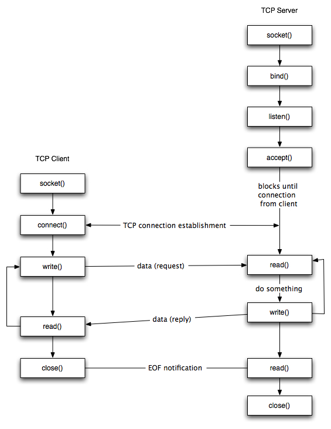
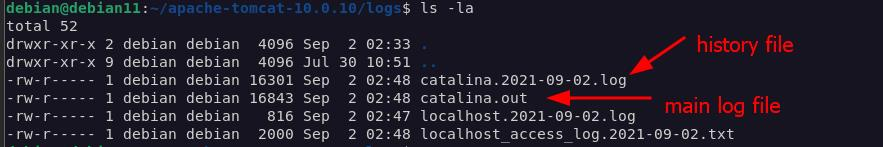

# Tomcat Apache Server


- [Tomcat Installation Notes](#installation)
- [Server webapps directory](#webapps)
- [Web deployment descriptor](#deployment_descriptor)
- [Web Container Listener](#listener)
- [Web Container Servlet](#servlet)
- [Session timeout](#session)
- [Cache-Control](#cache)
- [Tomcat Connectors](#connector)
- [Connector HTTP Thread pool](#thread_pool)
- [Enable Gzip Compression](#gzip_compression)
- [Server Logging](#logging)
- [Set Max war file size](#max_war_file)
- [Customize JVM options](#jvm_options)
- [Deploy war](#deploy_war)
- [Set ContextPath of a web application](#set_context)
- [Setting Up Tomcat User](#tomcat_user)
- [Configure SSL](#configure_ssl)


[//]: # (TODO[Jenkins CI/CD to deploy tomcat](#tomcat_user)


## <a name='installation'> Tomcat Installation Notes </a>

- Java SDK or Java JRE must be installed before tomcat so that i can work probably  
  - To check Java installation on **Windows**:
    ```
    echo %JAVA_HOME%
    echo %JRE_HOME%
    ```  
           
    To set JAVA_HOME and JRE_HOME, do the following:
    > Right click My Computer and select Properties.
    >> On the Advanced tab, select Environment Variables, and then edit JAVA_HOME to point to where the JDK software is located, for example, C:\Program Files\Java\jdk1.6.0_02
    
   - To check Java installation on **Linux**:
    ```
    echo $JAVA_HOME
    echo $JRE_HOME
    ```  
       
    To set JAVA_HOME and JRE_HOME, do the following:
    > - find /usr/lib/jvm/java-1.x.x-openjdk
    > - sudo vi /etc/profile  
    > - Press 'i' to get in insert mode  
    > - Add :
    >> $ export JAVA_HOME="path that you found"   
       $ export PATH=$JAVA_HOME/bin:$PATH   
       $ source /etc/profile
                                                                                                                                                                                                                                                                                                                                                                                                                                                                                                                                                                                                                                                                                                                                                                                                                    
     ***Do the same for JRE***
     
     
- The default installation port of tomcat is **8080**
- Check the tomcat server on http://localhost:8080 
- The tomcat server container is called **Catalina**

- Tomcat - **CATALINA_HOME** and **CATALINA_BASE** variables
  - The **CATALINA_HOME** and **CATALINA_BASE** environment variables are used to specify the location of Apache Tomcat 
  - If you are running multiple instances of Tomcat on a single host you should set **CATALINA_BASE** to be equal to the .../tomcat_instance1 or .../tomcat_instance2 directory as appropriate for each instance and the **CATALINA_HOME** environment variable to the common Tomcat installation whose files will be shared between the two instances.
  - The **CATALINA_BASE** environment is optional if you are running a single Tomcat instance on the host and will default to **CATALINA_HOME** in that case. If you are running multiple instances as you are it should be provided.
    - To check Java installation on **Windows**:
      ```
       echo %CATALINA_HOME%
       echo %CATALINA_BASE%
      ```  
     
     - To check Java installation on **Linux**:
       ```
       echo $CATALINA_HOME
       echo $CATALINA_BASE
       ```  
       
- start/stop tomcat
  - **tomcat start/stop** vs **catalina.sh run/stop**
  - catalina.sh run starts tomcat in the foreground, displaying the logs on the console that you started it. Hitting Ctrl-C will terminate tomcat.
  - startup.sh will start tomcat in the background. You'll have to **tail -f logs/catalina.out** to see the logs.
  - Both will do the same things, apart from the foreground/background distinction.   
      ```
      CATALINA_HOME/bin/startup.bat       <-- Windows
      CATALINA_HOME/bin/shutdown.bat      <-- Windows
      
      CATALINA_HOME/bin/startup.sh      <-- Linux
      CATALINA_HOME/bin/shutdown.sh     <-- Linux
      ```
         
- Install tomcat as a **Service**
  - On **Windows**
    ```
    C:\Java\Apache Tomcat 8.5.9\bin> service install
    ```
    - Run **Cntl+R**, then type **services.msc** and make sure that tomcat service is running and Automatic
   
  - On **Linux**
    ```
    systemctl status tomcat8
    ```
    
    > systemctl **[status | enable | disable | start | stop | restart | reload ]** tomcat8
                                                                     

## <a name='webapps'> Server webapps directory </a>

Location:
> $CATALINA_HOME/webapps

check it the default configuration in server.xml file
```xml
<Host name="localhost" appBase="webapps" unpackWARs="true" autoDeploy="true">

</Host>
```

## <a name='deployment_descriptor'> Web deployment descriptor </a>

In a java web application a file named web.xml is known as deployment descriptor. 
It is a xml file and <web-app> is the root element for it. 
When a request comes web server uses web.xml file to map the URL of the request to the specific code that handle the request.

File path: **CATALINA_BASE/webapp/WEB-INF/web.xml**


## <a name='listener'> Web Container Listener </a>

As already mentioned, tomcat is a Java web container.  
Sometimes we need to listen to this web container events like *OnStartup* or *OnDestroy* 

The listener is something sitting there and wait for specified event happened

The ***ServletContextListener*** is what you want, it will run your code before the web application is started.

example:
```java
package com.mkyong.listener;
import javax.servlet.ServletContextEvent;
import javax.servlet.ServletContextListener;

public class MyAppServletContextListener implements ServletContextListener{

	
    //Run this before web application is started
	@Override
	public void contextInitialized(ServletContextEvent arg0) {
		System.out.println("Web Application started");	
	}

	@Override
	public void contextDestroyed(ServletContextEvent arg0) {
		System.out.println("Web Application destroyed");
	}
	
}
```


Put it in the deployment descriptor web.xml  
```xml
<web-app ...>

   <listener>
	<listener-class>
             com.mkyong.listener.MyAppServletContextListener 
        </listener-class>
   </listener>

</web-app>
```


Starting Tomcat….

>//...
> Dec 2, 2009 10:11:46 AM org.apache.catalina.core.StandardEngine start
> INFO: Starting Servlet Engine: Apache Tomcat/6.0.20
> 
> Web Application started     <-------------- Your code here, before we application --->
> 
> Dec 2, 2009 10:11:46 AM org.apache.coyote.http11.Http11Protocol start
> INFO: Starting Coyote HTTP/1.1 on http-8080
> //...
> INFO: Server startup in 273 ms


## <a name='servlet'> Web Container Servlet Example </a>

A servlet is a class which responds to a particular type of network request - most commonly an HTTP request. Basically servlets are usually used to implement web applications

```java
// Import required java libraries
import java.io.*;
import javax.servlet.*;
import javax.servlet.http.*;

// Extend HttpServlet class
public class SimpleServlet extends HttpServlet {
 
   private String message;
    
   @Override
   public void init() throws ServletException {
      // Do required initialization
      message = "Hello World";
   }

   @Override
   public void doGet(HttpServletRequest request, HttpServletResponse response)
      throws ServletException, IOException {
      
      // Set response content type
      response.setContentType("text/html");

      // get Servlet parameter  
      String emailValue = getServletContext().getInitParameter("email");  

      // Actual logic goes here.
      PrintWriter out = response.getWriter();
      out.println("<h1>" + message + "</h1>");
      out.println("<p>" + emailValue + "</p>");
  
   }

   @Override
   public void destroy() {
      // do nothing.
   }
}
```


Put it in the deployment descriptor web.xml  
```xml
<web-app ...>

    <servlet>
       <servlet-name>simple-servlet</servlet-name>
       <servlet-class>SimpleServlet</servlet-class>
    </servlet>
    
    <servlet-mapping>
       <servlet-name>simple-servlet</servlet-name>
       <url-pattern>/HelloWorld</url-pattern>
    </servlet-mapping>

    <context-param>
        <param-name>email</param-name>
        <param-value>admin@email.com</param-value>
	</context-param>

</web-app>
```

run it from the web browser
> http://localhost:8080/HelloWorld


## <a name='session'> Session timeout </a>

- A session contains information specific to a particular user across the whole application.
- HttpSession object is used to store entire session for a specific user.
 

### Description of the session timeout
Session timeout represents the event occuring when a user does not perform any action on a web site during an interval (defined by a web server). The event, on the server side, changes the status of the user session to ‘invalid’ (ie. “not used anymore”) and instructs the web server to destroy it (deleting all data contained in it).

### Define the session timeout

On JEE web applications , there 2 ways to define a session timeout,

- Declaratively in web deployment descriptor (file “web.xml”) : This definition is applied to all sessions created for the application.

```xml
<web-app ...>

    ...

    <!-- Define a session timeout to 15 minutes -->
    <session-config>
        <session-timeout>15</session-timeout>
    </session-config>

    ...

</web-app>
```


- Programmatically on the session object : This definition applies only to the current session.

```java
package org.owasp.javaproject.sessiontimeout;

import java.io.IOException;

import javax.servlet.ServletException;
import javax.servlet.annotation.WebServlet;
import javax.servlet.http.HttpServlet;
import javax.servlet.http.HttpServletRequest;
import javax.servlet.http.HttpServletResponse;
import javax.servlet.http.HttpSession;

/**
 * Code sample showing how to access to session timeout and act on it.
 */
@SuppressWarnings("serial")
@WebServlet("/SessionTimeout")
public class SessionTimeoutCodeSample extends HttpServlet {

    /**
     * {@inheritDoc}
     *
     * @see javax.servlet.http.HttpServlet#doGet(javax.servlet.http.HttpServletRequest,
     *      javax.servlet.http.HttpServletResponse)
     */
    @SuppressWarnings("boxing")
    @Override
    protected void doGet(HttpServletRequest req, HttpServletResponse resp) throws ServletException, IOException {
        // Get reference on session object
        HttpSession session = req.getSession();

        // Display session timeout value defined in "web.xml"
        // Value here is specified in seconds...
        System.out.printf("Session timeout defined at application level : %s\n", session.getMaxInactiveInterval());

        // Change session timeout for this session and display new timeout value
        // Value here is defined in seconds...
        session.setMaxInactiveInterval(60);
        System.out.printf("Session timeout defined at code level : %s\n", session.getMaxInactiveInterval());
    }

}

Session timeout defined at application level : 900
Session timeout defined at code level        : 60
```

### Session timeout vs max-age in deployment descriptor web.xml

- They are taken into account and enforced by different software components.   
The **session-timeout** is taken into account by the container (web server),   
whereas the **max-age** is taken into account and enforced by the user's browser (client).    
Equivalently, you may say that session-timeout applies to the server-side, whereas max-age applies to the client side.

- **session-timeout** is in minutes, whereas **max-age** is in seconds


```xml
<web-app ...>

    ...

    <session-config>
        <session-timeout>30</session-timeout> <!-- 30 minutes! -->
        <cookie-config>
            <http-only>true</http-only>
            <max-age>1800</max-age> <!-- 1800 seconds: 30 minutes! -->
        </cookie-config>
        <tracking-mode>COOKIE</tracking-mode>
    </session-config>

    ...

</web-app>
```

example of HTTP response header
```
HTTP/1.1 302 Found 
Server: Apache-Coyote/1.1 
Set-Cookie: JSESSIONID=5EFDA7655A8D72E7D04AC2E88E754956; Expires=Thu, 31-Jul-2014 15:22:06 GMT; Path=/RESTTestService/; HttpOnly 
Location: http://localhost:8980/RESTTestService/ 
Content-Length: 0 
```


Note:
The *S* in RE**S**T means stateless and not stateful. 
In REST applications, the session state must be managed by the client and **not by the server**.    
Consequently, there must not be any session identifiers.


## <a name='cache'> Tomcat: Cache-Control </a>

please revise:  
[Cache-control HTTP header](../HttpCache/README.md)

**ExpiresFilter** is a Java Servlet API port of *Apache mod_expires*.   
This filter controls the setting of the Expires HTTP header and the max-age directive of the Cache-Control HTTP header in server responses.    
The expiration date can set to be relative to either the time the source file was last modified, or to the time of the client access.   


```xml
<web-app ...>

    ...

    <filter>
        <filter-name>ExpiresFilter</filter-name>
        <filter-class>org.apache.catalina.filters.ExpiresFilter</filter-class>
        <init-param>
            <param-name>ExpiresByType image</param-name>
            <param-value>access plus 10 days</param-value>
        </init-param>
        <init-param>
            <param-name>ExpiresByType text/css</param-name>
            <param-value>access plus 10 hours</param-value>
        </init-param>
        <init-param>
            <param-name>ExpiresByType application/javascript</param-name>
            <param-value>access plus 10 minutes</param-value>
        </init-param>

        <!-- Let everything else expire immediately -->
        <!-- like in case of dynamic resources and REST -->
        <init-param>
            <param-name>ExpiresDefault</param-name>
            <param-value>access plus 0 seconds</param-value>
        </init-param>
    </filter>
    
    <filter-mapping>
        <filter-name>ExpiresFilter</filter-name>
        <url-pattern>/*</url-pattern>
        <dispatcher>REQUEST</dispatcher>
    </filter-mapping>

    ...

</web-app>
```
___

Also a Filter could be implemented
```java
import javax.servlet.*;
import javax.servlet.http.HttpServletResponse;
import java.io.IOException;
import java.util.Date;

public class CacheControlFilter implements Filter {

    @Override
    public void doFilter(ServletRequest request, ServletResponse response, FilterChain chain) throws IOException, ServletException {

        HttpServletResponse resp = (HttpServletResponse) response;
    
        // set old date in "Expires" header means, It is already expires (no-cache allowed
        resp.setHeader("Expires", "Tue, 03 Jul 2001 06:00:00 GMT");
        resp.setDateHeader("Last-Modified", new Date().getTime());
        resp.setHeader("Cache-Control", "no-store, no-cache, must-revalidate, max-age=0, post-check=0, pre-check=0");
        resp.setHeader("Pragma", "no-cache");

        chain.doFilter(request, response);
    }

}

```


and in web.xml
```xml
<web-app ...>

    ...

    <filter>
        <filter-name>myFilter</filter-name>
        <filter-class>com.mypackage.CacheControlFilter</filter-class>
    </filter>
    
    <filter-mapping>
        <filter-name>myFilter</filter-name>
        <url-pattern>/api/*</url-pattern>
    </filter-mapping>

    ...

</web-app>
```

**Notes:**
- Filter in executes in order as they listed in the deployment descriptor file "web.xml"
- Spring framework handles the Fileter by xml config or by annotation  


## <a name='connector'> Tomcat Connectors </a>

Connectors are configured in **server.xml**    
path: TOMCAT_HOME/conf/server.xml

| Attribute       |    Description            |
| :---         |    :----                           |
| **port**     |  Connector listening port                             |
| **protocol**     |  "HTTP/1.1" **default** which uses an auto-switching mechanism to select either a Java NIO based connector or an APR/native based connector. <br> <br> To use an explicit protocol rather than rely on the auto-switching mechanism described above, the following values may be used:  <br> - org.apache.coyote.http11.Http11NioProtocol - non blocking Java NIO connector  <br>  - org.apache.coyote.http11.Http11Nio2Protocol - non blocking Java NIO2 connector <br> - org.apache.coyote.http11.Http11AprProtocol - the APR/native connector. <br> "AJP/1.3" <br>                           |
| **executor**     |  A reference to the name in an Executor element. If this attribute is set, and the named executor exists, the connector will use the executor, and all the other thread attributes will be ignored. Note that if a shared executor is not specified for a connector then the connector will use a private, internal executor to provide the thread pool.                          |
| **connectionTimeout**     |  The number of milliseconds this Connector will wait, after accepting a connection, for the request URI line to be presented. Use a value of -1 to indicate no (i.e. infinite) timeout. The default value is 60000 (i.e. 60 seconds) but note that the standard server.xml that ships with Tomcat sets this to 20000 (i.e. 20 seconds). Unless disableUploadTimeout is set to false, this timeout will also be used when reading the request body (if any).  <br> <br>      This parameter is there specifically to fight one type of Denial-Of-Service attack, whereby some malicious client(s) **create a TCP connection to the server (which has the effect of reserving some resources on the server for handling this connection)**, and then **just sit there without sending any HTTP request on that connection**. By making this delay shorter, you shorten the time during which the server resources are allocated, to serve a request that will never come.       <br> <br> for more information                    |
| **redirectPort**     |  If this **Connector** is supporting non-SSL requests, and a request is received for which a matching <security-constraint> requires SSL transport, Catalina will automatically redirect the request to the port number specified here.                            |
| **maxThreads**     |  The maximum number of request processing threads to be created by this Connector, which therefore determines the maximum number of simultaneous requests that can be handled. If not specified, this attribute is set to 200. If an executor is associated with this connector, this attribute is ignored as the connector will execute tasks using the executor rather than an internal thread pool. Note that if an executor is configured any value set for this attribute will be recorded correctly but it will be reported (e.g. via JMX) as -1 to make clear that it is not used.                             |
| **URIEncoding**     |  This specifies the character encoding used to decode the URI bytes, after %xx decoding the URL. If not specified, UTF-8 will be used unless the org.apache.catalina.STRICT_SERVLET_COMPLIANCE system property is set to true in which case ISO-8859-1 will be used.                             |
| **disableUploadTimeout**     |  This flag allows the servlet container to use a different, usually longer connection timeout during data upload. If not specified, this attribute is set to true which disables this longer timeout.                            |
| **connectionUploadTimeout**     |  Specifies the timeout, in milliseconds, to use while a data upload is in progress. This only takes effect if disableUploadTimeout is set to false.                            |
| **keepAliveTimeout**     |  The number of milliseconds this Connector will wait for another HTTP request before closing the connection. The default value is to use the value that has been set for the connectionTimeout attribute. Use a value of -1 to indicate no (i.e. infinite) timeout.                             |
| **maxKeepAliveRequests**     |  The maximum number of HTTP requests which can be pipelined until the connection is closed by the server. Setting this attribute to 1 will disable HTTP/1.0 keep-alive, as well as HTTP/1.1 keep-alive and pipelining. Setting this to -1 will allow an unlimited amount of pipelined or keep-alive HTTP requests. If not specified, this attribute is set to 100.                             |

**Notes:**
- HTTP enables a client and server to negotiate to keep a single network connection alive to handle multiple requests and responses. HTTP 1.0 requires the client to explicitly ask to keep a connection alive, whereas HTTP 1.1 assumes the connection is persistent unless the client or server indicates otherwise. The Connection header field is used to negotiate connection persistence:
    - An HTTP 1.1 client or server can close a persistent connection by sending the Connection: close header with the request or response.
    - An HTTP 1.0 client can ask the server to keep the connection alive using the **Connection: Keep-Alive header**.

## <a name='thread_pool'> Connector HTTP Thread pool </a>

Each incoming, non-asynchronous request requires a thread for the duration of that request. 
If more simultaneous requests are received than can be handled by the currently available request processing threads, additional threads will be created up to the configured maximum (the value of the maxThreads attribute).    
If still more simultaneous requests are received, Tomcat will accept new connections until the current number of connections reaches maxConnections.     
Connections are queued inside the server socket created by the Connector until a thread becomes avaialble to process the connection.     
Once maxConnections has been reached the operating system will queue further connections.     
The size of the operating system provided connection queue may be controlled by the acceptCount attribute.      
If the operating system queue fills, further connection requests may be refused or may time out.


in server.xml
```xml

<Connector 
    port="8443" 
    protocol="org.apache.coyote.http11.Http11Protocol"
    maxThreads="250"
    maxConnections ="500"  
    SSLEnabled="true" 
    scheme="https" secure="true"
    clientAuth="false" 
    sslProtocol="TLS" 
    connectiontimeout="20000"
/>

```

Tomcat can work in 2 modes:

- **BIO** – blocking I/O (one thread per connection)
- **NIO** – non-blocking I/O (many more connections than threads)

Tomcat 7 is BIO by default, although consensus seems to be "don't use Bio because Nio is better in every way". You set this using the protocol parameter in the server.xml file.

- **BIO** will be HTTP/1.1 or org.apache.coyote.http11.Http11Protocol
- **NIO** will be org.apache.coyote.http11.Http11NioProtocol

- If you're using NIO then actually "maxConnections=1000" and "maxThreads=10" might even be reasonable. The defaults are maxConnections=10,000 and maxThreads=200. With NIO, each thread can serve any number of connections, switching back and forth but retaining the connection so you don't need to do all the usual handshaking which is especially time-consuming with HTTPS but even an issue with HTTP.    
You can adjust the **"keepAlive"** parameter to keep connections around for longer and this should speed everything up.

- From Tomcat documentation, For blocking I/O (BIO), the default value of maxConnections is the value of maxThreads unless Executor (thread pool) is used in which case, the value of 'maxThreads' from Executor will be used instead. For Non-blocking IO, it doesn't seem to be dependent on maxThreads.


### Tomcat Thread Pool
Tomcat uses a Thread pool. You can configure two types of Thread Pools: 
- **Shared Pool**: 
can be shared among various components in Tomcat. So, for example if you have three connectors in your configuration, then you can use a single shared pool to serve requests for all of them


- **Dedicated Pool**: is a thread pool which is dedicated to only one connector definition. You can use it in a scenario when you are expecting a peak of connections and you want to have full control over the amounts of threads to be used by your connector.  
The dedicated thread pool configuration can be embedded directly into the Connector section of your server.xml

Generally speaking a Shared Thread pool is best fit when the number of users expected is not hight and we don't care much about performance. This is the typical scenario for a Development Environment. On the other hand, for production environment when Performance is critical you should consider using a Dedicated Thread Pool.

in server.xml 
```xml

<!--The connectors can use a shared executor, you can define one or more named thread pools-->
 <!--
 <Executor name="tomcatThreadPool" namePrefix="catalina-exec-" maxThreads="150" minSpareThreads="4"/>
 -->


<!-- A "Connector" using the shared thread pool-->
<!--
 <Connector executor="tomcatThreadPool" port="8080" protocol="HTTP/1.1" connectionTimeout="20000" redirectPort="8443" />
-->


```


## <a name='gzip_compression'> Enable Gzip Compression  </a>

HTTP compression is a capability that can be built into web servers and web clients to improve transfer speed and bandwidth utilization.

### Test your Tomcat before enable compression
Curl is a command line tool for getting or sending files using URL syntax. With Tomcat running, open your terminal and type:

> curl  -H "Accept-Encoding: gzip" -I http://localhost:8080
 
You should get the following response:
```
    HTTP/1.1 200 OK
    Server: Apache-Coyote/1.1
    Content-Type: text/html;charset=UTF-8     <----- not gzip
    Transfer-Encoding: chunked
    Date: Thu, 27 Oct 2016 16:37:55 GMT
```

### Enable Gzip on Tomcat
```xml

<Connector port="8080" maxHttpHeaderSize="8192"
           maxThreads="150" minSpareThreads="25" maxSpareThreads="75"
           enableLookups="false" redirectPort="8443" acceptCount="100"
           connectionTimeout="20000" disableUploadTimeout="true"
           useSendfile="false"
           compression="on"
           compressionMinSize="1024"
           noCompressionUserAgents="gozilla, traviata"
           compressibleMimeType="text/html,text/xml,text/plain,text/css,text/javascript,application/javascript" />

```

| Attribute       |    Description            |
| :---         |    :----                           |
| **compression**     |  The **Connector** may use HTTP/1.1 GZIP compression in an attempt to save server bandwidth. The acceptable values for the parameter is "off" (disable compression), "on" (allow compression, which causes text data to be compressed), "force" (forces compression in all cases), or a numerical integer value (which is equivalent to "on", but specifies the minimum amount of data before the output is compressed). If the content-length is not known and compression is set to "on" or more aggressive, the output will also be compressed. If not specified, this attribute is set to "off". <br><br> Note: There is a tradeoff between using compression (saving your bandwidth) and using the sendfile feature (saving your CPU cycles). If the connector supports the sendfile feature, e.g. the NIO connector, using sendfile will take precedence over compression. The symptoms will be that static files greater that 48 Kb will be sent uncompressed. You can turn off sendfile by setting useSendfile attribute of the connector, as documented below, or change the sendfile usage threshold in the configuration of the DefaultServlet in the default conf/web.xml or in the web.xml of your web application.                             |                             |
| **compressionMinSize**     |  If compression is set to "on" then this attribute may be used to specify the minimum amount of data before the output is compressed. If not specified, this attribute is defaults to "2048". Units are in bytes         |
| **noCompressionUserAgents**     |  The value is a regular expression (using java.util.regex) matching the user-agent header of HTTP clients for which compression should not be used, because these clients, although they do advertise support for the feature, have a broken implementation. The default value is an empty String (regexp matching disabled).                            |
| **compressibleMimeType**     |   The value is a comma separated list of MIME types for which HTTP compression may be used. The default value is text/html,text/xml,text/plain,text/css,text/javascript,application/javascript,application/json,application/xml . If you specify a type explicitly, the default is over-ridden.       |
| **useSendfile**     |  (bool)Use this attribute to enable or disable sendfile capability. The default value is true. Note that the use of sendfile will disable any compression that Tomcat may otherwise have performed on the response.                             |


### Test your Tomcat after enable compression

Curl is a command line tool for getting or sending files using URL syntax. With Tomcat running, open your terminal and type:

> curl  -H "Accept-Encoding: gzip" -I http://localhost:8080

You should get the following response:
```
    HTTP/1.1 200 OK
    Server: Apache-Coyote/1.1
    Content-Type: text/html;charset=UTF-8
    Transfer-Encoding: chunked
    Content-Encoding: gzip                       <----- gzip is working             
    Vary: Accept-Encoding
    Date: Thu, 27 Oct 2016 17:43:16 GMT
```


## <a name='logging'> Server Logging </a>

Logging location:      
```bash
echo $CATALINA_OUT
```

Inside the logs directory, you will find various logs files as shown below:  
```bash
ls -la
```


```bash
less catalina.out
```


To change the default location of the log file, edit the startup.sh file and locate the entry:
```bash
CATALINA_OUT="$CATALINA_BASE"/logs/catalina.out
```

### Tomcat Access Logs

in server.xml file
```xml
<Host name="localhost" appBase="webapps" unpackWARs="true" autoDeploy="true">

    <!-- SingleSignOn valve, share authentication between web applications Documentation at: /docs/config/valve.html -->
     <!--
     <Valve className="org.apache.catalina.authenticator.SingleSignOn" />
     -->

    <!-- Access log processes all example. Documentation at: /docs/config/valve.html Note: The pattern used is equivalent to using pattern="common" -->
     <Valve className="org.apache.catalina.valves.AccessLogValve" directory="logs" 
    prefix="localhost_access_log" suffix=".txt" pattern="%h %l %u %t "%r" %s %b" />

</Host>
```

accordingly, By default, the access log file name is as:
> localhost_access_log.2021-09-02.txt





### Disable Tomcat Logging
edit the **logging.properties** file inside the conf directory and comment the following entry:
```
handlers = 1catalina.org.apache.juli.AsyncFileHandler,
2localhost.org.apache.juli.AsyncFileHandler...
```

### Modifying the Log Format

We can extend the "common" and "combined" patterns by appending the response time for each request. To use this, set the
- **common**: pattern="common"
- **common plus response time**: pattern="%h %l %u %t &quot;%r&quot; %s %b %D"
- **combined**: pattern="combined"
- **combined plus response time**: pattern="%h %l %u %t &quot;%r&quot; %s %b &quot;%{Referer}i&quot; &quot;%{User-Agent}i&quot; %D"


## <a name='max_war_file'> Set Max war file size </a>

This is only a limit set for you to upload and deploy via the Tomcat 7 manager. There really is not a limit on the size of the war file you can deploy to a tomcat server.

> Go to the web.xml of the manager application (for instance it could be under /tomcat7/webapps/manager/WEB-INF/web.xml. 
> Increase the max-file-size and max-request-size:


```xml
<!– 50MB max –>

 <max-file-size>52428800</max-file-size>

 <max-request-size>52428800</max-request-size>

 <file-size-threshold>0</file-size-threshold>

 </multipart-config>

```


## <a name='jvm_options'> Customize JVM options </a>

you may not be having **setenv.sh** file available under the **CATALINA_HOME/bin** location. So you must create it.

```bash
$cat setenv.sh
JAVA_OPTS="-Xms1024m -Xmx1024m -Xss228k -XX:+UseParallelGC"

pwd
/opt/tomcat/apache-tomcat-7.0.69/bin
```

you can verify the JVM arguments in two ways
1) In **Catalina.out** log you would be able to something like this
    ```
    INFO: Command line argument: -Xms1024m
    May 13, 2016 10:34:46 AM org.apache.catalina.startup.VersionLoggerListener log
    INFO: Command line argument: -Xmx1024m
    May 13, 2016 10:34:47 AM org.apache.catalina.startup.VersionLoggerListener log
    INFO: Command line argument: -Xss228k
    May 13, 2016 10:34:47 AM org.apache.catalina.startup.VersionLoggerListener log
    INFO: Command line argument: -XX:+UseParallelGC
    ```

2) using ps command  you can find the JVM arguments
```
$ ps -eaf|grep -i java
tomcat    5944  3481  3 10:34 pts/0    00:00:05 /usr/bin/java -Djava.util.logging.config.file=/opt/tomcat/apache-tomcat-7.0.69/conf/logging.properties -Djava.util.logging.manager=org.apache.juli.ClassLoaderLogManager -Xms1024m -Xmx1024m -Xss228k -XX:+UseParallelGC -Djdk.tls.ephemeralDHKeySize=2048 -Djava.endorsed.dirs=/opt/tomcat/apache-tomcat-7.0.69/endorsed -classpath /opt/tomcat/apache-tomcat-7.0.69/bin/bootstrap.jar:/opt/tomcat/apache-tomcat-7.0.69/bin/tomcat-juli.jar -Dcatalina.base=/opt/tomcat/apache-tomcat-7.0.69 -Dcatalina.home=/opt/tomcat/apache-tomcat-7.0.69 -Djava.io.tmpdir=/opt/tomcat/apache-tomcat-7.0.69/temp org.apache.catalina.startup.Bootstrap start
tomcat    6008  5988  0 10:37 pts/1    00:00:00 grep -i java
```


## <a name='deploy_war'> Deploy war </a>

Simply place the war file in   
```
$TOMCAT_HOME/webapps    <----- "appBase" directory
```


the **appBase** is mentioned in server.xml config file
```xml
<Host name="localhost" appBase="webapps" unpackWARs="true" autoDeploy="true">
...

</Host>
```

- you have to retsart the server to deploy the war file
- upon server startup, it will unpack the war file


## <a name='set_context'> Set ContextPath of a web application </a>

Add a file called **ROOT.xml** in **CATALINA_HOME/conf/Catalina/localhost/**

This ROOT.xml will override the default settings for the root context of the tomcat installation for that engine and host (Catalina and localhost).


Enter the following to the ROOT.xml file;
```xml
    <Context 
      docBase="<yourApp>" 
      path="" 
      reloadable="true" 
    />
```


Here, <yourApp> is the name of, well, your app.. :)


And there you go, your application is now the default application and will show up on http://localhost:8080

However, there is one side effect;   
your application will be loaded twice. Once for localhost:8080 and once for localhost:8080/yourApp.    
To **fix** this you can **put your application OUTSIDE CATALINA_HOME//webapps** and use a relative or absolute path in the ROOT.xml's docBase tag. Something like this;

```xml
    <Context 
      docBase="/opt/mywebapps/<yourApp>" 
      path="" 
      reloadable="true" 
    />
```

And then it should be all OK!


## <a name='tomcat_user'> Setting Up Tomcat User </a>

For security reasons, it is best to have a user account to run the Apache Tomcat services. Avoid using the root user to run the tomcat server.

Therefore, you'll need to create a new user that will run the service with a home directory of /opt/tomcat. This directory is where you will install Tomcat, created with a shell of /bin/false so that no one can log into it.

Run the command below to do this:
```bash
$ sudo groupadd tomcat
$ sudo useradd -m -U -d /opt/tomcat -s /bin/false tomcat
$ passwd tomcat
```

Now that you have created a user to run Tomcat, you'll need to give them access to the correct directories.  Use the following commands, substituting your own usernames and groups as necessary:
```bash
$ chown -R tomcat.tomcat /path/to/tomcat
$ chmod 775 /path/to/tomcat/webapps
```

The first gives ownership of the Tomcat directories to the Tomcat user, and the second gives the user write access for the web apps directory.


You may need to access your server out of your local network. To achieve this, adjust your firewall settings and open port 8080.

```bash
$ sudo ufw allow 8080/tcp
```

If you wish to have Tomcat service automatically start at boot time, use:
```bash
$ sudo systemctl enable tomcat
```


## <a name='configure_ssl'> Configure SSL </a>

check [here](../Cryptography/DigitalCertificate.md)


